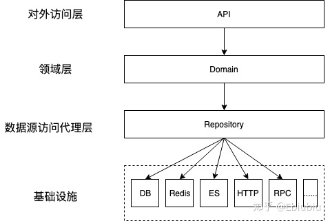
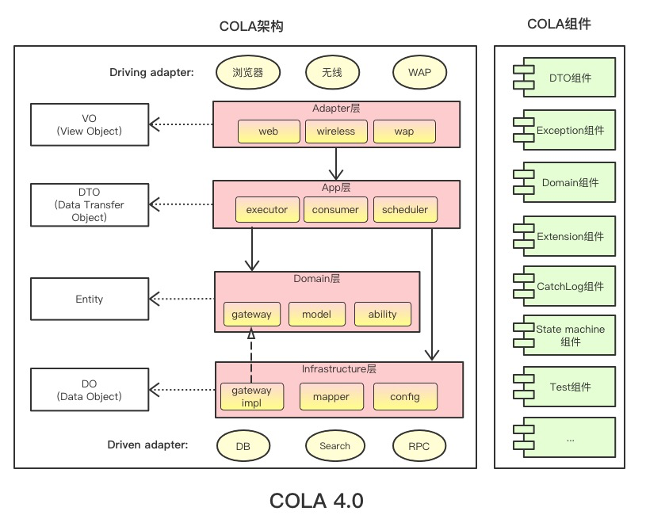
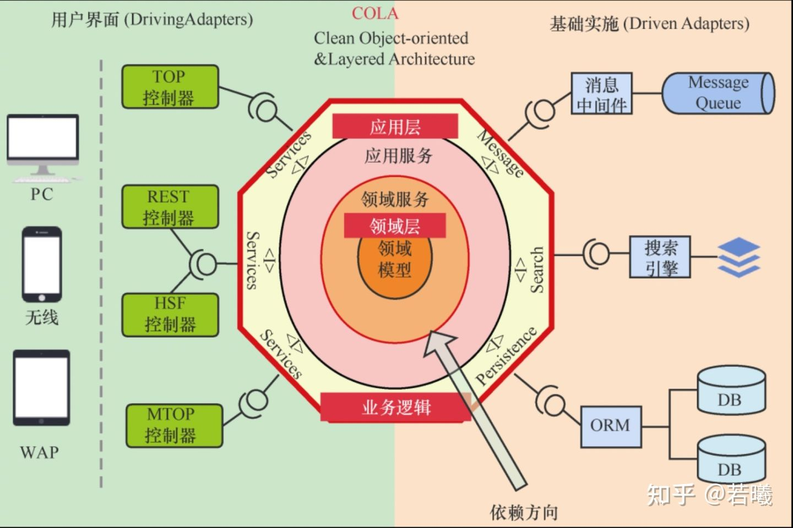
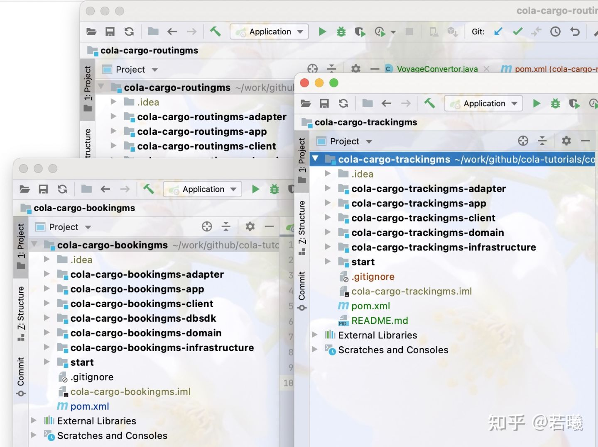
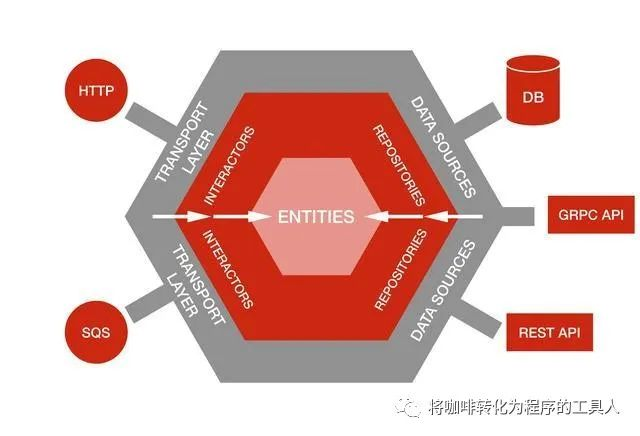

参考：https://zhuanlan.zhihu.com/p/109114670

# 一、序言
领域驱动设计是一种解决业务复杂性的设计思想，不是一种标准规则的解决方法。在领域驱动设计理念上，各路大侠的观点也是各有不同，能力有限、欢迎留言讨论。

# 二、领域驱动设计
## DDD是什么
wiki释义：

领域驱动设计（英语：Domain-driven design，缩写 DDD）是一种通过将实现连接到持续进化的模型[1]来满足复杂需求的软件开发方法。领域驱动设计的前提是：

把项目的主要重点放在核心领域（core domain）和域逻辑
把复杂的设计放在有界域（bounded context）的模型上
发起一个创造性的合作之间的技术和域界专家以迭代地完善的概念模式，解决特定领域的问题
领域驱动设计是一种由域模型（墙裂推荐@阿白 的域模型系列）来驱动着系统设计的思想，不是通过存储数据词典(DB表字段、ES Mapper字段等等)来驱动系统设计。领域模型是对业务模型的抽象，DDD是把业务模型翻译成系统架构设计的一种方式。

术概念
### DDD中的模型
Model与传统的POJO(DTO、DO、DAO)类等对比，都是一个类中有属性、属性有Get/Set方法，并且做传输对象。

Model与传统MVC三层架构层的业务逻辑层中的Service对比，都是处理业务行为(Action)层。

模型（Model）承载着业务的属性和具体的行为，是业务表达的方式、是DDD的内核。是一个类中有属性、属性有Get/Set方法，并且业务的行为（Action）操作也是在模型类中（充血模型）即做业务逻辑处理，又做数据传输对象，模型分为Entity、Value Object、Service这三种类型。

### Entity (实体)
有特定的标识，标识着这个Model在系统中全局唯一
内部值可以是变化的，可能存在生命周期 (比如订单对象，状态值是连续变化的)
有状态的Value Object
### Value Object （值对象）
内部值是不变的，不存在生命周期 (比如地址对象不存在生命周期)
无状态对象
### Service （服务）
无状态对象
当一个属性或行为放在Entity、Value Object中模棱两可或不合适的时候就需要以Service的形式来呈现
三种模型的复杂度是不一样的，在领域建模选Model模棱两可时，优先选择简单模型原则。模型复杂度顺序 Service > Entity > ValueObject

## DDD模型的生命周期
### Factory （工厂）
用来创建Model，以及帮助Repository (数据源)注入到Model中

### Aggreagte （聚合根）
封装Model，一个Mode中l可能包含其他Model（类似一个对象中包含其他对象的引用，实际概念更为复杂些）

### Repository (数据源)
数据源的访问网关层、通过Repository来对接不同的数据源

DDD模型的边界
限界上下文，领域边界上下文
域的拆分
按业务抽象进行划分
一个业务拆分成几个独立的域，每个域又可细拆成不同子域
### 防腐
一个域在访问其他域的模型时，把获取到的模型做层转换映射到自己域的模型中（不直接使用别的域模型作为自己域模型中的一部分）
防止源域模型发生变更，依赖源域模型的调用方，在需要源域模型新功能时，必须要全局依赖修改，才在能兼容
防止域上下文不一致产生的冲突
其他
## 一个团队，一种语言

一条业务线由研发、产品、业务共同协作和维护，大家只是在不同维度做同一件事情。领域驱动设计的实现方式不仅仅是代码，也可以是PRD、MRD、业务模型图，选择一种大家都能看懂的方式（领域模型术语），统一团队语言，从上层业务到底层实现都是同一个领域模型，减少信息传递经过翻译造成理解不一致。

## DDD设计的特点

### 根据业务模型设计系统

不是通过数据库等数据源驱动设计，是根据业务语义抽象梳理设计成领域模型

### 数据模型统一

通过真实业务背景，梳理出业务域模型自然会形成出参、入参、中间临时属性收口统一为域模型

### 业务模型与数据源无关

数据源数据结构无论怎么变、数据源无论怎么换，领域模型统一无感知，无须变更。
一个域模型底层对应的数据源可以是1个或n个不同类型数据源
系统升级底层数据源结构改造时，变更对业务层是透明，域模型可无缝对接，可达到开着飞机换引擎的效果
业务属性字段命名统一、引用唯一
在现在MVC模式开发中，入参model、数据传输model、数据源model 同一个业务属性含义可能有多种不同的命名，引用情况很难直接排除，当丰富某个业务字段值时，很难直接判断对原有业务的影响范围

### 业务行为Action收口
在原有开发模式下，一个Model类是一个POJO、DTO、DO，仅做数据传输，没有任何业务相关Action，属于典型的贫血模型。在DDD中一个Model就表述一个业务的域（可能是子域），这个Model不仅有属性，还有业务行为Action，并且这个域的所有操作都在这个Model中，这个Model不仅是数据传输的作用也是一个具体的Service，是属于充血模型。开发人员可以通过关注这个域模型就可以cover负责领域的全部，更不会出现大量的复制-粘贴重复代码。

### 业务操作高内聚、低耦合
所有这个域的操作都内聚在这个Model中，不会存在同一个相同业务行为在多个Service中存在现象。很多时候一个业务行为功能变更，在原有开发模式下需要把所有的service中有这个业务行为的地方都要变更（粘贴复制代码更为严重）

### 系统更能直观体现业务逻辑
产品是一直在演进的，PRD、技术方案都很难准确的表明现在产品的真实逻辑，很多时候大家都会遇见这种现象，产品经理不确定当前某个业务点的准确逻辑，需要开发阅读代码翻译给产品经理业务逻辑。

铁打的代码、流水的产研，产品经理、开发流动性都很大，新人仅看文档cover整个系统，很难做到。每个业务准确的细节点，还是要看系统代码实际的逻辑规则。

### 领域驱动架构

领域驱动设计没有特定的架构风格，它的核心是域模型驱动业务的思想，常见的领域驱动设计架构有经典的三层架构、REST架构、事件驱动架构、CQRS架构、六边形架构等。

#### 领域驱动三层架构

##### API层

API层是作为对外打包、前端接口调用使用。Domian层是整个域模型，不能直接把它打包成maven给别人使用，也不能直接把它作为接口给前端使用，有些需要API层作为进行转换后调用Domain，对调用Domain返回的数据进行包装筛选后再返回出去。

##### Domain层

系统的核心层，所有具体的业务逻辑处理、事件处理等都在这层域模型中处理

##### Repository 层

数据源代理层，Repository 层类似一个网关代理，它本身没有数据，数据都是通过它的代理来被Domain层访问，被代理的数据源不仅仅可以是DB、ES还可以是HTTP、RPC任何与Domain层进行数据交互的都叫Repository

## 领域驱动设计优势和劣势
DDD不是银弹，它只是复杂性业务的一种解决方式。DDD解决了系统设计的‘复杂性’，DDD设计思想本身又存在复杂性。

### 优势
### 系统演进更方便
随着业务的变化、系统设计也要演进升级。好的架构设计一定演化来的，不是一开始就设计出来的，但系统演进过程中的成本，一定是最开始的设计决定的。一个健康公司的成长，业务横向、纵向会发展的会越来越复杂，支持业务的系统也一定会越来越复杂。在领域驱动设计中，域模型对应的是业务模型，是系统架构的内核，通过域模型来驱动与外界的交互。

#### 业务复杂性变化的演进

域模型可能是简单新增属性或action就能支撑整体的业务发展。企业订餐的业务系统要同时有用户端、运营端、企业端、商户端的数据展示和操作，当业务演进出一个新功能时，这四端系统可能都要同时改造支撑。在领域驱动中，系统的域模型是同一套，只需在领域层进行改造，即可同时支撑四端。

#### 业务数据量变化的演进

公司业务数据量的变化后，现有的架构往往很难支持业务的发展，一定会进行新的技术选型支持业务。在DDD中，域模型为内核，在内核外的一层是代理层，通过这层代理来抽象透明化掉业务模型对系统底层设计的感知。比如原本数据量很小，一个简单的搜索直接使用MySQL like 模糊查询即可满足，在数据量巨大这种方式无法满足的时候，需要使用ES这种专业的搜索技术来实现，这时候仅需要在数据源层把原本指向数据源MySQL改成ES即可，业务代码全程透明无感知，可以达到给正在飞行的飞机换引擎的效果。

#### 更方便测试
对于测试（包含开发自测）来说，流程跑不通是痛苦的，由于IO造成阻塞而非系统逻辑是更痛苦。测试的时候最喜欢的纯函数测试，不依赖任何IO(不包含机器内存层面)，DDD设计思想是天然的在代码上把纯函数和普通函数区分开，Repository层是非纯函数，在Repository层Mock掉，整体系统就成了纯函数系统，对测试在Mock数据、切换数据源是非常方便和友好的。

### 劣势
#### 系统改造成DDD复杂
我们常用的架构基本都是MVC三层架构方式，在常用的MVC三层架构中基本所有的业务逻辑都在service层中，并且是按service功能属性设计的Service层，现在要进行DDD思想开发，需要打破原有的设计，有些严重的还必需要进行重构设计。

#### 团队开发熟悉DDD思想困难
改变自己比较困难，对别人产生影响更加困难。一个开发团队如果之前对DDD都没有了解，要推进和对团队产生影响是一个艰难的过程。

DDD不仅是统一语言、以业务驱动系统设计，在熟悉新业务和系统重构时，领域驱动设计思想更能很好快速梳理业务。如下图领域驱动设计是以领域(业务模型)为核心，通过数据代理层（Repository）来与其他系统交互，来驱动整个系统架构设计。

#### 劣势怎么解决？

1. 搭建项目框架，制定代码规范，培训讲解DDD架构思想
2. 代码实现前，编写技术文档并评审
3. 遇见不确定性问题，case by case解决
4. 最后的保障，提交代码前code reivew

# 三、COLA架构实现DDD

https://github.com/alibaba/COLA  

 [如何保证同事的代码不会腐烂？一文带你了解 Alibaba COLA 架构](https://www.cnblogs.com/rude3knife/p/cola-architecture.html)

## COLA架构图

## **为什么说COLA是架构？**

在架构设计上，COLA主张像六边形架构那样，使用端口-适配器去解耦技术细节；主张像洋葱架构那样，以领域为核心，并通过依赖倒置反转领域层的依赖方向。

从COLA应用处理响应一个请求的过程来看，COLA使用了CQRS来分离命令和查询的职责，使用扩展点和元数据来提供更高应用的可扩展性。

下图是COLA架构示意图，供参考：

## **为什么说COLA是框架？**

是因为开源COLA应用中还提供了一些非常有用的通用组件，这些组件可以帮助我们提升研发效率。

这些功能组件被收拢在cola-components目录下面。

| 组件名称                           | 功能                                                  | 版本  | 依赖                    |
| ---------------------------------- | ----------------------------------------------------- | ----- | ----------------------- |
| `cola-component-dto`               | 定义了`DTO`格式，包括分页                             | 1.0.0 | 无                      |
| `cola-component-exception`         | 定义了异常格式， 主要有`BizException`和`SysException` | 1.0.0 | 无                      |
| `cola-component-statemachine`      | 状态机组件                                            | 1.0.0 | 无                      |
| `cola-component-domain-starter`    | `Spring`托管的领域实体组件                            | 1.0.0 | 无                      |
| `cola-component-catchlog-starter`  | 异常处理和日志组件                                    | 1.0.0 | `exception` 、`dto`组件 |
| `cola-component-extension-starter` | 扩展点组件                                            | 1.0.0 | 无                      |
| `cola-component-test-container`    | 测试容器组件                                          | 1.0.0 | 无                      |

## demo项目结构

## COLA中每个层的命名和含义

| 层次       | 包名        | 功能                            | 必选 |
| ---------- | ----------- | ------------------------------- | ---- |
| Adapter层  | web         | 处理页面请求的Controller        | 否   |
| Adapter层  | wireless    | 处理无线端的适配                | 否   |
| Adapter层  | wap         | 处理wap端的适配                 | 否   |
| App层      | executor    | 处理request，包括command和query | 是   |
| App层      | consumer    | 处理外部message                 | 否   |
| App层      | scheduler   | 处理定时任务                    | 否   |
| Domain层   | model       | 领域模型                        | 否   |
| Domain层   | ability     | 领域能力，包括DomainService     | 否   |
| Domain层   | gateway     | 领域网关，解耦利器              | 是   |
| Infra层    | gatewayimpl | 网关实现                        | 是   |
| Infra层    | mapper      | ibatis数据库映射                | 否   |
| Infra层    | config      | 配置信息                        | 否   |
| Client SDK | api         | 服务对外透出的API               | 是   |
| Client SDK | dto         | 服务对外的DTO                   | 是   |

# DDD领域层与基础层的依赖倒置

## DDD中，为什么是基础层反向依赖领域层

> 工具人是这么理解的：逻辑上其实是领域层依赖了基础设施层。
>
> 比如：领域模型变更后，需要保存到数据库、发送到MQ等等。
>
> 但是在代码实现中，往往却是基础设施层依赖于领域层。

这句话怎么理解呢？因为，在架构设计的时候，一般都会遵循一些共同模式，不管是六边形架构、还是洋葱圈架构等等，都提倡以业务为核心，解耦外部依赖，分离业务复杂度和技术复杂度等。通俗地说，就是`越是核心的逻辑，依赖应该越少`。在DDD中，最核心的就是领域模型了。

在以往的MVC分层架构中，我们的核心业务逻辑是在Service层中编排的，而Service往往依赖于DAO层或其它技术实现。当我们需要做一些无关业务逻辑的优化时，比如给某个事件同步一下缓存、或者发送到一个MQ等，就需要去改动Service，这是因为业务的实现依赖于具体的技术，使得技术的变动反过来影响到了核心业务。

在DDD的模式中，我们往往采用依赖倒置等方式，做到业务实现于技术实现分离。

## 依赖倒置原则具体包括：

1、上层模块不应该依赖底层模块，它们都应该依赖于抽象。
2、抽象不应该依赖于细节，细节应该依赖于抽象。

### 在DDD中体现在：

1，domain层作为上层模块，不依赖于下层的infrastructure层；

2，domain层中的细节，依赖于repository的抽象（所以repository的接口被放置在domain中），而repository的具体实现放在了infrastructure中。并通过依赖注入的模式将具体技术实现动态加载到domain中。而infrastructure作为底层模块，可以依赖于domain层。

这样就避免了MVC分层架构中的依赖问题，保留了抽象（领域模型）的稳定性的同时，并提供了基础设施的灵活性。

接下来，我们举个六边形架构的例子：

在传统的分层架构中，我们所有的依赖项都会指向一个方向，上面的每一层都会依赖自己下面的层。

在六边形架构中，所有依赖项都指向中心方向。其中，中间的entity对应着DDD中的domain层。我们的核心业务逻辑对传输层或数据源一无所知。

### 六边形架构端口和适配器

该架构由端口和适配器组成。所谓**端口，**就是应用的入口和出口，在许多语言中，它以接口的形式存在。而适配器则用来屏蔽端口细节，其主要分为两种：

1，主动适配器代表用户如何访问应用，从技术上来说，它们接收用户输入，调用端口并返回输出。

2，被动适配器实现应用的出口端口，向外部工具执行操作。

若将其可视化，主动适配器和被动适配器基于端口围绕着应用形成左右结构，有别于传统的分层形象，形成一个六边形，因此也会称作六边形架构。

所以在DDD中，我们所谓的Repository和分层架构中的定位，与分层架构中的DAO有着本质的区别，Repository是被动适配器的一种抽象，而不仅仅是用于对于数据库的操作的接口封装。
