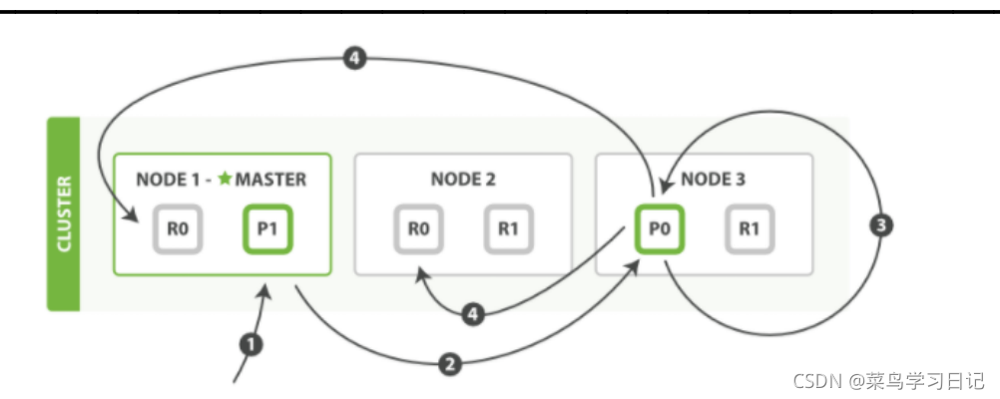

ahttps://mp.weixin.qq.com/s/m3LR6mtenlsOoFV69NP1sw

## es节点类型

https://blog.csdn.net/crazymakercircle/article/details/120890619

### Master Node：主节点

主节点，该节点不和应用创建连接，每个节点都保存了集群状态.

master节点控制整个集群的元数据。

只有Master Node节点可以修改节点状态信息及元数据(metadata)的处理，比如索引的新增、删除、分片路由分配、所有索引和相关 Mapping 、Setting 配置等等。

> 从资源占用的角度来说：master节点不占用磁盘IO和CPU，内存使用量一般， 没有data 节点高

### Master eligible nodes：合格主节点

合格节点，每个节点部署后不修改配置信息，默认就是一个 eligible 节点.

`有资格成为Master节点但暂时并不是Master的节点`被称为 eligible 节点，该节点可以参加选主流程，成为Master节点.

该节点只是与集群保持心跳，判断Master是否存活，如果Master故障则参加新一轮的Master选举。

> 从资源占用的角度来说：eligible节点比Master节点更节省资源，因为它还未成为 Master 节点，只是有资格成功Master节点。

### Data Node：数据节点

数据节点，改节点用于建立文档索引， 接收 应用创建连接、接收索引请求，接收用户的搜索请求

data节点真正存储数据，ES集群的性能取决于该节点的个数(每个节点最优配置的情况下)，

data节点的分片执行查询语句获得查询结果后将结果反馈给Coordinating节点，在查询的过程中非常消耗硬件资源，如果在分片配置及优化没做好的情况下，进行一次查询非常缓慢(硬件配置也要跟上数据量)。
数据节点：保存包含索引文档的分片数据，执行CRUD、搜索、聚合相关的操作。属于：内存、CPU、IO密集型，对硬件资源要求高。

> 从资源占用的角度来说：data节点会占用大量的CPU、IO和内存

### Coordinating Node：协调节点(/路由节点/client节点)

协调节点，该节点专用与接收应用的查询连接、接受搜索请求，但其本身不负责存储数据

协调节点的职责：

接受客户端搜索请求后将请求转发到与查询条件相关的多个data节点的分片上，然后多个data节点的分片执行查询语句或者查询结果再返回给协调节点，协调节点把各个data节点的返回结果进行整合、排序等一系列操作后再将最终结果返回给用户请求。

搜索请求在两个阶段中执行（query 和 fetch），这两个阶段由接收客户端请求的节点 - 协调节点协调。

在请求query 阶段，协调节点将请求转发到保存数据的数据节点。 每个数据节点在本地执行请求并将其结果返回给协调节点。
在收集fetch阶段，协调节点将每个数据节点的结果汇集为单个全局结果集。

> 从资源占用的角度来说：协调节点，可当负责均衡节点，该节点不占用io、cpu和内存

### Ingest Node：ingest节点

ingest 节点可以看作是数据前置处理转换的节点，支持 pipeline管道 设置，可以使用 ingest 对数据进行过滤、转换等操作，类似于 logstash 中 filter 的作用，功能相当强大。

Ingest节点处理时机——在数据被索引之前，通过预定义好的处理管道对数据进行预处理。默认情况下，所有节点都启用Ingest，因此任何节点都可以处理Ingest任务。

我们也可以创建专用的Ingest节点。

> 可以把Ingest节点的功能抽象为：**大数据处理环节的“ETL”**——抽取、转换、加载

#### ingest 节点能解决什么问题？

##### **思考问题1：线上写入数据改字段需求**

如何在数据写入阶段修改字段名（不是修改字段值）？

##### **思考问题2：线上业务数据添加特定字段需求**

如何在批量写入数据的时候，每条document插入实时时间戳？

### 节点的角色建议

- `在开发环境`，一个节点可以承担多种角色；

- `生产环境中`，需要根据数据量，写入和查询的吞吐量，选择合适的部署方式，建议设置单一角色的节点（dedicated node)；

从高可用 & 避免脑裂的角度出发，需要配置多个 Dedicated Master Node

> 一般在生产环境中配置 3 台，当有1 台丢失的时候，其余的节点会被提升成活跃主节点；
> 一个集群必须有一台活跃的主节点，负责分片管理，索引创建，集群管理等操作；

Elasticsearch集群至少三个Master实例，并且，生产建议每个es实例部署在不同的设备上，三个Master节点最多只能故障一台Master节点，数据不会丢失; 如果三个节点故障两个节点，则造成数据丢失并无法组成集群。

三台Master做集群，其中一台被真正选为了Master，那么其它两台就是 eligible 节点。

## es的脑裂问题怎么解决

### （1）脑裂问题可能的成因

- 网络问题：集群间的网络延迟导致一些节点访问不到master，认为master挂掉了从而选举出新的master，并对master上的分片和副本标红，分配新的主分片 

- 节点负载：主节点的角色既为master又为data，访问量较大时可能会导致ES停止响应造成大面积延迟，此时其他节点得不到主节点的响应认为主节点挂掉了，会重新选取主节点。 

- 内存回收：data节点上的ES进程占用的内存较大，引发JVM的大规模内存回收，造成ES进程失去响应。 

### （2）脑裂问题解决方案

- 减少误判：discovery.zen.ping_timeout节点状态的响应时间，默认为3s，可以适当调大，如果master在该响应时间的范围内没有做出响应应答，判断该节点已经挂掉了。调大参数（如6s，discovery.zen.ping_timeout:6），可适当减少误判。 

- 选举触发 discovery.zen.minimum_master_nodes:1 
  
  该参数是用于控制选举行为发生的最小集群主节点数量。 
  
  当备选主节点的个数大于等于该参数的值，且备选主节点中有该参数个节点认为主节点挂了，进行选举。官方建议为（n/2）+1，n为主节点个数（即有资格成为主节点的节点个数） 
  
  增大该参数，当该值为2时，我们可以设置master的数量为3，这样，挂掉一台，其他两台都认为主节点挂掉了，才进行主节点选举。 

- 角色分离：即master节点与data节点分离，限制角色


# elasticsearch深度分页

https://mp.weixin.qq.com/s/5iAimeVsELa5RPWr2a_nnA

https://mp.weixin.qq.com/s/tbgjz852BZM0mcdMJ873yw

## es默认的from+size的分页方式

es默认的from+size的分页方式返回的结果数据集不能超过1万条，超过之后返回的数据越多性能就越低。(参数`max_result_window`的限制)

这是因为es要计算相似度排名，需要排序整个整个结果集，假设我们有一个index它有5个shard，现在要读取1000到1010之间的这10条数据，es内部会在每个shard上读取1010条数据，然后返回给计算节点，这里有朋友可能问为啥不是10条数据而是1010条呢？这是因为某个shard上的10条数据，可能还没有另一个shard上top10之后的数据相似度高，所以必须全部返回，然后在计算节点上，重新对5050条数据进行全局排序，最后在选取top 10出来，这里面排序是非常耗时的，所以这个数量其实是指数级增长的，到后面分页数量越多性能就越下降的厉害，而且大量的数据排序会占用jvm的内存，很有可能就OOM了，这也是为什么es默认不允许读取超过1万条数据的原因。

## 深度分页

那么问题来了，我就是想要深度的分页数据应该怎么办？ es里面提供了两种方式来读取深度分页的数据：

### （1）离线的读取深度分页数据的Scroll方法

`Scroll方式`在前面的文章提到过，它通过一次查询请求后维护一个`索引快照`的search context，然后每次再去批量的读取数据，效率比较高。在5.x之后，还可以通过slice分片来实现并行导出。

#### Scroll方式缺点

就是维护一个search context需要占用很多资源，而且在快照建立之后数据变化如删除和更新操作是不能被感知到的，所以不能够用于实时和高并发的场景。

### （2）能够用于实时和高并发场景的searchAfter方法（5.x之后）

`searchAfter的方式`通过维护一个`实时游标`来避免scroll的缺点，它可以用于实时请求和高并发场景。

#### searchAfter缺点

1. 是不能够随机跳转分页，只能是一页一页的向后翻

2. 并且需要至少指定一个唯一不重复字段来排序。

   

> 此外还有一个与scorll的不同之处是searchAfter的读取数据的顺序会受索引的更新和删除影响而scroll不会，因为scroll读取的是不可变的快照。

下面来看下如何使用searchAfter：

我们先查询一页数据：

```
GET twitter/_search
{
    "size": 10,
    "query": {
        "match" : {
            "title" : "elasticsearch"
        }
    },
    "sort": [
        {"date": "asc"},
        {"_id": "desc"}
    ]
}
```

注意，上面用了两个字段来排序，第一个是业务字段可能不唯一，但是第二个id字段一定唯一不重复的。只有这样才能确保searchAfter的翻页顺序读取。

另外searchAfter的from字段一定要设置成0，不然会有问题。

第一个请求发出之后，我们需要获取第一个请求里面最后一条的数据的date和id，然后把这个信息传送到下一个批次，依次类推直到把所有的数据处理完。

如下第二个请求的查询体：

```
GET twitter/_search
{
    "size": 10,
    "query": {
        "match" : {
            "title" : "elasticsearch"
        }
    },
    "search_after": [1463538857, "654323"],
    "sort": [
        {"date": "asc"},
        {"_id": "desc"}
    ]
}
```

## 分页总结

| 分页方式     | 性能 | 优点                                             | 缺点                                                         | 场景                                   |
| :----------- | :--- | :----------------------------------------------- | :----------------------------------------------------------- | :------------------------------------- |
| from + size  | 低   | 灵活性好，实现简单                               | 深度分页问题                                                 | 数据量比较小，能容忍深度分页问题       |
| scroll       | 中   | 解决了深度分页问题                               | 无法反应数据的实时性（快照版本）维护成本高，需要维护一个 scroll_id | 海量数据的导出需要查询海量结果集的数据 |
| search_after | 高   | 性能最好不存在深度分页问题能够反映数据的实时变更 | 实现复杂，需要有一个全局唯一的字段连续分页的实现会比较复杂，因为每一次查询都需要上次查询的结果，它不适用于大幅度跳页查询 | 海量数据的分页                         |

## es的集群机制是怎样的？如何进行选举机制？为何要这样选举？

https://blog.csdn.net/u012270682/article/details/106262379

master选举默认是由zendiscovery模块负责

master和Master eligible节点间是存在一个类似心跳检测的ping机制的，当master ping不到其他节点，或者其他节点ping不到master的时候，他们之间就会互相判断，是否大多数都连不到主节点上了，如果大多数都连不上，那么就开始重新进行master选举。

master备选节点的主机列表  A ：discovery.zen.ping.unicast.hosts[]

master选举最少通过节点数 B：discovery.zen.mininum_master_nodes

防止脑裂：B的个数 = A/2+1

## es的高可用的机制如何保证的？

### 分片shard

### 节点选举

### 副本replicas

代表索引副本，es可以设置多个索引的副本。

副本的作用：

一是提高系统的容错性，当某个节点某个分片损坏或丢失时可以从副本中恢复。

二是提高es的查询效率，es会自动对搜索请求进行负载均衡。

### Recovery

代表数据恢复或叫数据重新分布，es在有节点加入或退出时会根据机器的负载对索引分片进行重新分配;

挂掉的节点重新启动时也会进行数据恢复。

## 27.es的分词词典的存储结构是什么样子的？

## es如何保证宕机恢复数据保持一致性的？

https://juejin.cn/post/6844903878962446350

### 索引恢复流程

索引恢复是ES数据恢复过程，待恢复的数据是客户端写入成功，但未执行刷盘(flush)的Lucene分段。副分片同步主分片数据

根据分片的性质，索引恢复过程可以分为朱分片恢复流程和副分片恢复流程

- 主分片从translog中自我恢复，尚未执行flush到磁盘lucene分段的数据可以从translog中重建
- 副分片需要从主分片中拉取Lucene分段和translog进行恢复。

索引恢复的触发条件包括从快照备份恢复，节点加入和离开，索引的_open操作

| 阶段           | 简介                             |
| ------------ | ------------------------------ |
| INIT         | 恢复尚未启动                         |
| INDEX        | 恢复Lucene文件，以及在节点间复制索引数据        |
| VERIFY_INDEX | 验证索引                           |
| TRANSLOG     | 启动engine，重放translog，建立Lucene索引 |
| FINALIZE     | 清理工作                           |
| DONE         | 完毕                             |

主分片和副分片恢复都会经历这些阶段 ，但有时候会跳过具体执行过程 ，只 是在流程上体 现出 经历了这个短暂阶段 。 例如， 副分片恢复时会跳过 TRANSLOG 重放过程： 主分片恢复过 程中 的卧IDEX 阶段不会在节点之 间 复制数据。

#### 主分片恢复流程

##### INIT 阶段

一个分片的恢复是从启动开始，检验当前分片是否为主分片，分片状态等信息校验

##### INDEX阶段

从Lucene读取最后一次提交的分段信息，

##### VERIFY_INDEX阶段

验证Lucene中的index是否被损坏 是否检验本项检查取决于配置index.shard.check_on_startup,在分片数据过多的时候，分片检查会消耗更多的时间，影响启动速度

##### TRANSLOG阶段

根据Lucene最后一次提交的记录和translog对比，将需要重新操作的数据遍历重新索引

##### FINALIZE阶段

本阶段执行刷新(refresh)操作，将缓冲的数据写入文件，但不刷盘，数据还在操作系统的cache中

##### DONE阶段

DONE阶段将再次执行refresh，然后更新分片状态为恢复完成

#### 副分片恢复流程

副分片恢复的核心思想是从主分片拉取 Lucene 分段和 translog 进行恢复 。 按数据传递的方向，主分片节点称为 Source ，副分片节点称为 Target。

索引恢复过程的一个难点在于如何维护主副分片的一致性。 假设副分片恢复期间 一直有写操作，如何实现一致呢？

我们先看看早期的做法：在 2.0 版本之前，副分片恢复要经历三个阶段 。

阶段1 ：将主分片的 Lucene 做快照，发送到 target 。期间不阻塞索引操作，新增数据写到主分片的 translog 。         

阶段2 ： 将主分片 translog 做快照，发送到 target 重放，期间不阻塞索引操作 。

阶段3 ： 为主分片加写锁，将剩余的 translog 发送到 target。 此时数据量很小，写入过程的阻塞很短 。

从2.0版本开始 引入 translog.view 概念的同时， 阶段3被删除 。这个阶段是重放操作（ operations ），同时防止新的写入 Engine 。 这是不必要的，因为自恢复开始，标准的 index 操作会发送所有的操作到正在恢复中的分片。 重放恢复 开始时获取的 view 中的所有操作足够保证不丢失任何操作 。

阶段1：在主分片所在节点， 获取 translog 保留锁， 从获取保留锁开始，会保留 translog不受其刷盘清空的影响 。然后调用 Lucene 接口把 shard 做快照，快照含有 shard 中己经刷到磁盘的文件引用，把这些 shard 数据复制到副本节点。在 phase1结束前 ，会向副分片节点发送告知对方启动 Engine ，在 phase2 开始之前，副分片就可以正常处理写 请求了。

阶段2 ： 对 translog 做快照，这个快照里包含从 phase ！开始，到执行 translog 快照期间 的新增索引 。 将这些 translog 发送到副分片所在节点进行重放。

- 查看集群中所有索引恢复的状态和进度

- ```
  #查看集群中所有的索引恢复进度
  GET _cat/recovery?v
  ```

- 查看单个索引的恢复状态、进度

- ```
  #查看单个索引恢复详情
  GET /haizhi1/_recovery?pretty
  ```

- 查看索引恢复状态统计
  
  ```
  GET /_all/_stats?level=shards&pretty
  ```

## ES数据写入原理，是否会丢失

### es 写数据过程

- 客户端选择一个 node 发送请求过去，这个 node 就是 `coordinating node` （协调节点）。
- `coordinating node` 对 document 进行**路由**，将请求转发给对应的 node（有 primary shard）。
- 实际的 node 上的 `primary shard` 处理请求，然后将数据同步到 `replica node` 。
- `coordinating node` 如果发现 `primary node` 和所有 `replica node` 都搞定之后，就返回响应结果给客户端。

路由算法就是根据路由和文档id计算目标的分片id的过程。

```
shard = hash(_routing) % (num_of_primary_shards)
```


#### `refresh`过程

先写入内存 buffer，在 buffer 里的时候数据是搜索不到的；同时将数据写入 translog 日志文件。
如果 buffer 快满了，或者到一定时间，就会将内存 buffer 数据  `refresh`  到一个新的  segment file  中，但是此时数据不是直接进入  segment file  磁盘文件，而是先进入  os cache  。

#### translog 日志文件的作用是什么？

你执行 commit 操作之前，数据要么是停留在 buffer 中，要么是停留在 os cache 中，无论是 buffer 还是 os cache 都是内存，一旦这台机器死了，内存中的数据就全丢了。所以需要将数据对应的操作写入一个专⻔的日志文件  translog  中，一旦此时机器宕机，再次重启的时候，es 会自动读取 translog 日志文件中的数据，恢复到内存 buffer 和os cache 中去。
translog 其实也是先写入 os cache 的，默认每隔 5 秒刷一次到磁盘中去，所以默认情况下，可能有 5 秒的数据会仅仅停留在 buer 或者 translog 文件的 os cache 中，如果此时机器挂了，会丢失 5 秒钟的数据。但是这样性能比较好，最多丢 5 秒的数据。也可以将 translog 设置成每次写操作必须是直接  fsync  到磁盘，但是性能会差很多。

#### 内存 buffer->os cache

数据先写入内存 buffer，然后每隔 1s，将数据 refresh 到 os cache，到了 os cache 数据就能被搜索到（所以我们才说 es 从写入到能被搜索到，中间有 1s 的延迟）。

#### os cache->translog 文件， 可能丢失

每隔 5s，将数据写入 translog 文件（这样如果机器宕机，内存数据全没，最多会有 5s 的数据丢失），
translog 大到一定程度，或者默认每隔 30mins，会触发 commit 操作，将缓冲区的数据都` flush`到 segment file 磁盘文件中。
数据写入 segment file 之后，同时就建立好了倒排索引。

**总结一下**，数据先写入内存 buffer，然后每隔 1s，将数据 refresh 到 os cache，到了 os cache 数据就能被搜索到（所以我们才说 es 从写入到能被搜索到，中间有 1s 的延迟）。每隔 5s，将数据写入 translog 文件（这样如果机器宕机，内存数据全没，最多会有 5s 的数据丢失），translog 大到一定程度，或者默认每隔 30mins，会触发 commit 操作，将缓冲区的数据都 flush 到 segment file 磁盘文件中。

> 数据写入 segment file 之后，同时就建立好了倒排索引。refresh和flush都可以通过API手动触发。

#### 在并发情况下，ES如何保证读写一致？

可以通过版本号使用乐观并发控制，以确保新版本不会被旧版本覆盖，由应用层来处理具体的冲突； 另外对于写操作，一致性级别支持quorum/one/all，默认为quorum，即只有当大多数分片可用时才允许写操作。但即使大多数可用，也可能存在因为网络等原因导致写入副本失败，这样该副本被认为故障，分片将会在一个不同的节点上重建。 对于读操作，可以设置replication为sync(默认)，这使得操作在主分片和副本分片都完成后才会返回；如果设置replication为async时，也可以通过设置搜索请求参数`_preference为primary`来查询主分片，确保文档是最新版本。

### es更新过程

https://blog.csdn.net/qq_43662627/article/details/120123474



1. 客户端向 Node 1 发送更新请求。
2. 它将请求转发到主分片所在的 Node 3 。
3. Node 3 从主分片检索文档，修改 _source 字段中的 JSON ，并且尝试重新索引主分片的文档。如果文档已经被另一个进程修改，它会重试步骤 3 ，超过 retry_on_conflict 次后放弃。
4. 如果 Node 3 成功地更新文档，它将新版本的文档并行转发到 Node 1 和 Node 2 上的副本分片，重新建立索引。一旦所有副本分片都返回成功， Node 3 向协调节点也返回成功，协调节点向客户端返回成功。

### es 读数据过程

可以通过 `doc id` 来查询，会根据 `doc id` 进行 hash，判断出来当时把 `doc id` 分配到了哪个 shard 上面去，从那个 shard 去查询。

- 客户端发送请求到**任意**一个 node，成为 `coordinate node` 。
- `coordinate node` 对 `doc id` 进行哈希路由，将请求转发到对应的 node，此时会使用 `round-robin` **随机轮询算法**，在 `primary shard` 以及其所有 replica 中随机选择一个，让读请求负载均衡。
- 接收请求的 node 返回 document 给 `coordinate node` 。
- `coordinate node` 返回 document 给客户端。

### es 搜索数据过程

es 最强大的是做全文检索，就是比如你有三条数据：

```
java真好玩儿啊
java好难学啊
j2ee特别牛
```

你根据 `java` 关键词来搜索，将包含 `java` 的 `document` 给搜索出来。es 就会给你返回：java 真好玩儿啊，java 好难学啊。

**es搜索的过程描述(默认搜索方式Query Then Fetch)**

- 客户端发送请求到一个 `coordinate node` 。
- 协调节点将搜索请求转发到**所有**的 shard 对应的 `primary shard` 或 `replica shard` ，都可以。
- query phase：每个 shard 将自己的搜索结果（其实就是一些 `doc id` ）返回给协调节点，由协调节点进行数据的合并、排序、分页等操作，产出最终结果。
- fetch phase：接着由协调节点根据 `doc id` 去各个节点上**拉取实际**的 `document` 数据，最终返回给客户端。

> 写请求是写入 primary shard，然后同步给所有的 replica shard；读请求可以从 primary shard 或 replica shard 读取，采用的是随机轮询算法。

#### Query Then Fetch 和DFS Query Then Fetch

https://www.jianshu.com/p/c7529b98993e

区别在结果打分上，DFS Query Then Fetch是全局Term/Document Frequency打分，Query Then Fetch本地Term/Document Frequency打分

DFS Query Then Fetch多了一步预查询每个shard，询问Term和Document frequency

预查询本身会有一个额外的在shard中的轮询，这个当然会有性能上的问题（跟索引的大小，shard的数量，查询的频率等）。在大多数情形下，是没有必要的，拥有足够的数据可以解决这样的问题。

但是有时候，你可能会遇到奇特的打分场景，在这些情况中，知道如何使用`DFS query then fetch`去进行搜索执行过程的微调还是有用的。

### 删除/更新数据底层原理

如果是删除操作，commit 的时候会生成一个 `.del` 文件，里面将某个 doc 标识为 `deleted` 状态，那么搜索的时候根据 `.del` 文件就知道这个 doc 是否被删除了。

如果是更新操作，就是将原来的 doc 标识为 `deleted` 状态，然后新写入一条数据。

buffer 每 refresh 一次，就会产生一个 `segment file` ，所以默认情况下是 1 秒钟一个 `segment file` ，这样下来 `segment file` 会越来越多，此时会定期执行 merge。每次 merge 的时候，会将多个 `segment file` 合并成一个，同时这里会将标识为 `deleted` 的 doc 给**物理删除掉**，然后将新的 `segment file` 写入磁盘，这里会写一个 `commit point` ，标识所有新的 `segment file` ，然后打开 `segment file` 供搜索使用，同时删除旧的 `segment file` 。

### 底层 lucene、lucence内部结构是什么

简单来说，lucene 就是一个 jar 包，里面包含了封装好的各种建立倒排索引的算法代码。我们用 Java 开发的时候，引入 lucene jar，然后基于 lucene 的 api 去开发就可以了。

通过 lucene，我们可以将已有的数据建立索引，lucene 会在本地磁盘上面，给我们组织索引的数据结构。Lucene是有索引和搜索的两个过程，包含索引创建，索引，搜索三个要点


### 倒排索引

在搜索引擎中，每个文档都有一个对应的文档 ID，文档内容被表示为一系列关键词的集合。例如，文档 1 经过分词，提取了 20 个关键词，每个关键词都会记录它在文档中出现的次数和出现位置。

那么，倒排索引就是**关键词到文档** ID 的映射，每个关键词都对应着一系列的文件，这些文件中都出现了关键词。

举个栗子。

有以下文档：

| DocId | Doc                             |
|:----- |:------------------------------- |
| 1     | 谷歌地图之父跳槽 Facebook               |
| 2     | 谷歌地图之父加盟 Facebook               |
| 3     | 谷歌地图创始人拉斯离开谷歌加盟 Facebook        |
| 4     | 谷歌地图之父跳槽 Facebook 与 Wave 项目取消有关 |
| 5     | 谷歌地图之父拉斯加盟社交网站 Facebook         |

对文档进行分词之后，得到以下**倒排索引**。

| WordId | Word     | DocIds        |
|:------ |:-------- |:------------- |
| 1      | 谷歌       | 1, 2, 3, 4, 5 |
| 2      | 地图       | 1, 2, 3, 4, 5 |
| 3      | 之父       | 1, 2, 4, 5    |
| 4      | 跳槽       | 1, 4          |
| 5      | Facebook | 1, 2, 3, 4, 5 |
| 6      | 加盟       | 2, 3, 5       |
| 7      | 创始人      | 3             |
| 8      | 拉斯       | 3, 5          |
| 9      | 离开       | 3             |
| 10     | 与        | 4             |
| ..     | ..       | ..            |

另外，实用的倒排索引还可以记录更多的信息，比如文档频率信息，表示在文档集合中有多少个文档包含某个单词。

那么，有了倒排索引，搜索引擎可以很方便地响应用户的查询。比如用户输入查询 `Facebook` ，搜索系统查找倒排索引，从中读出包含这个单词的文档，这些文档就是提供给用户的搜索结果。

要注意倒排索引的两个重要细节：

- 倒排索引中的所有词项对应一个或多个文档；
- 倒排索引中的词项**根据字典顺序升序排列**

> 倒排索引，相反于一篇文章包含了哪些词，它从词出发，记载了这个词在哪些文档中出现过，由两部分组成——词典和倒排表。

`加分项`：倒排索引的底层实现是基于：FST（Finite State Transducer）数据结构。
lucene从4+版本后开始大量使用的数据结构是FST。FST有两个优点：

- 1）空间占用小。通过对词典中单词前缀和后缀的重复利用，压缩了存储空间；
- 2）查询速度快。O(len(str))的查询时间复杂度。

## 说说你们公司es的集群架构，索引数据大小，分片有多少，以及一些调优手段

如实结合自己的实践场景回答即可。
比如：ES集群架构13个节点，索引根据通道不同共20+索引，根据日期，每日递增20+，索引：10分片，每日递增1亿+数据，
每个通道每天索引大小控制：150GB之内。

仅索引层面调优手段：

#### 1.1、设计阶段调优

- 1）根据业务增量需求，采取基于日期模板创建索引，通过roll over API滚动索引；
- 2）使用别名进行索引管理；
- 3）每天凌晨定时对索引做force_merge操作，以释放空间；
- 4）采取冷热分离机制，热数据存储到SSD，提高检索效率；冷数据定期进行shrink操作，以缩减存储；
- 5）采取curator进行索引的生命周期管理；
- 6）仅针对需要分词的字段，合理的设置分词器；
- 7）Mapping阶段充分结合各个字段的属性，是否需要检索、是否需要存储等。……..

#### 1.2、写入调优

- 1）写入前副本数设置为0；
- 2）写入前关闭refresh_interval设置为-1，禁用刷新机制；
- 3）写入过程中：采取bulk批量写入；
- 4）写入后恢复副本数和刷新间隔；
- 5）尽量使用自动生成的id。

#### 1.3、查询调优

- 1）禁用wildcard；
- 2）禁用批量terms（成百上千的场景）；
- 3）充分利用倒排索引机制，能keyword类型尽量keyword；
- 4）数据量大时候，可以先基于时间敲定索引再检索；
- 5）设置合理的路由机制。

#### 1.4、其他调优

部署调优，业务调优等。

上面的提及一部分，面试者就基本对你之前的实践或者运维经验有所评估了。

## elasticsearch 索引数据多了怎么办，如何调优，部署

`解答`：索引数据的规划，应在前期做好规划，正所谓“设计先行，编码在后”，这样才能有效的避免突如其来的数据激增导致集群处理能力不足引发的线上客户检索或者其他业务受到影响。
如何调优，正如问题1所说，这里细化一下：

#### 1.  动态索引层面

基于`模板+时间+rollover api滚动`创建索引，举例：设计阶段定义：blog索引的模板格式为：blog_index_时间戳的形式，每天递增数据。

这样做的好处：不至于数据量激增导致单个索引数据量非常大，接近于上线2的32次幂-1，索引存储达到了TB+甚至更大。

一旦单个索引很大，存储等各种风险也随之而来，所以要提前考虑+及早避免。

#### 2. 存储层面

`冷热数据分离存储`，热数据（比如最近3天或者一周的数据），其余为冷数据。
对于冷数据不会再写入新数据，可以考虑定期force_merge加shrink压缩操作，节省存储空间和检索效率。

#### 3. 部署层面

一旦之前没有规划，这里就属于应急策略。
结合ES自身的支持动态扩展的特点，动态新增机器的方式可以缓解集群压力，注意：如果之前主节点等`规划合理`，不需要重启集群也能完成动态新增的。

## elasticsearch是如何实现master选举的

`面试官`：想了解ES集群的底层原理，不再只关注业务层面了。
`解答`：
前置前提：

- 1）只有候选主节点（master：true）的节点才能成为主节点。
- 2）最小主节点数（min_master_nodes）的目的是防止脑裂。

这个我看了各种网上分析的版本和源码分析的书籍，云里雾里。
核对了一下代码，核心入口为findMaster，选择主节点成功返回对应Master，否则返回null。选举流程大致描述如下：

- 第一步：确认候选主节点数达标，elasticsearch.yml设置的值discovery.zen.minimum_master_nodes；
- 第二步：比较：先判定是否具备master资格，具备候选主节点资格的优先返回；若两节点都为候选主节点，则id小的值会主节点。注意这里的id为string类型。

题外话：获取节点id的方法。

```
1 GET /_cat/nodes?v&h=ip,port,heapPercent,heapMax,id,name
2 ip        port heapPercent heapMax id   name
3 127.0.0.1 9300          39   1.9gb Hk9w Hk9wFwU
```

## Elasticsearch在部署时，对Linux的设置有哪些优化方法

`解答`：

- 1）关闭缓存swap;
- 2）堆内存设置为：Min（节点内存/2, 32GB）;
- 3) 设置最大文件句柄数；
- 4）线程池+队列大小根据业务需要做调整；
- 5）磁盘存储raid方式——存储有条件使用RAID10，增加单节点性能以及避免单节点存储故障。

### 内存建议：

假如一台机器部署了一个ES实例，则ES最大可用内存，不要超过物理内存的50%；

ES最大可用内存，最多不可超过32G；

如果单台机器上部署了多个ES实例，则多个ES实例内存相加等于物理内存的50%。

每1GB堆内存对应集群的分片，建议保持在20个以内；

### 分片建议：

每个分片大小不要超过30G，硬盘条件好的话，不建议超过100G.


# lucene思维导图，让搜索引擎不再难懂

https://mp.weixin.qq.com/s/VRqp9V1ppyxkqf8l7sn_xg


 


今天，我们来讲讲lucene，同学们搬好板凳坐好啦。


首先我们来看张思维导图：

    

以上是我们java常用的全文搜索引擎框架，很多项目的搜索功能都是基于以上4个框架完成的。


所以lucene到底是干啥的？

Lucene是一套用于全文检索和搜索的开放源代码程序库，一个能够轻松集添加搜索功能到一个应用程序中的简单却强大的核心代码库和API。

**Lucene**，目前最受欢迎的Java全文搜索框架。原因很简单，hibernate search、solr、elasticsearch都是基于lucene拓展出来的搜索引擎。

**Hibernate Search**是在apache Lucene的基础上建立的主要用于Hibernate的持久化模型的全文检索工具。

**Elasticsearch**也使用Java开发并使用Lucene作为其核心来实现所有索引和搜索的功能，但是它的目的是通过简单的RESTful API来隐藏Lucene的复杂性，从而让全文搜索变得简单。

**Solr**它是一种开放源码的、基于 Lucene Java 的搜索服务器，易于加入到 Web 应用程序中。提供了层面搜索(就是统计)、命中醒目显示并且支持多种输出格式（包括XML/XSLT 和JSON等格式）。

接下来，我们分为以下几个部分去理解、打开lucene的真面目。

- 相关概念

- 构建索引与查询索引过程

- 倒排索引

- 可视化工具

- 项目应用指南


### **相关概念**

lucene官方网站：http://lucene.apache.org/


既然是全文搜索工具，肯定有一定的排序结构和规则。当我们输入关键字的时候，lucene能安装内部的层次结构快速检索出我需要的内容。这里面会涉及到几个层次和概念。


 

#### **索引库(Index)**

一个目录一个索引库，同一文件夹中的所有的文件构成一个Lucene索引库。*类似数据库的表的概念。*

 


（lucene的索引实例）


#### **段(Segment)**

Lucene索引可能由多个子索引组成，这些子索引成为段。每一段都是完整独立的索引，能被搜索。


#### **文档(Document)**

一个索引可以包含多个段，段与段之间是独立的，添加新文档可以生成新的段，不同的段可以合并。段是索引数据存储的单元。*类似****数据库内的行\****或者****文档数据库内的文档\****的概念。*


#### **域(Field)**

一篇文档包含不同类型的信息，可以分开索引，比如标题，时间，正文，作者等。*类似于****数据库表中的字段\****。*


#### **词(Term)**

词是索引的最小单位，是经过词法分析和语言处理后的字符串。一个Field由一个或多个Term组成。比如标题内容是“hello lucene”，经过分词之后就是“hello”，“lucene”，这两个单词就是Term的内容信息，当关键字搜索“hello”或者“lucene”的时候这个标题就会被搜索出来。


#### **分词器（**Analyzer）

一段有意义的文字需要通过Analyzer来分割成一个个词语后才能按关键词搜索。StandartdAnalyzer是Lucene中常用的分析器，中文分词有CJKAnalyzer、SmartChinieseAnalyzer等。


（lucene 索引存储结构概念图）


上图大概可以这样理解，索引内部由多个段组成，当新文档添加进来时候会生成新的段，不同的段之间可以合并（Segment-0、Segment-1、Segment-2合并成Segment-4），段内含有文档号与文档的索引信息。而每个文档内有多个域可以进行索引，每个域可以指定不同类型（StringField，TextField）。


所以，从图中可以看出，lucene的层次结构依次如下：***索引(Index) –> 段(segment) –> 文档(Document) –> 域(Field) –> 词(Term)\***。


在上面我们了解了lucene的一些基本概念，接下来我们进入原理分析的环节。


（为什么lucene搜索引擎查询这么快？）


### **倒排索引**

我们都知道要想提高检索速度要建立索引，重点就在这里，lucene使用了倒排索引（也叫反向索引）的结构。


倒排索引（反向索引）自然就有正排索引（正向索引）。


- 正排索引是指**从文档检索出单词**，正常查询的话我们都是从文档里面去检索有没这个关键字单词。


- 倒排索引是指**从单词检索出文档**，与从正排索引是倒过来的概念，需要预先为文档准备关键字，然后查询时候直接匹配关键字得到对应的文档。

有一句这样的总结：**由于不是由记录来确定属性值，而是由属性值来确定记录的位置，因而称为倒排索引(inverted index)。**

​    


#### 具体怎么实现的呀？


咱们来举个例子来研究一下（例子来源于网络）：

假如现在有两个文档，内容分别是：

- 文档1：home sales rise in July.
- 文档2：increase in home sales in July.   


分析上图可知，首先文档经过分词器（Analyzer）分词之后，我们可以得到词（term），词和文档ID是对应起来的，接下来这些词集进行一次排序，然后合并相同的词并统计出现频率，以及记录出现的文档ID。


所以：


**实现时**，lucene将上面三列分别作为*词典文件（Term Dictionary）*、*频率文件(frequencies)、位置文件 (positions)*保存。其中词典文件不仅保存有每个关键词，还保留了指向频率文件和位置文件的指针，通过指针可以找到该关键字的频率信息和位置信息。 


**索引时**，假设要查询单词 “sales”，lucene先对词典二元查找、找到该词，通过指向频率文件的指针读出所有文章号，然后返回结果。词典通常非常小，因而，整个过程的时间是毫秒级的。  


### **lucene可视化工具Luke**

- https://github.com/DmitryKey/luke/releases

    

###  **构建索引与查询索引过程**

以上我们知道了lucene构建索引的原理，接下来我们在代码层面去使用lucene。


我们先来看一张图：


   

检索文件之前先要建立索引，所以上图得从“待检索文件”节点开始看。


#### **构建索引过程：**

1、为每一个待检索的文件构建Document类对象,将文件中各部分内容作为Field类对象。

2、使用Analyzer类实现对文档中的自然语言文本进行分词处理,并使用IndexWriter类构建索引。

3、使用FSDirectory类设定索引存储的方式和位置,实现索引的存储。


#### **检索索引过程：**

4、使用IndexReader类读取索引。

5、使用Term类表示用户所查找的关键字以及关键字所在的字段,使用QueryParser类表示用户的查询条件。

6、使用IndexSearcher类检索索引,返回符合查询条件的Document类对象。


*其中虚线指向的是这个类所在的包名（packege）。如Analyzer在org.apache.lucene.analysis包下。*


#### 构建索引代码：


```
//创建索引
public class CreateTest {

    public static void main(String[] args) throws Exception {
        Path indexPath = FileSystems.getDefault().getPath("d:\\index\\");

//        FSDirectory有三个主要的子类,open方法会根据系统环境自动挑选最合适的子类创建
//        MMapDirectory：Linux, MacOSX, Solaris
//        NIOFSDirectory：other non-Windows JREs
//        SimpleFSDirectory：other JREs on Windows
        Directory dir = FSDirectory.open(indexPath);

        // 分词器
        Analyzer analyzer = new StandardAnalyzer();
        boolean create = true;
        IndexWriterConfig indexWriterConfig = new IndexWriterConfig(analyzer);
        if (create) {
            indexWriterConfig.setOpenMode(IndexWriterConfig.OpenMode.CREATE);
        } else {
            // lucene是不支持更新的，这里仅仅是删除旧索引，然后创建新索引
            indexWriterConfig.setOpenMode(IndexWriterConfig.OpenMode.CREATE_OR_APPEND);
        }
        IndexWriter indexWriter = new IndexWriter(dir, indexWriterConfig);

        Document doc = new Document();
        // 域值会被索引，但是不会被分词，即被当作一个完整的token处理，一般用在“国家”或者“ID
        // Field.Store表示是否在索引中存储原始的域值
        // 如果想在查询结果里显示域值，则需要对其进行存储
        // 如果内容太大并且不需要显示域值（整篇文章内容），则不适合存储到索引中
        doc.add(new StringField("Title", "sean", Field.Store.YES));
        long time = new Date().getTime();
        // LongPoint并不存储域值
        doc.add(new LongPoint("LastModified", time));
//        doc.add(new NumericDocValuesField("LastModified", time));
        // 会自动被索引和分词的字段，一般被用在文章的正文部分
        doc.add(new TextField("Content", "this is a test of sean", Field.Store.NO));

        List<Document> docs = new LinkedList<>();
        docs.add(doc);

        indexWriter.addDocuments(docs);
        // 默认会在关闭前提交
        indexWriter.close();
    }
}
```


对应时序图：


#### 查询索引代码：

```
//查询索引
public class QueryTest {

    public static void main(String[] args) throws Exception {
        Path indexPath = FileSystems.getDefault().getPath("d:\\index\\");
        Directory dir = FSDirectory.open(indexPath);
        // 分词器
        Analyzer analyzer = new StandardAnalyzer();

        IndexReader reader = DirectoryReader.open(dir);
        IndexSearcher searcher = new IndexSearcher(reader);

        // 同时查询多个域
//        String[] queryFields = {"Title", "Content", "LastModified"};
//        QueryParser parser = new MultiFieldQueryParser(queryFields, analyzer);
//        Query query = parser.parse("sean");

        // 一个域按词查doc
//        Term term = new Term("Title", "test");
//        Query query = new TermQuery(term);

        // 模糊查询
//        Term term = new Term("Title", "se*");
//        WildcardQuery query = new WildcardQuery(term);

        // 范围查询
        Query query1 = LongPoint.newRangeQuery("LastModified", 1L, 1637069693000L);

        // 多关键字查询，必须指定slop（key的存储方式）
        PhraseQuery.Builder phraseQueryBuilder = new PhraseQuery.Builder();
        phraseQueryBuilder.add(new Term("Content", "test"));
        phraseQueryBuilder.add(new Term("Content", "sean"));
        phraseQueryBuilder.setSlop(10);
        PhraseQuery query2 = phraseQueryBuilder.build();

        // 复合查询
        BooleanQuery.Builder booleanQueryBuildr = new BooleanQuery.Builder();
        booleanQueryBuildr.add(query1, BooleanClause.Occur.MUST);
        booleanQueryBuildr.add(query2, BooleanClause.Occur.MUST);
        BooleanQuery query = booleanQueryBuildr.build();

        // 返回doc排序
        // 排序域必须存在，否则会报错
        Sort sort = new Sort();
        SortField sortField = new SortField("Title", SortField.Type.SCORE);
        sort.setSort(sortField);

        TopDocs topDocs = searcher.search(query, 10, sort);
        if(topDocs.totalHits > 0)
            for(ScoreDoc scoreDoc : topDocs.scoreDocs){
                int docNum = scoreDoc.doc;
                Document doc = searcher.doc(docNum);
                System.out.println(doc.toString());
            }
    }
}
```


对应时序图：


lucene版本信息：

```
<dependency>
    <groupId>org.apache.lucene</groupId>
    <artifactId>lucene-core</artifactId>
    <version>7.4.0</version>
</dependency>

<dependency>
    <groupId>org.apache.lucene</groupId>
    <artifactId>lucene-queryparser</artifactId>
    <version>7.4.0</version>
</dependency>
```

### **项目应用指南**

在实际开发，比较少会直接用lucene，现在主流的搜索框架solr、Elasticsearch都是基于lucene，给我们提供了更加简便的API。特别是在分布式环境中，Elasticsearch可以问我们解决单点问题、备份问题、集群分片等问题，更加符合发展趋势。
