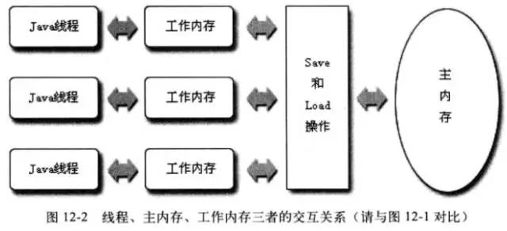
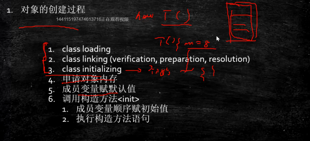
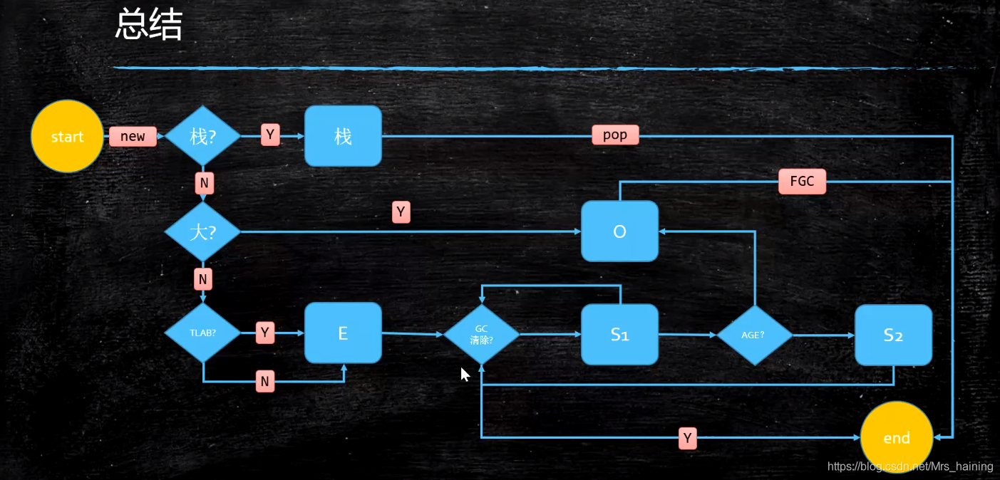
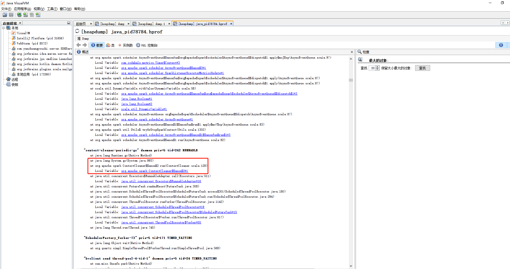

## 类加载器

#### 类加载过程

https://zhuanlan.zhihu.com/p/33509426


1. loading 加载

   加载类文件载入内存中

2. linking 链接

   verification验证 （文件格式**、**元数据的、字节码、符号引用的验证）

   preparation 准备

   ​		class静态变量赋默认值

   resolution解析  将常量池内的符号引用替换为直接引用的过程

3. initialing 初始化

   静态变量赋值为初始值

class类被加载，生成一个class类对象在内存，指向这个内存


#### 同一个Class可以被不同的ClassLoader多次装载么？

可以通过自定义一个类加载器并且重写loadClass方法，打破双亲委派的类加载机制。在Jvm中是通过类加载+类来唯一标示类的，如果不是同一个类加载加载的同一个类则是不能进行强转的。

#### tomcat中是如何实现一个同时运行多个webapp的

通过类加载器的隔离，并且优先使用自己项目路径下加载出来的类，如果自己项目路径下没有再去使用双亲委派机制加载

#### 类加载器有哪些

启动类加载器（Bootstrap ClassLoader）加载核心类库  

扩展类加载器（Extension ClassLoader）加载lib/ext 包下面的  

应用程序类加载器（Application ClassLoader）加载用户写的类

 custom自定义加载器

##### 为什么用自定义加载器？

实现自己的自定义类加载器进行解密，最后再加载

可能从非标准的来源加载代码，比如从网络来源，那就需要自己实现一个类加载器，从指定源进行加载。

继承ClassLoader，要实现findClass(String name) 方法，一般使用defineClass()方法进行定义

#### 双亲委派

是子加载器缓存去查找class，找不到逐级去父加载器找，如果都找不到从父逐级往下加载

父加载器不是类加载器的加载器，也没有继承关系,子类加载器里面有parent变量指向父类加载器

自定义classloader的classloader和父classloader是app classloader

##### 为什么要用双亲微派？

安全，如果有人定义了java.util.String类，并不会被加载，因为该class已经在bootstrap加载器被加载过了

   ####    jvm双亲委派模型是什么？具体是怎么实现的？它的主要作用是什么？如何去破坏双亲委派模型？

   类加载的时候，从子到父加载器的缓存中逐级查找，如果找不到，则从父到子逐级委托加载器去加载

   作用：安全性考虑，防止Java的类文件被篡改，比如你自己自定义个java.util.String

   打破：实现自定义ClassLoader，重新loadClass方法。

   自定义ClassLoader：继承ClassLoader，重写findClass方法。使用defineClass方法进行类的定义

## 内存模型&对象创建过程


#### Java内存模型（JMM）

  




- 线程之间的共享变量存储在主内存（Main Memory）中
- 每个线程都有一个私有的本地内存（Local Memory），本地内存是JMM的一个抽象概念，并不真实存在，它涵盖了缓存、写缓冲区、寄存器以及其他的硬件和编译器优化。本地内存中存储了该线程以读/写共享变量的拷贝副本。

#### **缓存一致性问题**

在多处理器系统中，每个处理器都有自己的高速缓存，而它们又共享同一主内存（MainMemory）

为了解决一致性的问题，需要各个处理器访问缓存时都遵循一些协议，在读写时要根据协议来进行操作，这类协议有MSI、MESI（IllinoisProtocol）、MOSI、Synapse、Firefly及DragonProtocol，等等：


#### 对象的创建过程



#### 对象结构


对象的几个部分的作用：

1.对象头中的**Mark Word**（标记字）主要用来表示对象的线程锁状态，另外还可以用来配合GC、存放该对象的hashCode；

2.**Klass Word**是一个指向方法区中Class信息的指针，意味着该对象可随时知道自己是哪个Class的实例；

3.**数组长度**也是占用64位（8字节）的空间，这是可选的，只有当本对象是一个数组对象时才会有这个部分；

4.**对象体**是用于保存对象属性和值的主体部分，占用内存空间取决于对象的属性数量和类型；

5.**对齐字**->64位虚拟机上对象的大小必须是**8的倍数**

#### 一个空对象占多少字节

```java
Object o=new Object():
```

在java中空对象（new Object()）占八个字节，对象的引用（Object o）占四个字节。所以上面那条语句所占的空间是4byte+8byte=12byte.java中的内存是以8的倍数来分配的，所以分配的内存是16byte.

举个例子：

```java
Class O{
    int i;
    byte j;
    String s;
}
```

其所占内存的大小是空对象（8）+int(4)+byte(1)+String引用(4)=17byte,因要是8的整数倍，所以其占大小为24byte.
当然，如果类里有其他对象的话，也要把其他对象的空间算进去。

其所占内存的大小是空对象（8）+int(4)+byte(1)+String引用(4)=17byte,因要是8的整数倍，所以其占大小为24byte.
当然，如果类里有其他对象的话，也要把其他对象的空间算进去。

#### 对象头mark word

64位的JVM中对象的MarkWord（8字节，（默认）启用oops压缩是4字节）


各种锁的对象头（只画出了最重要的部分，其他的省略）


#### GC默认年龄为15？

对象15次GC之后被存到“老年代”，4位存储分代年龄


#### JVM对象分配之栈上分配 & TLAB分配

https://mp.weixin.qq.com/s/8rj70QaU4ypZ0W5yqpkwvQ

##### Java对象分配流程

https://blog.csdn.net/Mrs_haining/article/details/115798804



如果开启栈上分配，[JVM](https://so.csdn.net/so/search?q=JVM&spm=1001.2101.3001.7020)会先进行栈上分配，如果没有开启栈上分配或则不符合条件的则会进行TLAB分配，如果TLAB分配不成功，再尝试在eden区分配，如果对象满足了直接进入老年代的条件，那就直接分配在老年代。

##### 栈上分配依赖于逃逸分析和标量替换

##### 逃逸分析

虚拟机会进行逃逸分析，判断线程内私有对象是否有可能被其他线程访问，导致逃逸，然后虚拟机就会根据是否可能会逃逸将其分配在栈上，或者堆中。

##### 标量替换

标量（Scalar）是指一个无法再分解成更小的数据的数据。Java中的原始数据类型就是标量。相对的，那些还可以分解的数据叫做聚合量（Aggregate），Java中的对象就是聚合量，因为他可以分解成其他聚合量和标量。

在JIT阶段，如果经过逃逸分析，发现一个对象不会被外界访问的话，那么经过JIT优化，就会把这个对象拆解成若干个其中包含的若干个成员变量来代替。这个过程就是标量替换。

参数: -XX:+DoEscapeAnalysis 是开启逃逸分析。 -XX:+EliminateAllocations 是开启标杆替换，允许将对象打散分配到栈上，默认就是打开的。

##### TLAB 分配

TLAB，全称Thread Local Allocation Buffer,即：线程本地分配缓存。这是一块线程专用的内存分配区域。TLAB占用的是eden区的空间。在TLAB启用的情况下（默认开启），JVM会为每一个线程分配一块TLAB区域。

局限性:TLAB空间一般不会太大（占用eden区），所以大对象无法进行TLAB分配，只能直接分配到堆上.


#### 方法区

方法区与 Java 堆一样，是各个线程共享的内存区域，它用于存储已被虚拟机加载的类信息、常量、静态变量、即时编译器编译后的代码等数据。虽然 **Java 虚拟机规范把方法区描述为堆的一个逻辑部分**，但是它却有一个别名叫做 **Non-Heap（非堆）**，目的应该是与 Java 堆区分开来。

#### [方法区和永久代的关系](https://snailclimb.gitee.io/javaguide/#/docs/java/jvm/Java内存区域?id=_251-方法区和永久代的关系)

JDK 1.7 永久代是方法区的实现

**JDK 1.8 方法区的实现从永久代变成了元空间(Metaspace)**

JDK 1.8 之前永久代还没被彻底移除的时候通常通过下面这些参数来调节方法区大小

```java
-XX:PermSize=N //方法区 (永久代) 初始大小
-XX:MaxPermSize=N //方法区 (永久代) 最大大小,超过这个值将会抛出 OutOfMemoryError 异常:java.lang.OutOfMemoryError: PermGen
```

JDK 1.8 的时候，方法区（HotSpot 的永久代）被彻底移除了（JDK1.7 就已经开始了），取而代之是元空间，元空间使用的是直接内存。

下面是一些常用参数：

```java
-XX:MetaspaceSize=N //设置 Metaspace 的初始（和最小大小）
-XX:MaxMetaspaceSize=N //设置 Metaspace 的最大大小Copy to clipboardErrorCopied
```

与永久代很大的不同就是，如果不指定大小的话，随着更多类的创建，虚拟机会耗尽所有可用的系统内存。

## volatile & synchronized

#### volatile的实现细节

1. 字节码层面 ACC_VOLATILE

2. JVM层面 volatile内存区的读写 都加屏障

   > StoreStoreBarrier
   >
   > volatile 写操作
   >
   > StoreLoadBarrier

   > LoadLoadBarrier
   >
   > volatile 读操作
   >
   > LoadStoreBarrier

3. OS和硬件层面 https://blog.csdn.net/qq_26222859/article/details/52235930 hsdis - HotSpot Dis Assembler windows lock 指令实现 | MESI实现

   # volatile

   • volatile保证线程可见性和禁止指令重排。不保证原子性。引起可见性问题的主要原因是每个线程拥有自己的一个高速缓存区——线程工作内存。
    • DCL Double Check Lock单例模式需要加volatile，为了防止指令重排序，(申请内存，初始化值，内存地址赋值给对象)

   ##### volatile是怎么保障内存可见性以及防止指令重排序的

   > https://blog.csdn.net/lsunwing/article/details/83154208?share_token=2de59892-186e-4b8a-883d-583fc3b315d3

   1.对其他核心立即可见，这个的意思是，当一个CPU核心A修改完volatile变量，并且立即同步回主存，如果CPU核心B的工作内存中也缓存了这个变量，那么B的这个变量将立即失效，当B想要修改这个变量的时候，B必须从主存重新获取变量的值。---缓存一致性协议

   

   2.指令有序性（内存屏障）

   在单例模式中，Instance inst = new Instance();  这一句，就不是原子操作，它可以分成三步原子指令：

   1，分配内存地址；

   2，new一个Instance对象；

   3，将内存地址赋值给inst；

   CPU为了提高执行效率，这三步操作的顺序可以是123，也可以是132，如果是132顺序的话，当把内存地址赋给inst后，inst指向的内存地址上面还没有new出来单例对象，这时候，如果就拿到inst的话，它其实就是空的，会报空指针异常。这就是为什么双重检查单例模式中，单例对象要加上volatile关键字。

   内存屏障有三种类型和一种伪类型：

   a、lfence：即读屏障(Load Barrier)，在读指令前插入读屏障，可以让高速缓存中的数据失效，重新从主内存加载数据，以保证读取的是最新的数据。
   b、sfence：即写屏障(Store Barrier)，在写指令之后插入写屏障，能让写入缓存的最新数据写回到主内存，以保证写入的数据立刻对其他线程可见。
   c、mfence，即全能屏障，具备ifence和sfence的能力。
   d、Lock前缀：Lock不是一种内存屏障，但是它能完成类似全能型内存屏障的功能。

#### synchronized实现细节

1. 字节码层面 ACC_SYNCHRONIZED （修饰方法）

   monitorenter monitorexit monitorexit （同步语句块）

   2个monitorexit是因为，异常情况下也会退出锁

2. JVM层面 C C++ 调用了操作系统提供的同步机制

3. OS和硬件层面 X86 : lock cmpxchg / xxx [https](https://blog.csdn.net/21aspnet/article/details/88571740)[://blog.csdn.net/21aspnet/article/details/](https://blog.csdn.net/21aspnet/article/details/88571740)[88571740](https://blog.csdn.net/21aspnet/article/details/88571740)


#### **可作为 GC Root的对象**


如上图，虚拟机栈帧中本地变量表引用的对象，本地方法栈中，JNI引用的对象，方法区中的类静态属性引入的对象和常量引用对象都可以作为 GC Root。

## 垃圾回收

   ###    jvm常见的垃圾回收器和垃圾回收算法有哪些？

####    常用组合

1. Serial New ->Searal Old
2.  Parallel Scavenge->Paraller Old
3.  ParNew->CMS
4. G1
5. ZGC

####    回收算法

   标记清除->年轻代

   标记整理->老年代

   复制 ->年轻代


### 常用垃圾回收器及使用场景对比

https://juejin.cn/post/6844904057602064391#heading-41

#### 常用垃圾回收器


最早是serial New 和Serial Old单线程

jdk1.8 默认垃圾回收算法ps（**Parallel Scavenge**） po （Parallel Old)

parnew是ps的升级版,是为了配合cms

cms**「Concurrent Mark Sweep」**(老年代用的)并发回收，工作线程和回收线程可同时执行

G1**(Garbage-First)**逻辑分带，物理不分带，G1之前的逻辑、物理都分带

##### cms

- 初始标记  会STW

  暂停所有的其它线程,并记录下直接与root相连的对象,速度很快.

- 并发标记 不会STW

  同时开启GC和用户线程，用一个闭包结构去记录可达对象。
  但在这个阶段结束，这个闭包结构并不能保证包含当前所有的可达对象。
  因为用户线程可能会不断的更新引用域，所以GC线程无法保证可达性分析的实时性。
  所以这个算法里会跟踪记录这些发生引用更新的地方。

- 重新标记 会STW

  重新标记阶段就是为了**修正并发标记期间因为用户程序继续运行而导致标记产生变动的那一部分对象的标记记录**

  **这个阶段的停顿时间一般会比初始标记阶段的时间稍长，远远比并发标记阶段时间短**

- 并发清理

  清除GC Roots不可达对象，和用户线程一起工作，不需要暂停工作线程。

##### cms问题

cms并没有作为jdk的默认回收器

- **内存碎片：** 使用标记清除算法，容易产生碎片化问题

  通过配置 `-XX:UseCMSCompactAtFullCollection=true` 来控制 Full GC的过程中是否进行空间的整理（默认开启，注意是Full GC，不是普通CMS GC），以及 `-XX: CMSFullGCsBeforeCompaction=n` 来控制多少次 Full GC 后进行一次压缩。

- **增量收集：** 降低触发 CMS GC 的阈值，即参数 `-XX:CMSInitiatingOccupancyFraction` 的值，让 CMS GC 尽早执行，以保证有足够的连续空间，也减少 Old 区空间的使用大小，另外需要使用 `-XX:+UseCMSInitiatingOccupancyOnly` 来配合使用，不然 JVM 仅在第一次使用设定值，后续则自动调整。

- **浮动垃圾：** 视情况控制每次晋升对象的大小，或者缩短每次 CMS GC 的时间，必要时可调节 NewRatio 的值。另外就是使用 `-XX:+CMSScavengeBeforeRemark` 在过程中提前触发一次 Young GC，防止后续晋升过多对象。

当年轻代对象无法放入老年代时，用serial old 单线程方式进行标记压缩，在大内存的情况下，stw时间会很长

`-XX:CMSFullGCsBeforeCompaction=n` 意思是说在上一次CMS并发GC执行过后，到底还要再执行多少次`full GC`才会做压缩。默认是0，也就是在默认配置下每次CMS GC顶不住了而要转入full GC的时候都会做压缩。

- cms 浮动垃圾问题，可以调小该阈值，留出空间，让年轻代对象可以进入到老年代

如果开启了 `-XX:UseCMSInitiatingOccupancyOnly` 参数，判断当前 Old 区使用率是否大于阈值，则触发 CMS GC，该阈值可以通过参数 `-XX:CMSInitiatingOccupancyFraction` 进行设置，如果没有设置，默认为 92%。

- **remark阶段停顿时间会很长的问题**：解决这个问题巨简单，加入`-XX:+CMSScavengeBeforeRemark`。在执行remark操作之前先做一次`Young GC`，目的在于减少年轻代对老年代的无效引用，降低remark时的开销。

##### G1

https://tech.meituan.com/2016/09/23/g1.html  美团

原理：


G1并不是简单的把堆内存分为新生代和老年代两部分，而是把整个堆划分为多个大小相等的独立区域（Region），新生代和老年代也是一部分不需要连续Region的集合。G1跟踪各个Region里面的垃圾堆积的价值大小，在后台维护一个优先列表，每次根据允许的收集时间，优先回收价值最大的Region。

- 初始标记：仅仅标记GCRoots能直接关联到的对象，且修改TAMS的值让下一阶段用户程序并发运行时能正确可用的Region中创建的新对象。速度很快，会STW。
- 并发标记：进行 GC Roots 跟踪的过程，和用户线程一起工作，不需要暂停工作线程。不会STW。
- 最终标记：为了修正在并发标记期间，因用户程序继续运行而导致标记产生变动的那一部分对象的标记记录，仍然需要暂停所有的工作线程。STW时间会比第一阶段稍微长点，但是远比并发标记短，效率也很高。
- 筛选回收：首先对各个Region的回收价值和成本进行排序，根据用户所期望的GC停顿时间来制定回收计划。

fullgc的时候是串行回收

G1 GC：young gc和mixed gc，G1 GC中除了分代的概念之外，还有分区的概念，所以针对old gen所使用的mixed gc，不会全量回收，而是只针对部分区域进行回收。这部分区域的决定会有许多控制参数参与，这里我不做详细讨论。但G1也有full gc，当mixed gc之后依然空间不足或无法未巨型对象分配连续空间时，就会来一次full gc。这个full gc使用的是串行的Serial gc，所以相当耗时。适当降低mixed gc触发的阈值可以减少full gc的频次

mixed gc相当于cms ，跟cms回收流程类似

- 空间整合
  与CMS的*标记-清理*算法不同，G1从整体来看是基于*标记-整理*算法实现的收集器；从局部上来看是基于复制算法实现的.

- **可预测的停顿**
  这是G1相对于CMS的另一个大优势，降低停顿时间是G1 和 CMS 共同的关注点.
  但G1 除了追求低停顿外，还能建立可预测的停顿时间模型，能让使用者明确指定在一个长度为M毫秒的时间片段内（可以用JVM参数 -XX:MaxGCPauseMillis指定）。让JVM自动调整Region个数，来尽量达到预测的停顿时间。

- RSet：全称Remembered Sets, 用来记录外部指向本Region的所有引用，每个Region维护一个RSet。

   ###    了解g1吗？

####    Region

https://blog.csdn.net/luzhensmart/article/details/106052574

####    CardTable

https://blog.csdn.net/darkness0604/article/details/105399684?utm_medium=distribute.pc_relevant.none-task-blog-baidujs_title-1&spm=1001.2101.3001.4242 马士兵

由于做YGC时，需要扫描整个OLD区，效率非常低，所以JVM设计了CardTable。
如果一个OLD区CardTable中有对象指向Y区，就将它设为Dirty，下次扫描时，只需要扫描Dirty Card
在结构上，Card Table用BitMap来实现

   ***\*Young区到Old区的引用则不需要单独处理\****，因为Young区中的对象本身变化比较大，没必要浪费空间去记录下来。

#### RSet

- RSet：全称Remembered Sets, 用来记录外部指向本Region的所有引用，每个Region维护一个RSet。使用hashtable来实现
- Card: JVM将内存划分成了固定大小的Card。这里可以类比物理内存上page的概念。

#### RSet有什么好处？

进行垃圾回收时，如果Region1有根对象A引用了Region2的对象B，显然对象B是活的，如果没有Rset，就需要扫描整个Region1或者其它Region，才能确定对象B是活跃的，有了Rset可以避免对整个堆进行扫描。

   ygc   mixedgc  fullgc->Serial-old

   逻辑分代，物理不分代

   可预测停顿时间，尽可能达到

   步骤：初始标记

   并发标记

   最终标记

   并发清理

### 在Java中如何主动调用GC?

https://www.zhihu.com/question/31307968/answer/57418754

Java的公有API可以主动调用GC的有两种办法，一个是

```java
System.gc();
// 或者下面，两者等价
Runtime.getRuntime().gc();
```

还有一个是JMX：

[java.lang.management.MemoryMXBean.gc()](https://link.zhihu.com/?target=http%3A//docs.oracle.com/javase/7/docs/api/java/lang/management/MemoryMXBean.html%23gc())

作用跟System.gc()也是类似的。

MemoryMXBean.gc()和System.gc()的内部实现都是Runtime.getRuntime().gc()，从效果上说两者一模一样没有区别。

上面的指令只是告诉JVM尽快GC一次，但不会立即执行GC。

## JVM调优及问题解决

### 有遇到线上JVM问题吗？你是怎么排查解决的

https://my.oschina.net/u/4534263/blog/4474065

### JVM参数配置大全

http://www.51gjie.com/java/551.html

#### 常用JVM参数

| **参数名称**          | **含义**                                                   | **默认值**           |                                                              |
| --------------------- | ---------------------------------------------------------- | -------------------- | ------------------------------------------------------------ |
| -Xms                  | 初始堆大小                                                 | 物理内存的1/64(<1GB) | 默认(MinHeapFreeRatio参数可以调整)空余堆内存小于40%时，JVM就会增大堆直到-Xmx的最大限制. |
| -Xmx                  | 最大堆大小                                                 | 物理内存的1/4(<1GB)  | 默认(MaxHeapFreeRatio参数可以调整)空余堆内存大于70%时，JVM会减少堆直到 -Xms的最小限制 |
| -Xmn                  | 年轻代大小(1.4or lator)                                    |                      | **注意**：此处的大小是（eden+ 2 survivor space).与jmap -heap中显示的New gen是不同的。 整个堆大小=年轻代大小 + 年老代大小 + 持久代大小. 增大年轻代后,将会减小年老代大小.此值对系统性能影响较大,Sun官方推荐配置为整个堆的3/8 |
| -XX:NewSize           | 设置年轻代大小(for 1.3/1.4)                                |                      |                                                              |
| -XX:MaxNewSize        | 年轻代最大值(for 1.3/1.4)                                  |                      |                                                              |
| -XX:PermSize          | 设置持久代(perm gen)初始值                                 | 物理内存的1/64       |                                                              |
| -XX:MaxPermSize       | 设置持久代最大值                                           | 物理内存的1/4        |                                                              |
| -Xss                  | 每个线程的堆栈大小                                         |                      | JDK5.0以后每个线程堆栈大小为1M,以前每个线程堆栈大小为256K.更具应用的线程所需内存大小进行 调整.在相同物理内存下,减小这个值能生成更多的线程.但是操作系统对一个进程内的线程数还是有限制的,不能无限生成,经验值在3000~5000左右 一般小的应用， 如果栈不是很深， 应该是128k够用的 大的应用建议使用256k。这个选项对性能影响比较大，需要严格的测试。（校长） 和threadstacksize选项解释很类似,官方文档似乎没有解释,在论坛中有这样一句话:"” -Xss is translated in a VM flag named ThreadStackSize” 一般设置这个值就可以了。 |
| -*XX:ThreadStackSize* | Thread Stack Size                                          |                      | (0 means use default stack size) [Sparc: 512; Solaris x86: 320 (was 256 prior in 5.0 and earlier); Sparc 64 bit: 1024; Linux amd64: 1024 (was 0 in 5.0 and earlier); all others 0.] |
| -XX:NewRatio          | 年轻代(包括Eden和两个Survivor区)与年老代的比值(除去持久代) |                      | -XX:NewRatio=4表示年轻代与年老代所占比值为1:4,年轻代占整个堆栈的1/5 Xms=Xmx并且设置了Xmn的情况下，该参数不需要进行设置。 |
| -XX:SurvivorRatio     | Eden区与Survivor区的大小比值                               |                      | 设置为8,则两个Survivor区与一个Eden区的比值为2:8,一个Survivor区占整个年轻代的1/10 |

### 线上CPU很高怎么排查

top  找出占用cpu高的进程id -> 

top -Hp  pid->找出占用cpu高的线程id->

printf "%X\n" threadId 转换为16进制

jstack -pid |grep threadId 查看线程堆栈

### 内存调优（美团案例）

##### [从实际案例聊聊Java应用的GC优化](https://tech.meituan.com/2017/12/29/jvm-optimize.html)

##### [Java中9种常见的CMS GC问题分析与解决](https://tech.meituan.com/2020/11/12/java-9-cms-gc.html)

##### 调优步骤

GC优化步骤一般

###### 确定目标

明确应用程序的系统需求是性能优化的基础，系统的需求是指应用程序运行时某方面的要求，譬如： - 高可用，可用性达到几个9。 - 低延迟，请求必须多少毫秒内完成响应。 - 高吞吐，每秒完成多少次事务。我们一般的需求是高可用，低延迟。

###### 优化参数

通过收集GC信息（监控、日志），结合系统需求，确定优化方案，例如选用合适的GC回收器、重新设置内存比例、调整JVM参数等。

###### 验收结果


##### 案例一 Major GC和Minor GC频繁

服务中存在大量短期临时对象，扩容新生代空间后，Minor GC频率降低，对象在新生代得到充分回收，只有生命周期长的对象才进入老年代。这样老年代增速变慢，Major GC频率自然也会降低。

##### 案例二 请求高峰期发生GC，导致服务可用性下降

GC日志显示，高峰期CMS在重标记（Remark）阶段耗时1.39s。Remark阶段是Stop-The-World（以下简称为STW）的，即在执行垃圾回收时，Java应用程序中除了垃圾回收器线程之外其他所有线程都被挂起

由于跨代引用的存在，CMS在Remark阶段必须扫描整个堆，同时为了避免扫描时新生代有很多对象，增加了可中断的预清理阶段用来等待Minor GC的发生。只是该阶段有时间限制，如果超时等不到Minor GC，Remark时新生代仍然有很多对象，我们的调优策略是，通过参数强制Remark前进行一次Minor GC，从而降低Remark阶段的时间。CMS提供CMSScavengeBeforeRemark参数，用来保证Remark前强制进行一次Minor GC。

**JVM是如何避免Minor GC时扫描全堆的？**

统计信息显示，老年代持有新生代对象引用的情况不足1%，根据这一特性JVM引入了卡表（card table）来实现这一目的。保存老年代对象在新生代的引用，只需扫描cardTable

##### 我的案例1：项目启动时频繁Full GC (Metadata GC Threshold)

解决参考：https://www.cnblogs.com/onmyway20xx/p/9019920.html


观察日志看到，项目启动时，频繁发生Full GC (Metadata GC Threshold)，PSYoungGen：8680K->0K(4587520K)和ParOldGen：96K->8474K(10485760K)空间充足，而[Metaspace: 20601K->20599K(1067008K)]在回收基本没怎么回收掉，

通过arthas的dashboard命令查看MetaSpace区占用96%，猜测可能是MetaSpace初始区域过小导致


> -XX:MetaspaceSize=N 
> 这个参数是初始化的Metaspace大小，该值越大触发Metaspace GC的时机就越晚。随着GC的到来，虚拟机会根据实际情况调控Metaspace的大小，可能增加上线也可能降低。在默认情况下，这个值大小根据不同的平台在`12M到20M`浮动。使用`java -XX:+PrintFlagsInitial`命令查看本机的初始化参数，`-XX:Metaspacesize`为`21810376B`（大约20.8M）。
>
> -XX:MaxMetaspaceSize=N 
> 这个参数用于限制Metaspace增长的上限，防止因为某些情况导致Metaspace无限的使用本地内存，影响到其他程序。在本机上该参数的默认值为4294967295B（大约4096MB）。

查看jvm初始MetaSpace大小：

使用`java -XX:+PrintFlagsInitial` |grep MetaspaceSize 命令查看本机的初始化参数，

`-XX:MetaspaceSize`为`21810376B`（大约20.8M）。通过启动参数设置为200M，-XX:MetaspaceSize=200M

```shell
java -Xms12g -Xmx12g -Xloggc:/opt/ecdata_sketch_web-gc-%t.log -XX:+UseGCLogFileRotation -XX:NumberOfGCLogFiles=5 -XX:GCLogFileSize=20M -XX:+PrintGCDetails -XX:+PrintGCDateStamps -XX:+PrintGCCause  -XX:MetaspaceSize=200M -jar 58corp-user-portrait-1.0.0.jar
```

观察日志，启动时不再FullGC，只是出现GC (Allocation Failure)，这个是年轻带GC，是正常的。


但是！！！为什么每隔30分钟就会有一次Full GC (System.gc())？

是不是引用 的jar包显式调用的System.gc()？排查

 加上参数在FullGC前后导出堆栈

```
 -XX:+HeapDumpBeforeFullGC -XX:+HeapDumpAfterFullGC -XX:HeapDumpPath=/opt/dump/dump
```

发现导出的文件有：dump dump1两个

```shell
-rw------- 1 work work 152690352 Jan 15 17:37 java_pid78784.hprof
-rw------- 1 work work 151500076 Jan 15 17:37 java_pid78784.hprof.1

```

通过jvisualvm导入dump 堆栈文件，查看堆栈上的线程选项，发现调用System.gc()的代码块。




```
#-XX:+DisableExplicitGC  禁止System.gc()
#  -XX:+PrintHeapAtGC   Y 和F GC时都会打印堆栈占用情况
```


##### jinfo动态设置参数FullGC导出参数：

使用jinfo命令进行设置。（生产环境常用的方法，无需重启程序）

第一步，通过jps获得java程序的pid

```shell
jps
5940 Main
3012 Jps
```

第二步，调用jinfo命令设置VM参数，dump文件默认会导出到程序启动的目录

```shell
jinfo -flag +HeapDumpBeforeFullGC 5940
jinfo -flag +HeapDumpAfterFullGC 5940
```

##### -XX:+DisableExplicitGC弊端

https://blog.csdn.net/bingxuesiyang/article/details/105527220

### System.gc()与NIO框架

System.gc常识

- system.gc其实是做一次full gc
- system.gc会暂停整个进程
- system.gc一般情况下我们要禁掉，使用-XX:+DisableExplicitGC
- system.gc在cms gc下我们通过-XX:+ExplicitGCInvokesConcurrent来做一次稍微高效点的GC(效果比Full GC要好些)
- system.gc最常见的场景是RMI/NIO下的堆外内存分配等

spark中的某些代码实际上确实调用了`System.gc()`


System.gc()默认会触发一次Full Gc,如果在代码中不小心调用了System.gc()会导致JVM间歇性的暂停,但有些NIO框架
比如Netty框架经常会使用DirectByteBuffer来分配堆外内存,在分配之前会显式的调用System.gc(),如果开启了DisableExplicitGC
这个参数,会导致System.gc()调用变成一个空调用,没有任何作用,反而会导致Netty框架无法申请到足够的堆外内存,从而产生
java.lang.OutOfMemoryError: Direct buffer memory.

通常我们不会显式地调用 `System.gc()`。但是一些情况下，比如使用了 Direct 内存，为了使得其（堆外内存）能够被及时回收，我们会通过显式调用 `System.gc()` 触发 full gc。但是 full gc 又会导致 stw，这又是我们不想看到的。即便是配置了使用 CMS 回收器，这个问题也会存在。

所以我们希望显式的对 GC 的触发也是并发执行的，这便是 `-XX:ExplicitGCInvokesConcurrent` 的意义。

####  jvm的常见优化策略有哪些？什么是逃逸分析，有哪些好处？方法内联，公共表达式消除是什么？

逃逸分析：如果一个对象只在方法内部使用，会被分配到线程本地缓存区，线程私有，避免竞争，速度快

公共表达式消除：https://zhuanlan.zhihu.com/p/94551728

```
int d = (c*b)*12+a+(a+b*c);
```

当这段代码进入到虚拟机即时编译器后，他将进行如下优化：编译器检测到”c*b“与”b*c“是一样的表达式，而且在计算期间b与c的值是不变的。因此，这条表达式就可能被视为：

```java
int d = E*12+a+(a+E);
```

方法内联：https://zhuanlan.zhihu.com/p/94551728

####  什么jvm jit即时优化编译器？热点代码的检测方式有哪些？jvm选择哪种，为什么这样选择？

为了提高热点代码的执行效率，在运行时，虚拟机将会把这些代码编译成与本地平台相关的机器码，并进行各种层次的优化，完成这个任务的编译器称为即时编译器（Just In Time Compiler），简称 JIT 编译器


- 基于采样的热点探测：采用这种方法的虚拟机会周期性地检查各个线程的栈顶如果发现某个（或某些）方法经常出现在栈顶，那这个方法就是“热点方法”

优点：实现简单高效，容易获取方法调用关系（将调用堆栈展开即可）

缺点：不精确，容易因为因为受到线程阻塞或别的外界因素的影响而扰乱热点探测

- 基于计数器的热点探测：采用这种方法的虚拟机会为每个方法（甚至是代码块）建立计数器，统计方法的执行次数，如果次数超过一定的阈值就认为它是“热点方法”

优点：统计结果精确严谨

缺点：实现麻烦，需要为每个方法建立并维护计数器，不能直接获取到方法的调用关系

##### HotSpot使用第二种 - 基于计数器的热点探测方法。

https://juejin.cn/post/6844903630408155150