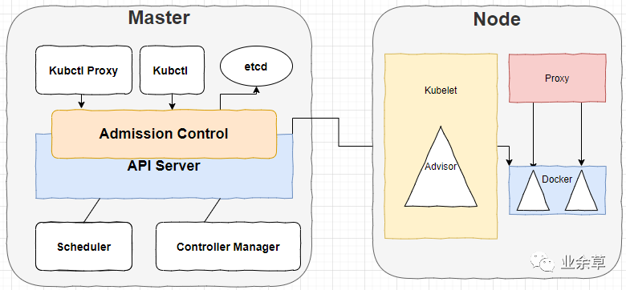
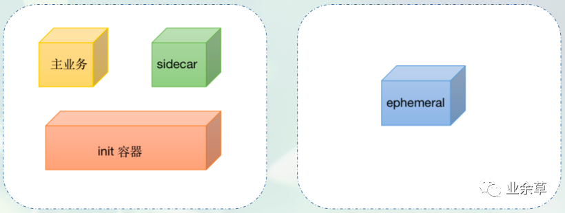
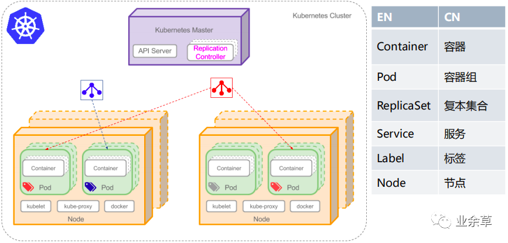
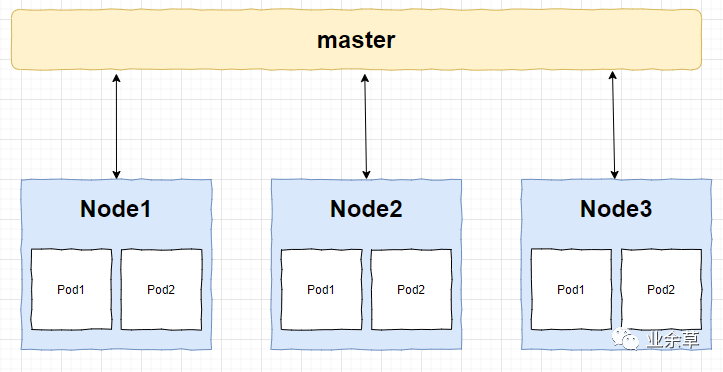
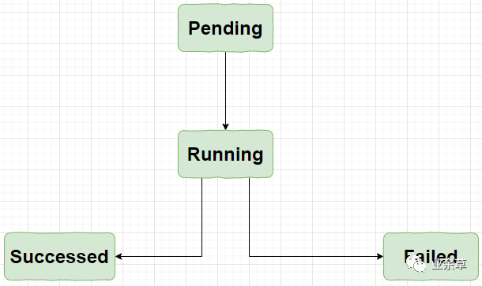
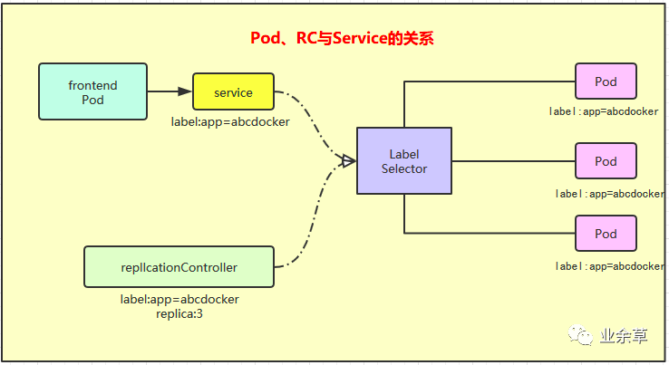

# k8s 就是这么简单！一文看懂其核心概念！

https://mp.weixin.qq.com/s/NR-PZWpgr_ZdySDLB-Rt3A

# 引子

上一篇讲了如何安装 K8s，并用 K8s 写了个[`hello,world`](http://mp.weixin.qq.com/s?__biz=MzIyODE5NjUwNQ==&mid=2653333065&idx=1&sn=6da2ed9d5ff93af932f5803b89fe329d&chksm=f387afbfc4f026a90911b90e5e782cd5499f36fd0bb793a3a306c452184fb6e1eb59f9c51520&scene=21#wechat_redirect)来开了个头，这一次我们来了解下 K8s 的核心概念，K8s 的核心概念主要有：Pod、Node、Service 等，这些核心概念还有个高大上的名字叫做：资源对象，他们是通过 K8s 提供的 Kubectl 工具或者是 API 调用进行工作的，然后保存在 ectd 里；

# 先来对 K8s 来个大体印象 K8s 的总体架构

一图胜千言：

K8S 的总体架构

K8s 集群主要有两个节点组成，他们分别是：Master 和 Node。

前者运行着四个组件：etcd、API Server、Controller Manager、Scheduler，除了第一个，后面三个主要负责对集群中的资源进行管理和调度，他们构成了 K8s 的总控中心；

后者往往不止一个，每个 Node 运行着 Kubelet、Proxy、Docker Daemon，他们负责对管理本节点的 Pod 的生命周期和服务代理；

API Server 是资源对象的操作入口，而且就跟 main()函数是程序唯一执行入口一样，API Server 也是唯一的。

Conroller Manager 是集群内部的管理控制中心，主要用于 k8s 的故障排查和修复；

Service 是 K8s 集群中的调度器，负责 Pod 在集群节点中的调度分配；

Kubelet 负责当前 Node 节点的 Pod 的创建、监控、修改和删除等；

Proxy 负责 Service 代理，同时也是软件模式的负载均衡器；

## 说概念之前来点开胃菜 Container

说到 Container，我想大家第一时间想到的可能是 Docker。实际上，k8s 中有 4 类容器：标准容器、sidecar 容器、init 容器、ephemeral 容器 4 种类型的 containers。



k8s中的4种容器

容器不管怎么分类，Docker 都是其中最主要的一个。前段时间，网上闹得沸沸扬扬的 [k8s 甩掉 docker](http://mp.weixin.qq.com/s?__biz=MzIyODE5NjUwNQ==&mid=2653324562&idx=1&sn=664df14162d49302a779099f949c3748&chksm=f3878ce4c4f005f273c1c365c35b70efdc5d05af8632092faa3e42d6c7fd69157cf225b9d722&scene=21#wechat_redirect) 的文章大肆流行，但只要明白一点 k8s 知识，就会知道，在可见的将来，Kubernetes 都无法真正摆脱 Docker 的影响。

实际上 Docker 最具革命性的创新，是应用程序的封装方式，即容器镜像的格式定义。可以说，Docker 的核心价值是容器镜像。容器镜像是真正改变世界的技术，这个观点至今仍然未变。Kubernetes 上跑的容器，离不开 Docker 镜像的使用。



根据上图，我们可以看出，Pod 算是一个容器组，因为一个 Pod 可以包含一个容器，也可以包含多个容器。

总的来说，每个运行的容器都是可重复的；包含依赖环境在内的标准，这意味着无论我们在哪里运行它，都会得到相同的行为。

容器将应用程序从底层的主机设施中解耦。这使得在不同的云或 OS 环境中部署更加容易。

# 就从你开始吧，Node 节点

Node 节点是相对于 Master 来说的工作主机，以前叫 Minion，现在叫 Node，它既可以是物理的，也就可以是虚拟的，每个 Node 上管理着 Pod 生命周期的 Kubelet 同时也被 Master 管理，在 Node 上面运行的服务进程主要有：Kubelet、Kube-proxy 和 docker daemon。

Node 的主要信息有：地址、运行状态、条件、系统容量等

## Node 管理

有个看起来不太令人相信的事情是：Node 并不是由 K8s 创建的，Node 节点其实是由物理机、虚拟机或者是云服务商提供的资源，我们在 K8s 创建的其实是 Node 对象，创建完成在之后再进行一系列的检查，比如服务是否正常启动、是否可以创建 Pod 等，如果检查不通过则会被标记为不可用；

### Node Controller

Node Controller 是管理 Node 对象的，主要负责集群范围内的 Node 信息同步和单个 Node 的生命周期的管理。

### 注册

每当 Kubelet 的`--register-node`的参数不更改，保持默认值（也就是 true），Kubelet 会向 apiserver 自动进行注册。

### 管理员的工作

Node 对象也可以进行手动创建和修改，其实操作起来也很简单，只需要把 Kubelet 的`--register-node`的参数设置为 false 就可以了。

## 最基本的操作单元 Pod

如果说函数是 java 程序的最大单元的话，那么 Pod 就是 K8s 的基本单元，它们包含一个或者是多个相关的容器，一个 Pod 可以视为容器化环境的应用层 Logical Host（逻辑宿主机）；

之所以再封装一层是因为 Docker 容器之间的通信受到 Docker 网络机制的限制，我们都知道在 Docker 里一个容器必须经过 link 方式才能访问另一个容器的服务，如果容器少了还好，多了对于 link 来说是个繁重的负担，所以，为了提升效率，Pod 把多个容器都“封装”到一个虚拟的主机里，这样容器之间就可以通过 localhost 进行通信了。

这是一个 Pod 容器：



Pod 容器

一个 Pod 中的应用容器共享同一组资源：PID 命名空间、网络命名空间、IPC 命名空间、UTS 命名空间、Volumes(共享存储)等等；

pod 的生命周期是通过 Replication Controller 来进行管理的。



pod 的生命周期

如果 Pod 定义正确，就会被提交到 Node 节点，然后运行，最后所有的容器都结束了，分为成功和失败两种情况。

## 随处可见的 Label

Label 定义了像 Pod、Service、Node 等对象的可识别属性，主要用于对他们进行管理和选择，Label 用的是键值对（Key/Value）的形式附加到这些对象上的，Label 既可以在创建对象的时候附加到对象上，也可以在对象创建之后通过 API 进行管理；

```
"labels":{
"key1":"value1",
"key2":"value2"
}
```

在为对象定义好 Label 之后，其他对象就可以使用 Label Selector 来定义其作用的对象；

Label Selector 有两种:一个是 Equality-based(基于等式)一个是 Set-based(基于集合)。

1. Euqality-baesd 使用等式类的表达式来进行选择:

```
//选择所有包含Label中Key="name"且value="redis-slave"的对象
name=redis-slave;
//选择所有包含Label中key="env"且value不等于"production"的对象
env！=production:
```

1. Set-based 使用集合操作:

```
//选择所有包含Label中Key="name"且value="redis-slave"或"redis-master"的对象
name in(redis-slave,redis-master):
//选择所有包含Label中Key="name"且value="php-frontend"的对象
name not in (php-frontend):
```

## RC

ReplicationController 简称 `RC`。之前也说过 RC 用于定义 Pod 副本的数量，根据 RC 的定义，K8s 能够确保在任意时刻都能运行用于指定的 Pod 的 Replica（副本），如果多了系统就会停止一些，如果少了系统就会启动一些新的。

与手动创建的 Pod 不同，由 ReplicationController 创建的 Pod 在失败、被删除或被终止时会被自动替换。例如，在中断性维护（如内核升级）之后，你的 Pod 会在节点上重新创建。因此，即使你的应用程序只需要一个 Pod，你也应该使用 ReplicationController 创建 Pod。ReplicationController 类似于进程管理器，但是 ReplicationController 不是监控单个节点上的单个进程，而是监控跨多个节点的多个 Pod。

RC 确保在任何时候都有特定数量的 Pod 副本处于运行状态。换句话说，ReplicationController 确保一个 Pod 或一组同类的 Pod 总是可用的。

在第一篇《[Kubernetes是啥？用它写个hello,world啊！](http://mp.weixin.qq.com/s?__biz=MzIyODE5NjUwNQ==&mid=2653333065&idx=1&sn=6da2ed9d5ff93af932f5803b89fe329d&chksm=f387afbfc4f026a90911b90e5e782cd5499f36fd0bb793a3a306c452184fb6e1eb59f9c51520&scene=21#wechat_redirect)》文章中，我们已经做过一个简单的`ReplicationController.yaml`文件了，后面还会有专门的篇幅去介绍 RC 配置文件中的细节知识。

## ReplicaSet（副本集）

在传统的集群工作模式中为了保证高可用性，集群里的应用至少要部署两个以上，这样，万一一个挂了另外的应用还能继续工作，扩容和缩容的时候通常需要手动在 Nginx 上配置集群 IP 地址，过程比较繁琐，麻烦不说，更重要的是还很容易出错。那么，ReplicaSet 就是 K8s 里的集群，ReplicaSet 可以认为是一组 pod 组成的集群，ReplicaSet 是一种逻辑上的集群。

## 以后少不了打交道的 Deployment

它是 Kubernetes 中最常用的一个对象，为 ReplicaSet 和 Pod 的创建提供了一种声明式的定义方法，主要用于部署应用，Deployment 对象不仅可以创建 ReplicaSet 和 Pod，还可以滚动升级和回滚应用、平滑的扩容和缩容，还可以是  Deployment 的开关。

## 这个 Service 可不简单

每个 Pod 都会被分配一个唯一的 IP，唯一的 IP 就如同数据库里的主键，访问起来特别方便，不过缺点就是这个 IP 会随着 Pod 的销毁而消失，如果有 Pod 组成一个集群来提供服务又该如何访问？这就是 Service 的作用了；

一个 Service 可以视为是一组提供相同服务的 Pod 的对外访问接口，K8s 支持两种对外提供服务的 Service 的 type 的定义：

1. NodePort

在定义 Service 时指定`spec.type=NodePort`并指定`spec.ports.nodePort`的值，系统就会在 K8s 集群中的每个 Node 上打开 一个主机上的真实端口号，这个端口号可以帮助访问 Node 的客户端访问到内部的 Service；

1. LoadBalancer

如果云服务商支持外接负载均衡器，则可以通过`spec.type=LoadBalancer`定义 Service，并指定负载均衡器的 IP 地址。



Pod、RC、Service 的关系

## 一个相对陌生的概念：Volume

Volume 是 Pod 中能够被多个容器访问的共享目录，Volume 就如同硬盘，容器的终止和重启不会其数据产生任何影响，Volume 有很多种类型。

K8S 支持很多类型的 volume 数据卷挂载，简单一点理解：数据卷 volume 是 Pod 内部的磁盘资源。

1. EmptyDir

在 Pod 分配到 Node 时创建的，同一个 Pod 中所有的容器都可以读写 EmptyDir 中相同的文件，这个类型主要是存放一些临时数据；

1. hostPath

在 Pod 上挂载宿主机上的文件或者目录，hostPath 通常用于需要永久保存的容器应用程序生成的日志文件以及范围 Docker 的文件系统；

1. secret

K8s 提供了 Secret 资源供我们来保存、设置一些敏感信息，比如 API endpoint 地址，各种用户密码或 token 之类的信息。在没有使用 K8s 的时候，这些信息可能是通过配置文件或者环境变量在部署的时候设置的。

不过，Secret 其实并不安全，稍微用 kubectl 查看过 Secret 的人都知道，我们可以非常方便的看到 Secret 的原文，只要有相关的权限即可，尽管它的内容是 base64 编码的，这基本上等同于明文。

所以说，K8s 原生的 Secret 是非常简单的，不是特别适合在大型公司里直接使用，对 RBAC 的挑战也比较大，很多不该看到明文信息的人可能都能看到。

不过大家也不用太过担心，社区中已经有比较多的成熟方案来解决它。shyiko/kubesec、bitnami-labs/sealed-secrets、Vault by HashiCorp、mozilla/sops、Kubernetes External Secrets、Kamus 等。

## 命名空间

通过把系统内部的对象“分配”到不同的命名空间中形成了逻辑上分组的不同项目、小组或者是用户组；

## Annotation

和 java 里的注解不同，这里的注解与 Label 一样也是通过键值对的形式来进行定义的，与 Label 不同的是，注解是用户可以任意定义的附加信息，方便外部工具查找的。

## K8s 的域名访问 ingress

内部（或者说局域网）的资源之间访问没有什么问题，可是外部想要访问内部的资源怎么办？还不能把一些 IP 地址啥的隐私给暴露了，这就需要 ingress 来大展身手了，一个 ingress 可以配置用于提供外部可访问的服务 url、负载均衡流量、SSL 终端和提供虚拟主机名配置，ingress controller 就是具体干活的，ingress 不暴露任何端口或协议。将 HTTP 和 HTTPS 之外的服务公开到因特网通常使用类型是 NodePort 或 loadbalance 的 service。