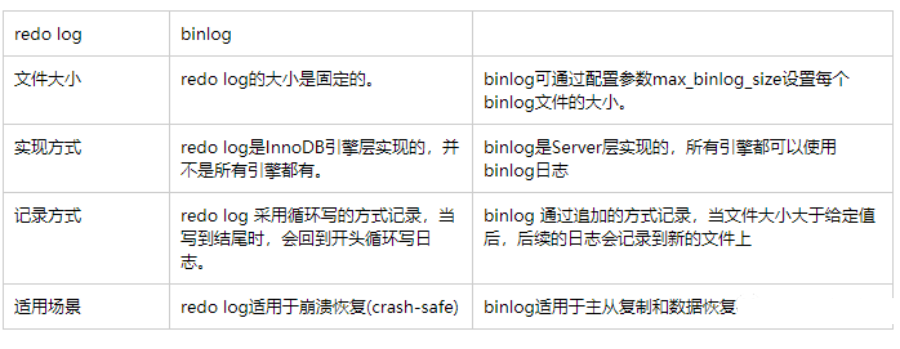

## 存储引擎

### MyISAM 和 InnoDB 的区别

#### **1.是否支持行级锁**

MyISAM 只有表级锁(table-level locking)，而 InnoDB 支持行级锁(row-level locking)和表级锁,默认为行级锁。

也就说，MyISAM 一锁就是锁住了整张表，这在并发写的情况下是多么滴憨憨啊！这也是为什么 InnoDB 在并发写的时候，性能更牛皮了！

#### **2.是否支持事务**

MyISAM 不提供事务支持。

InnoDB 提供事务支持，具有提交(commit)和回滚(rollback)事务的能力。

#### **3.是否支持外键**

MyISAM 不支持，而 InnoDB 支持。

🌈 拓展一下：

一般我们也是不建议在数据库层面使用外键的，应用层面可以解决。不过，这样会对数据的一致性造成威胁。具体要不要使用外键还是要根据你的项目来决定。

#### **4.是否支持数据库异常崩溃后的安全恢复**

MyISAM 不支持，而 InnoDB 支持。

使用 InnoDB 的数据库在异常崩溃后，数据库重新启动的时候会保证数据库恢复到崩溃前的状态。这个恢复的过程依赖于 `redo log` 。

#### **5.是否支持 MVCC**

MyISAM 不支持，而 InnoDB 支持。


## 临时表

https://mp.weixin.qq.com/s/vCTrj5winNRqd2WOub0auQ

### **外部临时表**

通过CREATE TEMPORARY TABLE 创建的临时表，这种临时表称为外部临时表。这种临时表只对当前用户可见，当前会话结束的时候，该临时表会自动关闭。这种临时表的命名与非临时表可以同名（同名后非临时表将对当前会话不可见，直到临时表被删除）。

### **内部临时表**

内部临时表是一种特殊轻量级的临时表，用来进行性能优化。这种临时表会被MySQL自动创建并用来存储某些操作的中间结果。这些操作可能包括在优化阶段或者执行阶段。这种内部表对用户来说是不可见的，但是通过EXPLAIN或者SHOW STATUS可以查看MYSQL是否使用了内部临时表用来帮助完成某个操作。内部临时表在SQL语句的优化过程中扮演着非常重要的角色， MySQL中的很多操作都要依赖于内部临时表来进行优化。但是使用内部临时表需要创建表以及中间数据的存取代价，所以用户在写SQL语句的时候应该尽量的去避免使用临时表。

内部临时表有两种类型：一种是`HEAP临时表`，这种临时表的所有数据都会存在内存中，对于这种表的操作不需要IO操作。另一种是`OnDisk临时表`，顾名思义，这种临时表会将数据存储在磁盘上。OnDisk临时表用来处理中间结果比较大的操作。如果HEAP临时表存储的数据大于MAX_HEAP_TABLE_SIZE（详情请参考MySQL手册中系统变量部分），HEAP临时表将会被自动转换成OnDisk临时表。OnDisk临时表在5.7中可以通过INTERNAL_TMP_DISK_STORAGE_ENGINE系统变量选择使用MyISAM引擎或者InnoDB引擎。


### 下列操作会使用到临时表

EXPLAIN 查看执行计划结果的 Extra 列中，如果包含 [Using Temporary](http://imysql.com/2015/06/14/mysql-faq-what-important-information-in-explain.shtml) 就表示会用到临时表。

https://blog.csdn.net/weixin_29343657/article/details/113443622

1、union查询

2、对于视图的操作，比如使用一些TEMPTABLE算法、union或aggregation

3、子查询

4、join 包括not in、exist等

5、查询产生的派生表

6、复杂的group by 和 order by

7、Insert select 同一个表，mysql会产生一个临时表缓存select的行

8、多个表更新

9、GROUP_CONCAT() 或者 COUNT(DISTINCT) 语句

### Mysql还会阻止内存表空间的使用，直接使用磁盘临时表：

1、表中含有BLOB或者TEXT列

2、使用union或者union all时，select子句有大于512字节的列

3、Show columns或者 desc 表的时候，有LOB或者TEXT

4、GROUP BY 或者 DISTINCT 子句中包含长度大于512字节的列

## MYSQL索引

### 覆盖索引

https://juejin.cn/post/6844903967365791752

主键索引存储了整行数据，而非主键索引中存储的值为主键id和非主键索引的值，如果一次查询select字段（再加一个主键索引）都在where条件中用的索引中，则无需再回表查询，即可得到结果，这个时候叫使用了覆盖索引

当发起一个索引覆盖查询时，在explain的extra列可以看到using index的信息，这里(name,age)为联合索引

### 1.数据库索引有哪些优缺点？

**B+树索引：** 不再需要进行全表扫描，只需要对树进行搜索即可，所以查找速度快很多

**哈希索引：** 哈希索引能以 O(1) 时间进行查找，无法用于排序与分组，并且只支持精确查找，无法用于部分查找和范围查找。

**全文索引：** MyISAM 存储引擎支持全文索引，MySQL InnoDB从5.6开始已经支持全文索引，用于查找文本中的关键词。全文索引导致磁盘资源的大量占用且必须修改查询语句。

### 2.为什么不用二叉查找树作为数据库索引？

​    二叉查找树：查找到指定数据，效率其实很高logn。但是数据库索引文件有可能很大，关系型数据存储了上亿条数据，索引文件大则上G，不可能全部放入内存中，而是需要的时候换入内存，方式是磁盘页。一般来说树的  **一个节点就是一个磁盘页**  （可存储16k数据）。如果使用二叉查找树，那么每个节点存储一个元素，查找到指定元素，需要进行大量的磁盘IO，效率很低。
​    B树：通过单一节点包含多个data，大大降低了树的高度，大大减少了磁盘IO次数。

### 3.为什么数据库索引不用红黑树而用B+树？

​    红黑树当插入删除元素的时候会进行频繁的变色与旋转，来保证红黑树的性质，浪费时间。但是当数据量较小，数据完全可以放入内存中，不需要进行磁盘IO时，红黑树时间复杂度比B+树低。

### 4.MySQL索引为什么用B+树？

​    B+树索引并不能直接找到具体的行，只是找到被查找行所在的页，然后DB通过把整页读入内存，再在内存中查找。B+树的高度一般为2-4层，所以查找记录时最多只需要2-4次IO，相对二叉平衡树已经大大降低了。范围查找时，能通过叶子节点的指针获取数据。例如查找大于等于3的数据，当在叶子节点中查到3时，通过3的尾指针便能获取所有数据，而不需要再像二叉树一样再获取到3的父节点。

### 5.为什么MySQL偏偏采用B+树作为索引？

https://mp.weixin.qq.com/s/EZb3zk26MS4Vah3ZeAjxBQ

#### 需要解决的问题

##### 减少磁盘IO

##### 支持范围查询

#### 为什么不用hash

哈希表的物理存储是一个数组，而数组在内存中是连续地址的空间。

数据以 Key、Value 的方式存储。哈希表拥有精确的查询，所以时间复杂度是 O(1)。哈希表能通过 Key 计算数组下标来快速找到 Value。

通常用数组+链表方式解决hash冲突


##### 缺点

不支持范围查询

#### 为什么不用跳表

跳表底层实质就是可以进行二分查找的有序链表。而且在链表基础加上索引层。即能支持插入、删除等动态操作，也支持按区间高效查询。而且不管是查找、插入、删除对应的时间复杂度都是 O(logn)。

要理解跳表，先来看链表，假设链表存储是有序的数据，我们要想查询某一个数据，在最差的情况下要从头全遍历整个链表，时间复杂度是 O(n)。


如下图所示，跳表是在链表基础上加了索引层。可以起到支持区间查询的作用。


从上图所示，我们如果要查询一个 26 的节点，跳表就可以先从索引层遍历，当遍历到在索引层的 21 节点，会发现下一个索引层的节点是 36 节点时，很明显要找的 26 的节点就在这区间。

此时我们只要再通过索引层指向原始链表的指针往下移到原始链这一层遍历，只要遍历 2 个节点即可找到 26 了。如果用原来的链表需要遍历 10 个节点，现在只要遍历 8 个节点。

如下图中，一图胜千言。当数据量大时，一个包含多个结点的链表，在建立了五级索引后可以突显的看到索引层的优势。


同时注意道这样一个规律 “加一层索引，查询所需要遍历的节点个数减少，查询效率也就提高了。” （从用户的角度就是，跳表这家伙其实就是在告诉链表从什么地方开始找比较快）

> 


看到这，跳表似乎也很适合用来作为索引的数据结构。但是不要忘了还有首个条件没满足，就是 "要尽少在磁盘做 I/O 操作。" 

而跳表显然没能满足这一条件，跳表在随数据量增多的情况，索引层也会随着增高，相应的就会增加读取 IO 的次数，从而影响性能。

##### 优点

支持区间查询、快速查找、删除操作

##### 缺点

随数据量增多的情况，索引层也会随着增高，首个条件没满足，就是 "要尽少在磁盘做 I/O 操作。" 

#### 为什么不用B树

##### B树结构


> 上图中每一个节点称为页，在 MySQL 中数据读取的基本单位是页，而页就是我们上面所说的磁盘块。磁盘块中的 p 节点是指向子节点的指针。指针在树结构中都有，在前面的二叉树中也都是有的。

那我们来看一下上图所示，当一颗 3 阶的 B 树查找 90 这个的元素时的流程是怎么样的？

先从根节点出发，也就是磁盘块 1，判断 90 在17 ~ 35 之间，通过磁盘块 1 中的指针 p3 找到磁盘块 4。

还是按照原来的步骤，在磁盘块 4 中的 65 ~ 87 之间相比较，最后磁盘 4 的指针 p3 找到磁盘块 11。也就找到有匹配 90 的键值。

可以发现一颗 3 阶的 B 树在查找叶子节点时，由于树高度只有 3，所以查找过程最多只需要 3 次的磁盘 I/O 操作。

B 树能高效的通过等值查询 90 这个值，但不方便查询出一个期间内 3 ~ 10 区间内所有数的结果。

因为当 B 树做范围查询时需要使用中序遍历，那么父节点和子节点也就需要不断的来回切换涉及了多个节点会给磁盘 I/O 带来很多负担。

优点：

1. B 树的出现可以解决树高度的问题
2. 解决范围查询的问题

缺点：范围查询要中序遍历，增加IO次数


#### B+树

B+树从 + 的符号可以看出是B树的升级版，MySQL 中 innoDB 引擎中的索引底层数据结构采用的正是 B+树。

B+树相比于 B 树，做了这样的升级：B+树中的非叶子节点都不存储数据，而是只作为索引。由叶子节点存放整棵树的所有数据。

而叶子节点之间构成一个从小到大有序的链表互相指向相邻的叶子节点，也就是叶子节点之间形成了有序的双向链表。

如下图 B+树的结构：


B+树是不是有点像前面的跳表，数据底层是数据，上层都是按底层区间构成的索引层，只不过它不像`跳表是纵向扩展`，而是横向扩展的“跳表”。这么做的好处即减少磁盘的 IO 操作又提高了范围查找的效率。

接着再来看 B+树的插入和删除，B+树做了大量冗余节点，从上面可以发现父节点的所有元素都会在子节点中出现，这样当删除一个节点时，可以直接从叶子节点中删除，这样效率更快。

B 树相比于 B+树，B 树没有冗余节点，删除节点时会发生复杂的树变形，而 B+树有冗余节点，不会涉及到复杂的树变形。

而且 B+树的插入也是如此，最多只涉及树的一条分支路径。B+树也不用更多复杂算法，可以类似黑红树的旋转去自动平衡。

##### B+树对比B树的优点

1. 范围查询时只需遍历叶子节点，查询性能是稳定的，进一步减少IO次数，而B树范围查询会进行中序遍历，增加IO次数
2. 增加删除节点只需操作叶子节点，不会涉及到复杂的树变形
3. 所有的叶子节点形成了一个有序链表，更加便于查找。

##### 缺点

B+树做了大量冗余节点，增加磁盘占用

> B+树是 B 树的升级，所有非叶子节点都用来做索引，只有叶子节点存储数据而且是有序双向的链表，树节点做了冗余，相比于 B 树既能支持高效的区间查询，插入和删除都比 B 树更加出色。

### 最左匹配

**对于联合索引来说，要遵守最左前缀法则**

https://blog.csdn.net/qq_39390545/article/details/108540362

在***创建联合索引***的时候一定要注意索引字段顺序，常用的查询字段放在最前面。

对于index:(col1, col2, col3)

1.按照文档, 更准确的说法应该是最左前缀原则, 即如果你创建一个联合索引, 那 这个索引的任何前缀都会用于查询, (col1, col2, col3)这个联合索引的所有前缀 就是(col1), (col1, col2), (col1, col2, col3), 包含这些列的查询都会启用索 引查询.  

引擎自动优化： (col2, col1)查询会用到索引

 2.其他所有不在最左前缀里的列都不会启用索引, 即使包含了联合索引里的部分列 也不行. 即上述中的(col2), (col3), (col2, col3) 都不会启用索引去查询.
 **注意, (col1, col3)会启用(col1)的索引查询**


> 如果abc_index:(a,b，c)
>
> mysql会一直向右匹配直到遇到范围查询(>、<、between、like)就停止匹配（包括`like '陈%'`这种）。在a、b走完索引后，c已经是无序了，所以c就没法走索引，优化器会认为还不如全表扫描c字段来的快。所以只使用了(a,b)两个索引，影响了执行效率。
>
> select * from LOL where a = 2 and b > 1000  and c='JJJ疾风剑豪'
>
> 不会用索引
>
> `修改索引顺序为 abc_index:(a,c,b)`，就可以使三个索引字段都用到索引

### 红黑树

 R-B Tree，全称是Red-Black Tree，又称为“红黑树”，它一种特殊的二叉查找树。红黑树的每个节点上都有存储位表示节点的颜色，可以是红(Red)或黑(Black)。

**红黑树的特性**:
**（1）每个节点或者是黑色，或者是红色。**
**（2）根节点是黑色。**
**（3）每个叶子节点（NIL）是黑色。 [注意：这里叶子节点，是指为空(NIL或NULL)的叶子节点！]**
**（4）如果一个节点是红色的，则它的子节点必须是黑色的。****（不能有连续的两个红色节点）**
**（5）从一个节点到该节点的子孙节点的所有路径上包含相同数目的黑节点。**

**注意**：
(01) 特性(3)中的叶子节点，是只为空(NIL或null)的节点。
(02) 特性(5)，确保没有一条路径会比其他路径长出俩倍。因而，红黑树是相对是接近平衡的二叉树。

红黑树示意图如下：

[](https://images0.cnblogs.com/i/497634/201403/251730074203156.jpg)

#### 右旋和右旋

##### 左旋动图


##### 右旋动图


#### 红黑树的变换规则

所有**插入的点默认都是红色**，否则全黑色就是普通二叉树了，下一步也就无法按照规律变换以达到自平衡。

1. 变色规则

   当前结点是红色，父结点是红色，且它的叔叔结点也是红色(自红，父红，叔叔红)

   1. 把父结点设为黑色
   2. 把叔叔结点设为黑色
   3. 把祖父结点设为红色
   4. 把指针结点定义到祖父结点设为当前要操作的，分析的点变换的规则（此时可能是要左右旋）

2. 左旋

- 当前结点是右子树，且是红色

- 父结点是红色

- 叔叔结点是黑色（**右红，父红，叔叔黑**）

- 以**父结点**左旋

  3 右旋
  当前节结点是左子树，红色，父结点红色，叔叔黑色。（**左红，父红，叔叔黑**）

- 把父结点变为黑色

- 把祖父变为红色

- 以**祖父为结点**右旋

### 聚簇索引和非聚簇索引的区别

1. 聚集索引。表数据按照索引的顺序来存储的，也就是说索引项的顺序与表中记录的物理顺序一致。对于聚集索引，叶子结点即存储了真实的数据行，不再有另外单独的数据页。 在一张表上最多只能创建一个聚集索引，因为真实数据的物理顺序只能有一种。
2. 非聚集索引。表数据存储顺序与索引顺序无关。对于非聚集索引，叶结点包含索引字段值及指向数据页数据行的逻辑指针，其行数量与数据表行数据量一致。

### innodb没有id能不能建立索引，为什么

https://blog.csdn.net/weixin_41699562/article/details/104139458

一个聚集索引定义了表中数据的物理存储顺序。

聚簇索引也称为主键索引，其索引树的叶子节点中存的是整行数据，表中行的物理顺序与键值的逻辑（索引）顺序相同。一个表只能包含一个聚集索引。因为索引（目录）只能按照一种方法进行排序。

非聚簇索引（普通索引）的叶子节点内容是主键的值。在 InnoDB 里，非主键索引也被称为二级索引（secondary index）。


1、如果设置了主键，那么InnoDB会选择主键作为聚集索引、如果没有显式定义主键，则InnoDB会选择第一个不包含有NULL值的唯一索引作为主键索引、如果也没有这样的唯一索引，则InnoDB会选择内置6字节长的ROWID作为隐含的聚集索引(ROWID随着行记录的写入而主键递增)。

**为什么非主键索引结构叶子结点存储的是主键值：**

减少了出现行移动或者数据页分裂时二级索引的维护工作（当数据需要更新的时候，二级索引不需要修改，只需要修改聚簇索引，一个表只能有一个聚簇索引，其他的都是二级索引，这样只需要修改聚簇索引就可以了，不需要重新构建二级索引）

### MySQL索引的实现，innodb的索引，b+树索引是怎么实

现的，为什么用b+树做索引节点，一个节点存了多少数据，怎么规定大小，与磁盘页对应。

mysql 页：单个叶子节点（页）中的记录数=16K

在计算机中磁盘存储数据最小单元是扇区，一个扇区的大小是512字节，而文件系统（例如XFS/EXT4）他的最小单元是块，一个块的大小是4k，而对于我们的InnoDB存储引擎也有自己的最小储存单元——页（Page），一个页的大小是16K。

## MySQL优化

### MySQL数据库的优化问题

https://juejin.cn/post/6922302468890198030#heading-15

### MySQL EXPLAIN 参数

#### type参数

EXPLAIN执行计划中type字段分为以下几种：

**ALL**      **全表扫描**，MYSQL扫描全表来找到匹配的行  **（需要重点优化）**

**INDEX**     **索引全扫描**，MYSQL遍历整个索引来查找匹配的行。**（需要优化）**

**RANGE**     索引范围扫描，常见于<、<=、>、>=、between等操作符

**REF**     使用非唯一性索引或者唯一索引的前缀扫描，返回匹配某个单独值的记录行。（非主键）

**EQ_REF**     相对于ref来说就是使用的是唯一索引，对于每个索引键值，只有唯一的一条匹配记录（在联表查询中使用primary key或者unique key作为关联条件）

**CONST,SYSTEM**     单表中最多只有一条匹配行，查询起来非常迅速，所以这个匹配行中的其他列中的值可以被优化器在当前查询中当做常量来处理。例如根据主键或者唯一索引进行的查询。

**NULL**   MYSQL不用访问表或者索引就直接能到结果。explain select 1 from dual  where 1

自上而下，性能从最差到最好，system > const > eq_ref > ref > range > index > all

#### table：表名

#### possible_key：表中存在的索引

#### key：本次查询使用的索引

#### row：找到目标大致所需的行数

#### Extra：

​	 using filesort 使用外部的索引排序

​      using temporary 使用临时表保存数据

​      using index 使用了覆盖索引

​      using where 使用where条件

​      using join buffer 使用连接缓存

​      impossible where where条件无结果

​      select tables optimized away 最佳优化状态，无需遍历索引

测试 mysql 5.7.32版本

```sql
CREATE TABLE `sbtest1` (
  `id` int(11) NOT NULL AUTO_INCREMENT,
  `k` int(11) NOT NULL DEFAULT '0',
  `c` char(120) NOT NULL DEFAULT '',
  `pad` char(60) NOT NULL DEFAULT '',
  PRIMARY KEY (`id`),
  KEY `k_1` (`k`),
  KEY `c_1` (`c`)
) ENGINE=InnoDB AUTO_INCREMENT=1

使用少量数据测试：再in和or查询时，如果没有使用覆盖索引，查询到索引后，会产生回表查询，如果数据量太小，mysql会认为还不如直接全表扫描，就可能不用索引，如果一定要用索引，使用force index
INSERT INTO `component`.`sbtest1`(`id`, `k`, `c`, `pad`) VALUES (1, 1, '1', '1');
INSERT INTO `component`.`sbtest1`(`id`, `k`, `c`, `pad`) VALUES (2, 2, '2', '2');
INSERT INTO `component`.`sbtest1`(`id`, `k`, `c`, `pad`) VALUES (3, 3, '3', '3');
INSERT INTO `component`.`sbtest1`(`id`, `k`, `c`, `pad`) VALUES (4, 4, '4', '4');

使用大量数据测试
下面使用存储过程插入1000条数据
delimiter //
drop procedure if exists looppc;
create procedure looppc()
begin 
declare i int;
set i = 1;
repeat 
    INSERT INTO `component`.`sbtest1`(`id`, `k`, `c`, `pad`) VALUES (i, i, i, i);
    set i = i + 1;
until i >= 10000

end repeat;
end //

call looppc()  -- 调用


select version() -- 5.7.32
explain select * from sbtest1 where id=1; -- type =const
explain select * from sbtest1 where k=5; -- type =ref

explain select id,k from sbtest1 where k=1 or k=5;  -- type =range,Using index 使用覆盖索引

explain select * from sbtest1 where k=1 or k=2;  -- 数据量小 type =ALL，数据量大type=range


explain select id,k from sbtest1 where k in (1,2,8); --type=range ,Using index 使用覆盖索引

explain select id,k,c,pad from sbtest1 where k in (1,2,8) ;-- 数据量小 type =ALL，数据量大type=range

explain select id,k,c,pad from sbtest1 force index(`k_1`) where k in (1,2,8) ; --type=range  强制索引
explain select id,k,c from sbtest1 where k in (1,2,8) ; -- type =ALL


explain select pad from sbtest1 where k in (1); -- type =ref  in为单值

explain select pad from sbtest1 where k=1 union all select pad from sbtest1 where k=2; -- type =ref


explain select pad from sbtest1 where  k=1 or c=2;  -- type =ALL

explain select k from sbtest1 where  k=1 or c=2;  -- type =ALL  or不同索引

explain select * from sbtest1 where  k=1 and c=2;  -- type =ref

explain select * from sbtest1 where id>1; -- type=range
explain select * from sbtest1 where id>1 or id <10;-- type =ALL

explain select 1 from dual  where 1 -- Null

explain select k,id from sbtest1 where  k like '1%' --type=index
explain select c from sbtest1 where  k like '1%' --type=ALL   应该是隐式类型转换的缘故
explain select * from sbtest1 where  c like 'd10%'; --type=range
```

### Mysql查询条件为“>=”时，竟然不走索引？

同样的查询语句，只是查询的参数值不同，却会出现一个走索引，一个不走索引的情况呢？

答案很简单：**上述索引失效是因为DBMS发现全表扫描比走索引效率更高，因此就放弃了走索引**。

也就是说，当Mysql发现通过索引扫描的行记录数超过全表的10%-30%时，优化器可能会放弃走索引，自动变成全表扫描。某些场景下即便强制SQL语句走索引，也同样会失效。

类似的问题，在进行范围查询（比如>、< 、>=、<=、in等条件）时往往会出现上述情况，而上面提到的临界值根据场景不同也会有所不同。

### MySQL不走索引的情况

https://mp.weixin.qq.com/s/eVk41zJW5T6HoxPDfXgo-w

```
1.in(2个及以上参数) ，单列索引a，where a in (xxxx) ，

如果参数是1个会用到索引，

如果参数是2个及以上不会用到索引。

注意：以上情况，数据量大可以用到索引，数据量小会直接走全表扫描，因为回表查询可能更慢

2.like '%abc' 或者 like‘%abc%’

3.条件中带有表达式，比如where num/2=100 或者 substring(a,1,3)='ab'或者age+10=30

4.条件中带有不等于，where id !=2 或者 where id <> 2

5.where name is null

6.not in,单列索引a ，where a not in (xxxxx) ，不管里面是一个还是多个参数都用不到a的索引.(包括int和varchar类型的字段)

7.字符类型的字段与数字比较（数字类型的字段与字符比较会用到索引）

8.单列索引a, where条件中 ：

a 用到（

比如a> xxx

或者 a>=yyy

或者 a >xxx and a <yyy

或者 a between xxx and yyy 均会用到），

a > xxx or a <yyy 用不到.(包括int和varchar类型的字段)

9.单列索引a,单列索引b,单列索引c,where条件中 ：

a or b 均用不到，

a or b or c 均用不到，

a and b 用到 a的索引，

a and b and c 用到a的索引，

c and b 用到b的索引(谁的索引定义在前面用谁的),

(a and b ) or c 均用不到，

(a or b ) and c 用到c的索引，

a in (w) and c in (x,y,...) 用到 a的索引，c的索引用不到

10.复合索引a-b-c，where条件中

a用到，

a and b用到，

b and a用到，

a and c用到，

c and a用到，

a and b and c用到，

c and b and a用到，

b用不到，

c用不到，

a and b in (x,y,....) 用不到，

b and c用不到，

c and b用不到，

a or b用不到，

b or c用不到,

a or b or c用不到，

(a or b) and c用不到，

(a and b) or c用不到，

(a or d) and b and c 用不到
```

###    mysql的索引优化手段有哪些？如何检查慢sql？具体如何优化？

   检查慢sql

   https://www.cnblogs.com/xk920/p/11132038.html

#### mysql SQL 执行慢的原因

1、大多数情况下很正常，偶尔很慢，则有如下原因

(1)、数据库在刷新脏页，例如 redo log 写满了需要同步到磁盘。

(2)、执行的时候，遇到锁，如表锁、行锁。

2、这条 SQL 语句一直执行的很慢，则有如下原因。

(1)、没有用上索引：例如该字段没有索引；由于对字段进行运算、函数操作导致无法用索引。

(2)、数据库选错了索引。


## MySQL事务

### MySQL的事务隔离级别，分别解决什么问题

读未提交：有脏读、幻读、不可重复读问题

读已提交：解决脏读

可重复读：解决脏读、不可重复读、MVCC解决幻读。

串行化读：最高隔离级别，最安全，效率低


**注意：可重复读隔离级别通过MVCC解决了幻读**

### 不可重复读和幻读区别

不可重复读，在一个事务里读取到的数据，被另一个事务修改了，造成该事务下次读取本条数据跟前一次读取到的不一致

幻读，在一个事务里读取到的数据，另一个事务新增了数据，造成该事务在同样条件读取数据的时候会多出部分数据，好像造成了幻觉

### mysql mvcc了解过吗？他的原理是怎样的？用来解决什么问题

 MVCC 多版本并发控制

**读已提交隔离级别下的事务在每次查询的开始都会生成一个独立的ReadView**

**可重复读隔离级别则在第一次读的时候生成一个ReadView，之后的读都复用之前的ReadView**

https://juejin.cn/post/6844904180440629262

https://blog.csdn.net/qq_35190492/article/details/109044141

查询一条数据时，事务会拿到这个ReadView，去到undo log中进行判断。若查询到某一条数据：

* 如果被访问版本的 trx_id 属性值小于 m_ids 列表中最小的事务id，表明生成该版本的事务在生成 ReadView 前已经提交，所以该版本可以被当前事务访问。
* 如果被访问版本的 trx_id 属性值大于 m_ids 列表中最大的事务id，表明生成该版本的事务在生成 ReadView 后才生成，所以该版本不可以被当前事务访问。
* 如果被访问版本的 trx_id 属性值在 m_ids 列表中最大的事务id和最小事务id之间，那就需要判断一下 trx_id 属性值是不是在 m_ids 列表中，如果在，说明创建 ReadView 时生成该版本的事务还是活跃的，该版本不可以被访问；如果不在，说明创建 ReadView 时生成该版本的事务已经被提交，该版本可以被访问。

**InnoDB 就是利用 undo log 和 trx_id 的配合，实现了事务启动瞬间”秒级创建快照“的能力。**


InnoDB 里面每个事务都有一个唯一的事务 ID，叫作 transaction id。它在事务开始的时候向 InnoDB 的事务系统申请的，是按申请顺序严格递增的。

每条记录在更新的时候都会同时记录一条 undo log，这条 log 就会记录上当前事务的 transaction id，记为 row trx_id。记录上的最新值，通过回滚操作，都可以得到前一个状态的值。


## mysql锁

### mysql快照读、当前读怎么实现的

https://www.cnblogs.com/wwcom123/p/10727194.html?spm=a2c6h.12873639.0.0.1bf85681xcglKN

#### 当前读

　　select...lock in share mode (共享读锁)
　　select...for update
　　update , delete , insert

　　当前读, 读取的是最新版本, 并且**对读取的记录加锁, 阻塞其他事务同时改动相同****记录****，避免出现安全问题**。

　　例如，假设要update一条记录，但是另一个事务已经delete这条数据并且commit了，如果不加锁就会产生冲突。所以update的时候肯定要是当前读，得到最新的信息并且锁定相应的记录。

- 当前读的实现方式：next-key锁(行记录锁+Gap间隙锁)

####  快照读

　　单纯的select操作，**不包括**上述 select ... lock in share mode, select ... for update。　　　　

　　Read Committed隔离级别：每次select都生成一个快照读。

　　Read Repeatable隔离级别：**开启事务后第一个select语句才是快照读的地方，而不是一开启事务就快照读。**

- 快照读的实现方式：undolog和多版本并发控制MVCC

### mysql死锁如何排查，如何避免死锁

可以通过`SHOW ENGINE INNODB STATUS;`来查看死锁日志：排查死锁时，首先需要根据死锁日志分析循环等待的场景，然后根据当前各个事务执行的SQL分析出加锁类型以及顺序，逆向推断出如何形成循环等待，这样就能找到死锁产生的原因了。

https://cloud.tencent.com/developer/article/1329183

### 死锁案例

https://mp.weixin.qq.com/s/YCR6-ZnlE16zhG88rPttHQ

### 什么是死锁？如何避免？

https://juejin.cn/post/6917477406483677191  事务和锁

死锁是指两个或者两个以上进程在执行过程中，由于竞争资源或者由于彼此通信而造成的一种阻塞的现象。在MySQL中，MyISAM是一次获得所需的全部锁，要么全部满足，要么等待，所以不会出现死锁。在InnoDB存储引擎中，除了单个SQL组成的事务外，锁都是逐步获得的，所以存在死锁问题。

如何避免MySQL发生死锁或锁冲突：

- 如果不同的程序并发存取多个表，尽量以相同的顺序访问表。
- 在程序以批量方式处理数据的时候，如果已经对数据排序，尽量保证每个线程按照固定的顺序来处理记录。
- 在事务中，如果需要更新记录，应直接申请足够级别的排他锁，而不应该先申请共享锁，更新时在申请排他锁，因为在当前用户申请排他锁时，其他事务可能已经获得了相同记录的共享锁，从而造成锁冲突或者死锁。
- 尽量使用较低的隔离级别
- 尽量使用索引访问数据，使加锁更加准确，从而减少锁冲突的机会
- 合理选择事务的大小，小事务发生锁冲突的概率更低
- 尽量用相等的条件访问数据，可以避免Next-Key锁对并发插入的影响。
- 不要申请超过实际需要的锁级别，查询时尽量不要显示加锁
- 对于一些特定的事务，可以表锁来提高处理速度或减少死锁的概率。

### 如何降低发生MySQL InnoDB死锁？

DB死锁在行锁及事务场景下很难完全消除，但可以通过表设计和SQL调整等措施减少锁冲突和死锁，下面列举了一些降低死锁发生的主要方法：

a.尽量使用较低的隔离级别，比如如果发生了GAP间隙锁，可以尝试把DB的事务隔离级别调整成为RC(read committed)级别来避免。当然在RC的隔离级别下需要考虑业务是否能够接受“不可重复读”的问题；

b.在业务上线之前精心设计并核查下业务表上创建的索引。业务工程DAO层中的SQL语句尽量使用索引访问数据（如果对于自己的业务SQL不确定，可以使用“Explain”关键字来查看对应的执行计划是怎么样的），使加锁更精确，从而减少锁冲突的机会；

c.选择合理的事务大小，小事务发生锁冲突的概率一般也更小；对于使用Spring Transaction注解的同学，也可以考虑使用其编程式声明Spring事务模板的方式来将类或者方法级别的事务划分给代码块更小级别的事务。

d.在不同线程中去访问一组DB的数据表时，尽量约定以相同的顺序进行访问；对于同一个单表而言，尽可能以固定的顺序存取表中的行。这样可以大大减少死锁的机会；

e.对于一些特定的业务流程，可以使用提升DB锁粒度的方式（在业务允许的情况下降低一定的并发度），比如表锁，来减少出现死锁的可能。

f.使用分布式锁先锁住资源，然后进行事务

### mysql的锁有哪些？什么是死锁？如何预防？间隙锁锁的是什么？间隙锁如何产生死锁？更新语句命中主键索引与非主键索引的区别是什么？更新语句没有命中主键索引，锁的是什么范围？

https://www.cnblogs.com/rjzheng/p/9950951.html  介绍锁的范围，比较全

https://my.oschina.net/u/3077716/blog/4401881  这个挺好

https://www.cnblogs.com/zejin2008/p/5262751.html

#### 锁类型

表锁：表级锁不会产生死锁.所以解决死锁主要还是针对于最常用的InnoDB

行锁

for update **没有命中索引会锁表**。

update更新语句和for update机制一样，没有命中索引，同样会锁表。

命中主键：锁主键

没有命中：

算法：

next KeyLocks锁，同时锁住记录(数据)，并且锁住记录前面的Gap   

Gap Locks

索引的间隙加锁，其目的只有一个，防止其他事物插入数据（防止幻读）。只在隔离级别为`Repeatable Read`和`Serializable`时，会存在间隙锁。不锁记录，仅仅记录前面的Gap

Recordlock锁

锁是在加索引上而不是行上的。注意了，innodb一定存在聚簇索引，因此行锁最终都会落到聚簇索引上！（锁数据，不锁Gap）

 Next-KeyLocks

所以其实 Next-KeyLocks=Gap锁+ Recordlock锁

锁住的是索引前面的间隙！比如一个索引包含值，10，11，13和20。那么，间隙锁的范围如下

```
(negative infinity, 10]
(10, 11]
(11, 13]
(13, 20]
(20, positive infinity)
```


#### 什么情况下会造成死锁

死锁的关键在于**：两个(****或以上)****的Session****加锁的顺序****不一致。**

那么对应的解决死锁问题的关键就是：让不同的session加锁有次序


#### 锁类型

##### 共享锁(S锁):

假设事务T1对数据A加上共享锁，那么事务T2可以读数据A，不能修改数据A。

##### 排他锁(X锁):

假设事务T1对数据A加上排他锁，那么事务T2不能读数据A，不能修改数据A。
我们通过update、delete等语句加上的锁都是行级别的锁。只有LOCK TABLE … READ和LOCK TABLE … WRITE才能申请表级别的锁。

索引的间隙加锁，其目的只有一个，防止其他事物插入数据（防止幻读）。
只在隔离级别为`Repeatable Read`和`Serializable`时，会存在间隙锁。不锁记录，仅仅记录前面的Gap
加锁一定是给索引（物理存在）加锁

##### 对于for update和update

`Repeatable Read` 简写RR

假设有表如下，pId为主键索引

| pId(int) | name(varchar) | num(int) |
| -------- | ------------- | -------- |
| 1        | aaa           | 100      |
| 2        | bbb           | 200      |
| 3        | bbb           | 300      |
| 7        | ccc           | 200      |

###### RR+条件列非索引

​	num为非索引列
​	select * where num ... for update
​	任意for update查询语句，每一行存在的数据主键加S锁，聚簇索引的所有间隙加gap锁，看起来像锁表。

###### RR+条件列是聚簇索引


等值查询：
	命中： 命中的那行加X锁，where pId=2  for update,只给2加锁。RC 和 RR隔离等级相同。
	未命中：where pId=6  for update 加gap锁，查询6未命中，则给(3,7)加gap锁。在 RC 隔离等级下，不需要加锁；
范围查询：
	where pId>2 for update，则查询命中结果3,7的聚簇索引上加X锁，区间(2,3),(3,7),(7,+∞)加gap锁；
	where pId>18 for update，未命中结果，则只在(7,+∞)加gap锁

​    

###### RR+条件列是非聚簇索引

非唯一索引
	num改为非唯一索引
	where num = 200 for update，对命中的pId=2，7的聚簇索引上加S锁，在num=200的非聚集索引上加X锁，在num索引(100,200)(200,300)加上gap lock。
	where num > 200 for update，对命中的pId=3的聚簇索引上加S锁，在num索引(200,300)，(300,+∞)加gap锁
	where num = 250 for update，未命中，在num索引(200,300)加gap锁
	where num > 400 for update，在num索引(300,+∞)加gap锁

###### 总结：

- 为非索引列加锁，为每行聚簇索引加S锁，同时为每个区间加gap锁，等于表加锁	
- 等值查询聚簇索引命中，只给命中行加X行锁，未命中加gap锁
- 范围查询聚簇索引：命中的行加X行锁，同时给命中的范围加gap锁
- 查询条件列是非唯一索引，对命中的非唯一索引加X锁，同时对命中的聚簇索引加S锁
  并且对于等值查询：对命中非唯一索引的左侧范围和右侧范围都加gap锁
    	  并且对于范围查询：对命中非唯一索引的所在范围加gap锁	

- 加锁会对命中的where条件索引列加X锁，如果where条件索引列为非聚簇索引，则同时对命中的聚簇索引加S锁
- 对比lock in share mode和for update，加锁方式是把所有的X写锁，改为S共享锁

###  MySQL InnoDB 中意向锁的作用

https://mp.weixin.qq.com/s/iNAj3fIVub9Wm-0ue6OwSw

#### 意向锁要解决的问题

如果另一个任务试图在该表级别上应用共享或排它锁，则受到由第一个任务控制的表级别意向锁的阻塞。第二个任务在锁定该表前不必检查各个页或行锁，而只需检查表上的意向锁。

`意向锁是有数据引擎自己维护的，用户无法手动操作意向锁`，在为数据行加共享 / 排他锁之前，InooDB 会先获取该数据行所在在数据表的对应意向锁

#### 兼容性

**意向锁之间是互相兼容的**


与普通的**排他 / 共享锁**互斥


#### 意向锁的并发性

**意向锁不会与行级的共享 / 排他锁互斥！！！**

假设三个事务按顺序发生，1、2互斥，而1、3不互斥

```
1. SELECT * FROM users WHERE id = 6 FOR UPDATE;
2. LOCK TABLES users READ;
3. SELECT * FROM users WHERE id = 5 FOR UPDATE;
```


## 集群

###   mysql的主从复制机制是如何做的？

https://zhuanlan.zhihu.com/p/50597960

#### 复制流程

对于每一个主从连接，都需要三个进程来完成。

**l 主节点 binary log dump 线程**

当从节点连接主节点时，主节点会创建一个log dump 线程，用于发送bin-log的内容。

**l 从节点I/O线程**

当从节点上执行`start slave`命令之后，从节点会创建一个I/O线程用来连接主节点，请求主库中更新的bin-log。I/O线程接收到主节点binlog dump 进程发来的更新之后，保存在本地relay-log中。

**l 从节点SQL线程**

SQL线程负责读取relay log中的内容，解析成具体的操作并执行，最终保证主从数据的一致性。

#### 复制模式

**l 异步模式（mysql async-mode）**

MySQL 主从复制默认是 **异步的模式**。MySQL增删改操作会全部记录在 Binlog 中，当 slave 节点连接 master 时，会主动从 master 处获取最新的 Binlog 文件。并把 Binlog 存储到本地的 relay log 中，然后去执行 relay log 的更新内容。

**l 半同步模式(mysql semi-sync)**  

主节点只需要接收到其中一台从节点的返回信息，就会commit；否则需要等待直到超时时间然后切换成异步模式再提交；

**l 全同步模式**

全同步模式是指主节点和从节点全部执行了commit并确认才会向客户端返回成功。

**GTID复制模式**

全局事物标识：global transaction identifieds。

https://blog.csdn.net/jolly10/article/details/80221892

1、master更新数据时，会在事务前产生GTID，一同记录到binlog日志中。

2、slave端的i/o 线程将变更的binlog，写入到本地的relay log中。

3、sql线程从relay log中获取GTID，然后对比slave端的binlog是否有记录。

4、如果有记录，说明该GTID的事务已经执行，slave会忽略。

5、如果没有记录，slave就会从relay log中执行该GTID的事务，并记录到binlog。

6、在解析过程中会判断是否有主键，如果有就用二级索引，如果没有就用全部扫描。


## MySQL三大日志：binlog、redo log和undo log

https://blog.csdn.net/b644ROfP20z37485O35M/article/details/111658912

##### **binlog**（所有引擎都有，Server层面的）

binlog用于记录数据库执行的写入性操作(不包括查询)信息，以二进制的形式保存在磁盘中。binlog是mysql的逻辑日志，并且由Server层进行记录，使用任何存储引擎的mysql数据库都会记录binlog日志。

- 逻辑日志：可以简单理解为记录的就是sql语句。
- 物理日志：因为mysql数据最终是保存在数据页中的，物理日志记录的就是数据页变更。

binlog是通过追加的方式进行写入的，可以通过max_binlog_size参数设置每个binlog文件的大小，当文件大小达到给定值之后，会生成新的文件来保存日志。

##### **binlog刷盘时机**

对于InnoDB存储引擎而言，只有在事务提交时才会记录biglog，此时记录还在内存中，那么biglog是什么时候刷到磁盘中的呢？mysql通过sync_binlog参数控制biglog的刷盘时机，取值范围是0-N：

- 0：不去强制要求，由系统自行判断何时写入磁盘；
- 1：每次commit的时候都要将binlog写入磁盘；
- N：每N个事务，才会将binlog写入磁盘。

从上面可以看出，sync_binlog最安全的是设置是1，这也是MySQL 5.7.7之后版本的默认值。但是设置一个大一些的值可以提升数据库性能，因此实际情况下也可以将值适当调大，牺牲一定的一致性来获取更好的性能。

##### **redo log**（InnoDB 引擎特有，物理层）

每次事务提交的时候，将该事务涉及修改的数据页全部刷新到磁盘中。但是这么做会有严重的性能问题，主要体现在两个方面：

- 因为Innodb是以页为单位进行磁盘交互的，而一个事务很可能只修改一个数据页里面的几个字节，这个时候将完整的数据页刷到磁盘的话，太浪费资源了！
- 一个事务可能涉及修改多个数据页，并且这些数据页在物理上并不连续，使用随机IO写入性能太差！

redo log，具体来说就是只记录事务对数据页做了哪些修改

先写redo log再进行数据操作！！！

mysql支持三种将redo log buffer写入redo log file的时机，可以通过innodb_flush_log_at_trx_commit参数配置，各参数值含义如下：


##### **redo log与binlog区别**



##### **undo log**（逻辑层）

- 用于事务的回滚

原子性底层就是通过undo log实现的。undo log主要记录了数据的逻辑变化，比如一条INSERT语句，对应一条DELETE的undo log，对于每个UPDATE语句，对应一条相反的UPDATE的undo log，这样在发生错误时，就能回滚到事务之前的数据状态

##### undo log 是否是redo log的逆过程？

否，undo log是逻辑日志，对事务回滚时，只是将数据库逻辑地恢复到原来的样子，而redo log是物理日志，记录的是数据页的物理变化，显然undo log不是redo log的逆过程。


## 其他

###   mysql的innodb的缓存lru的具体实现是什么？

https://cloud.tencent.com/developer/article/1453698

##### **简单的LRU** 

- 新数据插入到链表头部；
- 每当缓存命中（即缓存数据被访问），则将数据移到链表头部；
- 当链表满的时候，将链表尾部的数据丢弃。

###### 实现一个LRU

可以使用LinkedHashMap

##### **Innodb的LRU** 

`young区`在链表的头部，存放经常被访问的数据页，可以理解为热数据！ 

`old区`在链表的尾部，存放不经常被访问的数据页，可以理解为冷数据！

