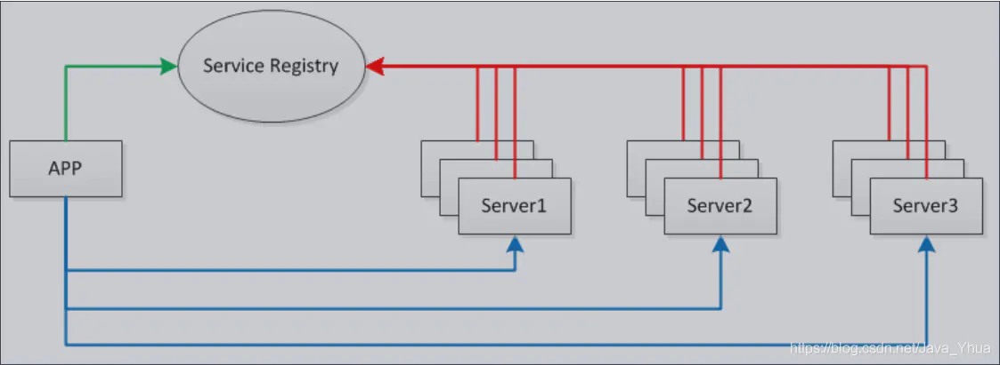
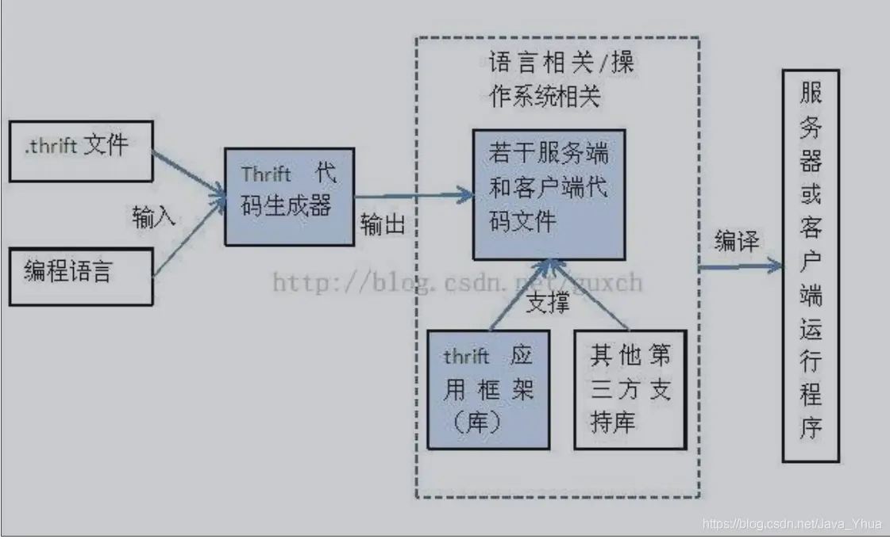

# thrift 原理浅析

https://mp.weixin.qq.com/s/5kXo_WQCwTJhkk9d1YWKJw

## RPC 原理

RPC( Remote Procedure Call ） 远程调用过程。

```
1. 定义了一个接口文件，描述了对象，对象成员，接口方法等一系列信息。
2.通过RPC 框架提供的编译器，将接口说明文件编译成对应的语言文件。
2. 在客户端和服务端分别引用 RPC 编译器生成的文件，即可像调用本地方法一样远程调用。
```

RPC 通信过程如下：

```
1. 客户端以正常方式调用客户桩（client stub)
2. 客户桩生成一个消息，然后调用本地操作系统。
3. 客户端操作系统将消息发送给原程操作系统。
4. 远程操作系统将消息交给服务器桩
5. 服务器桩将参数提取出来，然后调用服务过程
6. 服务器执行要求的操作，操作完成后将结果返回给服务器桩，
7. 服务器桩将结果打包成一个消息， 然后调用本地操作系统。
8. 服务器操作系统将含有结果的消息发送给客户端操作系统
9. 客户端操作系统将消息交给客户桩
10. 客户桩将结果提取出来，返回给他的调用方 
```

- 资源粒度， RPC 调用类似于本地调用，RESTful API 每一次添加接口都可能需要额外开发接口的数据，这相当于应用视图中再写一次方法调用。
- 流量消耗，RestFull API 在应用层和使用 HTTP 协议， 即使是传输高效的 JSON 也会消耗较大流量， RPC 可以使用 TCP，也可以使用 UDP , 而且可以编码，降低数据大小和减少流量消耗。

## Thrift 架构

Thrift 作用于各个服务之间的 RPC 通信，支持跨语言，thrift 是一个典型的 CS 框架，客户端服务端可以使用不同的语言开发， thrift  通过 IDL (Interface Description Language) 来关联客户端和服务器。

### Thrift 整体架构


- your code 是业务逻辑代码
- FooService.Client /Foo.Processor() + Foo.Write() Foo.Read是 thrift 根据 IDL  生成的客户端和服务端代码，对应的是 RPC 中的 Client Stub 和 Server Stub
- TProtocol 是用来对数据进行序列化和反序列化。
- TTransport 提供传输数据功能，使用 Apache Thrift 可以方便的定义一个服务并选择不同的传输协议。

### Thrift 网络栈架构


#### TTransport 层

- TSocket ：阻塞 Socket
- TFrametransport ：以 frame 为单位进行传输， 非阻塞式服务中使用
- TFileTransport : 以文件形式进行传输

#### TProtocol 层

代表 thrift 客户端和服务端之间的传输数据的协议，指的是客户端和服务端传输数据的格式，比如 Json,  thrift 中有如下格式：

- TBinaryProtocol：二进制格式
- TCompactProtocol：压缩格式
- TJSONProtocol : Json 格式
- TSimpleJsonProtocol：提供只写的 JSON 协议

Thrift 支持的 Server 模型

- TSimpleServer ：用于简单的单线程模型，常用于测试
- TThreadPoolServer ：多线程模型，使用标准的阻塞 IO
- TNoBlockingServer: 多线程服务模型，使用非阻塞 IO，需要使用TFramedTransport 数据传输方式。
- THsHaServer : THsHa 引入了线程池去处理，其模型读写任务放到线程池去处理，Half-sync/Half-async处理模式，Half-async是在处理IO事件上(accept/read/write io)，Half-sync用于handler对rpc的同步处理；

### Thrift  支持的基本数据类型

- byte: 有符号字节
- i16: 16 位有符号整数
- i32 : 32 位有符号整数
- i64: 64 位有符号整数
- double : 64 位浮点数
- string : 字符串

### Thrift 支持的容器类型

- list：一系列由 T 类型的数据组成的有序列表, 元素可以重复
- set : 一系列由 T 类型组成的无序集合，元素不可以重复
- map: 一个字典结构，Key 为 K 类型， Value 为 V 类型，和 Java 中的 HashMap 类似

thrift 支持 struct 类型，可以将一些数据类型聚合到一块。

```
struct People {
    1:string name;
    2:i32 age;
    3:string gender;
}
```

thrift 支持枚举类型

```
enum Gender {
    MALE,
    FEMALE
}
```

thrift 支持异常类型

```
exception RequestException {
    1:i32 code;
    2:string reason;
}
```

thrift 定义 Service. 格式如下：

```
service HelloWorldService {
    // service中可以定义若干个服务，相当于Java Interface中定义的方法
    string doAction(1:string name, 2:i32 age);
}
```

thrift 支持给类型定义别名

```
typedef i32 int
typedef i64 long
```

thrift. 支持常量的定义

```
const i32 MAX_RETRIES_TIME = 10;
const string MY_WEBSITE = "http://facebook.com";
```

thrift 支持命名空间，相当于 Java 中的package.

```
namespace java com.test.thrift.demo
```

\#、//、/**/都可以作为thrift文件中的注释。

thrift提供两个关键字required和optional，分别用于表示对应的字段是必填的还是可选的(推荐尽量使用optional)，如下

```
struct People {
    1:required string name;
    2:optional i32 age;
}
```

thrift也支持文件包含，相当于CPP中的include，Java中的import，使用关键字include:

```
include "global.thrift"
```

### thrift IDL 例子

```
// data.thrift
namespace java thrift.generated
namespace py py.thrift.generated

typedef i16 short
typedef i32 int
typedef i64 long
typedef bool boolean
typedef string String

// struct关键字用于定义结构体，相当于面向对象编程语言中的类
struct Person {
    // 相当于定义类中的成员，并生成相应的get和set方法，optional表示username这个成员可以没有
    1: optional String username,
    2: optional int age,
    3: optional boolean married
}

// 定义一个异常类型，用于接口中可能抛出的异常
exception DataException {
    1: optional String message,
    2: optional String callStack,
    3: optional String date
}

// 定义服务接口
service PersonService {
    Person getPersonByUsername(1: required String username) throws (1: DataException data),
    void savePerson(1: required Person person)
}
```

执行 thrift --gen java src/thrift/data.thrift  生成代码.

thrift 如何安装，可参考 https://wangxiaoming.blog.csdn.net/article/details/114317905

客户端可以像调用本地的方法一样调用服务端的方法

生成代码结构如下：


### 参考资料

- https://www.cnblogs.com/jpfss/p/10881220.html

# 超详细Netty 与 RPC！看了受益匪浅！（原理、高性能、Netty RPC 实现、RMI 实现方式、Thrift）

https://www.jianshu.com/p/291925f33c1e

# 一、Netty 与 RPC

## 1.1. Netty 原理

Netty 是一个高性能、异步事件驱动的 NIO 框架，基于 JAVA NIO 提供的 API 实现。它提供了对TCP、UDP 和文件传输的支持，作为一个异步 NIO 框架，Netty 的所有 IO 操作都是异步非阻塞的，通过 Future-Listener 机制，用户可以方便的主动获取或者通过通知机制获得 IO 操作结果。

## 1.2. Netty 高性能

在 IO 编程过程中，当需要同时处理多个客户端接入请求时，可以利用多线程或者 IO 多路复用技术进行处理。IO 多路复用技术通过把多个 IO 的阻塞复用到同一个 select 的阻塞上，从而使得系统在单线程的情况下可以同时处理多个客户端请求。与传统的多线程/多进程模型比，I/O 多路复用的最大优势是系统开销小，系统不需要创建新的额外进程或者线程，也不需要维护这些进程和线程的运行，降低了系统的维护工作量，节省了系统资源。与 Socket 类和 ServerSocket 类相对应，NIO 也提供了 SocketChannel 和 ServerSocketChannel两种不同的套接字通道实现。

### 1.2.1. 多路复用通讯方式

Netty 架构按照 Reactor 模式设计和实现，它的服务端通信序列图如下：


在这里插入图片描述

客户端通信序列图如下：


在这里插入图片描述

Netty 的 IO 线程 NioEventLoop 由于聚合了多路复用器 Selector，可以同时并发处理成百上千个客户端 Channel，由于读写操作都是非阻塞的，这就可以充分提升 IO 线程的运行效率，避免由于频繁 IO 阻塞导致的线程挂起。

### 1.2.2. 异步通讯 NIO

由于 Netty 采用了异步通信模式，一个 IO 线程可以并发处理 N 个客户端连接和读写操作，这从根本上解决了传统同步阻塞 IO 一连接一线程模型，架构的性能、弹性伸缩能力和可靠性都得到了极大的提升。

### 1.2.3. 零拷贝（DIRECT BUFFERS 使用堆外直接内存）

1. Netty 的接收和发送 ByteBuffer 采用 DIRECT BUFFERS，使用堆外直接内存进行 Socket 读写，
   不需要进行字节缓冲区的二次拷贝。如果使用传统的堆内存（HEAP BUFFERS）进行 Socket 读写，
   JVM 会将堆内存 Buffer 拷贝一份到直接内存中，然后才写入 Socket 中。相比于堆外直接内存，
   消息在发送过程中多了一次缓冲区的内存拷贝。
2. Netty 提供了组合 Buffer 对象，可以聚合多个 ByteBuffer 对象，用户可以像操作一个 Buffer 那样
   方便的对组合 Buffer 进行操作，避免了传统通过内存拷贝的方式将几个小 Buffer 合并成一个大的
   Buffer。
3. Netty的文件传输采用了transferTo方法，它可以直接将文件缓冲区的数据发送到目标Channel，
   避免了传统通过循环 write 方式导致的内存拷贝问题

### 1.2.4. 内存池（基于内存池的缓冲区重用机制）

随着 JVM 虚拟机和 JIT 即时编译技术的发展，对象的分配和回收是个非常轻量级的工作。但是对于缓冲区 Buffer，情况却稍有不同，特别是对于堆外直接内存的分配和回收，是一件耗时的操作。为了尽量重用缓冲区，Netty 提供了基于内存池的缓冲区重用机制。

### 1.2.5. 高效的 Reactor 线程模型

常用的 Reactor 线程模型有三种，Reactor 单线程模型, Reactor 多线程模型, 主从 Reactor 多线程模型。
Reactor 单线程模型
Reactor 单线程模型，指的是所有的 IO 操作都在同一个 NIO 线程上面完成，NIO 线程的职责如下：

1. 作为 NIO 服务端，接收客户端的 TCP 连接；

2. 作为 NIO 客户端，向服务端发起 TCP 连接；

3. 读取通信对端的请求或者应答消息；

4. 向通信对端发送消息请求或者应答消息。

   

   在这里插入图片描述

由于 Reactor 模式使用的是异步非阻塞 IO，所有的 IO 操作都不会导致阻塞，理论上一个线程可以独立处理所有 IO 相关的操作。从架构层面看，一个 NIO 线程确实可以完成其承担的职责。例如，通过Acceptor 接收客户端的 TCP 连接请求消息，链路建立成功之后，通过 Dispatch 将对应的 ByteBuffer派发到指定的 Handler 上进行消息解码。用户 Handler 可以通过 NIO 线程将消息发送给客户端。
**Reactor 多线程模型**
Rector 多线程模型与单线程模型最大的区别就是有一组 NIO 线程处理 IO 操作。 有专门一个
NIO 线程-Acceptor 线程用于监听服务端，接收客户端的 TCP 连接请求； 网络 IO 操作-读、写等由一个 NIO 线程池负责，线程池可以采用标准的 JDK 线程池实现，它包含一个任务队列和 N个可用的线程，由这些 NIO 线程负责消息的读取、解码、编码和发送；


在这里插入图片描述


**主从 Reactor 多线程模型**
服务端用于接收客户端连接的不再是个 1 个单独的 NIO 线程，而是一个独立的 NIO 线程池。
Acceptor 接收到客户端 TCP 连接请求处理完成后（可能包含接入认证等），将新创建的
SocketChannel 注册到 IO 线程池（sub reactor 线程池）的某个 IO 线程上，由它负责
SocketChannel 的读写和编解码工作。Acceptor 线程池仅仅只用于客户端的登陆、握手和安全认证，一旦链路建立成功，就将链路注册到后端 subReactor 线程池的 IO 线程上，由 IO 线程负责后续的 IO 操作。


在这里插入图片描述


### 1.2.6. 无锁设计、线程绑定

Netty 采用了串行无锁化设计，在 IO 线程内部进行串行操作，避免多线程竞争导致的性能下降。表面上看，串行化设计似乎 CPU 利用率不高，并发程度不够。但是，通过调整 NIO 线程池的线程参数，可以同时启动多个串行化的线程并行运行，这种局部无锁化的串行线程设计相比一个队列-多个工作线程模型性能更优。


在这里插入图片描述

Netty 的 NioEventLoop 读取到消息之后，直接调用 ChannelPipeline 的fireChannelRead(Object msg)，只要用户不主动切换线程，一直会由 NioEventLoop 调用
到用户的 Handler，期间不进行线程切换，这种串行化处理方式避免了多线程操作导致的锁
的竞争，从性能角度看是最优的。

### 1.2.7. 高性能的序列化框架

Netty 默认提供了对 Google Protobuf 的支持，通过扩展 Netty 的编解码接口，用户可以实现其它的高性能序列化框架，例如 Thrift 的压缩二进制编解码框架。

1. SO_RCVBUF 和 SO_SNDBUF：通常建议值为 128K 或者 256K。
   小包封大包，防止网络阻塞
2. SO_TCPNODELAY：NAGLE 算法通过将缓冲区内的小封包自动相连，组成较大的封包，阻止大量小封包的发送阻塞网络，从而提高网络应用效率。但是对于时延敏感的应用场景需要关闭该优化算法。软中断 Hash 值和 CPU 绑定
3. 软中断：开启 RPS 后可以实现软中断，提升网络吞吐量。RPS 根据数据包的源地址，目的地址以
   及目的和源端口，计算出一个 hash 值，然后根据这个 hash 值来选择软中断运行的 cpu，从上层
   来看，也就是说将每个连接和 cpu 绑定，并通过这个 hash 值，来均衡软中断在多个 cpu 上，提升
   网络并行处理性能。

## 1.3. Netty RPC 实现

### 1.3.1. 概念

RPC，即 Remote Procedure Call（远程过程调用），调用远程计算机上的服务，就像调用本地服务一
样。RPC 可以很好的解耦系统，如 WebService 就是一种基于 Http 协议的 RPC。这个 RPC 整体框架
如下：




在这里插入图片描述

### 1.3.2. 关键技术

1. 服务发布与订阅：服务端使用 Zookeeper 注册服务地址，客户端从 Zookeeper 获取可用的服务
   地址。
2. 通信：使用 Netty 作为通信框架。
3. Spring：使用 Spring 配置服务，加载 Bean，扫描注解。
4. 动态代理：客户端使用代理模式透明化服务调用。
5. 消息编解码：使用 Protostuff 序列化和反序列化消息。

### 1.3.3. 核心流程

1. 服务消费方（client）调用以本地调用方式调用服务；

2. client stub 接收到调用后负责将方法、参数等组装成能够进行网络传输的消息体；

3. client stub 找到服务地址，并将消息发送到服务端；

4. server stub 收到消息后进行解码；

5. server stub 根据解码结果调用本地的服务；

6. 本地服务执行并将结果返回给 server stub；

7. server stub 将返回结果打包成消息并发送至消费方；

8. client stub 接收到消息，并进行解码；

9. 服务消费方得到最终结果。
   RPC 的目标就是要 2~8 这些步骤都封装起来，让用户对这些细节透明。JAVA 一般使用动态代
   理方式实现远程调用。

   

   在这里插入图片描述

### 1.3.4. 消息编解码

息数据结构（接口名称+方法名+参数类型和参数值+超时时间+ requestID）
客户端的请求消息结构一般需要包括以下内容：

1. 接口名称：在我们的例子里接口名是“HelloWorldService”，如果不传，服务端就不知道调用哪
   个接口了；
2. 方法名：一个接口内可能有很多方法，如果不传方法名服务端也就不知道调用哪个方法；
3. 参数类型和参数值：参数类型有很多，比如有 bool、int、long、double、string、map、list，
   甚至如 struct（class）；以及相应的参数值；
4. 超时时间：
5. requestID，标识唯一请求 id，在下面一节会详细描述 requestID 的用处。
6. 服务端返回的消息 ： 一般包括以下内容。返回值+状态 code+requestID
   **序列化**
   目前互联网公司广泛使用 Protobuf、Thrift、Avro 等成熟的序列化解决方案来搭建 RPC 框架，这
   些都是久经考验的解决方案。

### 1.3.5. 通讯过程

核心问题(线程暂停、消息乱序)
如果使用 netty 的话，一般会用 channel.writeAndFlush()方法来发送消息二进制串，这个方
法调用后对于整个远程调用(从发出请求到接收到结果)来说是一个异步的，即对于当前线程来说，将请求发送出来后，线程就可以往后执行了，至于服务端的结果，是服务端处理完成后，再以消息的形式发送给客户端的。于是这里出现以下两个问题：

1. 怎么让当前线程“暂停”，等结果回来后，再向后执行？

2. 如果有多个线程同时进行远程方法调用，这时建立在 client server 之间的 socket 连接上
   会有很多双方发送的消息传递，前后顺序也可能是随机的，server 处理完结果后，将结
   果消息发送给 client，client 收到很多消息，怎么知道哪个消息结果是原先哪个线程调用
   的？如下图所示，线程 A 和线程 B 同时向 client socket 发送请求 requestA 和 requestB，
   socket 先后将 requestB 和 requestA 发送至 server，而 server 可能将 responseB 先返
   回，尽管 requestB 请求到达时间更晚。我们需要一种机制保证 responseA 丢给
   ThreadA，responseB 丢给 ThreadB。

   

   在这里插入图片描述

**通讯流程**
requestID 生成-AtomicLong

1. client 线程每次通过 socket 调用一次远程接口前，生成一个唯一的 ID，即 requestID
   （requestID 必需保证在一个 Socket 连接里面是唯一的），一般常常使用 AtomicLong
   从 0 开始累计数字生成唯一 ID；
   存放回调对象 callback 到全局 ConcurrentHashMap
2. 将处理结果的回调对象 callback ，存放到全局 ConcurrentHashMap 里 面
   put(requestID, callback)；
   synchronized 获取回调对象 callback 的锁并自旋 wait
3. 当线程调用 channel.writeAndFlush()发送消息后，紧接着执行 callback 的 get()方法试
   图获取远程返回的结果。在 get()内部，则使用 synchronized 获取回调对象 callback 的
   锁，再先检测是否已经获取到结果，如果没有，然后调用 callback 的 wait()方法，释放
   callback 上的锁，让当前线程处于等待状态。
   监听消息的线程收到消息，找到 callback 上的锁并唤醒
4. 服务端接收到请求并处理后，将 response 结果（此结果中包含了前面的 requestID）发
   送给客户端，客户端 socket 连接上专门监听消息的线程收到消息，分析结果，取到
   requestID ，再从前面的 ConcurrentHashMap 里 面 get(requestID) ，从而找到
   callback 对象，再用 synchronized 获取 callback 上的锁，将方法调用结果设置到
   callback 对象里，再调用 callback.notifyAll()唤醒前面处于等待状态的线程。


```java
 public Object get() {
   synchronized (this) { // 旋锁
     while (true) { // 是否有结果了
          If （!isDone）{
           		wait(); //没结果释放锁，让当前线程处于等待状态
          	}else{//获取数据并处理
          }
        }
      }
 }
private void setDone(Response res) {
 this.res = res;
 isDone = true;
 synchronized (this) { //获取锁，因为前面 wait()已经释放了 callback 的锁了
 notifyAll(); // 唤醒处于等待的线程
 }
}
```

## 1.4. RMI 实现方式

Java 远程方法调用，即 Java RMI（Java Remote Method Invocation）是 Java 编程语言里，一种用于实现远程过程调用的应用程序编程接口。它使客户机上运行的程序可以调用远程服务器上的对象。远
程方法调用特性使 Java 编程人员能够在网络环境中分布操作。RMI 全部的宗旨就是尽可能简化远程接
口对象的使用。

### 1.4.1. 实现步骤

1. 编写远程服务接口，该接口必须继承 java.rmi.Remote 接口，方法必须抛出
   java.rmi.RemoteException 异常；
2. 编写远程接口实现类，该实现类必须继承 java.rmi.server.UnicastRemoteObject 类；
3. 运行 RMI 编译器（rmic），创建客户端 stub 类和服务端 skeleton 类;
4. 启动一个 RMI 注册表，以便驻留这些服务;
   13/04/2018 Page 156 of 283
5. 在 RMI 注册表中注册服务；
6. 客户端查找远程对象，并调用远程方法；


```java
1：创建远程接口，继承 java.rmi.Remote 接口
public interface GreetService extends java.rmi.Remote {
 String sayHello(String name) throws RemoteException;
}2：实现远程接口，继承 java.rmi.server.UnicastRemoteObject 类
public class GreetServiceImpl extends java.rmi.server.UnicastRemoteObject
implements GreetService {
 private static final long serialVersionUID = 3434060152387200042L;
 public GreetServiceImpl() throws RemoteException {
 super();
 }
 @Override
 public String sayHello(String name) throws RemoteException {
 return "Hello " + name;
 } }
 
3：生成 Stub 和 Skeleton;
4：执行 rmiregistry 命令注册服务
5：启动服务
LocateRegistry.createRegistry(1098);
Naming.bind("rmi://10.108.1.138:1098/GreetService", new GreetServiceImpl());
6.客户端调用
GreetService greetService = (GreetService) 
Naming.lookup("rmi://10.108.1.138:1098/GreetService");
System.out.println(greetService.sayHello("Jobs"));
```

## 1.5. Protoclol Buffer

protocol buffer 是 google 的一个开源项目,它是用于结构化数据串行化的灵活、高效、自动的方法，例如 XML，不过它比 xml 更小、更快、也更简单。你可以定义自己的数据结构，然后使用代码生成器生成的代码来读写这个数据结构。你甚至可以在无需重新部署程序的情况下更新数据结构。

### 1.5.1. 特点


在这里插入图片描述

Protocol Buffer 的序列化 & 反序列化简单 & 速度快的原因是：

1. 编码 / 解码 方式简单（只需要简单的数学运算 = 位移等等）
2. 采用 Protocol Buffer 自身的框架代码 和 编译器 共同完成
   Protocol Buffer 的数据压缩效果好（即序列化后的数据量体积小）的原因是：
3. a. 采用了独特的编码方式，如 Varint、Zigzag 编码方式等等
4. b. 采用 T - L - V 的数据存储方式：减少了分隔符的使用 & 数据存储得紧凑

## 1.6. Thrift

Apache Thrift 是 Facebook 实现的一种高效的、支持多种编程语言的远程服务调用的框架。本文将从Java 开发人员角度详细介绍 Apache Thrift 的架构、开发和部署，并且针对不同的传输协议和服务类型给出相应的 Java 实例，同时详细介绍 Thrift 异步客户端的实现，最后提出使用 Thrift 需要注意的事项。
目前流行的服务调用方式有很多种，例如基于 SOAP 消息格式的 Web Service，基于 JSON 消息格式的 RESTful 服务等。其中所用到的数据传输方式包括 XML，JSON 等，然而 XML 相对体积太大，传输效率低，JSON 体积较小，新颖，但还不够完善。本文将介绍由 Facebook 开发的远程服务调用框架Apache Thrift，它采用接口描述语言定义并创建服务，支持可扩展的跨语言服务开发，所包含的代码生成引擎可以在多种语言中，如 C++, Java, Python, PHP, Ruby, Erlang, Perl, Haskell, C#, Cocoa, Smalltalk 等创建高效的、无缝的服务，其传输数据采用二进制格式，相对 XML 和 JSON 体积更小，
对于高并发、大数据量和多语言的环境更有优势。本文将详细介绍 Thrift 的使用，并且提供丰富的实例代码加以解释说明，帮助使用者快速构建服务。
为什么要 Thrift： 1、多语言开发的需要 2、性能问题




在这里插入图片描述

# 从零开始手撸一个较为完整的RPC框架！

https://mp.weixin.qq.com/s/sgrvaLhyteATBwkeMEbUqA

## 概念篇

## RPC 是什么？

RPC 称远程过程调用（Remote Procedure Call），用于解决分布式系统中服务之间的调用问题。通俗地讲，就是开发者能够像调用本地方法一样调用远程的服务。所以，RPC的作用主要体现在这两个方面：

- 屏蔽远程调用跟本地调用的区别，让我们感觉就是调用项目内的方法；
- 隐藏底层网络通信的复杂性，让我们更专注于业务逻辑。

## RPC 框架基本架构

下面我们通过一幅图来说说 RPC 框架的基本架构。


RPC 框架的基本架构

RPC 框架包含三个最重要的组件，分别是客户端、服务端和注册中心。在一次 RPC 调用流程中，这三个组件是这样交互的：

- 服务端在启动后，会将它提供的服务列表发布到注册中心，客户端向注册中心订阅服务地址；
- 客户端会通过本地代理模块 Proxy 调用服务端，Proxy 模块收到负责将方法、参数等数据转化成网络字节流；
- 客户端从服务列表中选取其中一个的服务地址，并将数据通过网络发送给服务端；
- 服务端接收到数据后进行解码，得到请求信息；
- 服务端根据解码后的请求信息调用对应的服务，然后将调用结果返回给客户端。

## RPC 框架通信流程以及涉及到的角色

RPC 框架通信流程以及涉及到的角色

从上面这张图中，可以看见 RPC 框架一般有这些组件：服务治理(注册发现)、负载均衡、容错、序列化/反序列化、编解码、网络传输、线程池、动态代理等角色，当然有的RPC框架还会有连接池、日志、安全等角色。

## 具体调用过程

具体调用过程

1. 服务消费方(client)以本地调用方式调用服务
2. client stub 接收到调用后负责将方法、参数等封装成能够进行网络传输的消息体
3. client stub 将消息进行编码并发送到服务端
4. server stub 收到消息后进行解码
5. server stub 根据解码结果调用本地的服务
6. 本地服务执行并将结果返回给 server stub
7. server stub 将返回导入结果进行编码并发送至消费方
8. client stub 接收到消息并进行解码
9. 服务消费方(client)得到结果

### RPC 消息协议

RPC调用过程中需要将参数编组为消息进行发送，接收方需要解组消息为参数，过程处理结果同样需要经编组、解组。消息由哪些部分构成及消息的表示形式就构成了消息协议。
RPC调用过程中采用的消息协议称为RPC消息协议。

## 实战篇

从上面的概念我们知道一个RPC框架大概有哪些部分组成，所以在设计一个RPC框架也需要从这些组成部分考虑。从RPC的定义中可以知道，RPC框架需要屏蔽底层细节，让用户感觉调用远程服务像调用本地方法一样简单，所以需要考虑这些问题：

- 用户使用我们的RPC框架时如何尽量少的配置
- 如何将服务注册到ZK(这里注册中心选择ZK)上并且让用户无感知
- 如何调用透明(尽量用户无感知)的调用服务提供者
- 启用多个服务提供者如何做到动态负载均衡
- 框架如何做到能让用户自定义扩展组件(比如扩展自定义负载均衡策略)
- 如何定义消息协议，以及编解码
- ...等等

上面这些问题在设计这个RPC框架中都会给予解决。

## 技术选型

- 注册中心 目前成熟的注册中心有Zookeeper，Nacos，Consul，Eureka，这里使用ZK作为注册中心，没有提供切换以及用户自定义注册中心的功能。
- IO通信框架 本实现采用 Netty 作为底层通信框架，因为Netty 是一个高性能事件驱动型的非阻塞的IO(NIO)框架，没有提供别的实现，也不支持用户自定义通信框架
- 消息协议 本实现使用自定义消息协议，后面会具体说明

## 项目总体结构

项目总体结构

从这个结构中可以知道，以rpc命名开头的是rpc框架的模块，也是本项目RPC框架的内容，而consumer是服务消费者，provider是服务提供者，provider-api是暴露的服务API。

### 整体依赖情况


整体依赖情况

## 项目实现介绍

要做到用户使用我们的RPC框架时尽量少的配置，所以把rpc框架设计成一个starter，用户只要依赖这个starter,基本那就可以了。

#### 为什么要设计成两个 starter (client-starter/server-starter) ?

这个是为了更好的体现出客户端和服务端的概念，消费者依赖客户端，服务提供者依赖服务端，还有就是最小化依赖。

#### 为什么要设计成 starter ?

基于spring boot自动装配机制，会加载starter中的 spring.factories 文件，在文件中配置以下代码，这里我们starter的配置类就生效了，在配置类里面配置一些需要的bean。

```
org.springframework.boot.autoconfigure.EnableAutoConfiguration=com.rrtv.rpc.client.config.RpcClientAutoConfiguration
```

### 发布服务和消费服务

- 对于发布服务

  服务提供者需要在暴露的服务上增加注解 @RpcService，这个自定义注解是基于 @service 的，是一个复合注解，具备@service注解的功能，在@RpcService注解中指明服务接口和服务版本，发布服务到ZK上，会根据这个两个元数据注册。

  

  对于发布服务

- - 发布服务原理：

    服务提供者启动之后，根据spring boot自动装配机制，server-starter的配置类就生效了，在一个 bean 的后置处理器（RpcServerProvider）中获取被注解 @RpcService 修饰的bean，将注解的元数据注册到ZK上。

    发布服务原理

- 对于消费服务

  消费服务需要使用自定义的 @RpcAutowired 注解标识，是一个复合注解，基于 @Autowired。

  

  对于消费服务

  

  消费服务原理

  代理类 invoke 方法通过服务发现获取服务端元数据，封装请求，通过netty发起调用。

- - 消费服务原理

    要让客户端无感知的调用服务提供者，就需要使用动态代理，如上面所示， HelloWordService 没有实现类，需要给它赋值代理类，在代理类中发起请求调用。基于spring boot自动装配，服务消费者启动，bean 后置处理器 RpcClientProcessor 开始工作，它主要是遍历所有的bean，判断每个bean中的属性是否有被 @RpcAutowired 注解修饰，有的话把该属性动态赋值代理类，这个再调用时会调用代理类的 invoke 方法。


代理类 invoke

### 注册中心

本项目注册中心使用ZK，由于注册中心被服务消费者和服务提供者都使用。所以把ZK放在rpc-core模块。


注册中心

rpc-core 这个模块如上图所示，核心功能都在这个模块。服务注册在 register 包下。

服务注册接口，具体实现使用ZK实现。


服务注册接口

### 负载均衡策略

负载均衡定义在rpc-core中，目前支持轮询（FullRoundBalance）和随机（RandomBalance），默认使用随机策略。由rpc-client-spring-boot-starter指定。


负载均衡策略

通过ZK服务发现时会找到多个实例，然后通过负载均衡策略获取其中一个实例。


负载均衡策略

可以在消费者中配置 `rpc.client.balance=fullRoundBalance` 替换，也可以自定义负载均衡策略，通过实现接口 LoadBalance，并将创建的类加入IOC容器即可。由于我们配置 @ConditionalOnMissingBean，所以会优先加载用户自定义的 bean。


优先加载用户自定义的 bean

## 自定义消息协议、编解码

所谓协议，就是通信双方事先商量好规则，服务端知道发送过来的数据将如何解析。

- 自定义消息协议


自定义消息协议

```
+   魔数：魔数是通信双方协商的一个暗号，通常采用固定的几个字节表示。魔数的作用是防止任何人随便向服务器的端口上发送数据。例如 java Class 文件开头就存储了魔数 0xCAFEBABE，在加载 Class 文件时首先会验证魔数的正确性
    
+   协议版本号：随着业务需求的变化，协议可能需要对结构或字段进行改动，不同版本的协议对应的解析方法也是不同的。
    
+   序列化算法：序列化算法字段表示数据发送方应该采用何种方法将请求的对象转化为二进制，以及如何再将二进制转化为对象，如 JSON、Hessian、Java 自带序列化等。
    
+   报文类型：在不同的业务场景中，报文可能存在不同的类型。RPC 框架中有请求、响应、心跳等类型的报文。
    
+   状态：状态字段用于标识请求是否正常（SUCCESS、FAIL）。
    
+   消息ID：请求唯一ID，通过这个请求ID将响应关联起来，也可以通过请求ID做链路追踪。
    
+   数据长度：标明数据的长度，用于判断是否是一个完整的数据包
    
+   数据内容：请求体内容
```

- 编解码

  编解码实现在 `rpc-core` 模块，在包 `com.rrtv.rpc.core.codec`下。

  自定义编码器通过继承 netty 的 `MessageToByteEncoder<MessageProtocol<T>>`类实现消息编码。

  

  自定义编码器

  自定义解码器通过继承 netty 的 `ByteToMessageDecoder`类实现消息解码。

  

  自定义解码器

  

  解码RPC

### 解码时需要注意TCP粘包、拆包问题

#### 什么是TCP粘包、拆包

TCP 传输协议是面向流的，没有数据包界限，也就是说消息无边界。客户端向服务端发送数据时，可能将一个完整的报文拆分成多个小报文进行发送，也可能将多个报文合并成一个大的报文进行发送。因此就有了拆包和粘包。

在网络通信的过程中，每次可以发送的数据包大小是受多种因素限制的，如 MTU 传输单元大小、滑动窗口等。
所以如果一次传输的网络包数据大小超过传输单元大小，那么我们的数据可能会拆分为多个数据包发送出去。如果每次请求的网络包数据都很小，比如一共请求了 10000 次，TCP 并不会分别发送 10000 次。TCP采用的 Nagle（批量发送，主要用于解决频繁发送小数据包而带来的网络拥塞问题） 算法对此作出了优化。

所以，网络传输会出现这样：

网络传输

1. 服务端恰巧读到了两个完整的数据包 A 和 B，没有出现拆包/粘包问题；
2. 服务端接收到 A 和 B 粘在一起的数据包，服务端需要解析出 A 和 B；
3. 服务端收到完整的 A 和 B 的一部分数据包 B-1，服务端需要解析出完整的 A，并等待读取完整的 B 数据包；
4. 服务端接收到 A 的一部分数据包 A-1，此时需要等待接收到完整的 A 数据包；
5. 数据包 A 较大，服务端需要多次才可以接收完数据包 A。

#### 如何解决TCP粘包、拆包问题

解决问题的根本手段：找出消息的边界：

- 消息长度固定

  每个数据报文都需要一个固定的长度。当接收方累计读取到固定长度的报文后，就认为已经获得一个完整的消息。当发送方的数据小于固定长度时，则需要空位补齐。

  消息定长法使用非常简单，但是缺点也非常明显，无法很好设定固定长度的值，如果长度太大会造成字节浪费，长度太小又会影响消息传输，所以在一般情况下消息定长法不会被采用。

- 特定分隔符

  在每次发送报文的尾部加上特定分隔符，接收方就可以根据特殊分隔符进行消息拆分。分隔符的选择一定要避免和消息体中字符相同，以免冲突。否则可能出现错误的消息拆分。比较推荐的做法是将消息进行编码，例如 base64 编码，然后可以选择 64 个编码字符之外的字符作为特定分隔符。

- 消息长度 + 消息内容

  消息长度 + 消息内容是项目开发中最常用的一种协议，接收方根据消息长度来读取消息内容。

本项目就是利用 “消息长度 + 消息内容” 方式解决TCP粘包、拆包问题的。所以在解码时要判断数据是否够长度读取，没有不够说明数据没有准备好，继续读取数据并解码，这里这种方式可以获取一个个完整的数据包。


完整的数据包

具体代码如下：


解决TCP粘包、拆包问题

## 序列化和反序列化

序列化和反序列化在 `rpc-core` 模块 `com.rrtv.rpc.core.serialization` 包下，提供了 `HessianSerialization` 和 `JsonSerialization` 序列化。
默认使用 `HessianSerialization` 序列化。用户不可以自定义。

序列化性能：

- 空间上


序列化性能

- 时间上


序列化性能

## 网络传输，使用netty

netty 代码固定的，值得注意的是 handler 的顺序不能弄错，以服务端为例，编码是出站操作（可以放在入站后面），解码和收到响应都是入站操作，解码要在前面。


netty解码

## 客户端 RPC 调用方式

成熟的 RPC 框架一般会提供四种调用方式，分别为同步 Sync、异步 Future、回调 Callback和单向 Oneway。

- Sync 同步调用。客户端线程发起 RPC 调用后，当前线程会一直阻塞，直至服务端返回结果或者处理超时异常。


Sync 同步调用

- Future 异步调用

  客户端发起调用后不会再阻塞等待，而是拿到 RPC 框架返回的 Future 对象，调用结果会被服务端缓存，客户端自行决定后续何时获取返回结果。当客户端主动获取结果时，该过程是阻塞等待的


Future 异步调用

- Callback 回调调用客户端发起调用时，将 Callback 对象传递给 RPC 框架，无须同步等待返回结果，直接返回。当获取到服务端响应结果或者超时异常后，再执行用户注册的 Callback 回调

Callback 回调

- Oneway 单向调用，客户端发起请求之后直接返回，忽略返回结果。

Oneway 单向调用

这里使用的是第一种：客户端同步调用，其他的没有实现。逻辑在 RpcFuture 中，使用 CountDownLatch 实现阻塞等待（超时等待）。

CountDownLatch 实现阻塞等待

## 整体架构和流程


整体架构和流程

流程分为三块：服务提供者启动流程、服务消费者启动、调用过程

- 服务提供者启动

- 1. 服务提供者 provider 会依赖 rpc-server-spring-boot-starter
  2. ProviderApplication 启动，根据springboot 自动装配机制，RpcServerAutoConfiguration 自动配置生效
  3. RpcServerProvider 是一个bean后置处理器，会发布服务，将服务元数据注册到ZK上
  4. RpcServerProvider.run 方法会开启一个 netty 服务

- 服务消费者启动

- 1. 服务消费者 consumer 会依赖 rpc-client-spring-boot-starter
  2. ConsumerApplication 启动，根据springboot 自动装配机制，RpcClientAutoConfiguration 自动配置生效
  3. 将服务发现、负载均衡、代理等bean加入IOC容器
  4. 后置处理器 RpcClientProcessor 会扫描 bean ,将被 @RpcAutowired 修饰的属性动态赋值为代理对象

- 调用过程

- 1. 服务消费者 发起请求`http://localhost:9090/hello/world?name=hello`
  2. 服务消费者 调用 helloWordService.sayHello() 方法，会被代理到执行 ClientStubInvocationHandler.invoke() 方法
  3. 服务消费者 通过ZK服务发现获取服务元数据，找不到报错404
  4. 服务消费者 自定义协议，封装请求头和请求体
  5. 服务消费者 通过自定义编码器 RpcEncoder 将消息编码
  6. 服务消费者 通过 服务发现获取到服务提供者的ip和端口， 通过Netty网络传输层发起调用
  7. 服务消费者 通过 RpcFuture 进入返回结果（超时）等待
  8. 服务提供者 收到消费者请求
  9. 服务提供者 将消息通过自定义解码器 RpcDecoder 解码
  10. 服务提供者 解码之后的数据发送到 RpcRequestHandler 中进行处理，通过反射调用执行服务端本地方法并获取结果
  11. 服务提供者 将执行的结果通过 编码器 RpcEncoder 将消息编码。（由于请求和响应的协议是一样，所以编码器和解码器可以用一套）
  12. 服务消费者 将消息通过自定义解码器 RpcDecoder 解码
  13. 服务消费者 通过RpcResponseHandler将消息写入 请求和响应 池中，并设置 RpcFuture 的响应结果
  14. 服务消费者 获取到结果

以上流程具体可以结合代码分析，代码后面会给出

## 环境搭建

- 操作系统：Windows
- 集成开发工具：IntelliJ IDEA
- 项目技术栈：SpringBoot 2.5.2 + JDK 1.8 + Netty 4.1.42.Final
- 项目依赖管理工具：Maven 4.0.0
- 注册中心：Zookeeeper 3.7.0

## 项目测试

- 启动 Zookeeper 服务器：bin/zkServer.cmd
- 启动 provider 模块 ProviderApplication
- 启动 consumer 模块 ConsumerApplication
- 测试：浏览器输入`http://localhost:9090/hello/world?name=hello`，成功返回“您好：hello”，rpc 调用成功。

## 项目代码

本文完整源码地址链接: `https://pan.baidu.com/s/1Ct5qHU7CAytT6iWPv2F0Ow`提取码: dzx3，如失效，请加我微信：xttblog2，补充链接！