### Redis数据结构类型

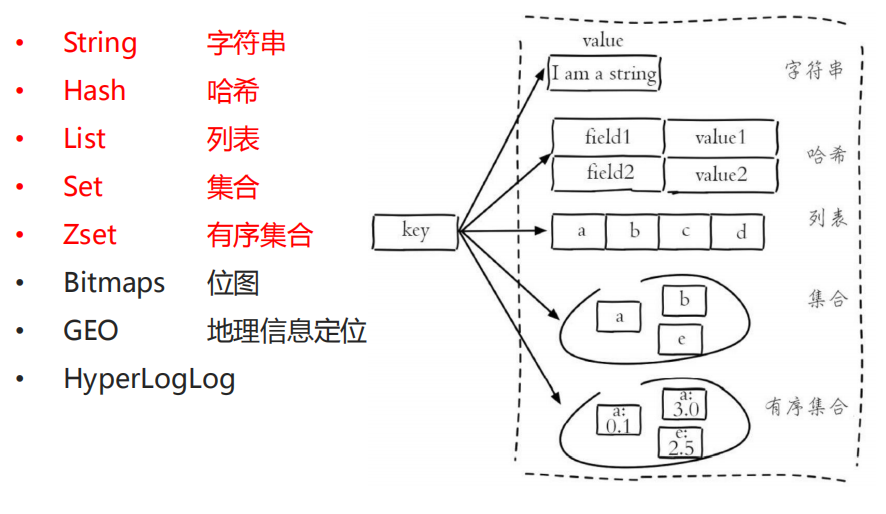

#### **List（集合)**

#### **Set(集合)**

集合类型存储多个字符串，但是**不允许有重复元素**！

**典型应用场景：**

• 兴趣标签、好友集合等，用于推荐业务

**使用注意：**

• **单个set类型成员个数不要过多**

• **smembers命令获取所有成员谨慎使用，很容易带来性能问题（sscan）**

#### **Sorted set(有序集合)** 

有序集合类型存储多个字符串，**不允许有重复元素，但是可以排序**！ 

• Sorted-Sets中的每一个成员都会有一个分数(score)关联，通过分数来为集合中的成员迕行从小到大的排序。成员是唯一的，但是分数(score)却是可以重复的。位置索引:分数最低的索引为0

**典型应用场景：**

• 排行榜等

**使用注意：**

• **单个zset类型成员个数不要过多** 

• **zset的命令大部分实现复杂度较高，一些高频操作慎重**

#### **Bitmaps（位图）**

Bitmaps是一个可以对位操作的字符串！

**典型应用场景：**

• 统计活跃用户、用户在线状态、用户标签等

**使用注意：**

• **第一次初始化时，如果偏移量比较大会比较慢，会有阻塞现象发生**

• **预分配内存，如果设置值较大但统计值较少，会有很大的内存消耗**

#### **bitmaps在大数据统计分析的应用**

**传统方案：**使用set等集合收集所有信息，然后计数统计

**使用bitmaps位存储方案：**

- 使用一个bit位来表示某个元素对应的值或者状态，一个字节8位，对大规模数据过滤或统计可以极大节省内存空间

- 统计活跃用户，极大节省内存消耗【1亿用户，每天日活5000w】

  #### 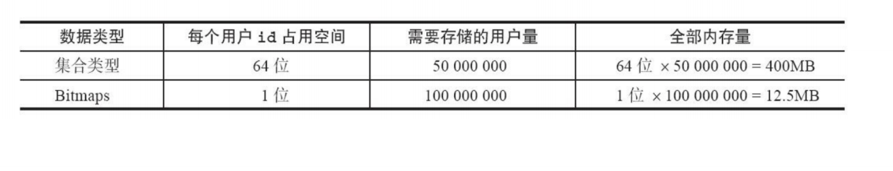

#### GEO（地理位置信息）

存储地理位置信息！【3.2+】 

**典型应用场景：**

• 附近的位置、摇一摇等

**使用注意：**

• **底层实现基于zset，可以使用zrem、zrange等相关命令迚行操作**

• **合理控制GEO集合的大小，各个命令操作复杂度较高，过大的集合会影响操作效率**


#### HyperLogLog**类型**

• 一种基数算法，可以利用极小的内存空间完成大量独立数的统计！

 **典型应用场景：**

• 大访问量UV统计等

**使用注意：**

• **基于该算法的统计并不是精准的，官方给出的误差率是0.81%**

• **兼顾精确度和成本，在满足业务需求前提下做一定的取舍**

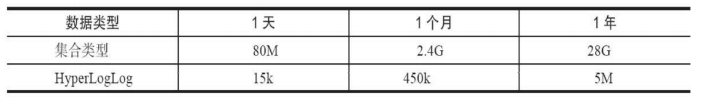

### Redis持久化

#### **RDB数据持化**

内存中的数据集快照（Snapshot）整体写入磁盘，以二迕制文件存储

RDB过程中会fork一个子进程，子进程做数据备份操作，主进程继续对外提供服务，所有Redis服务不会阻塞；

RDB的原理是**fork和cow**。fork是指redis通过创建子进程来进行RDB操作，cow指的是**copy on write**，子进程创建后，父子进程共享数据段，父进程继续提供读写服务，写脏的页面数据会逐渐和子进程分离开来。

快照持久化的内存策略是：子进程按照**数据页**进行复制。在持久化过程中，子进程负责持久化过程，它将主进程数据段的数据页复制一份出来，然后对原数据页进行存储；同一时间，主进程对那份复制出来的数据进行操作。通过复制小数据量数据页（通常每个数据页只有 4KB）的方式，保证了主进程修改数据不会影响子进程存储，子进程存储的数据，还是子进程产生一瞬间的数据。

#### AOF数据持久化

##### AOF 的持久化策略

问：**如果突然机器掉电会怎样？**

**AOF 的持久化策略**：AOF 日志是以文件形式存在的，里面记录的是内存的操作记录，它的实现是将**操作系统内核为文件描述符分配的内存缓存，通过异步的方式刷新到数据磁盘中**。这种操作是 glibc 的 fsync 操作，它是一个很慢的操作，与 Redis 的高性能是相反的。 AOF 提供了三种持久化策略：

- **no**: 无 fsync，由系统保证数据刷新到磁盘，速度最快，但很不安全（通常不使用）；
- **always**: 每次 fsync，每一个修改内存的 Redis 指令都会执行一次 fsync，速度很慢（通常不使用）；
- **everysec**: 每秒进行一次 fsync，有可能丢失一秒的 fsync 的数据。通常选择 everysec 策略，兼顾安全性和效率。

持久化取决于 AOF 日志 sync 属性的配置，如果不要求性能，在每条写指令时都sync一下磁盘，就不会丢失数据。但是在高性能的要求下每次都sync是不现实的，一般都使用定时sync，比如1s1次，这个时候最多就会丢失1s的数据。

##### 关于三个I/O级别：
我们在写java代码时，如果需要向某一个文件中写数据，写完之后，关闭文件之前，需要做什么操作？  
**flush**  
为什么要调用flush？  
在计算机中，所有对硬盘的I/O操作都必须要调用内核，内核会对每一个I/O开出一个缓存空间buffer，然后如果想要向磁盘中写东西，会优先写到buffer中，buffer满了
之后，内核会调用flush向磁盘中刷写。而flush就是刷新缓冲区，将缓冲区的数据刷入磁盘中。所以说，如果向文件中写数据，最后一次写的数据没有占满buffer，
那么内核不会主动调用flush，那么如果没有调用flush，就会丢失这一块的数据，所以需要手动调用flush，刷新缓冲区。缓冲区的大小可以调，一般4k左右。
然后我们在看redis的三个I/O级别：
* no：redis不调flush。也就是说当redis来了四笔写操作，那么每一笔都会向buffer中写，buffer什么时候满了，就往磁盘中刷写。这种方式可能会丢失的最大数据量
就是buffer的大小。
* always： 每一笔写操作都调用flush。这个级别数据是最可靠的，最多可能就是有一笔数据过来调flush的时候停电了，那么最多丢失一笔数据。
* everysec： 每秒钟调用一次flush。这个级别的数据丢失量是多少呢？最坏的情况，在这一秒内，这个buffer内的数据差一点满了，但是还没满，因此没有调flush，
那么在下一秒到达，刚要调用flush时，停电了，那么最多就是丢失一个buffer的数据。但是如果写的比较快的话， buffer很快就满了，就会自动调用flush，因此一秒可能
会调用三四次flush。所以上面那种情况触发概率是非常低的。因此每秒这种是no这种最慢的和always这种最快的中间的一种，相对丢失数据较少的。

#### **RDB-AOF混合持久化模式【4.0+】：** 

• 通过AOF重写创建一个同时包含RDB数据和AOF数据的AOF文件，其中 RDB 数据位于文件的开头， 它储存了开始重写操执行作时的数据库镜像，之后执行的命令则继续以AOF格式追加文件的末尾. 开启aof-use-rdb-preamble后，aof文件仍是正常的纯命令文件，之后执行重写后才会变成混合文件

 ```text
    在4.0之后，重写(对同一个key增、删操作抵消)会将所有的合并后指令放入一个纯指令文件，然后redis会将这个文件中的数据通过rdb的方式写入aof文件中，然后再将增量的数据以指令的方式append到aof，
    也就是说间接的出结论：aof当中包含rdb和增量日志。此时aof文件就是一个混合体，即利用了rdb恢复快，又利用了日志的全量，数据丢失少。如果8点触发，那么就把8点内存里的数据写成rdb，写到aof文件中，然后8点往后的所有新的增删改就开始追加。
 ```

- **RDB-AOF数据恢复**

• 数据恢复时，通过快速加载RDB格式内容，及较少的AOF操作命令，兼顼了两种持

丽化的优势，提高了恢复的速度并兼顼数据的完整度

 注意：4.0+混合持久化模式下，AOF数据文件格式已经发生变化，不能再简单的拷贝

到低版本中加载恢复！

#### RDB-AOF对比

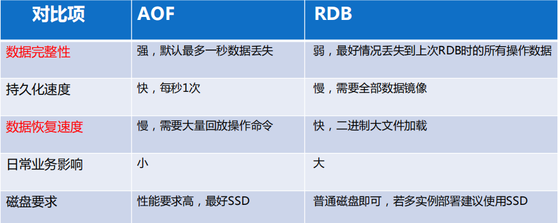


### **持久化类型最佳实践**

- **Redis数据是全部存储在内存中的** 
- 区分业务是缓存还是持久化应用，如无必要关闭持久化
- 持久化**化不能代替数据库，重要或者需要长期保留的数据不能完全依赖Redis存储**
- 线上业务禁用RDB持久化，建议使用AOF持久化
- 如果写入量较大，建议主库关闭持久化，从库开启持久化
- AOF重写和RDB持久化期间会占用额外内存，极端情况多使用一倍【copy-on-write】 
- 使用SSD磁盘进行持久化存储

#### **Redis启劢加载数据恢复流程：**

• AOF配置开启且存在相关文件时，优先加载AOF文件

• AOF关闭或者AOF文件不存在时，加载RDB文件

• 若AOF或RDB存在错误，Redis启劢失败

• 加载成功后，Redis启劢成功

**【加载过程中不对外提供服务】**

### 数据宕机恢复问题

RDB：原理是**fork和cow**，主线程fork产生子线程，使用copyonwrite机制进行更新数据

AOF 日志是以文件形式存在的，里面记录的是内存的操作记录。通过异步的方式刷新到数据磁盘中。这种操作是 glibc 的 fsync 操作

AOF的刷新机制（fsync ）

- 默认：跟随操作系统刷新机制，30s

- **no**: 无 fsync，由系统保证数据刷新到磁盘，速度最快，但很不安全（通常不使用）；
- **always**: 每次 fsync，每一个修改内存的 Redis 指令都会执行一次 fsync，速度很慢（通常不使用）；
- **everysec**: 每秒进行一次 fsync，有可能丢失一秒的 fsync 的数据。通常选择 everysec 策略，兼顾安全性和效率。

RDB+AOF模式

保存内存镜像+很少的AOF命令，加载恢复速度快。

### **Redis主从复制**

 

#### 复制流向

只能由主库流向从库，**不支持双向复制**

#### 支持复制拓扑


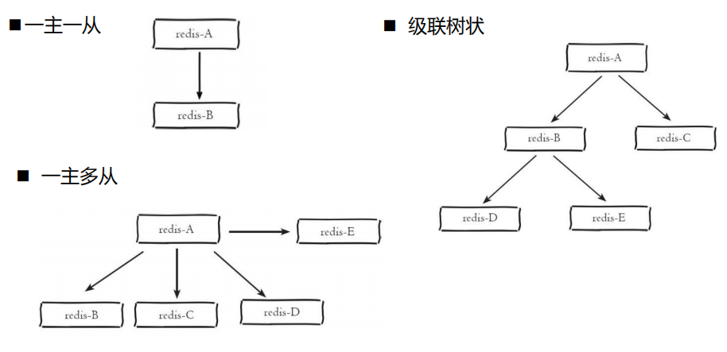

##### redis的哨兵是如何发现其他哨兵的？
我们在配置哨兵的时候，只配置了主节点的信息，但是当主节点宕机时需要其他的哨兵发起投票选出新的master，那么一个哨兵是如何知道其他的哨兵的？
redis自带的功能就是发布订阅，当一个主节点启动的时候，哨兵就会在主节点身上进行发布订阅。

#### **全量复制**

- 初次建立连接，主节点**所有数据**一次性传输给从节点

- 数据量较大，会给主从节点和网络传输带来较大压力

**全量复制流程：**

1. 新Slave第一次连接master发出PSYNC ？ -1命令；

2. 当Master收到PSYNC命令之后：

   - Master fork出bgsave子线程，**在后台保存镜像数据到磁盘（rdb快照）** 

   - Master同时将新收到的写入命令存入缓冲区；

3. 当Master保存快照完成之后，**将快照文件传送给Slave**

4. Slave则把本机内存清空后，再加载该文件到内存中***[不可对外提供读写]***

5.  Master把期间收集到缓冲区命令发给Slave，Slave执行回放，实现和Master同步；

6. . Master/Slave此后通过**异步方式**迕行命令的同步，达到最终数据的同步一致； 

#### **增量复制**

- 建立连接后，主节点仅新增命令会传输给从节点

- 数据量较小，对主从节点和网络开销压力都很小

**增量复制流程：**

1. 主从连接超时发生

2. 主节点持续接收写命令，写入复制缓冲区【repl-backlog-size】

3. 主从连接恢复

4. 从节点发起psync同步请求，提交自己的主节点ID和复制偏移量

5. 主节点核对Id是否和自己一致，并判断偏移量是否在复制缓冲区存在

6. 发送缓冲区数据给从节点

#### **基于一主多从的读写分离架构**

- 主库提供写入服务，写入命令会复制分发到从库异步回放

- 配置一个或多个从库，提供只读服务【多个从库可以使用LVS 负载均衡】 

### redis主从复制的坑?

`redis`高可用最常见的方案就是`主从复制`（master-slave），这种模式也给`redis分布式锁`挖了一坑。

`redis cluster`集群环境下，假如现在`A客户端`想要加锁，它会根据路由规则选择一台`master`节点写入`key` `mylock`，在加锁成功后，`master`节点会把`key`异步复制给对应的`slave`节点。

如果此时`redis master`节点宕机，为保证集群可用性，会进行`主备切换`，`slave`变为了`redis master`。`B客户端`在新的`master`节点上加锁成功，而`A客户端`也以为自己还是成功加了锁的。


### **Redis分布式锁**

#### **分布式锁基本原则**

• 互斥性，任意时刻只能有一个客户端持有锁

• 不能死锁，锁持有者即使意外崩溃未释放，也要保证后续其他客户端可以继续加锁

• 加锁和解锁为同一客户端，避免解锁非自己创建的锁


#### **错误实现方案：**

• SETNX Key Value + Expire Key Seconds +Del Key

**问题：**

 客户端在SETNX成功获取锁后崩溃，Expire迓没有来得及执行，将导致死锁发生

#### **参考实现方案：**

**SET** **Key Value NX PX milliseconds+lua脚本**

-  NX表示只有当键key不存在的时候才会设置成功，获取锁
-  PX表示设置键key的过期时间，避免锁持有者崩溃未主劢释放锁
-  Value为加锁唯一标记，保证锁的添加和释放为相同客户端
- Lua脚本主劢释放锁【lua脚本判断释放锁是否是加锁方，一致则释放锁，另确保为原子操作】

#### 锁过期了，业务还没执行完？

**自动续期**

redis`客户端`redisson。在加锁成功后，会注册一个定时任务监听这个锁，每隔10秒就去查看这个锁，如果还持有锁，就对过期时间进行续期。默认过期时间30秒。这个机制也被叫做：“看门狗”

redisson不管是`加锁`、`解锁`、`续约`都是客户端把一些复杂的业务逻辑，通过封装在`Lua`脚本中发送给`redis`，保证这段复杂业务逻辑执行的`原子性`


#### Redis锁不可重入？

解决方案 ： https://segmentfault.com/a/1190000022931307

分布式可重入锁实现方式有两种：

- 基于 ThreadLocal 实现方案---不能设置过期时间
- 基于 Redis Hash 实现方案
- Redisson 可重入原理 https://my.oschina.net/u/4409332/blog/3291259

####  redis和zk分别做分布式锁，如何实现，有什么优劣？

##### redis实现

**SET** **Key Value NX PX milliseconds+lua脚本**

-  NX表示只有当键key不存在的时候才会设置成功，获取锁
-  PX表示设置键key的过期时间，避免锁持有者崩溃未主劢释放锁
-  Value为加锁唯一标记，保证锁的添加和释放为相同客户端
-  Lua脚本主劢释放锁【lua脚本判断释放锁是否是加锁方，一致则释放锁，另确保为原子操作】

lua脚本封装：setnx （不存在才设置）+ expire 时间（防止加锁线程死掉，产生死锁）+ 固定 value（只有加锁线程知道value，保证加锁者才能解锁），如果过期了还没处理完？延长过期时间。

缺点：

1.未获得锁的线程需要轮询去加锁，比较消耗性能

2.redis获取锁的那个客户端bug了或者挂了，那么只能等待超时时间之后才能释放锁

**优点**：redis本身的读写性能很高，因此基于redis的分布式锁效率比较高

##### zk实现

加锁：只有一个线程可以创建成功同名的临时结点，创建成功就表示获取到锁了，当其他系统过来创建锁就会失败，只能注册监听去监听这个锁，当删除这个节点的时候也就是释放锁的时候就会通过监听通知给等待的系统去重新加锁。

加锁2:创建临时序列节点，序号最小的拿到锁，剩余节点以此监听比它大1的节点（更好，防止监听消息爆炸）

释放锁：好处是加锁线程死掉，结点可以自动释放

好处：watch机制，无需轮询加锁

**缺点**：因为需要频繁的创建和删除节点，性能上不如Redis方式。


### **Redis缓存MySQL数据一致性方案**

**数据更新逻辑：**先写数据库再删缓存 VS 先删缓存再更新数据库

场景：https://baijiahao.baidu.com/s?id=1706150811910444110&wfr=spider&for=pc

**延时双删策略+缓存过期**

1）先删除缓存；

2）再写数据库；

3）休眠500毫秒（按需）；

4）再次删除缓存

5）写入数据Key自劢过期清理

注意缓存从数据库加载的时候要加分布式锁，防止多个线程都在从数据库加载

### **Redis可靠的消息队列**

**通用方案：**

- 上游生产者将消息打入消息队列【lpush】 

- 下游多个消费者从队列获取消息处理【rpop】

**弊端：消费者处理消息任务时突然崩溃，该消息任务将会丢失！**

**方案改进：**

每个下游消费者维护一个私有的任务处理队列

每次通过rpoplpush原子命令，从主消息队里获取并写入私有队列(下图中应该为rpoplpush)

任务处理完成后从私有队列LREM出队列删除

独立监控程序，如果私有队列任务赸时未处理，将其再放回主消息队列继续由其它下游客户端

处理

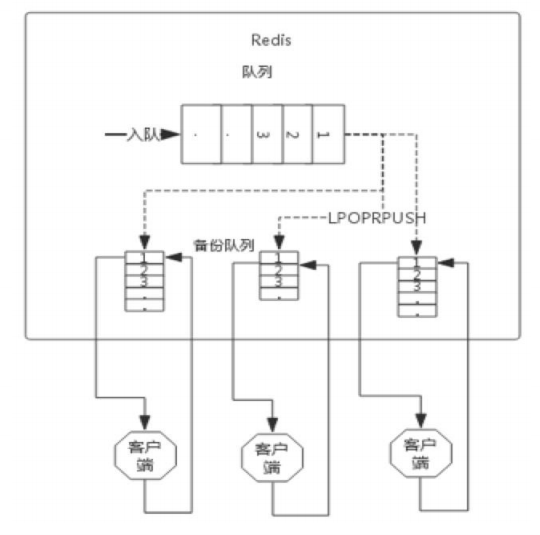


###   redis的淘汰策略有哪些？底层的淘汰机制的lru和lfu的实现是什么？

https://my.oschina.net/zxiaofan/blog/4765393

实际上Redis定义了几种策略用来处理这种情况：

| 淘汰策略名称    | 策略含义                                                     |
| --------------- | ------------------------------------------------------------ |
| noeviction      | 默认策略，不淘汰数据；大部分写命令都将返回错误（DEL等少数除外） |
| allkeys-lru     | 从所有数据中根据 LRU 算法挑选数据淘汰                        |
| volatile-lru    | 从设置了过期时间的数据中根据 LRU 算法挑选数据淘汰            |
| allkeys-random  | 从所有数据中随机挑选数据淘汰                                 |
| volatile-random | 从设置了过期时间的数据中随机挑选数据淘汰                     |
| volatile-ttl    | 从设置了过期时间的数据中，挑选**越早过期的**数据进行删除     |
| allkeys-lfu     | 从所有数据中根据 LFU 算法挑选数据淘汰（4.0及以上版本可用）   |
| volatile-lfu    | 从设置了过期时间的数据中根据 LFU 算法挑选数据淘汰（4.0及以上版本可用） |

> 当使用**volatile-lru**、**volatile-random**、**volatile-ttl**、volatile-lfu这4种策略时，如果没有key可以被淘汰，则和**noeviction**一样返回错误

##### 关于redis的key过期原理
redis的key过期有两种方式，主动和被动。
* 被动：当redis的一个key过期后，如果一直没有新的请求访问这个key，那么这个key可能并不会被删除，redis一直访问他，也不管它，那么他就一直占着空间
不释放，当有用户访问它，然后发现这个key已经过期了，那么就会返回给客户端没有，并且清除它，这样就会有一个时间差，如果一个月一年不访问，那么他就会
一直占着空间。
* 主动：主动方式就代表着轮询。如果redis中有十万个key，那么就要遍历十万次，每个key都看一眼，就会阻塞响应客户端，影响性能。因此redis是间接式
主动遍历，具体就是redis每秒检测十次，每次随机抽20个key查看是否过期并删除已经过期的key，如果有多于25%的key过期，那么就重复上面的过程，直到过期key
低于25%，这意味着在任何时刻，最多删除25%的key。

Redis实现的是近似LRU ：LRU底层结构是 hash 表 + 双向链表。hash 表用于保证查询操作的时间复杂度是O(1)，双向链表用于保证节点插入、节点删除的时间复杂度是O(1)。


# Redis底层数据结构

## redis 为什么把简单的字符串设计成 SDS？

https://juejin.cn/post/6930520039560839176

`redis`是用`C`写的，但它却没有完全直接使用`C`的字符串，而是自己又重新构建了一个叫简单动态字符串`SDS`（simple dynamic string）的抽象类型。

### SDS结构

一个SDS值的数据结构，主要由`len`、`free`、`buf[]`这三个属性组成。

```
struct sdshdr{

  int free; // buf[]数组未使用字节的数量

  int len; // buf[]数组所保存的字符串的长度

  char buf[]; // 保存字符串的数组
}

```

其中`buf[]`为实际保存字符串的`char`类型数组；`free`表示buf[]数组未使用字节的数量；`len`表示buf[]数组所保存的字符串的长度。

`SDS`没有完全直接使用`C`的字符串，还是沿用了一些C特性的，比如遵循`C`的字符串以空格符结尾的规则，这样还可以使用一部分C字符串的函数。

### 效率高

在`SDS`结构中`len`属性记录了字符串的长度，所以我们获取一个字符串长度直接取`len`的值，复杂度是O(1)。

### 规避数据溢出

当我们需要修改数据时，首先会检查当前SDS空间`len`是否满足，不满足则自动扩容空间至修改所需的大小，然后再执行修改

### 内存重分配策略

#### 1.空间预分配

空间预分配策略用于优化SDS**字符串增长**操作，当修改字符串并需对SDS的空间进行扩展时，不仅会为SDS分配修改所必要的空间，还会为SDS分配额外的未使用空间`free`，下次再修改就先检查未使用空间`free`是否满足，满足则不用在扩展空间。

通过空间预分配策略，`redis`可以有效的减少字符串连续增长操作，所产生的内存重分配次数。

#### 2.惰性空间释放

惰性空间释放策略则用于优化SDS**字符串缩短**操作，当缩短SDS字符串后，并不会立即执行内存重分配来回收多余的空间，而是用`free`属性将这些空间记录下来，如果后续有增长操作，则可直接使用。

### **C字符串与SDS对比**

| C字符串                                | SDS                                              |
| -------------------------------------- | ------------------------------------------------ |
| 获取字符串长度复杂度为O(N)             | 获取字符串长度复杂度为O(1)                       |
| API是不安全的，可能会造成缓冲区溢出    | API是安全的，不会造成缓冲区溢出                  |
| 修改字符串长度必然会需要执行内存重分配 | 修改字符串长度N次**最多**会需要执行N次内存重分配 |
| 只能保存文本数据                       | 可以保存文本或二进制数据                         |
| 可以使用所有`<string.h>`库中的函数     | 可以使用一部分`<string.h>`库中的函数             |


https://juejin.cn/post/6844903936520880135

## Sorted set的底层数据结构

ziplist 和  hash（dict）+skiplist两种实现方式


有序列表有压缩列表ziplist和跳表skiplist两种实现方式,通过encoding识别,当数据项数目小于zset_max_ziplist_entries(默认为128),且保存的所有元素长度不超过zset_max_ziplist_value(默认为64)时,则用ziplist实现有序集合,否则使用zset结构,zset底层使用skiplist跳表和dict字典

##### 为什么不使用平衡树存储

与平衡树(AVL、红黑树)比,skiplist有如下优点,这也是redis使用跳表做有序集合底层结构而不选用平衡树的原因。

- 占用内存少。通过调节概率p,可以使每个节点的平均指针数发生变化,redis中为1.33,而二叉树每个节点都有两个指针
- ZRANGE or ZREVRANGE等范围查询更简单。Skiplist可以看作特殊的双向链表,只需找到范围中的最小节点，顺序遍历即可,而平衡树找到范围中的最小节点,仍需中序遍历。
- 和红黑树等比,skiplist实现和调试简单。

## list底层数据结构

https://blog.csdn.net/qq_17305249/article/details/84710480?share_token=6b6d2fd0-f758-440d-8130-b6eb6b324cbe

Redis的list并不简单使用链表实现，在list元素较少的时候，使用的是一种连续内存空间的数据结构**ziplist**（压缩列表）进行存储。这样做的好处是防止过多的不连续的内存碎片产生，同时也避免了过多的链表前趋、后继指针占用过多的内存空间。

但这种 **“ 元素少时使用ziplist ，元素多时使用linked list ”** 作为list的数据结构的方式只存在于Redis 的早期版本，在新的Redis 版本中，这种数据结构被抛弃了，直接使用的是quicklist 数据结构保存：Redis 将多个ziplist 通过双向指针串联起来，实现**快速链表**结构。

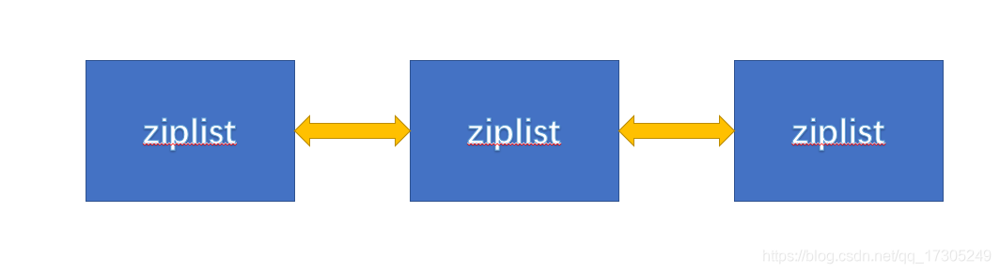

### 每个 ziplist 存多少元素

quicklist 内部默认单个 ziplist 长度为 8k 字节，超出了这个字节数，就会新起一个 ziplist。ziplist 的最大长度由配置文件的参数list-max-ziplist-size决定


19. Redis了解么，如果Redis有1亿个key，使用keys命令是否会影响线上服务

    https://stor.51cto.com/art/201904/595194.htm

    - (1)运维人员进行keys *操作，该操作比较耗时，又因为redis是单线程的，所以redis被锁住。
    - (2)此时QPS比较高，又来了几万个对redis的读写请求，因为redis被锁住，所以全部Hang在那。
    - (3)因为太多线程Hang在那，CPU严重飙升，造成redis所在的服务器宕机
    - (4)所有的线程在redis那取不到数据，一瞬间全去数据库取数据，数据库就宕机了。

    如果有使用类似keys正则命令需求，使用scan命令代替

20. Redis的持久化方式，aof和rdb，具体怎么实现，追加日志和备份文件，底层实现原理。

    https://juejin.cn/post/6844903939339452430

    aof:  可以减少数据丢失或不丢失

    appendonly   被执行的写命令写到AOF文件的末尾，记录数据的变化

    ### 命令追加(append)

    开启AOF持久化功能后，服务器每执行一个写命令，都会把该命令以协议格式先追加到`aof_buf`缓存区的末尾，而不是直接写入文件，避免每次有命令都直接写入硬盘，减少硬盘IO次数

    ### 文件写入(write)和文件同步(sync)

    对于何时把`aof_buf`缓冲区的内容写入保存在AOF文件中，Redis提供了多种策略

    - `appendfsync always`：将`aof_buf`缓冲区的所有内容写入并同步到AOF文件，每个写命令同步写入磁盘
    - `appendfsync everysec`：将`aof_buf`缓存区的内容写入AOF文件，每秒同步一次，该操作由一个线程专门负责
    - `appendfsync no`：将`aof_buf`缓存区的内容写入AOF文件，什么时候同步由操作系统来决定

    `appendfsync`选项的默认配置为`everysec`，即每秒执行一次同步

    

    rdb: 适合数据备份

    fork的子进程要完成内存快照+copyonwrite

21. Redis的list是怎么实现的，我说用ziplist+quicklist实现的，ziplist压缩空间，quicklist实现链表。

    在新的Redis 版本中，直接使用的是quicklist 数据结构保存：

    

    quicklist 是 ziplist 和 linkedlist 的混合体，它将 linkedlist 按段切分，每一段使用 ziplist 来紧凑存储，多个 ziplist 之间使用双向指针串接起来。

    quicklist 内部默认单个 ziplist 长度为 8k 字节，超出了这个字节数，就会新起一个 ziplist。ziplist 的最大长度由配置文件的参数list-max-ziplist-size决定。

22. zset怎么实现的，skiplist的数据结构。

    ziplist或skiplist+dict（hash）实现

    参考：(https://www.jianshu.com/p/fb7547369655)

    zset底层的存储结构包括ziplist或skiplist，在同时满足以下两个条件的时候使用ziplist，其他时候使用skiplist，两个条件如下：

        有序集合保存的元素数量小于128个
        有序集合保存的所有元素的长度小于64字节
    
    
    ​    
    当ziplist作为zset的底层存储结构时候，每个集合元素使用两个紧挨在一起的压缩列表节点来保存，第一个节点保存元素的成员，第二个元素保存元素的分值。
    
    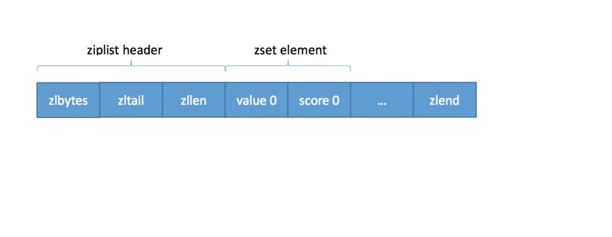
    当skiplist作为zset的底层存储结构的时候，使用skiplist按序保存元素及分值，使用dict来保存元素和分值的映射关系
    
    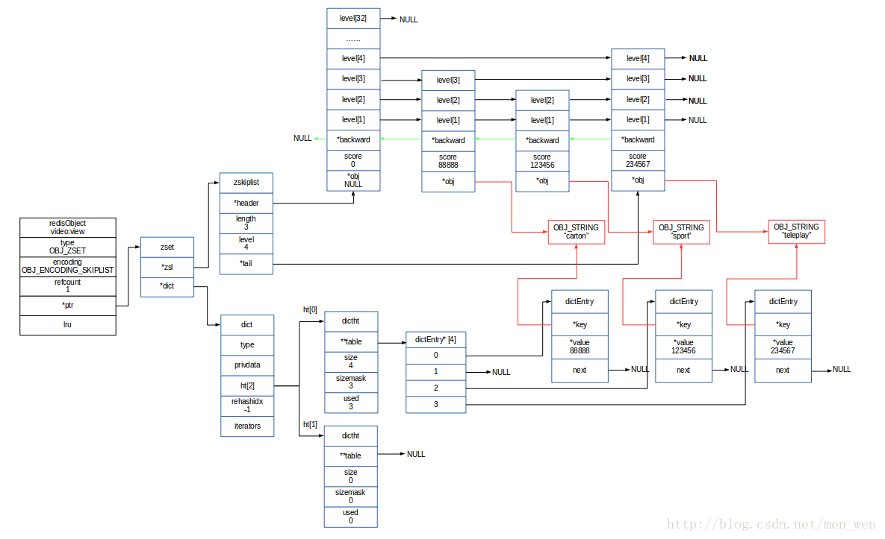


  23. redis如果list较大，怎么优化

   分拆为多个key

   https://cloud.tencent.com/developer/article/1420342


  24. redis的跳表用在哪，为什么用跳表

   

   https://redisbook.readthedocs.io/en/latest/datatype/sorted_set.html#sorted-set-chapter

   `zset` 同时使用字典和跳跃表两个数据结构来保存有序集元素。

   通过使用字典结构， 并将 `member` 作为键， `score` 作为值， 有序集可以在O(1) 复杂度内：

   - 检查给定 `member` 是否存在于有序集（被很多底层函数使用）；
   - 取出 `member` 对应的 `score` 值（实现 [ZSCORE](http://redis.readthedocs.org/en/latest/sorted_set/zscore.html#zscore) 命令）。

   另一方面， 通过使用跳跃表， 可以让有序集支持以下两种操作：

   - 在 O(logN) 期望时间、 O(N)  最坏时间内根据 `score` 对 `member` 进行定位（被很多底层函数使用）；
   - 范围性查找和处理操作，这是（高效地）实现 [ZRANGE](http://redis.readthedocs.org/en/latest/sorted_set/zrange.html#zrange) 、 [ZRANK](http://redis.readthedocs.org/en/latest/sorted_set/zrank.html#zrank) 和 [ZINTERSTORE](http://redis.readthedocs.org/en/latest/sorted_set/zinterstore.html#zinterstore) 等命令的关键。

   通过同时使用字典和跳跃表， 有序集可以高效地实现按成员查找和按顺序查找两种操作。


## BigKey、HotKey的发现与处理
https://developer.aliyun.com/article/788271?utm_content=m_1000291945
### 1 什么是大Key
通常我们会将含有较大数据或含有大量成员、列表数的Key称之为大Key，下面我们将用几个实际的例子对大Key的特征进行描述：

- 一个STRING类型的Key，它的值为5MB（数据过大）
- 一个LIST类型的Key，它的列表数量为20000个（列表数量过多）
- 一个ZSET类型的Key，它的成员数量为10000个（成员数量过多）
- 一个HASH格式的Key，它的成员数量虽然只有1000个但这些成员的value总大小为100MB（成员体积过大）

需要注意的是，在以上的例子中，为了方便理解，我们对大Key的数据、成员、列表数给出了具体的数字。为了避免误导，在实际业务中，大Key的判定仍然需要根据Redis的实际使用场景、业务场景来进行综合判断。

### 2 什么是热Key
在某个Key接收到的访问次数、显著高于其它Key时，我们可以将其称之为热Key，常见的热Key如：

- 某Redis实例的每秒总访问量为10000，而其中一个Key的每秒访问量达到了7000（访问次数显著高于其它Key）
- 对一个拥有上千个成员且总大小为1MB的HASH Key每秒发送大量的HGETALL（带宽占用显著高于其它Key）
- 对一个拥有数万个成员的ZSET Key每秒发送大量的ZRANGE（CPU时间占用显著高于其它Key）

### 1 大Key带来的常见问题
Client发现Redis变慢；
- Redis内存不断变大引发OOM，或达到maxmemory设置值引发写阻塞或重要Key被逐出；
- Redis Cluster中的某个node内存远超其余node，但因Redis Cluster的数据迁移最小粒度为Key而无法将node上的内存均衡化；
- 大Key上的读请求使Redis占用服务器全部带宽，自身变慢的同时影响到该服务器上的其它服务；
- 删除一个大Key造成主库较长时间的阻塞并引发同步中断或主从切换；
### 2 热Key带来的常见问题
- 热Key占用大量的Redis CPU时间使其性能变差并影响其它请求；
- Redis Cluster中各node流量不均衡造成Redis Cluster的分布式优势无法被Client利用，一个分片负载很高而其它分片十分空闲从而产生读/写热点问题；
- 在抢购、秒杀活动中，由于商品对应库存Key的请求量过大超出Redis处理能力造成超卖；
- 热Key的请求压力数量超出Redis的承受能力造成缓存击穿，此时大量强求将直接指向后端存储将其打挂并影响到其它业务；
### 找出Redis中的大Key与热Key

#### 通过Redis官方客户端redis-cli的bigkeys参数发现大Key

如果你并无明确的目标Key用于分析，而是希望通过工具找出整个Redis实例中的大Key，此时redis-cli的bigkeys参数能够方便的帮你实现这个目标。而缺点也非常明显：分析结果不可定制化。

#### 通过Redis官方客户端redis-cli的hotkeys参数发现热Key

Redis自4.0起提供了hotkeys参数来方便用户进行实例级的热Key分析功，该参数能够返回所有Key的被访问次数，它的缺点同样为不可定制化输出报告，大量的信息会使你在分析结果时复杂度较大，另外，使用该方案的前提条件是将redis-server的maxmemory-policy参数设置为LFU。

#### 通过业务层定位热Key

指向Redis的每一次访问都来自业务层，因此我们可以通过在业务层增加相应的代码对Redis的访问进行记录并异步汇总分析。该方案的优势为能够准确并及时的分析出热Key的存在，缺点为业务代码复杂度的增加，同时可能会降低一些性能。

#### 使用monitor命令在紧急情况时找出热Key

Redis的monitor命令能够忠实的打印Redis中的所有请求，包括时间信息、Client信息、命令以及Key信息。在发生紧急情况时，我们可以通过短暂执行monitor命令并将输出重定向至文件，在关闭monitor命令后通过对文件中请求进行归类分析即可找出这段时间中的热Key。

由于monitor命令对Redis的CPU、内存、网络资源均有一定的占用。因此，对于一个已处于高压状态的Redis，monitor可能会起到雪上加霜的作用。同时，这种异步收集并分析的方案的时效性较差，并且由于分析的精确度取决于monitor的执行时间，因此在多数无法长时间执行该命令的线上场景中本方案的精确度也不够好。

### 2 使用开源工具发现大Key
Redis的高度流行使我们能够方便的找到大量开源方案来解决我们当前遇到的难题：在不影响线上服务的同时得到精确的分析报告。

#### 使用redis-rdb-tools工具以定制化方式找出大Key

如果你希望按照自己的标准精确的分析一个Redis实例中所有Key的真实内存占用并避免影响线上服务，在分析结束后得到一份简洁易懂的报告，redis-rdb-tools是非常好的选择。

该工具能够对Redis的RDB文件进行定制化的分析，但由于分析RDB文件为离线工作，因此对线上服务不会有任何影响，这是它的最大优点但同时也是它的最大缺点：


### 1 大Key的常见处理办法
#### 对大Key进行拆分

如将一个含有数万成员的HASH Key拆分为多个HASH Key，并确保每个Key的成员数量在合理范围，在Redis Cluster结构中，大Key的拆分对node间的内存平衡能够起到显著作用。

#### 对大Key进行清理

将不适合Redis能力的数据存放至其它存储，并在Redis中删除此类数据。需要注意的是，我们已在上文提到一个过大的Key可能引发Redis集群同步的中断，Redis自4.0起提供了UNLINK命令，该命令能够以非阻塞的方式缓慢逐步的清理传入的Key，通过UNLINK，你可以安全的删除大Key甚至特大Key。

#### 时刻监控Redis的内存水位

突然出现的大Key问题会让我们措手不及，因此，在大Key产生问题前发现它并进行处理是保持服务稳定的重要手段。我们可以通过监控系统并设置合理的Redis内存报警阈值来提醒我们此时可能有大Key正在产生，如：Redis内存使用率超过70%，Redis内存1小时内增长率超过20%等。

通过此类监控手段我们可以在问题发生前解决问题，如：LIST的消费程序故障造成对应Key的列表数量持续增长，将告警转变为预警从而避免故障的发生。

#### 对失效数据进行定期清理
定时任务的方式对失效数据进行清理。在此类场景中，建议使用HSCAN并配合HDEL对失效数据进行清理，这种方式能够在不阻塞的前提下清理无效数据。


### 2 热Key的常见处理办法
#### 在Redis Cluster结构中对热Key进行复制

在Redis Cluster中，热Key由于迁移粒度问题造成请求无法打散使单一node的压力无法下降。此时可以将对应热Key进行复制并迁移至其他node，例如为热Key foo复制出3个内容完全一样的Key并名为foo2，foo3，foo4，然后将这三个Key迁移到其他node来解决单一node的热Key压力。

该方案的缺点在于代码需要联动修改，同时，Key一变多带来了数据一致性挑战：由更新一个Key演变为需要同时更新多个Key，在很多时候，该方案仅建议用来临时解决当前的棘手问题。

#### 使用读写分离架构

如果热Key的产生来自于读请求，那么读写分离是一个很好的解决方案。在使用读写分离架构时可以通过不断的增加从节点来降低每个Redis实例中的读请求压力。
#### 服务端增加本地缓存
本地具有一个基于 Cache LRU 策略的缓存空间，先从本地拿，本地没有再去redis加载

## 缓存雪崩、缓存穿透、缓存预热、缓存更新、缓存降级等问题
### 缓存雪崩
我们可以简单的理解为：由于原有缓存失效，新缓存未到期间 (例如：我们设置缓存时采用了相同的过期时间，在同一时刻出现大面积的缓存过期)，所有原本应该访问缓存的请求都去查询数据库了，而对数据库CPU和内存造成巨大压力，严重的会造成数据库宕机。从而形成一系列连锁反应，造成整个系统崩溃。
### 解决办法
- 大多数系统设计者考虑用加锁（ 最多的解决方案）或者队列的方式保证来保证不会有大量的线程对数据库一次性进行读写，从而避免失效时大量的并发请求落到底层存储系统上。
- 还有一个简单方案就时讲缓存失效时间分散开。
- 设置永不失效


### 缓存穿透
缓存穿透是指用户查询数据，在数据库没有，自然在缓存中也不会有。这样就导致用户查询的时候，在缓存中找不到，每次都要去数据库再查询一遍，然后返回空（相当于进行了两次无用的查询）。这样请求就绕过缓存直接查数据库，这也是经常提的缓存命中率问题。 解决办法; 
### 解决办法
- 最常见的则是采用布隆过滤器，将所有可能存在的数据哈希到一个足够大的bitmap中，一个一定不存在的数据会被这个bitmap拦截掉，从而避免了对底层存储系统的查询压力。
- 如果一个查询返回的数据为空（不管是数据不存在，还是系统故障），我们仍然把这个空结果进行缓存，但它的过期时间会很短，最长不超过五分钟

### 缓存穿透与缓存击穿的区别
 #### 缓存击穿
 是指一个key非常热点，在不停的扛着大并发，大并发集中对这一个点进行访问，当这个key在失效的瞬间，持续的大并发就穿破缓存，直接请求数据库
 #### 分布式锁
 redis里没有取到数据时，访问数据库前用分布式锁保证同时只有一个线程去读区数据库

 ### 缓存预热 
 缓存预热这个应该是一个比较常见的概念，相信很多小伙伴都应该可以很容易的理解，缓存预热就是系统上线后，将相关的缓存数据直接加载到缓存系统。这样就可以避免在用户请求的时候，先查询数据库，然后再将数据缓存的问题！用户直接查询事先被预热的缓存数据！
 ###  解决思路：
 - 1、直接写个缓存刷新页面，上线时手工操作下；
 - 2、数据量不大，可以在项目启动的时候自动进行加载；
 - 3、定时刷新缓存；

 ### 缓存降级 

 服务降级的目的，是为了防止Redis服务故障，导致数据库跟着一起发生雪崩问题。因此，对于不重要的缓存数据，可以采取服务降级策略，例如一个比较常见的做法就是，Redis出现问题，不去数据库查询，而是直接返回默认值给用户。


### 单线程的redis为什么这么快

- (一)纯内存操作 
- (二)单线程操作，避免了频繁的上下文切换 
- (三)采用了非阻塞I/O多路复用机制

多路复用机制

### 讲解下Redis线程模型


文件事件处理器包括分别是`套接字`、 `I/O 多路复用程序`、 `文件事件分派器（dispatcher）`、 以及`事件处理器`。
- 使用 I/O 多路复用程序来同时监听多个套接字， 并根据套接字目前执行的任务来为套接字关联不同的事件处理器。
- 当被监听的套接字准备好执行连接应答（accept）、读取（read）、写入（write）、关闭（close）等操作时， 与操作相对应的文件事件就会产生， 
- 这时文件事件处理器就会调用套接字之前关联好的事件处理器来处理这些事件。I/O 多路复用程序负责监听多个套接字， 并向文件事件分派器传送那些产生了事件的套接字。 

工作原理： 1)I/O 多路复用程序负责监听多个套接字， 并向文件事件分派器传送那些产生了事件的套接字。尽管多个文件事件可能会并发地出现， 但 I/O 多路复用程序总是会将所有产生事件的套接字都入队到一个队列里面， 然后通过这个队列， 以有序（sequentially）、同步（synchronously）、每次一个套接字的方式向文件事件分派器传送套接字：当上一个套接字产生的事件被处理完毕之后（该套接字为事件所关联的事件处理器执行完毕）， I/O 多路复用程序才会继续向文件事件分派器传送下一个套接字。如果一个套接字又可读又可写的话， 那么服务器将先读套接字， 后写套接字.


## Redis集群方案应该怎么做？

https://www.cnblogs.com/ludongguoa/p/15324315.html
https://www.zhihu.com/question/21419897


### 单节点高可用方案


- 主从复制，slave节点开启持久化
- 哨兵监控自动选举主节点，主节点故障自动切换。多哨兵机制避免单个哨兵自己网络原因引起误判。
- 如果读区压力过大，可读写分离，多个slave处理读，master处理写

### 分片集群
解决写入压力过大、单机内存不足问题


分片规则
- 客户端分片
- 服务端分片


客户端分片，key的路由规则在客户端做：


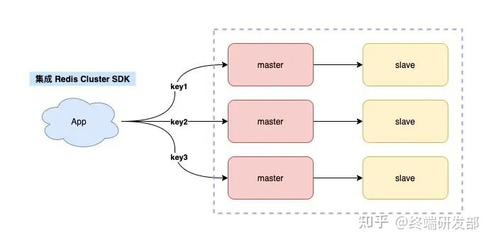

服务端分片，
这种方案指的是，路由规则不放在客户端来做，而是在客户端和服务端之间增加一个「中间代理层」，这个代理就是我们经常听到的 Proxy。
而数据的路由规则，就放在这个 Proxy 层来维护。
这样一来，你就无需关心服务端有多少个 Redis 节点了，只需要和这个 Proxy 交互即可。Proxy 会把你的请求根据路由规则，转发到对应的 Redis 节点上，而且，当集群实例不足以支撑更大的流量请求时，还可以横向扩容，添加新的 Redis 实例提升性能，这一切对于你的客户端来说，都是透明无感知的。re
业界开源的 Redis 分片集群方案，例如 Twemproxy、Codis 就是采用的这种方案。
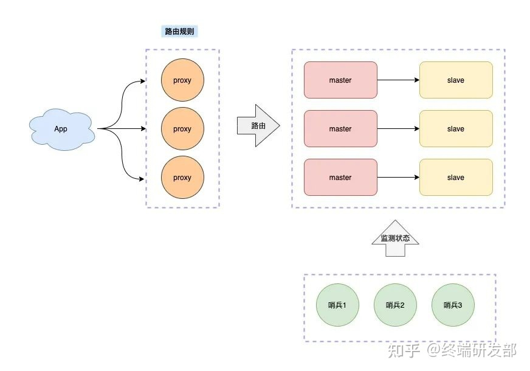


### Redis 集群总结

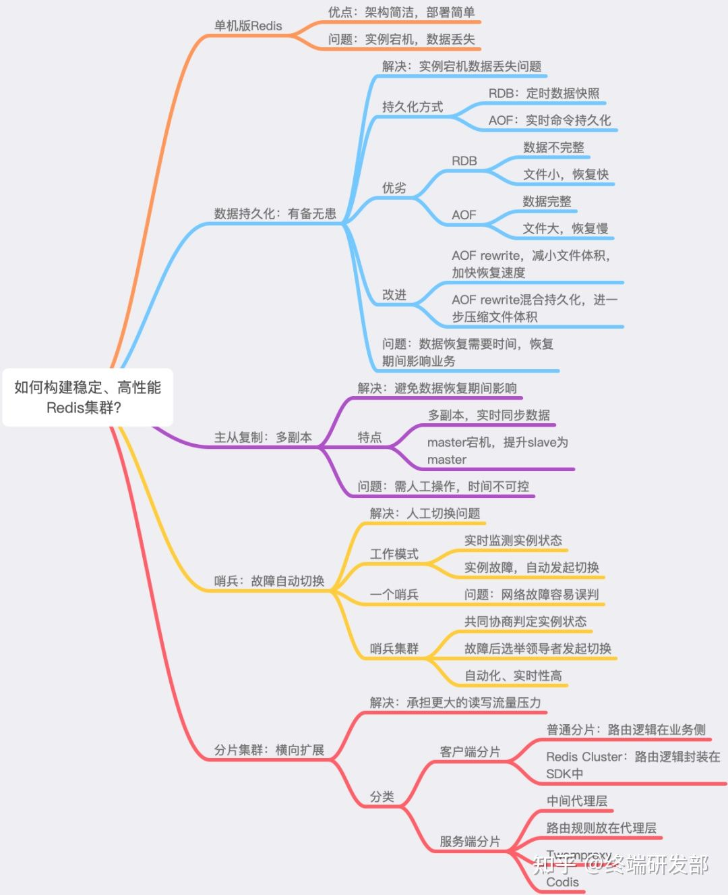