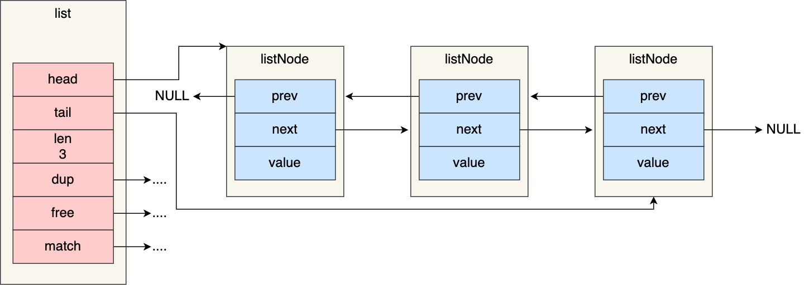

# redis 为什么把简单的字符串设计成 SDS？

https://juejin.cn/post/6930520039560839176

`redis`是用`C`写的，但它却没有完全直接使用`C`的字符串，而是自己又重新构建了一个叫简单动态字符串`SDS`（simple dynamic string）的抽象类型。

### SDS结构

一个SDS值的数据结构，主要由`len`、`free`、`buf[]`这三个属性组成。

```
struct sdshdr{

  int free; // buf[]数组未使用字节的数量

  int len; // buf[]数组所保存的字符串的长度

  char buf[]; // 保存字符串的数组
}

```

其中`buf[]`为实际保存字符串的`char`类型数组；`free`表示buf[]数组未使用字节的数量；`len`表示buf[]数组所保存的字符串的长度。

`SDS`没有完全直接使用`C`的字符串，还是沿用了一些C特性的，比如遵循`C`的字符串以空格符结尾的规则，这样还可以使用一部分C字符串的函数。

### 效率高

在`SDS`结构中`len`属性记录了字符串的长度，所以我们获取一个字符串长度直接取`len`的值，复杂度是O(1)。

### 规避数据溢出

当我们需要修改数据时，首先会检查当前SDS空间`len`是否满足，不满足则自动扩容空间至修改所需的大小，然后再执行修改

### 内存重分配策略

#### 1.空间预分配

空间预分配策略用于优化SDS**字符串增长**操作，当修改字符串并需对SDS的空间进行扩展时，不仅会为SDS分配修改所必要的空间，还会为SDS分配额外的未使用空间`free`，下次再修改就先检查未使用空间`free`是否满足，满足则不用在扩展空间。

通过空间预分配策略，`redis`可以有效的减少字符串连续增长操作，所产生的内存重分配次数。

#### 2.惰性空间释放

惰性空间释放策略则用于优化SDS**字符串缩短**操作，当缩短SDS字符串后，并不会立即执行内存重分配来回收多余的空间，而是用`free`属性将这些空间记录下来，如果后续有增长操作，则可直接使用。

### **C字符串与SDS对比**

| C字符串                                | SDS                                              |
| -------------------------------------- | ------------------------------------------------ |
| 获取字符串长度复杂度为O(N)             | 获取字符串长度复杂度为O(1)                       |
| API是不安全的，可能会造成缓冲区溢出    | API是安全的，不会造成缓冲区溢出                  |
| 修改字符串长度必然会需要执行内存重分配 | 修改字符串长度N次**最多**会需要执行N次内存重分配 |
| 只能保存文本数据                       | 可以保存文本或二进制数据                         |
| 可以使用所有`<string.h>`库中的函数     | 可以使用一部分`<string.h>`库中的函数             |


https://juejin.cn/post/6844903936520880135


https://www.cnblogs.com/xiaolincoding/p/15628854.html


## Redis有哪些数据结构


可以看到，Redis 数据类型的底层数据结构随着版本的更新也有所不同，比如：

在 Redis 3.0 版本中 List 对象的底层数据结构由「双向链表」或「压缩表列表」实现，但是在 3.2 版本之后，List 数据类型底层数据结构是由 quicklist 实现的；
在最新的 Redis 代码（还未发布正式版本）中，压缩列表数据结构已经废弃了，交由 listpack 数据结构来实现了。

共有 9 种数据结构：SDS、双向链表、压缩列表、哈希表、跳表、整数集合、quicklist、listpack。


## 键值对数据库是怎么实现的？
Redis 的键值对中的 key 就是字符串对象，而 value 可以是字符串对象，也可以是集合数据类型的对象，比如 List 对象、Hash 对象、Set 对象和 Zset 对象。

Redis 是使用了一个「哈希表」保存所有键值对，哈希表的最大好处就是让我们可以用 O(1) 的时间复杂度来快速查找到键值对。哈希表其实就是一个数组，数组中的元素叫做哈希桶。


## SDS
字符串在 Redis 中是很常用的，键值对中的键是字符串类型，值有时也是字符串类型。

Redis 是用 C 语言实现的，但是它没有直接使用 C 语言的 char* 字符数组来实现字符串，而是自己封装了一个名为简单动态字符串（simple dynamic string，SDS） 的数据结构来表示字符串，也就是 Redis 的 String 数据类型的底层数据结构是 SDS。

SDS 结构设计
下图就是 Redis 5.0 的 SDS 的数据结构：


结构中的每个成员变量分别介绍下：
```text
len，记录了字符串长度。这样获取字符串长度的时候，只需要返回这个成员变量值就行，时间复杂度只需要 O（1）。

alloc，分配给字符数组的空间长度。这样在修改字符串的时候，可以通过 alloc - len 计算出剩余的空间大小，可以用来判断空间是否满足修改需求，如果不满足的话，就会自动将 SDS 的空间扩展至执行修改所需的大小，然后才执行实际的修改操作，所以使用 SDS 既不需要手动修改 SDS 的空间大小，也不会出现前面所说的缓冲区溢出的问题。

flags，用来表示不同类型的 SDS。一共设计了 5 种类型，分别是 sdshdr5、sdshdr8、sdshdr16、sdshdr32 和 sdshdr64，后面在说明区别之处。

buf[]，字符数组，用来保存实际数据。不仅可以保存字符串，也可以保存二进制数据。
总的来说，Redis 的 SDS 结构在原本字符数组之上，增加了三个元数据：len、alloc、flags，用来解决 C 语言字符串的缺陷。

```
好处：


```text

1，O（1）复杂度获取字符串长度
2.二进制安全
    因为 SDS 不需要用 “\0” 字符来标识字符串结尾了，而是有个专门的 len 成员变量来记录长度，所以可存储包含 “\0” 的数据。但是 SDS 为了兼容部分 C 语言标准库的函数， SDS 字符串结尾还是会加上 “\0” 字符。
3.不会发生缓冲区溢出
4.节省内存空间
```


## 链表

Redis 的 List 对象的底层实现之一就是链表。C 语言本身没有链表这个数据结构的，所以 Redis 自己设计了一个链表数据结构。

链表节点结构设计
先来看看「链表节点」结构的样子：
```
typedef struct listNode {
    //前置节点
    struct listNode *prev;
    //后置节点
    struct listNode *next;
    //节点的值
    void *value;
} listNode;
```
有前置节点和后置节点，可以看的出，这个是一个双向链表。


链表结构设计
不过，Redis 在 listNode 结构体基础上又封装了 list 这个数据结构，这样操作起来会更方便，链表结构如下：

```
typedef struct list {
    //链表头节点
    listNode *head;
    //链表尾节点
    listNode *tail;
    //节点值复制函数
    void *(*dup)(void *ptr);
    //节点值释放函数
    void (*free)(void *ptr);
    //节点值比较函数
    int (*match)(void *ptr, void *key);
    //链表节点数量
    unsigned long len;
} list;
```
list 结构为链表提供了链表头指针 head、链表尾节点 tail、链表节点数量 len、以及可以自定义实现的 dup、free、match 函数。

举个例子，下面是由 list 结构和 3 个 listNode 结构组成的链表。


### 链表的优势与缺陷
#### Redis 的链表实现优点如下：

- listNode 链表节点的结构里带有 prev 和 next 指针，获取某个节点的前置节点或后置节点的时间复杂度只需O(1)，而且这两个指针都可以指向 NULL，所以链表是无环链表；
- list 结构因为提供了表头指针 head 和表尾节点 tail，所以获取链表的表头节点和表尾节点的时间复杂度只需O(1)；
- list 结构因为提供了链表节点数量 len，所以获取链表中的节点数量的时间复杂度只需O(1)；
- listNode 链表节使用 void* 指针保存节点值，并且可以通过 list 结构的 dup、free、match 函数指针为节点设置该节点类型特定的函数，因此链表节点可以保存各种不同类型的值；
#### 链表的缺陷也是有的：

链表每个节点之间的内存都是不连续的，意味着无法很好利用 CPU 缓存。能很好利用 CPU 缓存的数据结构就是数组，因为数组的内存是连续的，这样就可以充分利用 CPU 缓存来加速访问。

还有一点，保存一个链表节点的值都需要一个链表节点结构头的分配，内存开销较大。

因此，Redis 3.0 的 List 对象在数据量比较少的情况下，会采用「压缩列表」作为底层数据结构的实现，它的优势是节省内存空间，并且是内存紧凑型的数据结构。

不过，压缩列表存在性能问题（具体什么问题，下面会说），所以 Redis 在 3.2 版本设计了新的数据结构 quicklist，并将 List 对象的底层数据结构改由 quicklist 实现。

然后在 Redis 5.0 设计了新的数据结构 listpack，沿用了压缩列表紧凑型的内存布局，最终在最新的 Redis 版本，将 Hash 对象和 Zset 对象的底层数据结构实现之一的压缩列表，替换成由 listpack 实现。

### 压缩列表

压缩列表的最大特点，就是它被设计成一种内存紧凑型的数据结构，占用一块连续的内存空间，不仅可以利用 CPU 缓存，而且会针对不同长度的数据，进行相应编码，这种方法可以有效地节省内存开销。

但是，压缩列表的缺陷也是有的：

不能保存过多的元素，否则查询效率就会降低；
新增或修改某个元素时，压缩列表占用的内存空间需要重新分配，甚至可能引发连锁更新的问题。
因此，Redis 对象（List 对象、Hash 对象、Zset 对象）包含的元素数量较少，或者元素值不大的情况才会使用压缩列表作为底层数据结构。

压缩列表是 Redis 为了节约内存而开发的，它是由连续内存块组成的顺序型数据结构，有点类似于数组。


压缩列表在表头有三个字段：

- zlbytes，记录整个压缩列表占用对内存字节数；
- zltail，记录压缩列表「尾部」节点距离起始地址由多少字节，也就是列表尾的偏移量；
- zllen，记录压缩列表包含的节点数量；
- zlend，标记压缩列表的结束点，固定值 0xFF（十进制255）。

在压缩列表中，如果我们要查找定位第一个元素和最后一个元素，可以通过表头三个字段的长度直接定位，复杂度是 O(1)。而查找其他元素时，就没有这么高效了，只能逐个查找，此时的复杂度就是 O(N) 了，因此压缩列表不适合保存过多的元素。

另外，压缩列表节点（entry）的构成如下：


压缩列表节点包含三部分内容：

- prevlen，记录了「前一个节点」的长度；
- encoding，记录了当前节点实际数据的类型以及长度；
- data，记录了当前节点的实际数据；


#### 压缩列表的缺陷
空间扩展操作也就是重新分配内存，因此连锁更新一旦发生，就会导致压缩列表占用的内存空间要多次重新分配，这就会直接影响到压缩列表的访问性能。

所以说，虽然压缩列表紧凑型的内存布局能节省内存开销，但是如果保存的元素数量增加了，或是元素变大了，会导致内存重新分配，最糟糕的是会有「连锁更新」的问题。

因此，压缩列表只会用于保存的节点数量不多的场景，只要节点数量足够小，即使发生连锁更新，也是能接受的。

## 哈希表

哈希表优点在于，它能以 O(1) 的复杂度快速查询数据。

Redis 采用了「链式哈希」来解决哈希冲突（hashmap类似），在不扩容哈希表的前提下，将具有相同哈希值的数据串起来，形成链接起，以便这些数据在表中仍然可以被查询到。 

```
typedef struct dictht {
    //哈希表数组
    dictEntry **table;
    //哈希表大小
    unsigned long size;  
    //哈希表大小掩码，用于计算索引值
    unsigned long sizemask;
    //该哈希表已有的节点数量
    unsigned long used;
} dictht;
```


## 整数集合

整数集合是 Set 对象的底层实现之一。当一个 Set 对象只包含整数值元素，并且元素数量不时，就会使用整数集这个数据结构作为底层实现。

整数集合本质上是一块连续内存空间，它的结构定义如下：

```
typedef struct intset {
    //编码方式
    uint32_t encoding;
    //集合包含的元素数量
    uint32_t length;
    //保存元素的数组
    int8_t contents[];
} intset;

```

## 跳表

zset底层的存储结构包括ziplist或skiplist，在同时满足以下两个条件的时候使用ziplist，其他时候使用skiplist，两个条件如下：

- 有序集合保存的元素数量小于128个
- 有序集合保存的所有元素的长度小于64字节


Redis 只有在 Zset 对象的底层实现用到了跳表，跳表的优势是能支持平均 O(logN) 复杂度的节点查找。

Zset 对象是唯一一个同时使用了两个数据结构来实现的 Redis 对象，这两个数据结构一个是跳表，一个是哈希表。这样的好处是既能进行高效的范围查询，也能进行高效单点查询。
```
typedef struct zset {
    dict *dict;
    zskiplist *zsl;
} zset;
```
Zset 对象能支持范围查询（如 ZRANGEBYSCORE 操作），这是因为它的数据结构设计采用了跳表，而又能以常数复杂度获取元素权重（如 ZSCORE 操作），这是因为它同时采用了哈希表进行索引。

### 跳表结构设计
链表在查找元素的时候，因为需要逐一查找，所以查询效率非常低，时间复杂度是O(N)，于是就出现了跳表。跳表是在链表基础上改进过来的，实现了一种「多层」的有序链表，这样的好处是能快读定位数据。


## quicklist

在 Redis 3.0 之前，List 对象的底层数据结构是双向链表或者压缩列表。然后在 Redis 3.2 的时候，List 对象的底层改由 quicklist 数据结构实现。

其实 quicklist 就是「双向链表 + 压缩列表」组合，因为一个 quicklist 就是一个链表，而链表中的每个元素又是一个压缩列表。

在前面讲压缩列表的时候，我也提到了压缩列表的不足，虽然压缩列表是通过紧凑型的内存布局节省了内存开销，但是因为它的结构设计，如果保存的元素数量增加，或者元素变大了，压缩列表会有「连锁更新」的风险，一旦发生，会造成性能下降。

quicklist 解决办法，通过控制每个链表节点中的压缩列表的大小或者元素个数，来规避连锁更新的问题。因为压缩列表元素越少或越小，连锁更新带来的影响就越小，从而提供了更好的访问性能。


### quicklist 结构设计
quicklist 的结构体跟链表的结构体类似，都包含了表头和表尾，区别在于 quicklist 的节点是 quicklistNode。
```
typedef struct quicklist {
    //quicklist的链表头
    quicklistNode *head;      //quicklist的链表头
    //quicklist的链表头
    quicklistNode *tail; 
    //所有压缩列表中的总元素个数
    unsigned long count;
    //quicklistNodes的个数
    unsigned long len;       
    ...
} quicklist;
```
quicklistNode 的结构定义：
```
typedef struct quicklistNode {
    //前一个quicklistNode
    struct quicklistNode *prev;     //前一个quicklistNode
    //下一个quicklistNode
    struct quicklistNode *next;     //后一个quicklistNode
    //quicklistNode指向的压缩列表
    unsigned char *zl;              
    //压缩列表的的字节大小
    unsigned int sz;                
    //压缩列表的元素个数
    unsigned int count : 16;        //ziplist中的元素个数 
    ....
} quicklistNode;

```


在向 quicklist 添加一个元素的时候，不会像普通的链表那样，直接新建一个链表节点。而是会检查插入位置的压缩列表是否能容纳该元素，如果能容纳就直接保存到 quicklistNode 结构里的压缩列表，如果不能容纳，才会新建一个新的 quicklistNode 结构。

quicklist 会控制 quicklistNode 结构里的压缩列表的大小或者元素个数，来规避潜在的连锁更新的风险，但是这并没有完全解决连锁更新的问题。


## listpack

quicklist 虽然通过控制 quicklistNode 结构里的压缩列表的大小或者元素个数，来减少连锁更新带来的性能影响，但是并没有完全解决连锁更新的问题。

Redis 在 5.0 新设计一个数据结构叫 listpack，目的是替代压缩列表，它最大特点是 listpack 中每个节点不再包含前一个节点的长度了，压缩列表每个节点正因为需要保存前一个节点的长度字段，就会有连锁更新的隐患。


主要包含三个方面内容：

- encoding，定义该元素的编码类型，会对不同长度的整数和字符串进行编码；
- data，实际存放的数据；
- len，encoding+data的总长度；
可以看到，listpack 没有压缩列表中记录前一个节点长度的字段了，listpack 只记录当前节点的长度，当我们向 listpack 加入一个新元素的时候，不会影响其他节点的长度字段的变化，从而避免了压缩列表的连锁更新问题。