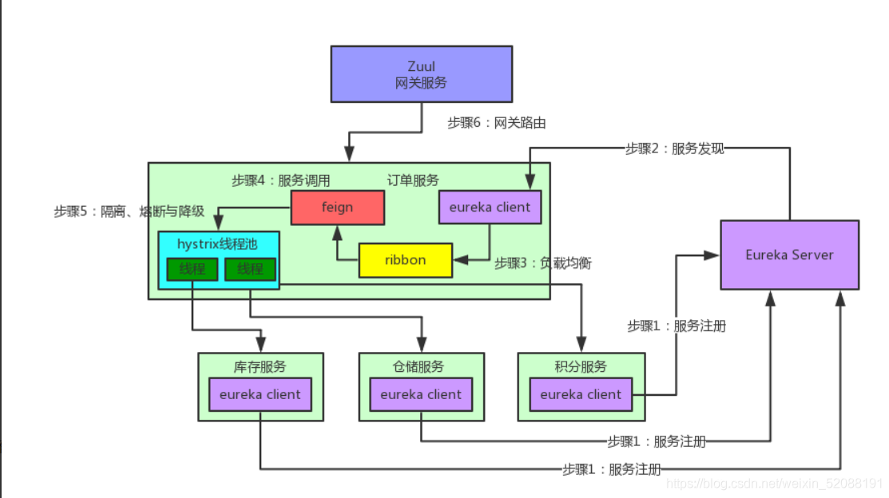

# SpringCloud五大组件

https://blog.csdn.net/weixin_52088191/article/details/118499406

## 1、Eureka注册中心

  举一个电商项目的例子，有订单服务，库存服务，积分服务以及仓储服务等。
在用户购买商品并且下单后，需要修改订单状态，减少库存，增加用户相应的积分，并 且通知仓储中心进行发货，这个时候订单服务需要怎么去一一联系各个服务呢？就算联 系上怎么去调用也是一个问题，这里就引出了Eureka注册中心。

  首先，就是在订单服务、库存服务、积分服务以及仓储服务中添加一个EurekaClient组件，其中，库存服务、积分服务以及仓储服务通过这个组件将自己在哪个机器上，监听哪个端口的信息注册到EurekaServer中，EurekaServer中有个注册表，是专门保存这些信息的。
  然后，订单服务中的EurekaClient询问EurekaServer组件库存服务、积分服务以及仓储服务都在哪台机器上，监听的端口号是什么，订单服务获取这些信息后调取每一个服务就从自己本地中获取想要调取服务的位置和端口，收到响应后，发送请求过去调取要使用的接口即可。

## 2、Feign声明式WebService客户端

  拿刚才的例子说，订单服务确实知道了库存服务、积分服务以及仓储服务在哪里了，同时也有监听着端口号，但是新的问题又来了，难道订单服务交互其他三个服务的时候都要写一大堆代码，跟其他服务建立连接，然后构造复杂的请求，然后发送请求过去吗？
答案是No，这里就引出了Feign声明式WebService客户端。

  首先说明，Feign的一个机制就是使用了动态代理，如果你对某个接口定义了@FeignClient注解，那么Feign就会针对这个接口创建一个动态代理。
然后，你调用这个接口的时候，其实就是调用了Feign为这个接口创建的动态代理，这个是核心中的核心，Feign的动态代理会根据你在接口的定义的@RequestMapping等注解，来动态构造你要请求的服务地址，最后根据这个地址发送请求，解析相应。

## 3、Ribbon负载均衡

  继续拿上一个的例子说，Feign确实方便了许多，但是新的问题出来了，如果库存服务上有多台机器，那Feign怎么知道请求的是哪台机器呢？这里就引出了Ribbon负载均衡。
  Ribbon会在你每次请求的时候选择一台机器，均匀的将请求发送到各个机器上，Ribbon默认使用的是RoundRobin轮询算法，顾名思义，就是请求到达的时候，对每台机器进行挨个询问，如果订单服务对库存发动了十次请求，那么就会先让你请求第一台机器，然后是第二台机器········第十台机器。

  首先说明，Feign的一个机制就是使用了动态代理，如果你对某个接口定义了@FeignClient注解，那么Feign就会针对这个接口创建一个动态代理。
  然后，你调用这个接口的时候，其实就是调用了Feign为这个接口创建的动态代理，这个是核心中的核心，Feign的动态代理会根据你在接口的定义的@RequestMapping等注解，来动态构造你要请求的服务地址，最后根据这个地址发送请求，解析相应。

### 3-1、Ribbon与Feign和Eureka一起工作。

  首先，Ribbon通过EurekaClient 获取对应的服务信息表，也就知道了所有的服务都部署在哪台机器上，在监听什么端口。
然后，Ribbon获取到请求后，使用轮询算法，从中选择一台机器。
最后，Feign就会针对这些机器构造并发出请求，可以参考下图思考：

  首先说明，Feign的一个机制就是使用了动态代理，如果你对某个接口定义了@FeignClient注解，那么Feign就会针对这个接口创建一个动态代理。
  然后，你调用这个接口的时候，其实就是调用了Feign为这个接口创建的动态代理，这个是核心中的核心，Feign的动态代理会根据你在接口的定义的@RequestMapping等注解，来动态构造你要请求的服务地址，最后根据这个地址发送请求，解析相应。

## 4、Hystrix熔断器

  继续拿上例来说，订单服务在一个业务流程里需要调用三个服务，现在假设订单服务自己最多只有100个线程可以接受请求，然后呢，积分服务不幸的挂掉了，每次订单服务调用积分服务的时候都会卡几秒钟，然后抛出异常。
  大家可以考虑一下为什么会出现这样的问题？如果系统在高并发的情况下，大量的请求涌进来，订单服务的100个线程会卡在积分服务这里，导致订单服务没有一个线程可以处理请求，然后又有第101个请求订单服务的时候，发现订单服务崩了，不接受请求了，就会导致其他服务也会挂掉，这就是雪崩效应，一个服务挂掉引起的连锁反应。
  这里我们可以思考一下，就算积分服务挂掉了，订单服务也可以不用挂啊？为什么？我们结合业务来看，只要订单服务修改订单状态，减少库存并通知仓储进行发货就OK了，如果积分服务挂了，大不了等他恢复之后，慢慢人肉手工恢复数据！为啥一定要因为一个积分服务挂了，就直接导致订单服务也挂了呢？不可以接受！这里就引出了SpringCloud 的组件：Hystrix熔断器。

  现在的情况就是积分服务挂掉了，但是仓储服务与库存服务都可以正常工作，在订单服务调用积分服务的时候每次都要卡几秒干啥？一点意义也没有，所以我们直接对积分服务做熔断，比如说在五秒内请求积分服务失败就直接返回，这个过程就是熔断。
  在熔断的同时我们还要做一件事，订单服务每次调用积分服务的时候，就在数据库中添加一条信息，例如：给张三用户添加30积分，因为积分服务挂掉，添加失败！这样等积分服务恢复了之后，可以根据这些信息手动给用户添加积分，这个过程就是降级。

## 5、zuul微服务网关（网络路由）

  继续拿上个例子说，假设你后台部署了几百台机器，现在有个前端兄弟，通过浏览器请求过来的，人家要请求库存服务，难道还要让人家记住这个服务的名字？部署在5台机器上？就算人家肯记住一个，你有好几百机器呢，难不成还要人家请求一个就要记住一个？这个时候就得引出了zuul微服务网关。
  一般，微服务架构中都会有一个zuul网关，前端不用去关心后端有多少台机器，就知道有一个网关即可，前端得请求都会往网关走，网关会根据请求中得一些特征，将请求转发给后端的各个服务。而且有了网关之后，还可以做统一的`降级`、`限流`、`认证授权`、`安全`等。

## SpringCloud五大组件示意图

