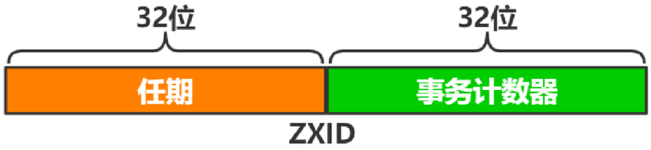

# Zookeeper

https://xie.infoq.cn/article/9c9bc2ab62f20d2bf935145b9

https://juejin.cn/post/6844903984814096398

## Zookeeper 都有哪些功能？

1. 集群管理：监控节点存活状态、运行请求等；

2. 主节点选举：主节点挂掉了之后可以从备用的节点开始新一轮选主，主节点选举说的就是这个选举的过程，使用 Zookeeper 可以协助完成这个过程；

3. 分布式锁：Zookeeper 提供两种锁：独占锁、共享锁。独占锁即一次只能有一个线程使用资源，共享锁是读锁共享，读写互斥，即可以有多线线程同时读同一个资源，如果要使用写锁也只能有一个线程使用。Zookeeper 可以对分布式锁进行控制。

4. 命名服务：在分布式系统中，通过使用命名服务，客户端应用能够根据指定名字来获取资源或服务的地址，提供者等信息。

## 集群角色？

Leader、Follower、Observer



## 如何识别请求的先后顺序？

ZooKeeper会给每个更新请求，分配一个全局唯一的递增编号（zxid)，编号的大小体现事务操作的先后顺序。

## Zookeeper 宕机如何处理？

Zookeeper 本身也是集群，推荐配置不少于 3 个服务器。Zookeeper 自身也要保证当一个节点宕机时，其他节点会继续提供服务。如果是一个 Follower 宕机，还有 2 台服务器提供访问，因为 Zookeeper 上的数据是有多个副本的，数据并不会丢失；如果是一个 Leader 宕机，Zookeeper 会选举出新的 Leader。

Zookeeper 集群的机制是只要超过半数的节点正常，集群就能正常提供服务。只有在 Zookeeper 节点挂得太多，只剩一半或不到一半节点能工作，集群才失效。所以：

3 个节点的 cluster 可以挂掉 1 个节点(leader 可以得到 2 票 > 1.5)

2 个节点的 cluster 就不能挂掉任何1个节点了(leader 可以得到 1 票 <= 1)

## 说下四种类型的数据节点 Znode？

1. PERSISTENT：持久节点，除非手动删除，否则节点一直存在于 Zookeeper 上。

2. EPHEMERAL：临时节点，临时节点的生命周期与客户端会话绑定，一旦客户端会话失效（客户端与 Zookeeper连接断开不一定会话失效），那么这个客户端创建的所有临时节点都会被移除。

3. PERSISTENT_SEQUENTIAL：持久顺序节点，基本特性同持久节点，只是增加了顺序属性，节点名后边会追加一个由父节点维护的自增整型数字。

4. EPHEMERAL_SEQUENTIAL：临时顺序节点，基本特性同临时节点，增加了顺序属性，节点名后边会追加一个由父节点维护的自增整型数字。

## 什么是会话Session?

指的是客户端会话，客户端启动时，会与服务器建议TCP链接，连接成功后，客户端的生命周期开始，客户端和服务器通过心跳检测保持有效的的会话以及发请求并响应、监听Watch事件等。



## 在sessionTimeout之内的会话，因服务器压力大、网络故障或客户端主动断开情况下，之前的会话还有效吗？

有效。

## 谈下你对 ZAB 协议的了解？

ZAB 协议是为分布式协调服务 Zookeeper 专门设计的一种支持崩溃恢复的原子广播协议。ZAB 协议包括两种基本的模式：崩溃恢复和消息广播。

当整个 Zookeeper 集群刚刚启动或者Leader服务器宕机、重启或者网络故障导致不存在过半的服务器与 Leader 服务器保持正常通信时，所有服务器进入崩溃恢复模式，首先选举产生新的 Leader 服务器，然后集群中 Follower 服务器开始与新的 Leader 服务器进行数据同步。当集群中超过半数机器与该 Leader 服务器完成数据同步之后，退出恢复模式进入消息广播模式，Leader 服务器开始接收客户端的事务请求生成事物提案来进行事务请求处理。

## Zookeeper 怎么保证主从节点的状态同步？

### Zab 协议有两种模式

Zookeeper 的核心是原子广播机制，这个机制保证了各个 server 之间的同步。实现这个机制的协议叫做 Zab 协议。Zab 协议有两种模式，它们分别是恢复模式和广播模式。

### 1. 恢复模式

当服务启动或者在领导者崩溃后，Zab就进入了恢复模式，当领导者被选举出来，且大多数 server 完成了和 leader 的状态同步以后，恢复模式就结束了。状态同步保证了 leader 和 server 具有相同的系统状态。

### 2. 广播模式

一旦 leader 已经和多数的 follower 进行了状态同步后，它就可以开始广播消息了，即进入广播状态。这时候当一个 server 加入 ZooKeeper 服务中，它会在恢复模式下启动，发现 leader，并和 leader 进行状态同步。待到同步结束，它也参与消息广播。ZooKeeper 服务一直维持在 Broadcast 状态，直到 leader 崩溃了或者 leader 失去了大部分的 followers 支持。

## ZAB 和 Paxos 算法的联系与区别？

### 相同点：

（1）两者都存在一个类似于 Leader 进程的角色，由其负责协调多个 Follower 进程的运行

（2）Leader 进程都会等待超过半数的 Follower 做出正确的反馈后，才会将一个提案进行提交

（3）ZAB 协议中，每个 Proposal 中都包含一个 epoch 值来代表当前的 Leader周期，Paxos 中名字为 Ballot

### 不同点：

ZAB 用来构建高可用的分布式数据主备系统（Zookeeper），Paxos 是用来构建分布式一致性状态机系统。

## 说一下 Zookeeper 的通知机制？

client 端会对某个 znode 建立一个 watcher 事件，当该 znode 发生变化时，这些 client 会收到 zk 的通知，然后 client 可以根据 znode 变化来做出业务上的改变等。

# 聊一聊ZooKeeper的顺序一致性

https://mp.weixin.qq.com/s/3fjn-ZTT1ODa6u0paWdGeg

ZooKeeper作为分布式应用系统协调服务，在分布式系统中的应用非常广泛，在某些业务场景下甚至可以作为注册中心、分布式锁来使用。ZooKeeper之所以能有如此广泛的应用，与它良好的数据一致性保障机制是分不开的。我们都知道ZooKeeper专门设计了Zab（Zookeeper Atomic Broadcast）协议作为其数据一致性协议。

## 数据的最终一致性

> 使用两阶段提交的方式，达到数据的最终一致性

利用Zab协议的数据写入由Leader结点协调，使用两阶段提交的方式，达到数据的最终一致性。为什么是最终一致性呢？我们先了解下两阶段的过程，如图一所示：

图一

 

## 两阶段提交数据写入过程

**第一阶段：**每次的数据写入事件作为提案广播给所有Follower结点；可以写入的结点返回确认信息ACK；

**第二阶段：**Leader收到一半以上的ACK信息后确认写入可以生效，向所有结点广播COMMIT将提案生效。

根据写入过程的两阶段的描述，我们知道ZooKeeper保证的是最终一致性，即Leader向客户端返回写入成功后，可能有部分Follower还没有写入最新的数据，所以是最终一致性。

我们都知道ZooKeeper保证的最终一致性也叫顺序一致性，即每个结点的数据都是严格按事务的发起顺序生效的。

## ZooKeeper是如何保证事务顺序的呢？

### 

这里需要了解下它的事务ID（ZXID），之前的文章介绍过ZooKeeper的在选举时通过比较各结点的ZXID和机器ID选出新的注结点的。ZXID由Leader节点生成，有新写入事件时，Leader生成新ZXID并随提案一起广播，每个结点本地都保存了当前最近一次事务的ZXID，ZXID是递增的，所以谁的ZXID越大，就表示谁的数据是最新的。

ZXID的生成规则如下图所示：

**图二**

### **ZXID有两部分组成：**

**任期：**完成本次选举后，直到下次选举前，由同一Leader负责协调写入；

**事务计数器：**单调递增，每生效一次写入，计数器加一。

可以看到，ZXID的低32位是计数器，所以同一任期内，ZXID是连续的，每个结点又都保存着自身最新生效的ZXID，通过对比新提案的ZXID与自身最新ZXID是否相差“1”，来保证事务严格按照顺序生效的。

我们都知道ZooKeeper集群的写入是由Leader结点协调的，真实场景下写入会有一定的并发量，那Zab协议的两阶段提交是如何保证事务严格按顺序生效的呢？在本章介绍两阶段提交的部分描述了Leader在收到半数以上ACK后会将提案生效并广播给所有Follower结点。

Leader为了保证提案按ZXID顺序生效，使用了一个ConcurrentHashMap，记录所有未提交的提案，命名为outstandingProposals，key为ZXID，Value为提案的信息。**对outstandingProposals的访问逻辑如下：**

### 提案提交流程

1、每发起一个提案，会将提案的ZXID和内容放到outstandingProposals中，作为待提交的提案；

2、收到Follower的ACK信息后，根据ACK中的ZXID从outstandingProposals中找到对应的提案，对ACK计数；

3、执行tryToCommit尝试将提案提交，判断流程如下：

   3.1：判断当前ZXID之前是否还有未提交提案，如果有，当前提案暂时不能提交；

   3.2：判断提案是否收到半数以上ACK，如果达到半数则可以提交；

   3.3：如果可以提交，将当前ZXID从outstandingProposals中清除并向Followers广播提交当前提案；

Leader是如何判断当前ZXID之前是否还有未提交提案的呢？由于前提是保证顺序提交的，所以Leader只需判断outstandingProposals里，当前ZXID的前一个ZXID是否存在，代码如下：

**图三
**

 

> 所以ZooKeeper是通过两阶段提交保证数据的最终一致性，并且通过严格的按照ZXID的顺序生效提案保证其顺序一致性的。