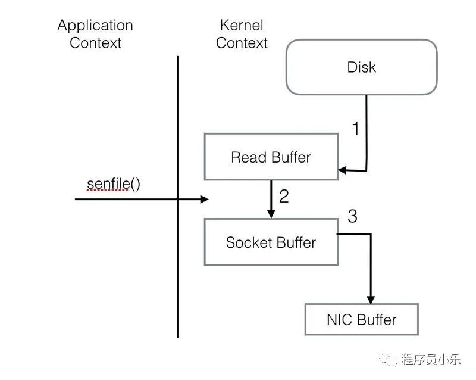

# Kafka

## Kafka消息中间件如何实现几十万每秒并发写入

1、⻚缓存技术 + 磁盘顺序写
2、零拷⻉技术
3、最后的总结


### 1、⻚缓存技术 + 磁盘顺序写

#### 基于操作系统的⻚缓存来实现文件写入的。

操作系统本身有一层缓存，叫做 page cache，是在内存里的缓存，我们也可以称之为 oscache，意思就是操作系统自己管理的缓存。
你在写入磁盘文件的时候，可以直接写入这个 os cache 里，也就是仅仅写入内存中，接下来由操作系统自己决定什么时候把 os cache 里的数据真的刷入磁盘文件中。
仅仅这一个步骤，就可以将磁盘文件写性能提升很多了，因为其实这里相当于是在写内存，不是在写磁盘.

#### 磁盘顺序写文件

接着另外一个就是 kafka 写数据的时候，非常关键的一点，他是以磁盘顺序写的方式来写的。也就是说，仅仅将数据追加到文件的末尾，不是在文件的随机位置来修改数据。
普通的机械磁盘如果你要是随机写的话，确实性能极差，也就是随便找到文件的某个位置来写数据。
但是如果你是追加文件末尾按照顺序的方式来写数据的话，那么这种磁盘顺序写的性能基本上可以跟写内存的性能本身也是差不多的

### 2.零拷⻉技术（读取）

通过零拷⻉技术，就不需要把 os cache 里的数据拷⻉到应用（kafka）缓存，再从应用（kafka）缓存拷⻉到 Socket缓存了，两次拷⻉都省略了，所以叫做零拷⻉。
对 Socket 缓存仅仅就是拷⻉数据的描述符过去，然后数据就直接从 os cache 中发送到网卡上去了，这个过程大大的提升了数据消费时读取文件数据的性能。
而且在从磁盘读数据的时候，会先看看 os cache 内存中是否有，如果有的话，其实读数据都是直接读内存的。

优化前：


整个过程共经历两次Context Switch，四次System Call。同一份数据在内核Buffer与用户Buffer之间重复拷贝，效率低下。其中2、3两步没有必要，完全可以直接在内核区完成数据拷贝。这也正是Sendfile所解决的问题，经过Sendfile优化后，整个I/O过程就变成了下面这个样子



### 3、最后的总结

通过这篇文章对 kafka 底层的⻚缓存技术的使用，磁盘顺序写的思路，以及零拷⻉技术的运用，大家应该就明白 Kafka 每台机器在底层对数据进行写和读的时候采取的是什么样的思路，
如果 kafka 集群经过良好的调优，大家会发现大量的数据都是直接写入 os cache 中，然后读数据的时候也是从 os cache 中读。相当于是 Kafka 完全基于内存提供数据的写和读了，所以这个整体性能会极其的高。

## Kafka是如何做到优化JVM的GC问题的呢？

Kafka通过使用内存缓冲池的设计，让整个发送过程中的存储空间循环利用，有效减少JVM GC造成的影响，从而提高发送性能，提升吞吐量。

## kafka如果保证消息不丢失（写入）

1、背景引入
2、Kafka 分布式存储架构
3、Kafka 高可用架构
4、画图复现 Kafka 的写入数据丢失问题
5、Kafka 的 ISR 机制是什么？
6、Kafka 写入的数据如何保证不丢失？
7、总结

### 2.Kafka 分布式存储架构

Kafka 有一个概念叫做 Partition，就是把一个 topic 数据集合拆分为多个数据分区，你可以认为是多个数据分片，每个 Partition 可以在不同的机器上，储存部分数据

### 3、Kafka 高可用架构

Partition 有多副本的话，Kafka 会选举其中一个 Parititon 副本作为 Leader，然后其他的 Partition 副本是 Follower。
只有 Leader Partition 是对外提供读写操作的，Follower Partition 就是从 Leader Partition 同步数据。
一旦 Leader Partition 宕机了，就会选举其他的 Follower Partition 作为新的 Leader Partition 对外提供读写服务，这不就实现了高可用架构了


### 4.什么情况下 Kafka 中写入数据会丢失呢？

写入数据都是往某个 Partition 的 Leader 写入的，然后那个 Partition的 Follower 会从 Leader 同步数据。
但是万一 1 条数据刚写入 Leader Partition，还没来得及同步给 Follower，此时 Leader Partiton所在机器突然就宕机了呢？


### ISR 机制

这个机制简单来说，就是会自动给每个 Partition 维护一个 ISR 列表，这个列表里一定会有Leader，然后还会包含跟 Leader 保持同步的 Follower。
也就是说，只要 Leader 的某个 Follower 一直跟他保持数据同步，那么就会存在于 ISR 列表里。
但是如果 Follower 因为自身发生一些问题，导致不能及时的从 Leader 同步数据过去，那么这个
Follower 就会被认为是 “out-of-sync”，从 ISR 列表里踢出去。
ISR 是什么，说白了，就是 Kafka 自动维护和监控哪些 Follower 及时的跟上了 Leader 的数据同步。


### 写入 Kafka 的数据不丢失，你需要要求几点：

每个 Partition 都至少得有 1 个 Follower 在 ISR 列表里，跟上了 Leader 的数据同步
每次写入数据的时候，都要求至少写入 Partition Leader 成功，同时还有至少一个 ISR 里的Follower 也写入成功，才算这个写入是成功了
如果不满足上述两个条件，那就一直写入失败，让生产系统不停的尝试重试，直到满足上述两个条件，然后才能认为写入成功
按照上述思路去配置相应的参数，才能保证写入 Kafka 的数据不会丢失


### 让你设计MQ，如何性能优化

1、客户端与服务端的交互
2、频繁网络通信带来的性能低下问题
3、batch 机制：多条消息打包成一个 batch
4、request 机制：多个 batch 打包成一个 request


### kafka 如何保证发送消息不丢失-ack机制

首先这个 acks 参数，是在 KafkaProducer，也就是生产者客户端里设置的

你往 kafka 写数据的时候，就可以来设置这个 acks 参数。然后这个参数实际上有三种常⻅的值可以设置，分别是：0、1 和 all。

#### acks 参数设置为 0  （发送就认为成功）

意思就是我的 KafkaProducer 在客户端，只要把消息发送出去，不管那条数据有没有在哪怕 Partition Leader 上落到磁盘，我就不管他了，直接就认为这个消息发送成功了。

#### 设置 acks = 1，kafka 默认的设置（leader接收就认为成功）

意思就是说只要 Partition Leader 接收到消息而且写入本地磁盘了，就认为成功了，不管他其他的 Follower 有没有同步过去这条消息了。
这种设置其实是 kafka 默认的设置，大家请注意，划重点！这是默认的设置。也就是说，默认情况下，你要是不管 acks 这个参数，只要 Partition Leader 写成功就算成功。
但是这里有一个问题，万一 Partition Leader 刚刚接收到消息，Follower 还没来得及同步过去，结果 Leader 所在的 broker 宕机了，此时也会导致这条消息丢失，因为人家客户端已经认为发送成功了

#### 设置 acks=all （leader和ISR列表的Follower都接收才认为成功）

这个意思就是说，Partition Leader 接收到消息之后，还必
须要求 ISR 列表里跟 Leader 保持同步的那些 Follower 都要把消息同步过去，才能认为这条消息是写入成功了。
如果说 Partition Leader 刚接收到了消息，但是结果 Follower 没有收到消息，此时 Leader 宕机了，那么客户端会感知到这个消息没发送成功，他会重试再次发送消息过去。
此时可能 Partition 2 的 Follower 变成 Leader 了，此时 ISR 列表里只有最新的这个 Follower 转变成的 Leader 了，那么只要这个新的 Leader 接收消息就算成功了。

#### acks=all 就可以代表数据一定不会丢失了吗？

当然不是，如果你的 Partition 只有一个副本，也就是一个 Leader，任何 Follower 都没有，你认为 acks=all 有用吗？
当然没用了，因为 ISR 里就一个 Leader，他接收完消息后宕机，也会导致数据丢失。
所以说，这个 acks=all，必须跟 ISR 列表里至少有 2 个以上的副本配合使用，起码是有一个
Leader 和一个 Follower 才可以。

## kafka读多写少场景

目录

1. 读多写少的场景下引发的问题？
2. 引入 CopyOnWrite 思想解决问题！
   3.CopyOnWrite 思想在 Kafka 源码中的运用
   1、读多写少的场景下引发的问题？
   大家可以设想一下现在我们的内存里有一个 ArrayList，这个 ArrayList 默认情况下肯定是线程不安全的，要是多个线程并发读和写这个 ArrayList 可能会有问题。
   好，问题来了，我们应该怎么让这个 ArrayList 变成线程安全的呢？有一个非常简单的办法，对这个 ArrayList 的访问都加上线程同步的控制。

使用synchronized
比如说一定要在 synchronized 代码段来对这个 ArrayList 进行访问，这样的话，就能同一时间就让一个线程来操作它了

用 ReadWriteLock
我们假设就是用 ReadWriteLock 读写锁的方式来控制对这个 ArrayList 的访问。这样多个读请求可以同时执行从 ArrayList 里读取数据，但是读请求和写请求之间互斥，写请求和写请求也是互斥的。

大家想想，类似上面的代码有什么问题呢？
最大的问题，其实就在于写锁和读锁的互斥。假设写操作频率很低，读操作频率很高，是写少读多的场景。
那么偶尔执行一个写操作的时候，是不是会加上写锁，此时大量的读操作过来是不是就会被阻塞住，无法执行？
这个就是读写锁可能遇到的最大的问题。

2、引入 CopyOnWrite 思想解决问题
这个时候就要引入 CopyOnWrite 思想来解决问题了。
他的思想就是，不用加什么读写锁，锁统统给我去掉，有锁就有问题，有锁就有互斥，有锁就
可能导致性能低下，你阻塞我的请求，导致我的请求都卡着不能执行。那么他怎么保证多线程并发的安全性呢？
很简单，顾名思义，利用 “CopyOnWrite” 的方式，这个英语翻译成中文，大概就是“写数据的时候利用拷⻉的副本来执行”。

读操作就是非常简单的对那个数组进行读而已，不涉及任何的锁。而且只要他
更新完毕对 volatile 修饰的变量赋值，那么读线程立⻢可以看到最新修改后的数组，这是volatile 保证的

CopyOnWriteArrayList 源码

```
 /** The array, accessed only via getArray/setArray. */
    private transient volatile Object[] array;

    public boolean add(E e) {
        final ReentrantLock lock = this.lock;
        lock.lock();
        try {
            Object[] elements = getArray();
            int len = elements.length;
            Object[] newElements = Arrays.copyOf(elements, len + 1);
            newElements[len] = e;
            setArray(newElements);
            return true;
        } finally {
            lock.unlock();
        }
    }
```

CopyOnWrite 思想在kafka的运用
在 Kafka 的内核源码中，有这么一个场景，客户端在向 Kafka 写数据的时候，会把消息先写入客户端本地的内存缓冲，然后在内存缓冲里形成一个 Batch 之后再一次性发送到 Kafka 服务器上去，这样有助于提升吞吐量。

所以 Kafka 这个核心数据结构在这里之所以采用 CopyOnWriteMap 思想来实现，就是因为这个Map 的 key-value 对，其实没那么频繁更新。也就是 TopicPartition-Deque 这个 key-value 对，更新频率很低。但是他的 get 操作却是高频的读取请求，因为会高频的读取出来一个 TopicPartition 对应的
Deque 数据结构，来对这个队列进行入队出队等操作，所以对于这个 map 而言，高频的是其get 操作。这个时候，Kafka 就采用了 CopyOnWrite 思想来实现这个 Map，避免更新 key-value 的时候阻塞住高频的读操作，实现无锁的效果，优化线程并发的性能。


## 【架构设计的艺术】Kafka如何通过精妙的架构设计优化


1、Kafka 的客户端缓冲机制
2、内存缓冲造成的频繁 GC 问题
3、Kafka 设计者实现的缓冲池机制


#### 1. Kafka 的客户端缓冲机制

在客户端发送消息给 kafka 服务器的时候，一定是有一个内存缓冲机制的。
也就是说，消息会先写入一个内存缓冲中，然后直到多条消息组成了一个 Batch，才会一次网络通信把 Batch 发送过去。


#### 2. 内存缓冲造成的频繁 GC 问题

在客户端发送消息给 kafka 服务器的时候，一定是有一个内存缓冲机制的。
也就是说，消息会先写入一个内存缓冲中，然后直到多条消息组成了一个 Batch，才会一次网络通信把 Batch 发送过去。

那么这种内存缓冲机制的本意，其实就是把多条消息组成一个 Batch，一次网络请求就是一个Batch 或者多个 Batch。
这样每次网络请求都可以发送很多数据过去，避免了一条消息一次网络请求。从而提升了吞吐量，即单位时间内发送的数据量。
但是问题来了，大家可以思考一下，一个 Batch 中的数据，会取出来然后封装在底层的网络包里，通过网络发送出去到达 Kafka 服务器。
那么然后呢？这个 Batch 里的数据都发送过去了，现在 Batch 里的数据应该怎么处理？
你要知道，这些 Batch 里的数据此时可还在客户端的 JVM 的内存里啊！那么此时从代码实现层
面，一定会尝试避免任何变量去引用这些 Batch 对应的数据，然后尝试触发 JVM 自动回收掉这些内存垃圾。
这样不断的让 JVM 回收垃圾，就可以不断的清理掉已经发送成功的 Batch 了，然后就可以不断的腾出来新的内存空间让后面新的数据来使用。
这种想法很好，但是实际线上运行的时候一定会有问题，最大的问题，就是 JVM GC 问题。
大家都知道一点，JVM GC 在回收内存垃圾的时候，他会有一个 “Stop the World” 的过程，也就是垃圾回收线程运行的时候，会导致其他工作线程短暂的停顿，这样可以便于他自己安安静静的回收内存垃圾

#### 3. Kafka 设计者实现的缓冲池机制

在 Kafka 客户端内部，对这个问题实现了一个非常优秀的机制，就是缓冲池的机制
简单来说，就是每个 Batch 底层都对应一块内存空间，这个内存空间就是专⻔用来存放写入进去的消息的。
然后呢，当一个 Batch 被发送到了 kafka 服务器，这个 Batch 的数据不再需要了，就意味着这个 Batch 的内存空间不再使用了。
此时这个 Batch 底层的内存空间不要交给 JVM 去垃圾回收，而是把这块内存空间给放入一个缓冲池里。
这个缓冲池里放了很多块内存空间，下次如果你又有一个新的 Batch 了，那么不就可以直接从这个缓冲池里获取一块内存空间就 ok 了？

一旦使用了这个缓冲池机制之后，就不涉及到频繁的大量内存的 GC 问题了。
为什么呢？因为他可以上来就占用固定的内存，比如 32MB。然后把 32MB 划分为 N 多个内存
块，比如说一个内存块是 16KB，这样的话这个缓冲池里就会有很多的内存块。
然后你需要创建一个新的 Batch，就从缓冲池里取一个 16KB 的内存块就可以了，然后这个
Batch 就不断的写入消息，但是最多就是写 16KB，因为 Batch 底层的内存块就 16KB。
接着如果 Batch 被发送到 Kafka 服务器了，此时 Batch 底层的内存块就直接还回缓冲池就可以了。

那么此时有人说了，如果我现在把一个缓冲池里的内存资源都占满了，现在缓冲池里暂时没有内存块了，怎么办呢？
很简单，阻塞你的写入操作，不让你继续写入消息了。把你给阻塞住，不停的等待，直到有内存块释放出来，然后再继续让你写入消息


好文：

https://zhuanlan.zhihu.com/p/107351723

### Kafka 的高可靠性是怎么实现的？

##### 可回答Kafka如何保证消息不丢失不重复

kafka的副本机制

##### 在Producer端

 将request.required.acks设置为all，同时配合设置最小接收同步到的副本数min.insync.replicas 。将producer.type=sync，默认的为sync同步模式

##### 在consumer端

关闭自定提交，处理完业务后手动提交offset

##   kafka如何实现延迟消息？说一下ar和isr的区别？kafka如何利用isr保证消息不丢失机制？

延迟消息：发送到不可见的延迟topic，一个服务取出该topic消息，消息到期后再发送到真实topic

AR （All Replica）= ISR（In Sync Replica）+OSR（Out Of Sync Replica）

每个partition的主分区保存ISR信息，跟上生产者步伐的副本才允许被加入ISR，如果一个主partition结点挂了，从ISR中选择副本partition结点作为主partition，从而保证数据不丢。

HW：High WaterMark，只有 High Water Mark 以上的消息才支持 Consumer 读取，而 High Water Mark 取决于 ISR 列表里面偏移量最小的分区，主节点挂了，选择副本结点当做主节点时，保证数据的一致性。

##   23.kafka如何实现高性能和高可用的？

##### 高性能

1）顺序读写

2）零拷贝 ：Zero-Copy大大提高了应用程序的性能，并且减少了kernel和user模式上下文的切换。  https://zhuanlan.zhihu.com/p/88789697

3）文件分段

4）批量发送

5）数据压缩

##### 高可用

副本机制

High WaterMark

ISR

### **怎么确定kafka分区数？**

答案就是：**视情况而定**。基本上你还是需要通过一系列实验和测试来确定。当然测试的依据应该是吞吐量。

不过你依然可以遵循一定的步骤来尝试确定分区数：创建一个只有1个分区的topic，然后测试这个topic的producer吞吐量和consumer吞吐量。假设它们的值分别是Tp和Tc，单位可以是MB/s。然后假设总的目标吞吐量是Tt，那么分区数 =  Tt / max(Tp, Tc)

 Tp表示producer的吞吐量。测试producer通常是很容易的，因为它的逻辑非常简单，就是直接发送消息到Kafka就好了。Tc表示consumer的吞吐量。测试Tc通常与应用的关系更大， 因为Tc的值取决于你拿到消息之后执行什么操作，因此Tc的测试通常也要麻烦一些。

  另外，Kafka并不能真正地做到线性扩展(其实任何系统都不能)，所以你在规划你的分区数的时候最好多规划一下，这样未来扩展时候也更加方便。

#### **如何设定consumer线程数**

  我个人的观点，如果你的分区数是N，那么最好线程数也保持为N，这样通常能够达到最大的吞吐量。超过N的配置只是浪费系统资源，因为多出的线程不会被分配到任何分区。

### Kafka为什么速度那么快？

https://cloud.tencent.com/developer/article/1448153

一、写入数据

Kafka会把收到的消息都写入到硬盘中，它绝对不会丢失数据。为了优化写入速度Kafka采用了两个技术， 顺序写入和MMFile 。

 1、顺序写入

顺序写入磁盘顺序读写速度超过内存随机读写

2.Memory Mapped Files

Memory Mapped Files(后面简称mmap)也被翻译成 内存映射文件

通过mmap，进程像读写硬盘一样读写内存（当然是虚拟机内存），也不必关心内存的大小有虚拟内存为我们兜底。

使用这种方式可以获取很大的I/O提升，省去了用户空间到内核空间复制的开销（调用文件的read会把数据先放到内核空间的内存中，然后再复制到用户空间的内存中。）

 二、读取数据

 2、基于sendfile实现Zero Copy

在内核版本2.1中，引入了sendfile系统调用，以简化网络上和两个本地文件之间的数据传输。sendfile的引入不仅减少了数据复制，还减少了上下文切换。

sendfile(socket, file, len);

运行流程如下：

1、sendfile系统调用，文件数据被copy至内核缓冲区

2、再从内核缓冲区copy至内核中socket相关的缓冲区

3、最后再socket相关的缓冲区copy到协议引擎

在Apache、Nginx、lighttpd等web服务器当中，都有一项sendfile相关的配置，使用sendfile可以大幅提升文件传输性能。

Kafka把所有的消息都存放在一个一个的文件中，当消费者需要数据的时候Kafka直接把文件发送给消费者，配合mmap作为文件读写方式，直接把它传给sendfile。

 2、批量压缩

1、如果每个消息都压缩，但是压缩率相对很低，所以Kafka使用了批量压缩，即将多个消息一起压缩而不是单个消息压缩

## Kafka如何保证消息顺序性

https://cloud.tencent.com/developer/article/1839597

针对消息有序的业务需求，还分为全局有序和局部有序。

全局有序：一个Topic下的所有消息都需要按照生产顺序消费。
局部有序：一个Topic下的消息，只需要满足同一业务字段的要按照生产顺序消费。例如：Topic消息是订单的流水表，包含订单orderId，业务要求同一个orderId的消息需要按照生产顺序进行消费。

### 全局有序

由于Kafka的一个Topic可以分为了多个Partition，Producer发送消息的时候，是分散在不同 Partition的。当Producer按顺序发消息给Broker，但进入Kafka之后，这些消息就不一定进到哪个Partition，会导致顺序是乱的。

因此要满足全局有序，需要1个Topic只能对应1个Partition。
而且对应的consumer也要使用单线程（不使用线程池等）或者保证消费顺序的线程模型，否则会出现下图所示，消费端造成的消费乱序。


### 局部有序

https://mp.weixin.qq.com/s/zP2qDnLpteuTIhbdPuIxKQ

要满足局部有序，只需要在发消息的时候指定Partition Key，Kafka对其进行Hash计算，根据计算结果决定放入哪个Partition。这样Partition Key相同的消息会放在同一个Partition。此时，Partition的数量仍然可以设置多个，提升Topic的整体吞吐量。

在不增加partition数量的情况下想提高消费速度，可以考虑再次hash唯一标识（例如商户编号、订单orderId）到不同的线程上，多个消费者线程并发处理消息（依旧可以保证局部有序）。

（路由规则要制定好，根据订单id路由要比商户编号路由更优，因为一个商户可能出现超多订单，导致单个分区消息挤压）


消费端这里要加入失败重试机制，消息A失败消息持久化到重试库，消息B（假设消息B依赖消息A，如发货依赖下单）去重试库查询依赖消息，如果没有则执行，有则把自己也持久化到重试库

### 消息重试对顺序消息的影响

对于一个有着先后顺序的消息A、B，正常情况下应该是A先发送完成后再发送B，但是在异常情况下，在A发送失败的情况下，B发送成功，而A由于重试机制在B发送完成之后重试发送成功了。这时对于本身顺序为AB的消息顺序变成了BA。

针对这种问题，严格的顺序消费还需要`max.in.flight.requests.per.connection`参数的支持。

该参数指定了生产者在收到服务器响应之前可以发送多少个消息。它的值越高，就会占用越多的内存，同时也会提升吞吐量。把它设为1就可以保证消息是按照发送的顺序写入服务器的。

此外，对于某些业务场景，设置`max.in.flight.requests.per.connection=1`会严重降低吞吐量，如果放弃使用这种同步重试机制，则可以考虑在消费端增加失败标记的记录，然后用定时任务轮询去重试这些失败的消息并做好监控报警。

# kafka和RabbitMQ的区别

https://zhuanlan.zhihu.com/p/161224418

RabbitMQ支持

**消息存活时间（TTL）**

RabbitMQ支持

**延迟/预定的消息**

RabbitMQ支持

**消息留存（retention）**

RabbitMQ：成功消费后删除

Kafka：达到清理到期时间（默认7天)自动清理，与消费者是否消费无关。使用Kafka,即使消费者错误处理，但是可以使用偏移进行回退。RabbitMQ则不行。

**伸缩性，吞吐量**

RabbitMQ：支持消息的可靠的传递，支持事务，不支持批量操作

kafka：内部采用消息的批量处理，数据的存储和获取是本地磁盘顺序批量操作，消息处理的效率高，还有零copy，吞吐量高。

尽管这两个消息平台都可以处理大规模负载，但是Kafka在伸缩方面更优并且能够获得比RabbitMQ更高的吞吐量

**事务**

Kafka中事务的应用主要是读-处理-写模式。事务可以跨越多个话题和分区。一个生产者打开一个事务，写一个批量的消息，然后提交事务。

当消费者使用默认的read uncommited 隔离级别时，消费者可以看到所有的消息，无论是提交的，未提交的，还是终止的。当消费者使用read committed隔离级别时，消费者不会看到未提交的或者终止的消息。

##### 如何选择？

优先选择RabbitMQ的条件：

- 高级灵活的路由规则；
- 消息时序控制（控制消息过期或者消息延迟）；
- 高级的容错处理能力，在消费者更有可能处理消息不成功的情景中（瞬时或者持久）；对可靠性要求较高的消息传递上
- 更简单的消费者实现。

优先选择Kafka的条件：

- 严格的消息顺序；
- 延长消息留存时间，包括过去消息重放的可能；
- 传统解决方案无法满足的高伸缩能力。
- 用于处于活跃的流式数据，大数据量的数据处理上。

# kafka和rabbitmq全面对比分析

| 对比项                     | kafka                                                        | rabbitmq                                     |
| -------------------------- | ------------------------------------------------------------ | -------------------------------------------- |
| 开发语言                   | scala,Java                                                   | erlang                                       |
| 是否支持多租户             | 2.x.x支持多租户                                              | 支持多租户                                   |
| 是否支持topic优先级        | 不支持                                                       | 支持                                         |
| 是否支持消息全局有序       | 不支持                                                       | 支持                                         |
| 是否支持消息分区有序       | 支持                                                         | 支持                                         |
| 是否内置监控               | 无内置监控                                                   | 内置监控                                     |
| 是否支持多个生产者         | 一个topic支持多个生产者                                      |                                              |
| 是否支持多个消费者         | 一个topic支持多个消费者(一个消费者可消费多个分区，一个分区可被多个消费组消费，但同一消费组内仅能有一个消费者同时消费1个分区) |                                              |
| 是否支持一个分区多个消费者 | 不支持                                                       | 不支持                                       |
| 是否支持JMX                | 支持                                                         | 不支持(非java语言编写)                       |
| 是否支持加密               | 支持                                                         | 支持                                         |
| 消息队列协议支持           | 仅支持自定义协议                                             | 支持AMQP、MQTT、STOMP协议                    |
| 客户端语言支持             | 支持多语言客户端                                             | 支持多语言客户端                             |
| 是否支持消息追踪           | 不支持消息追踪                                               | 支持消息追踪                                 |
| 是否支持消费者推模式       | 不支持消费者推模式                                           | 支持消费者推模式                             |
| 是否支持消费者拉模式       | 支持消费者拉模式                                             | 支持消费者拉模式                             |
| 是否支持广播消息           | 支持广播消息                                                 | 支持广播消息                                 |
| 是否支持消息回溯           | 支持消息回溯，因为消息持久化，消息被消费后会记录offset和timstamp | 不支持，消息确认被消费后，会被删除           |
| 是否支持消息数据持久化     | 支持消息数据持久                                             | 支持消息数据持久                             |
| 是否支持消息堆积           | 支持消息堆积，并批量持久化到磁盘                             | 支持阈值内的消息对接，无法支持较大的消息堆积 |
| 是否支持流量控制           | 支持控制用户和客户端流量                                     | 支持生产者的流量控制                         |
| 是否支持事务性消息         | 0.11后  支持                                                 | 支持                                         |
| 元数据管理                 | 通过zookeeper进行管理                                        | 支持消息数据持久                             |
| 默认服务端口               | 9092                                                         | 5672                                         |
| 默认监控端口               | kafka web console 9000;kafka manager 9000;                   | 15672                                        |
| 网络开销                   | 相对较小                                                     | 相对较大                                     |
| 内存消耗                   | 相对较小                                                     | 相对较大                                     |
| cpu消耗                    | 相对较大                                                     | 相对较小                                     |

# RocketMQ 和 Kafka的事务

https://blog.csdn.net/csdnnews/article/details/108353904

##### **事务消息**

**主要是适用于异步更新的场景，并且对数据实时性要求不高的地方**。它的目的是为了**解决消息生产者与消息消费者的数据一致性问题**

**RocketMQ :**

RocketMQ 的事务消息也可以被认为是一个两阶段提交，简单的说就是在事务开始的时候会先发送一个半消息给 Broker 。

半消息的意思就是这个消息此时对 Consumer 是不可见的，而且也不是存在真正要发送的队列中，而是一个特殊队列。

发送完半消息之后再执行本地事务，再根据本地事务的执行结果来决定是向 Broker发送提交消息，还是发送回滚消息。

**Broker 会定时的向 Producer 来反查这个事务是否成功**，具体的就是 Producer 需要暴露一个接口，通过这个接口 Broker 可以得知事务到底有没有执行成功，没成功就返回未知，因为有可能事务还在执行，会进行多次查询。

如果成功那么就将半消息恢复到正常要发送的队列中，这样消费者就可以消费这条消息了。

**Kafka:**

Kafka的事务消息和RocketMQ的事务消息又不一样了，RocketMQ解决的是本地事务的执行和发消息这两个动作满足事务的约束。

而Kafka事务消息则是用在一次事务中需要发送多个消息的情况，保证多个消息之间的事务约束，即多条消息要么都发送成功，要么都发送失败。**Kafka 的事务基本上是配合其幂等机制来实现 Exactly Once 语义的**，所以说 Kafka 的事务消息不是我们想的那种事务消息 RocketMQ 的才是。

这其实和 Redis 说他实现事务了一样，也不是我们心想的事务。


# rocketmq

##   20.rocketmq具体说说各个模块的作用，横向对比kafaka的一些区别，比较各自使用场景？

模块的作用 https://blog.csdn.net/wangyy130/article/details/95602346

##### 各个模块的作用

Namesrv: 存储当前集群所有Brokers信息、Topic跟Broker的对应关系。
Broker: 集群最核心模块，主要负责***Topic消息存储***、消费者的消费位点管理（消费进度）。
Producer: 消息生产者，每个生产者都有一个ID(编号)，多个生产者实例可以共用同一个ID。同一个ID下所有实例组成一个生产者集群。
Consumer: 消息消费者，每个订阅者也有一个ID(编号)，多个消费者实例可以共用同一个ID。同一个ID下所有实例组成一个消费者集群。


区别 https://zhuanlan.zhihu.com/p/60196818

##   20.rocketmq如何保证消息不丢？如何防止消息重复？如何保证高可用？

消息不丢 https://www.cnblogs.com/goodAndyxublog/p/12563813.html

### 如何保证消息不丢失

- producer重试发送消息

- broker的持久化机制

  1、消息支持持久化到Commitlog里面，即使宕机后重启，未消费的消息也是可以加载出来的 

  2、Broker自身支持同步刷盘、异步刷盘的策略，可以保证接收到的消息一定存储在本地的内存中 

  3、Broker集群支持 1主N从的策略，支持同步复制和异步复制的方式，同步复制可以保证即使Master 磁盘崩溃，消息仍然不会丢失

- 消费端的重试机制

  消费者可以根据自身的策略批量Pull消息
  1、Consumer自身维护一个持久化的offset（对应MessageQueue里面的min offset），标记已经成功消费或者已经成功发回到broker的消息下标
  2、如果Consumer消费失败，那么它会把这个消息发回给Broker，发回成功后，再更新自己的offset
  3、如果Consumer消费失败，发回给broker时，broker挂掉了，那么Consumer会定时重试这个操作
  如果Consumer和broker一起挂了，消息也不会丢失，因为consumer 里面的offset是定时持久化的，重启之后，继续拉取offset之前的消息到本地

### 避免消息重复

 https://zhuanlan.zhihu.com/p/100619017

在业务上消费消息要幂等。（Kafka等消息队列通解）

- 比如你拿个数据要写库，你先根据主键查一下，如果这数据都有了，你就别插入了，update 一下好吧。
- 比如你是写 Redis，那没问题了，反正每次都是 set，天然幂等性。
- 比如你不是上面两个场景，那做的稍微复杂一点，你需要让生产者发送每条数据的时候，里面加一个全局唯一的 id，类似订单 id 之类的东西，然后你这里消费到了之后，先根据这个 id 去比如 Redis 里查一下，之前消费过吗？如果没有消费过，你就处理，然后这个 id 写 Redis。如果消费过了，那你就别处理了，保证别重复处理相同的消息即可。
- 比如基于数据库的唯一键来保证重复数据不会重复插入多条。因为有唯一键约束了，重复数据插入只会报错，不会导致数据库中出现脏数据。

##   21.rockertmq如何保证顺序消费，如何实现事物消息？

https://xie.infoq.cn/article/fba37afd9bda31fb10eec651f

事务：半消息

##### 顺序发送的技术原理

RocketMQ的顺序消息分为2种情况：局部有序和全局有序。前面的例子是局部有序场景。
局部有序：指发送同一个队列的消息有序，可以在发送消息时指定队列，在消费消息时也按顺序消费。例如同一个订单ID的消息要保证有序，不同订单的消息没有约束，相互不影响，不同订单ID之间的消息时并行的。
全局有序：设置Topic只有一个队列可以实现全局有序，创建Topic时手动设置。此类场景极少，性能差，通常不推荐使用。

##### 顺序消费的技术原理

顺序消费也叫做有序消费，原理是同一个消息队列只允许Consumer中的一个消费线程拉取消费，Consumer中有个消费线程池，多个线程会同时消费消息。在顺序消费的场景下消费线程请求到Broker时会先申请独占锁，获得锁的请求则允许消费。


1. kafka生产端怎么实现幂等的

   http://trumandu.github.io/2019/07/08/kafka%E5%B9%82%E7%AD%89%E6%80%A7%E5%92%8C%E4%BA%8B%E5%8A%A1%E4%BD%BF%E7%94%A8%E5%8F%8A%E5%AE%9E%E7%8E%B0%E5%8E%9F%E7%90%86/

   

   - ProducerID：在每个新的Producer初始化时，会被分配一个唯一的ProducerID，这个ProducerID对客户端使用者是不可见的。
   - SequenceNumber：对于每个ProducerID，Producer发送数据的每个Topic和Partition都对应一个从0开始单调递增的SequenceNumber值。

   由于引入了幂等性，在每条消息中附带了PID（ProducerID）和SequenceNumber。相同的PID和SequenceNumber发送给Broker，而之前Broker缓存过之前发送的相同的消息，那么在消息流中的消息就只有一条(x2,y2)，不会出现重复发送的情况。

   ```properties
   开启幂等方式：
   `props.put(ProducerConfig.ENABLE_IDEMPOTENCE_CONFIG, "true");`
   
   当幂等性开启的时候acks即为all
   ```

   

2. kafka如何实现分布式消息

   https://gitbook.cn/books/5ae1e77197c22f130e67ec4e/index.html

3. kafka的slave的同步机制

4. kafka怎么进行消息写入的ack


## RabbitMQ
### 消息中间件的消费端如何保证数据不丢失
如果你是基于 RabbitMQ 来做消息中间件的话，消费端的代码里，必须考虑三个问题：
手动ack、
处理失败的 nack、
prefetch count 的合理设置
这三个问题背后涉及到了各种机制：
自动 ack 机制 (吞吐量高，消息容易丢失)
delivery tag 机制（同一个channel唯一，标识一条消息）
ack 批量与异步提交机制 （提高ack效率）
消息重发机制 （失败重试）
手动 nack 触发消息重发机制

#### unack消息挤压问题
合理设置prefetch count
prefetch count 过大导致内存溢出问题
prefetch count 过小导致吞吐量过低
RabbitMQ 官方给出的建议是 prefetch count 一般设置在 100~300之间。
也就是一个消费者服务最多接收到 100~300 个 message 来处理，允许处于 unack 状态。
这个状态下可以兼顾吞吐量也很高，同时也不容易造成内存溢出的问题。
但是其实在我们的实践中，这个 prefetch count 大家完全是可以自己去压测一下的。
比如说慢慢调节这个值，不断加大，观察高并发大流量之下，吞吐量是否越来越大，而且观察
消费者服务的内存消耗，会不会 OOM、频繁 FullGC 等问题。
### 消息中间件的生产端如何保证数据不丢失。

目录
（1）背景引入
（2）先来思考一下消息中间件的可用性问题
（3）集群化部署 + 数据多副本冗余 （增加集群可用性）
（4）多副本同步复制强制要求 （防止消息未同步到其它机器就挂了）
（5）多机器承载多副本强制要求 （集群里必须有超过 2 台机器可以接收你的数据副本复制）
（6）架构原理与技术无关性（RabbitMQ、Kafka、RocketMQ相通）


