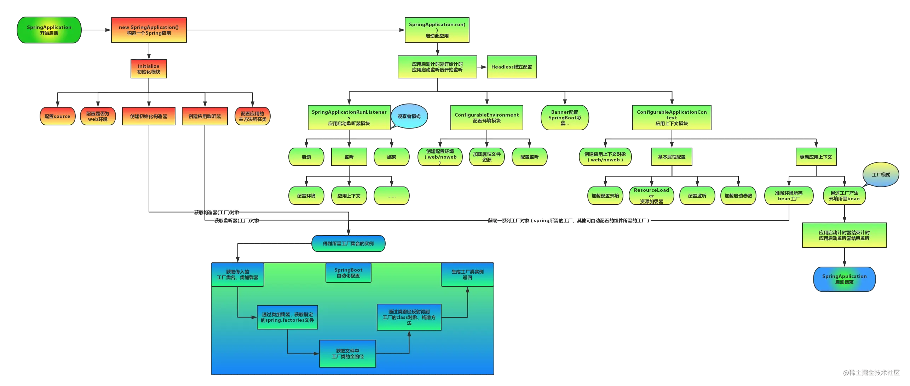
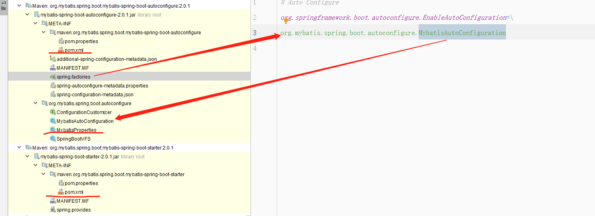

# SpringBoot启动流程

https://blog.csdn.net/weixin_64314555/article/details/122061857

 

# [Spring Boot 自动装配](https://www.cnblogs.com/ashleyboy/p/9425179.html)

## @Configuration和@Bean

使用注解@Configuration,向Spring表明这是一个配置类，类里的含有@Bean注解的方法都会被Spring调用，返回对象将会为Spring容器管理的Bean，注解@Bean可以给Bean指定一个名称，如@Bean(“xxxBean”),如不指定，则将会以该方法名作为Bean的名称

```java
@Configuration
public class TestConfiguration {

    @Bean
    public  EncodingConvert createUTF8EncodingConvert(){
        return  new UTF8EncodingConvert();
    }

    @Bean
    public  EncodingConvert createGBKEncodingConvert(){
        return  new GBKEncodingConvert();
    }
}
```

## 条件装配

Spting Boot提供一系列@ConditionalOnXXX的注解用于不同场景下的Bean装配。基本上通过注解名称就能明白用途，@ConditionalOnXXX注解可以作用于类或者方法上。

1.作用用于类上，需要和 @Configuration注解一起使用，决定该配置类是否生效

2.作用于方法上，需要和@Bean注解一起使用，判断该@Bean是否生成

### Bean条件装配

Spring Boot可以通过有没有指定Bean来决定是否配置当前Bean，

使用@ConditionalOnBean，在当前上下文中存在某个对象时，才会实例化当前Bean；

使用@ConditionalOnMissingBean，在当前上下文中不存在某个对象时，才会实例化当前Bean。

### Class条件装配

Class条件装配是按照某个类是否在Classpath中来判断是否需要配置Bean。

@ConditionalOnClass：表示classpath有指定的类时，配置才生效

@ConditionalOnMissingClass：表示当classpath中没有指定类，则配置生效

### Environment装配

Spring Boot可以根据Environment属性来决定是否实例化Bean，通过@ConditionalOnProperty注解来实现。根据注解属性name读取Spring Boot的Environment的变量包含的属性 ，再根据属性值与注解属性havingValue的值比较，判断否实例化Bean，如果没有指定注解属性havingValue，name只要environment属性值不为false，都会实例化Bean。MatchIfMissing=true，表示如果evironment没有包含xxx.xxx.enabled属性,也会实例化Bean，默认是false。

### 其他条件装配注解：

@ConditionalOnExpression ：当表达式为true时，才会实例化一个Bean，支持SpEL表达式

@ConditionalOnNotWebApplication：表示不是web应用，才会实例化一个Bean

## 自定义条件装配（实现Condition接口）

当Spring Boot提供的一些列@ConditionalOnXXX注解无法满足需求时，也可以手动构造一个Condition实现，使用注解@Conditional来引用Condition实现。

重写matches方法，返回true或false来判断是否装配


# EnableAutoConfiguration注解的工作原理

https://www.jianshu.com/p/464d04c36fb1


## 自定义starter

https://mp.weixin.qq.com/s/cy7ghkexpxDI9UUoZr2a3w

使用自动装配功能

1. 动态注入@Configuration配置类，注入Bean
2. 通过starter中的pom，动态引入jar

以mybatis-spring-boot-starter为例




```
mybatis-spring-boot-autoconfigure
mybatis-spring-boot-starter
```

一般在autoconfigure进行自动装配的配置，在starter pom里依赖autoconfigure，然后项目里依赖starter。

或者直接只使用一个starter完成自动装配功能，项目里依赖starter。


# 年轻人的第一个自定义 Spring Boot Starter！


[Spring Boot Starters 启动器](https://mp.weixin.qq.com/s?__biz=MzI3ODcxMzQzMw==&mid=2247484257&idx=1&sn=f06b553cb8695448f7a7e6d07aacae70&scene=21#wechat_redirect)，看完有了学习基础，我们再继续下面的自定义 Starter 实战！

## 一、自定义 Starter 必备组件

一个完整的 Spring Boot Starter 需要包含以下组件：

- 包含自动配置代码的自动配置模块；参考：[Spring Boot自动配置原理、实战](https://mp.weixin.qq.com/s?__biz=MzI3ODcxMzQzMw==&mid=2247484365&idx=1&sn=a4ab1d977d6b03bf122b4d596d7ee1ab&scene=21#wechat_redirect)。
- Starter模块提供对自动模块的依赖关系，和相关依赖库，以及任何需要用到的依赖。简而言之，就是，添加一个 Starter 就应该提供使用该 Starter 所需的一切；

## 二、创建一个自定义Starter

怎么创建 Spring Boot 项目就不说了，之前也分享过，参考：[年轻人的第一个 Spring Boot 应用！](https://mp.weixin.qq.com/s?__biz=MzI3ODcxMzQzMw==&mid=2247489852&idx=1&sn=e1772d9b7abd5a5dbbd0ffb172396c25&scene=21#wechat_redirect)。

这个自定义 Starter 就实现一个根据属性的值是否配置Bean。

#### 1、创建自动配置类

```
package cn.javastack.springboot.starter.config;

import cn.javastack.springboot.starter.service.TestService;
import org.springframework.boot.autoconfigure.condition.ConditionalOnProperty;
import org.springframework.context.annotation.Bean;
import org.springframework.context.annotation.Configuration;

@Configuration
@ConditionalOnProperty(prefix = "javastack.starter", name = "enabled", havingValue = "true")
public class TestServiceAutoConfiguration {

    @Bean
    public TestService testService() {
        return new TestService();
    }

}
```

这个自动配置类很简单，就是根据是否有 `javastack.starter.enabled=true` 这个参数的值再配置一个Bean。

`TestService`示例如下：

```
package cn.javastack.springboot.starter.service;

public class TestService {

    public String getServiceName() {
        return "Java技术栈";
    }

}
```

这个类就有一个方法 `getServiceName`，它就返回一个字符串：`Java技术栈`。

#### 2、允许自动配置

创建 `META-INF/spring.factories` 文件，添加这个允许自动配置的类。

```
org.springframework.boot.autoconfigure.EnableAutoConfiguration=\
cn.javastack.springboot.starter.config.TestServiceAutoConfiguration
```

## 三、测试这个自定义Starter

上面的自定义 Starter 项目建好后，可以来测试一下它是否生效了。

一般是把它打成 jar 包上传到 Maven 仓库，供其他同事调用，这里我们本报打完包之后再引用它。

#### 1、添加依赖

新建一个 Spring Boot 测试项目，添加这个自定义 Starter 依赖，Maven 依赖如下：

```
<dependencies>
    <dependency>
        <groupId>cn.javastack</groupId>
        <artifactId>javastack-spring-boot-starter</artifactId>
        <version>1.0</version>
        <scope>compile</scope>
    </dependency>
</dependencies>
```

#### 2、添加测试方法

```
package cn.javastack.springboot.starter.sample;

import cn.javastack.springboot.starter.service.TestService;
import org.springframework.boot.CommandLineRunner;
import org.springframework.boot.SpringApplication;
import org.springframework.boot.autoconfigure.SpringBootApplication;
import org.springframework.context.annotation.Bean;

/**
 * 微信公众号：Java技术栈
 */
@SpringBootApplication
public class Application {

    public static void main(String[] args) {
        SpringApplication.run(Application.class);
    }

    @Bean
    public CommandLineRunner commandLineRunner(TestService testService) {
        return (args) -> {
            System.out.println(testService.getServiceName());
        };
    }

}
```

这个方法的作用是，项目启动后，调用 `TestService` 的实例方法，输出方法的值。

关于 `CommandLineRunner` 有不懂的可以看这篇文章：[Spring Boot Runner 启动器](https://mp.weixin.qq.com/s?__biz=MzI3ODcxMzQzMw==&mid=2247484366&idx=1&sn=7dc94038861fe9e10cdf132ffc83092f&scene=21#wechat_redirect)。

#### 3、开启配置

我们知道这个自定义 Starter 中需要有 `javastack.starter.enabled=true` 这个参数的值的，所以我们在 `application.yml` 配置文件中添加这个配置：

```
javastack:
  starter:
    enabled: true
```

#### 4、运行测试

运行 Application 类的 main 方法，最后会输出结果：Java技术栈。

当我们把配置改为：

```
javastack:
  starter:
    enabled: false
```

此时，运行报错，因为没有这个实例啊，自动配置类只有为 true 时才会配置。

## 四、总结

本章栈长简单演示了如何自定义一个 Spring Boot Starter，根据某个参数的值来决定是否自动配置，其实还可以根据是否有某个类、某个Bean……等，可以看下《[Spring Boot 最核心的 25 个注解](https://mp.weixin.qq.com/s?__biz=MzI3ODcxMzQzMw==&mid=2247488597&idx=1&sn=e3b44af93f36fce77fe69956c4e41251&scene=21#wechat_redirect)》这篇文章对应的 `ConditionOnXXX` 系列注解。

其实了解了 Spring Boot 自动配置的原理，自定义一个 Starter 并不难，你可以在这个实例基础上灵活扩展。

**本文完整的代码实例 Github 地址：**

> https://github.com/javastacks/spring-boot-best-practice

## 其他简单问题

https://blog.csdn.net/ThinkWon/article/details/104397299