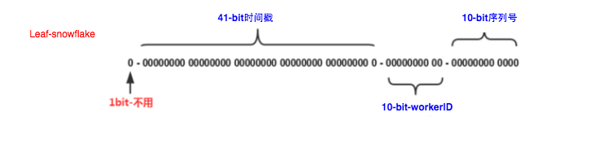

# [Leaf——美团点评分布式ID生成系统](https://tech.meituan.com/2017/04/21/mt-leaf.html)

## 背景

在复杂分布式系统中，往往需要对大量的数据和消息进行唯一标识。如在美团点评的金融、支付、餐饮、酒店、猫眼电影等产品的系统中，数据日渐增长，对数据分库分表后需要有一个唯一ID来标识一条数据或消息，数据库的自增ID显然不能满足需求；特别一点的如订单、骑手、优惠券也都需要有唯一ID做标识。此时一个能够生成全局唯一ID的系统是非常必要的。概括下来，那业务系统对ID号的要求有哪些呢？

1. 全局唯一性：不能出现重复的ID号，既然是唯一标识，这是最基本的要求。
2. 趋势递增：在MySQL InnoDB引擎中使用的是聚集索引，由于多数RDBMS使用B-tree的数据结构来存储索引数据，在主键的选择上面我们应该尽量使用有序的主键保证写入性能。
3. 单调递增：保证下一个ID一定大于上一个ID，例如事务版本号、IM增量消息、排序等特殊需求。
4. 信息安全：如果ID是连续的，恶意用户的扒取工作就非常容易做了，直接按照顺序下载指定URL即可；如果是订单号就更危险了，竞对可以直接知道我们一天的单量。所以在一些应用场景下，会需要ID无规则、不规则。

上述123对应三类不同的场景，3和4需求还是互斥的，无法使用同一个方案满足。

同时除了对ID号码自身的要求，业务还对ID号生成系统的可用性要求极高，想象一下，如果ID生成系统瘫痪，整个美团点评支付、优惠券发券、骑手派单等关键动作都无法执行，这就会带来一场灾难。

由此总结下一个ID生成系统应该做到如下几点：

1. 平均延迟和TP999延迟都要尽可能低；
2. 可用性5个9；
3. 高QPS。

## 常见方法介绍

### UUID

UUID(Universally Unique Identifier)的标准型式包含32个16进制数字，以连字号分为五段，形式为8-4-4-4-12的36个字符，示例：`550e8400-e29b-41d4-a716-446655440000`，到目前为止业界一共有5种方式生成UUID，详情见IETF发布的UUID规范 [A Universally Unique IDentifier (UUID) URN Namespace](http://www.ietf.org/rfc/rfc4122.txt)。

优点：

- 性能非常高：本地生成，没有网络消耗。

缺点：

- 不易于存储：UUID太长，16字节128位，通常以36长度的字符串表示，很多场景不适用。

- 信息不安全：基于MAC地址生成UUID的算法可能会造成MAC地址泄露，这个漏洞曾被用于寻找梅丽莎病毒的制作者位置。

- ID作为主键时在特定的环境会存在一些问题，比如做DB主键的场景下，UUID就非常不适用：

  ① MySQL官方有明确的建议主键要尽量越短越好[4]，36个字符长度的UUID不符合要求。

  > All indexes other than the clustered index are known as secondary indexes. In InnoDB, each record in a secondary index contains the primary key columns for the row, as well as the columns specified for the secondary index. InnoDB uses this primary key value to search for the row in the clustered index.*** If the primary key is long, the secondary indexes use more space, so it is advantageous to have a short primary key***.

② 对MySQL索引不利：如果作为数据库主键，在InnoDB引擎下，UUID的无序性可能会引起数据位置频繁变动，严重影响性能。

### 类snowflake方案

这种方案大致来说是一种以划分命名空间（UUID也算，由于比较常见，所以单独分析）来生成ID的一种算法，这种方案把64-bit分别划分成多段，分开来标示机器、时间等，比如在snowflake中的64-bit分别表示如下图（图片来自网络）所示：


image


41-bit的时间可以表示（1L<<41）/(1000L*3600*24*365)=69年的时间，10-bit机器可以分别表示1024台机器。如果我们对IDC划分有需求，还可以将10-bit分5-bit给IDC，分5-bit给工作机器。这样就可以表示32个IDC，每个IDC下可以有32台机器，可以根据自身需求定义。12个自增序列号可以表示2^12个ID，理论上snowflake方案的QPS约为409.6w/s，这种分配方式可以保证在任何一个IDC的任何一台机器在任意毫秒内生成的ID都是不同的。

这种方式的优缺点是：

优点：

- 毫秒数在高位，自增序列在低位，整个ID都是趋势递增的。
- 不依赖数据库等第三方系统，以服务的方式部署，稳定性更高，生成ID的性能也是非常高的。
- 可以根据自身业务特性分配bit位，非常灵活。

缺点：

- 强依赖机器时钟，如果机器上时钟回拨，会导致发号重复或者服务会处于不可用状态。

#### 应用举例Mongdb objectID

[MongoDB官方文档 ObjectID](https://docs.mongodb.com/manual/reference/method/ObjectId/#description)可以算作是和snowflake类似方法，通过“时间+机器码+pid+inc”共12个字节，通过4+3+2+3的方式最终标识成一个24长度的十六进制字符。

### 数据库生成

以MySQL举例，利用给字段设置`auto_increment_increment`和`auto_increment_offset`来保证ID自增，每次业务使用下列SQL读写MySQL得到ID号。

```sql
begin;
REPLACE INTO Tickets64 (stub) VALUES ('a');
SELECT LAST_INSERT_ID();
commit;
```


image


这种方案的优缺点如下：

优点：

- 非常简单，利用现有数据库系统的功能实现，成本小，有DBA专业维护。
- ID号单调自增，可以实现一些对ID有特殊要求的业务。

缺点：

- 强依赖DB，当DB异常时整个系统不可用，属于致命问题。配置主从复制可以尽可能的增加可用性，但是数据一致性在特殊情况下难以保证。主从切换时的不一致可能会导致重复发号。
- ID发号性能瓶颈限制在单台MySQL的读写性能。

对于MySQL性能问题，可用如下方案解决：在分布式系统中我们可以多部署几台机器，每台机器设置不同的初始值，且步长和机器数相等。比如有两台机器。设置步长step为2，TicketServer1的初始值为1（1，3，5，7，9，11…）、TicketServer2的初始值为2（2，4，6，8，10…）。这是Flickr团队在2010年撰文介绍的一种主键生成策略（[Ticket Servers: Distributed Unique Primary Keys on the Cheap ](http://code.flickr.net/2010/02/08/ticket-servers-distributed-unique-primary-keys-on-the-cheap/)）。如下所示，为了实现上述方案分别设置两台机器对应的参数，TicketServer1从1开始发号，TicketServer2从2开始发号，两台机器每次发号之后都递增2。

```sql
TicketServer1:
auto-increment-increment = 2
auto-increment-offset = 1

TicketServer2:
auto-increment-increment = 2
auto-increment-offset = 2
```

假设我们要部署N台机器，步长需设置为N，每台的初始值依次为0,1,2…N-1那么整个架构就变成了如下图所示：


image


这种架构貌似能够满足性能的需求，但有以下几个缺点：

- 系统水平扩展比较困难，比如定义好了步长和机器台数之后，如果要添加机器该怎么做？假设现在只有一台机器发号是1,2,3,4,5（步长是1），这个时候需要扩容机器一台。可以这样做：把第二台机器的初始值设置得比第一台超过很多，比如14（假设在扩容时间之内第一台不可能发到14），同时设置步长为2，那么这台机器下发的号码都是14以后的偶数。然后摘掉第一台，把ID值保留为奇数，比如7，然后修改第一台的步长为2。让它符合我们定义的号段标准，对于这个例子来说就是让第一台以后只能产生奇数。扩容方案看起来复杂吗？貌似还好，现在想象一下如果我们线上有100台机器，这个时候要扩容该怎么做？简直是噩梦。所以系统水平扩展方案复杂难以实现。
- ID没有了单调递增的特性，只能趋势递增，这个缺点对于一般业务需求不是很重要，可以容忍。
- 数据库压力还是很大，每次获取ID都得读写一次数据库，只能靠堆机器来提高性能。

## Leaf方案实现

Leaf这个名字是来自德国哲学家、数学家莱布尼茨的一句话： >There are no two identical leaves in the world > “世界上没有两片相同的树叶”

综合对比上述几种方案，每种方案都不完全符合我们的要求。所以Leaf分别在上述第二种和第三种方案上做了相应的优化，实现了Leaf-segment和Leaf-snowflake方案。

### Leaf-segment数据库方案

第一种Leaf-segment方案，在使用数据库的方案上，做了如下改变： - 原方案每次获取ID都得读写一次数据库，造成数据库压力大。改为利用proxy server批量获取，每次获取一个segment(step决定大小)号段的值。用完之后再去数据库获取新的号段，可以大大的减轻数据库的压力。 - 各个业务不同的发号需求用biz_tag字段来区分，每个biz-tag的ID获取相互隔离，互不影响。如果以后有性能需求需要对数据库扩容，不需要上述描述的复杂的扩容操作，只需要对biz_tag分库分表就行。

数据库表设计如下：

```sql
+-------------+--------------+------+-----+-------------------+-----------------------------+
| Field       | Type         | Null | Key | Default           | Extra                       |
+-------------+--------------+------+-----+-------------------+-----------------------------+
| biz_tag     | varchar(128) | NO   | PRI |                   |                             |
| max_id      | bigint(20)   | NO   |     | 1                 |                             |
| step        | int(11)      | NO   |     | NULL              |                             |
| desc        | varchar(256) | YES  |     | NULL              |                             |
| update_time | timestamp    | NO   |     | CURRENT_TIMESTAMP | on update CURRENT_TIMESTAMP |
+-------------+--------------+------+-----+-------------------+-----------------------------+
```

重要字段说明：biz_tag用来区分业务，max_id表示该biz_tag目前所被分配的ID号段的最大值，step表示每次分配的号段长度。原来获取ID每次都需要写数据库，现在只需要把step设置得足够大，比如1000。那么只有当1000个号被消耗完了之后才会去重新读写一次数据库。读写数据库的频率从1减小到了1/step，大致架构如下图所示：


image


test_tag在第一台Leaf机器上是1~1000的号段，当这个号段用完时，会去加载另一个长度为step=1000的号段，假设另外两台号段都没有更新，这个时候第一台机器新加载的号段就应该是3001~4000。同时数据库对应的biz_tag这条数据的max_id会从3000被更新成4000，更新号段的SQL语句如下：

```sql
Begin
UPDATE table SET max_id=max_id+step WHERE biz_tag=xxx
SELECT tag, max_id, step FROM table WHERE biz_tag=xxx
Commit
```

这种模式有以下优缺点：

优点：

- Leaf服务可以很方便的线性扩展，性能完全能够支撑大多数业务场景。
- ID号码是趋势递增的8byte的64位数字，满足上述数据库存储的主键要求。
- 容灾性高：Leaf服务内部有号段缓存，即使DB宕机，短时间内Leaf仍能正常对外提供服务。
- 可以自定义max_id的大小，非常方便业务从原有的ID方式上迁移过来。

缺点：

- ID号码不够随机，能够泄露发号数量的信息，不太安全。
- TP999数据波动大，当号段使用完之后还是会hang在更新数据库的I/O上，tg999数据会出现偶尔的尖刺。
- DB宕机会造成整个系统不可用。

### 双buffer优化

对于第二个缺点，Leaf-segment做了一些优化，简单的说就是：

Leaf 取号段的时机是在号段消耗完的时候进行的，也就意味着号段临界点的ID下发时间取决于下一次从DB取回号段的时间，并且在这期间进来的请求也会因为DB号段没有取回来，导致线程阻塞。如果请求DB的网络和DB的性能稳定，这种情况对系统的影响是不大的，但是假如取DB的时候网络发生抖动，或者DB发生慢查询就会导致整个系统的响应时间变慢。

为此，我们希望DB取号段的过程能够做到无阻塞，不需要在DB取号段的时候阻塞请求线程，即当号段消费到某个点时就异步的把下一个号段加载到内存中。而不需要等到号段用尽的时候才去更新号段。这样做就可以很大程度上的降低系统的TP999指标。详细实现如下图所示：


image


采用双buffer的方式，Leaf服务内部有两个号段缓存区segment。当前号段已下发10%时，如果下一个号段未更新，则另启一个更新线程去更新下一个号段。当前号段全部下发完后，如果下个号段准备好了则切换到下个号段为当前segment接着下发，循环往复。

- 每个biz-tag都有消费速度监控，通常推荐segment长度设置为服务高峰期发号QPS的600倍（10分钟），这样即使DB宕机，Leaf仍能持续发号10-20分钟不受影响。
- 每次请求来临时都会判断下个号段的状态，从而更新此号段，所以偶尔的网络抖动不会影响下个号段的更新。

### Leaf高可用容灾

对于第三点“DB可用性”问题，我们目前采用一主两从的方式，同时分机房部署，Master和Slave之间采用**半同步方式[5]**同步数据。同时使用公司Atlas数据库中间件(已开源，改名为[DBProxy](http://tech.meituan.com/dbproxy-introduction.html))做主从切换。当然这种方案在一些情况会退化成异步模式，甚至在**非常极端**情况下仍然会造成数据不一致的情况，但是出现的概率非常小。如果你的系统要保证100%的数据强一致，可以选择使用“类Paxos算法”实现的强一致MySQL方案，如MySQL 5.7前段时间刚刚GA的[MySQL Group Replication](https://dev.mysql.com/doc/refman/5.7/en/group-replication.html)。但是运维成本和精力都会相应的增加，根据实际情况选型即可。


image


同时Leaf服务分IDC部署，内部的服务化框架是“MTthrift RPC”。服务调用的时候，根据负载均衡算法会优先调用同机房的Leaf服务。在该IDC内Leaf服务不可用的时候才会选择其他机房的Leaf服务。同时服务治理平台OCTO还提供了针对服务的过载保护、一键截流、动态流量分配等对服务的保护措施。

## Leaf-snowflake方案

Leaf-segment方案可以生成趋势递增的ID，同时ID号是可计算的，不适用于订单ID生成场景，比如竞对在两天中午12点分别下单，通过订单id号相减就能大致计算出公司一天的订单量，这个是不能忍受的。面对这一问题，我们提供了 Leaf-snowflake方案。



image


Leaf-snowflake方案完全沿用snowflake方案的bit位设计，即是“1+41+10+12”的方式组装ID号。对于workerID的分配，当服务集群数量较小的情况下，完全可以手动配置。Leaf服务规模较大，动手配置成本太高。所以使用Zookeeper持久顺序节点的特性自动对snowflake节点配置wokerID。Leaf-snowflake是按照下面几个步骤启动的：

1. 启动Leaf-snowflake服务，连接Zookeeper，在leaf_forever父节点下检查自己是否已经注册过（是否有该顺序子节点）。
2. 如果有注册过直接取回自己的workerID（zk顺序节点生成的int类型ID号），启动服务。
3. 如果没有注册过，就在该父节点下面创建一个持久顺序节点，创建成功后取回顺序号当做自己的workerID号，启动服务。


image


### 弱依赖ZooKeeper

除了每次会去ZK拿数据以外，也会在本机文件系统上缓存一个workerID文件。当ZooKeeper出现问题，恰好机器出现问题需要重启时，能保证服务能够正常启动。这样做到了对三方组件的弱依赖。一定程度上提高了SLA

### 解决时钟问题

因为这种方案依赖时间，如果机器的时钟发生了回拨，那么就会有可能生成重复的ID号，需要解决时钟回退的问题。


image


参见上图整个启动流程图，服务启动时首先检查自己是否写过ZooKeeper leaf_forever节点：

1. 若写过，则用自身系统时间与leaf_forever/${self}节点记录时间做比较，若小于leaf_forever/${self}时间则认为机器时间发生了大步长回拨，服务启动失败并报警。
2. 若未写过，证明是新服务节点，直接创建持久节点leaf_forever/${self}并写入自身系统时间，接下来综合对比其余Leaf节点的系统时间来判断自身系统时间是否准确，具体做法是取leaf_temporary下的所有临时节点(所有运行中的Leaf-snowflake节点)的服务IP：Port，然后通过RPC请求得到所有节点的系统时间，计算sum(time)/nodeSize。
3. 若abs( 系统时间-sum(time)/nodeSize ) < 阈值，认为当前系统时间准确，正常启动服务，同时写临时节点leaf_temporary/${self} 维持租约。
4. 否则认为本机系统时间发生大步长偏移，启动失败并报警。
5. 每隔一段时间(3s)上报自身系统时间写入leaf_forever/${self}。

由于强依赖时钟，对时间的要求比较敏感，在机器工作时NTP同步也会造成秒级别的回退，建议可以直接关闭NTP同步。要么在时钟回拨的时候直接不提供服务直接返回ERROR_CODE，等时钟追上即可。**或者做一层重试，然后上报报警系统，更或者是发现有时钟回拨之后自动摘除本身节点并报警**，如下：

```java
 //发生了回拨，此刻时间小于上次发号时间
 if (timestamp < lastTimestamp) {
  			  
            long offset = lastTimestamp - timestamp;
            if (offset <= 5) {
                try {
                	//时间偏差大小小于5ms，则等待两倍时间
                    wait(offset << 1);//wait
                    timestamp = timeGen();
                    if (timestamp < lastTimestamp) {
                       //还是小于，抛异常并上报
                        throwClockBackwardsEx(timestamp);
                      }    
                } catch (InterruptedException e) {  
                   throw  e;
                }
            } else {
                //throw
                throwClockBackwardsEx(timestamp);
            }
        }
 //分配ID       
        
```

**从上线情况来看，在2017年闰秒出现那一次出现过部分机器回拨，由于Leaf-snowflake的策略保证，成功避免了对业务造成的影响。**

## Leaf现状

Leaf在美团点评公司内部服务包含金融、支付交易、餐饮、外卖、酒店旅游、猫眼电影等众多业务线。目前Leaf的性能在4C8G的机器上QPS能压测到近5w/s，TP999 1ms，已经能够满足大部分的业务的需求。每天提供亿数量级的调用量，作为公司内部公共的基础技术设施，必须保证高SLA和高性能的服务，我们目前还仅仅达到了及格线，还有很多提高的空间。

## 作者简介

照东，美团点评基础架构团队成员，主要参与[美团大型分布式链路跟踪系统Mtrace](http://tech.meituan.com/mt-mtrace.html)和美团点评分布式ID生成系统Leaf的开发工作。曾就职于阿里巴巴，2016年7月加入美团。


# 百度开源的分布式唯一ID生成器UidGenerator，解决了时钟回拨问题

https://mp.weixin.qq.com/s/FbIuI4McQ__siStSg74aOA

UidGenerator是百度开源的Java语言实现，基于Snowflake算法的唯一ID生成器。而且，它非常适合虚拟环境，比如：Docker。另外，它通过消费未来时间克服了雪花算法的并发限制。UidGenerator提前生成ID并缓存在RingBuffer中。 压测结果显示，单个实例的QPS能超过6000,000。

依赖环境：

- JDK8+
- MySQL（用于分配WorkerId）

### snowflake

由下图可知，雪花算法的几个核心组成部分：

- 1位sign标识位；
- 41位时间戳；
- 10位workId（数据中心+工作机器，可以其他组成方式）；
- 12位自增序列；


但是百度对这些组成部分稍微调整了一下：


由上图可知，UidGenerator的时间部分只有28位，这就意味着UidGenerator默认只能承受8.5年（2^28-1/86400/365）。当然，根据你业务的需求，UidGenerator可以适当调整delta seconds、worker node id和sequence占用位数。

接下来分析百度UidGenerator的实现。需要说明的是UidGenerator有两种方式提供：和DefaultUidGenerator和CachedUidGenerator。我们先分析比较容易理解的DefaultUidGenerator。

### DefaultUidGenerator

#### delta seconds

这个值是指当前时间与epoch时间的时间差，且单位为秒。epoch时间就是指集成UidGenerator生成分布式ID服务第一次上线的时间，可配置，也**一定**要根据你的上线时间进行配置，因为默认的epoch时间可是2016-09-20，不配置的话，会浪费好几年的可用时间。

#### worker id

接下来说一下UidGenerator是如何给worker id赋值的，搭建UidGenerator的话，需要创建一个表：

```sql
DROP TABLE
IF
	EXISTS WORKER_NODE;
CREATE TABLE WORKER_NODE (
	ID BIGINT NOT NULL AUTO_INCREMENT PRIMARY KEY,
	HOST_NAME VARCHAR ( 64 ) NOT NULL COMMENT 'host name',
	PORT VARCHAR ( 64 ) NOT NULL COMMENT 'port',
	TYPE INT NOT NULL COMMENT 'node type: ACTUAL or CONTAINER',
	LAUNCH_DATE DATE NOT NULL COMMENT 'launch date',
	MODIFIED DATETIME NOT NULL COMMENT 'modified time',
	CREATED DATEIMTE NOT NULL COMMENT 'created time' 
) COMMENT = 'DB WorkerID Assigner for UID Generator',
ENGINE = INNODB;
```

UidGenerator会在集成用它生成分布式ID的实例启动的时候，往这个表中插入一行数据，得到的id值就是准备赋给workerId的值。由于workerId默认22位，那么，集成UidGenerator生成分布式ID的所有实例重启次数是不允许超过4194303次（即2^22-1），否则会抛出异常。

这段逻辑的核心代码来自DisposableWorkerIdAssigner.java中，当然，你也可以实现WorkerIdAssigner.java接口，自定义生成workerId。

#### sequence

核心代码如下，几个实现的关键点：

- **synchronized**保证线程安全；
- 如果时间有任何的回拨，那么**直接**抛出异常；
- 如果当前时间和上一次是同一秒时间，那么sequence自增。如果同一秒内自增值超过2^13-1，那么就会自旋等待下一秒（getNextSecond）；
- 如果是新的一秒，那么sequence重新从0开始；


#### 总结

通过DefaultUidGenerator的实现可知，它对时钟回拨的处理比较简单粗暴。另外如果使用UidGenerator的DefaultUidGenerator方式生成分布式ID，一定要根据你的业务的情况和特点，调整各个字段占用的位数：

```xml
<property name="timeBits" value="28"/><property name="workerBits" value="22"/>
<property name="seqBits" value="13"/>
<property name="epochStr" value="2016-09-20"/>
```

### CachedUidGenerator

CachedUidGenerator是UidGenerator的重要改进实现。它的核心利用了RingBuffer，如下图所示，它本质上是一个数组，数组中每个项被称为slot。UidGenerator设计了两个RingBuffer，一个保存唯一ID，一个保存flag。RingBuffer的尺寸是2^n，n必须是正整数：


#### RingBuffer Of Flag

其中，保存flag这个RingBuffer的每个slot的值都是0或者1，0是CANPUTFLAG的标志位，1是CANTAKEFLAG的标识位。每个slot的状态要么是CANPUT，要么是CANTAKE。以某个slot的值为例，初始值为0，即CANPUT。接下来会初始化填满这个RingBuffer，这时候这个slot的值就是1，即CANTAKE。等获取分布式ID时取到这个slot的值后，这个slot的值又变为0，以此类推。

#### RingBuffer Of UID

保存唯一ID的RingBuffer有两个指针，Tail指针和Cursor指针。

1. Tail指针表示最后一个生成的唯一ID。如果这个指针追上了Cursor指针，意味着RingBuffer已经满了。这时候，不允许再继续生成ID了。用户可以通过属性rejectedPutBufferHandler指定处理这种情况的策略。
2. Cursor指针表示最后一个已经给消费的唯一ID。如果Cursor指针追上了Tail指针，意味着RingBuffer已经空了。这时候，不允许再继续获取ID了。用户可以通过属性rejectedTakeBufferHandler指定处理这种异常情况的策略。

另外，如果你想增强RingBuffer提升它的吞吐能力，那么需要配置一个更大的boostPower值：

```xml
<!-- RingBuffer size扩容参数, 可提高UID生成能力.即每秒产生ID数上限能力 -->
<!-- 默认:3，原bufferSize=2^13, 扩容后bufferSize = 2^13 << 3 = 65536 -->
<property name="boostPower" value="3"/>
```

CachedUidGenerator的理论讲完后，接下来就是它具体是如何实现的了，我们首先看它的申明，它是实现了DefaultUidGenerator，所以，它事实上就是对DefaultUidGenerator的增强：

```java
public class CachedUidGenerator extends DefaultUidGenerator implements DisposableBean {   ... ...}
```

#### worker id

CachedUidGenerator的workerId实现继承自它的父类DefaultUidGenerator，即实例启动时往表WORKER_NODE插入数据后得到的自增ID值。

接下来深入解读CachedUidGenerator的核心操作，即对RingBuffer的操作，包括初始化、取分布式唯一ID、填充分布式唯一ID等。

#### 初始化

CachedUidGenerator在初始化时除了给workerId赋值，还会初始化RingBuffer。这个过程主要工作有：

1. 根据**boostPower**的值确定RingBuffer的size；
2. 构造RingBuffer，默认**paddingFactor**为50。这个值的意思是当RingBuffer中剩余可用ID数量少于50%的时候，就会触发一个异步线程往RingBuffer中填充新的唯一ID（调用BufferPaddingExecutor中的paddingBuffer()方法，这个线程中会有一个标志位**running**控制并发问题），直到填满为止；
3. 判断是否配置了属性**scheduleInterval**，这是另外一种RingBuffer填充机制, 在Schedule线程中, 周期性检查填充。默认:不配置, 即不使用Schedule线程. 如需使用, 请指定Schedule线程时间间隔, 单位:秒；
4. 初始化Put操作拒绝策略，对应属性**rejectedPutBufferHandler**。即当RingBuffer已满, 无法继续填充时的操作策略。默认无需指定, 将丢弃Put操作, 仅日志记录. 如有特殊需求, 请实现RejectedPutBufferHandler接口(支持Lambda表达式)；
5. 初始化Take操作拒绝策略，对应属性**rejectedTakeBufferHandler**。即当环已空, 无法继续获取时的操作策略。默认无需指定, 将记录日志, 并抛出UidGenerateException异常. 如有特殊需求, 请实现RejectedTakeBufferHandler接口；
6. 初始化填满RingBuffer中所有slot（即塞满唯一ID，这一步和第2步骤一样都是调用BufferPaddingExecutor中的paddingBuffer()方法）；
7. 开启buffer补丁线程（前提是配置了属性scheduleInterval），原理就是利用ScheduledExecutorService的scheduleWithFixedDelay()方法。

说明：第二步的异步线程实现非常重要，也是UidGenerator解决时钟回拨的关键：在满足填充新的唯一ID条件时，通过时间值递增得到新的时间值（lastSecond.incrementAndGet()），而不是System.currentTimeMillis()这种方式，而lastSecond是AtomicLong类型，所以能保证线程安全问题。

#### 取值

RingBuffer初始化有值后，接下来的取值就简单了。不过，由于分布式ID都保存在RingBuffer中，取值过程中就会有一些逻辑判断：

1. 如果剩余可用ID百分比低于paddingFactor参数指定值，就会异步生成若干个ID集合，直到将RingBuffer填满。
2. 如果获取值的位置追上了tail指针，就会执行Task操作的拒绝策略。
3. 获取slot中的分布式ID。
4. 将这个slot的标志位只为CANPUTFLAG。

### 总结

#### 时钟回拨的问题解决

通过上面对UidGenerator的分析可知，CachedUidGenerator方式主要通过采取如下一些措施和方案规避了时钟回拨问题和增强唯一性：

- **自增列**：UidGenerator的workerId在实例每次重启时初始化，且就是数据库的自增ID，从而完美的实现每个实例获取到的workerId不会有任何冲突。
- **RingBuffer**：UidGenerator不再在每次取ID时都实时计算分布式ID，而是利用RingBuffer数据结构预先生成若干个分布式ID并保存。
- **时间递增**：传统的雪花算法实现都是通过System.currentTimeMillis()来获取时间并与上一次时间进行比较，这样的实现严重依赖服务器的时间。而`UidGenerator的时间类型是AtomicLong`，且通过incrementAndGet()方法获取下一次的时间，从而脱离了对服务器时间的依赖，也就`不会有时钟回拨的问题`（这种做法也有一个**小问题**，即分布式ID中的时间信息可能并不是这个ID真正产生的时间点，例如：获取的某分布式ID的值为3200169789968523265，它的反解析结果为{"timestamp":"2019-05-02 23:26:39","workerId":"21","sequence":"1"}，但是这个ID可能并不是在"2019-05-02 23:26:39"这个时间产生的）。