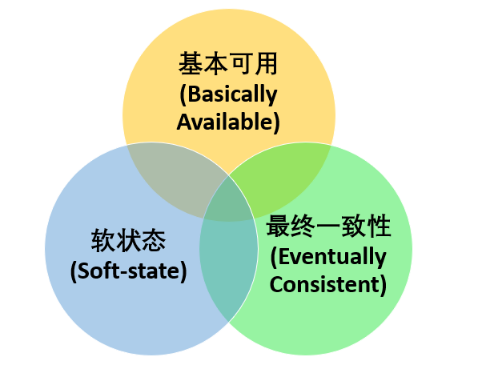

## CAP和BASE理论

### CAP 理论

> CAP 原则又称 CAP 定理，指的是在一个分布式系统中， Consistency（一致性）、 Availability（可用性）、Partition tolerance（分区容错性），三者不可得兼。

一致性（C）：

> 在分布式系统中的所有数据备份，在同一时刻是否同样的值。（等同于所有节点访问同一份最新的数据副本）

可用性（A）：

> 在集群中一部分节点故障后，集群整体是否还能响应客户端的读写请求。（对数据更新具备高可用性）

分区容错性（P）：

> 以实际效果而言，分区相当于对通信的时限要求。系统如果不能在时限内达成数据一致性，就意味着发生了分区的情况，必须就当前操作在 C 和 A 之间做出选择。

#### Eureka和Zookeeper分别满足什么

常见的可以作为注册中心的组件有：ZooKeeper、Eureka、Nacos...。

1. **ZooKeeper 保证的是 CP。** 任何时刻对 ZooKeeper 的读请求都能得到一致性的结果，但是， ZooKeeper 不保证每次请求的可用性比如在 Leader 选举过程中或者半数以上的机器不可用的时候服务就是不可用的。
2. **Eureka 保证的则是 AP。** Eureka 在设计的时候就是优先保证 A （可用性）。在 Eureka 中不存在什么 Leader 节点，每个节点都是一样的、平等的。因此 Eureka 不会像 ZooKeeper 那样出现选举过程中或者半数以上的机器不可用的时候服务就是不可用的情况。 Eureka 保证即使大部分节点挂掉也不会影响正常提供服务，只要有一个节点是可用的就行了。只不过这个节点上的数据可能并不是最新的。
3. **Nacos 不仅支持 CP 也支持 AP。**

### BASE 理论

**BASE** 是 **Basically Available（基本可用）** 、**Soft-state（软状态）** 和 **Eventually Consistent（最终一致性）** 三个短语的缩写。BASE 理论是对 CAP 中一致性 C 和可用性 A 权衡的结果，其来源于对大规模互联网系统分布式实践的总结，是基于 CAP 定理逐步演化而来的，它大大降低了我们对系统的要求。

#### BASE 理论的核心思想

即使无法做到强一致性，但每个应用都可以根据自身业务特点，采用适当的方式来使系统达到最终一致性。

> 也就是牺牲数据的一致性来满足系统的高可用性，系统中一部分数据不可用或者不一致时，仍需要保持系统整体“主要可用”。

**BASE 理论本质上是对 CAP 的延伸和补充，更具体地说，是对 CAP 中 AP 方案的一个补充。**

### 总结

**ACID 是数据库事务完整性的理论，CAP 是分布式系统设计理论，BASE 是 CAP 理论中 AP 方案的延伸。**

## Basic Paxos 算法

https://javaguide.cn/distributed-system/theorem&algorithm&protocol/paxos-algorithm.html#%E8%83%8C%E6%99%AF

- **Basic Paxos 算法** ： 描述的是多节点之间如何就某个值(提案 Value)达成共识。
- **Multi-Paxos 思想** ： 描述的是执行多个 Basic Paxos 实例，就一系列值达成共识。Multi-Paxos 说白了就是执行多次 Basic Paxos ，核心还是 Basic Paxos 。

### Basic Paxos 中 3 个重要的角色

1. **提议者（Proposer）**：也可以叫做协调者（coordinator），提议者负责接受客户端发起的提议，然后尝试让接受者接受该提议，同时保证即使多个提议者的提议之间产生了冲突，那么算法都能进行下去；
2. **接受者（Acceptor）**：也可以叫做投票员（voter），负责对提议者的提议投票，同时需要记住自己的投票历史；
3. **学习者（Learner）**：如果有超过半数接受者就某个提议达成了共识，那么学习者就需要接受这个提议，并就该提议作出运算，然后将运算结果返回给客户端。

## Raft 算法

https://javaguide.cn/distributed-system/theorem&algorithm&protocol/raft-algorithm.html#_2-%E5%9F%BA%E7%A1%80

### 2.1 节点类型

一个 Raft 集群包括若干服务器，以典型的 5 服务器集群举例。在任意的时间，每个服务器一定会处于以下三个状态中的一个：

- `Leader`：负责发起心跳，响应客户端，创建日志，同步日志。
- `Candidate`：Leader 选举过程中的临时角色，由 Follower 转化而来，发起投票参与竞选。
- `Follower`：接受 Leader 的心跳和日志同步数据，投票给 Candidate。

在正常的情况下，只有一个服务器是 Leader，剩下的服务器是 Follower。Follower 是被动的，它们不会发送任何请求，只是响应来自 Leader 和 Candidate 的请求。

### paxos和Raft对比

paxos共识协议是后面所有一致性协议的基础，据说Google Chubby的作者Mike Burrows说过：**这个世界上只有一种一致性算法，那就是Paxos，其它的算法都是残次品**。raft协议在paxos协议的基础上，抽象出了一个共识协议需要做的以下几个事情：

- Leader选举（Leader Election）
- 日志同步（Log Replication）
- Commit Index推进（Advance Commit Index）
- 崩溃恢复（Crash Recovery）
- 成员变更（Membership Change）