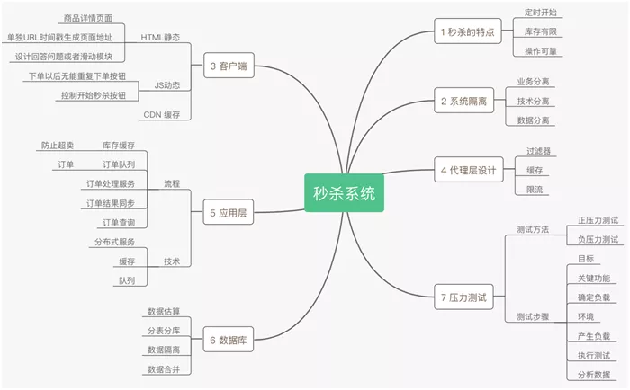
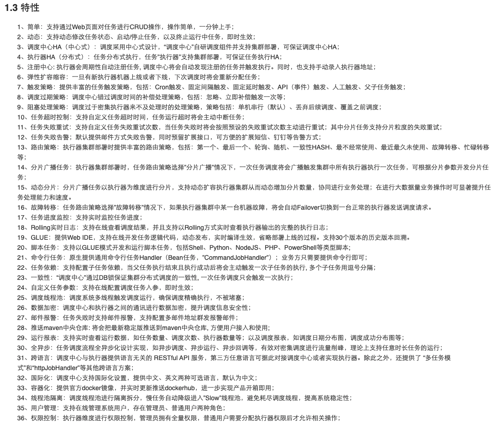
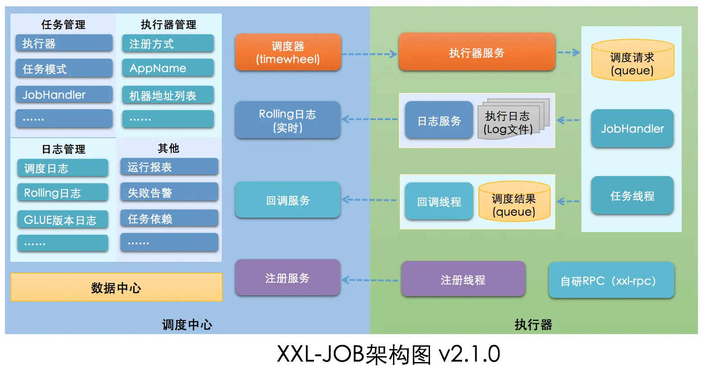

2. HTTP 301 302有啥区别？设计一个短链接算法；md5长度是多少？

   https://www.cnblogs.com/zhuzhenwei918/p/7582620.html

   301 永久重定向   nginx  ->rewrite	.比较常用的场景是使用域名跳转。

   302 临时重定向   nginx->redirect    比如未登陆的用户访问用户中心重定向到登录页面。

   共同点的，就是用户都可以看到url替换为了一个新的，然后发出请求。

3.  场景题：设计一个im系统包括群聊单聊

4.  场景题：设计数据库连接池

5.  场景题：秒杀场景的设计

 #### 如何保证调用服务的速率是均匀的

  漏桶算法和令牌桶算法

  #### 怎么保证服务的稳定性，当一部分服务有问题时，怎么保证服务能正常运行

  https://lework.github.io/2019/12/03/system-stability/

  常见的一些稳定性策略

  ### 1. 限流

  第一点是防止系统高负荷运行，第二点是有效利用服务器资源。 常见限流的算法包括漏桶算法和令牌桶算法。

  ### 2. 降级

  第一个是保障服务器基本可用，第二个是保障服务的核心服务可用。 以社区案例为例，即便是 My SQL 挂掉，也要能够保证社区为用户提供基本的可读服务。 一般降级的每个策略都是针对一个场景，预想特定场景下需要要解决什么问题；然后再梳理在这个场景下需要保留哪些核心基本服务；最后才选定技术方案，系统化的进行实现

  ### 3. 隔离

  隔离目的非常简单，要限制住不稳定因素导致的风险，停止传播。 如秒杀场景一个高并发的场景，可能带来的问题也比较多，在高并发场景下秒杀的时候，需要和一些正常的业务区分开来。 慢 SQL 隔离，一个资源隔离。一条慢 SQL 会导致整个服务不稳定。每请求一次线程，慢 SQL 会一直耗着当前线程，所以资源占用非常大。

  ### 4. 超时

  合理的设置业务的超时时间，可有效避免因第三方原因导致的接口等待时间过久。 设置超时时间的大体思路：第一步，识别业务需要的服务响应时间。比如，需要 100 毫秒去响应数据，之后统计业务里面可能需要调多少服务。第二步，统计服务日常的响应时间。第三步，分清主次，即分出哪些是核心服务。因为核心服务一旦失败，整个链路便不可用，所以可以对核心服务的时间设置的宽松一些。 设置完超时之后需要验证。

  ### 5. 集群

  集群的目的是为了解决单点的问题。集群的形式主要有主备，即同时只有一台机器提供整个服务，可以有一台或者多台提供备份，备份不仅要包含代码层面，整个服务运行所依赖的资源都要有备份。另外一个形式是主从。主是提供一个完整的服务，从是提供部分的服务。还有一种是多主，多主指的是每一台机器的决策是对等的，都会对外提供一些服务。

####  41.秒杀场景一般有什么特点？设计秒杀场景需要重点考虑哪些点？

思考顺序如下，客户端→代理层→应用层→数据库→压力测试：

- 客户端 90% 静态 HTML+10% 动态 JS；配合 CDN 做好缓存工作。
- 接入层专注于过滤和限流。
- 应用层利用缓存+队列+分布式处理好订单。
- 做好数据的预估，隔离，合并。
- 上线之前记得进行压力测试。

####  42.在秒杀场景中对于超时订单如何能做到取消？

https://blog.csdn.net/zzl429556205/article/details/103833319

####  43.秒杀中如何防止超卖？减库存和支付如何保证数据一致性？如何尽量提升秒杀的效率？

https://www.zhihu.com/question/54895548 如何设计秒杀系统？

https://www.infoq.cn/article/ypqschsrdsk8bv5nhny4

####  44.线上优化一些项目的请求慢的接口？用什么方式去优化？分别从哪几个维度去考虑？如何保证自己的优化方向正确并有效，有哪些注意的点？

https://tech.meituan.com/2016/12/02/performance-tunning.html  美团

https://blog.csdn.net/lilizhou2008/article/details/106935052

1、针对 HTTP 请求的优化，是否能升级 HTTP 1.1 到 HTTP2 ？

2、针对带宽瓶颈的升级？

3、是否做了 DNS 缓存？

4、可以通过 LBS 等负载功能提高集群的吞吐量以充分利用单机的性能？

5、是否可以添加缓存？

6、是否热点数据不均衡？

7、是否有慢 SQL ？

8、是否可以通过分库分表解决？

9、是否可以通过读写分离解决？

10、是否代码上面可以优化？

11、是否可以使用无锁编程？

12、是否可以调整 GC 策略？

分布式系统查看调用链路：定位最慢的服务，再通过对服务进行工具监控，比如arthas进行trace 命令进行方法的监控，推测最慢的函数。继续再 trace 耗时最多的子函数。

####  45.列举一些自己线上出现的故障，并详细说解决的思路和处理过程，并说明这样处理的思考和分析

####   46.有线上jvm调优经验吗？看具体要检查哪些指标？具体优化的方向和顺序是怎样的？如何保证优化的有效性？

####   47.列举一个你印象最深的一个问题，你是如何处理和解决的？

####  48.详细说说你参与最多一个项目中，遇到的一个最大的挑战？具体难点在哪里？你是如何一步步思考并处理的？你从这一挑战中得到哪些收获？

####  49.你对自己定位是什么？你对自己的职业规划是什么？

## 设计一个任务调度系统

### 参考xxl-job特性

https://javaguide.cn/system-design/schedule-task.html#xxl-jobxx

### 架构

