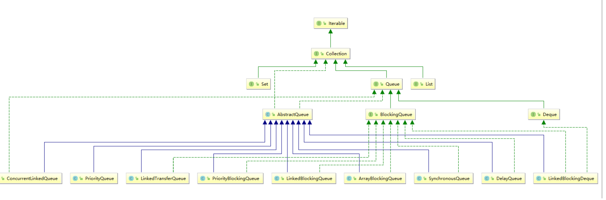

## 多线程与高并发

#### 什么是JUC

JUC（java.util.concurrent）是在并发编程中使用的工具类

## Java的锁


> 锁的讲解见：
>
> https://tech.meituan.com/2018/11/15/java-lock.html

### 互斥锁和自旋锁

最底层的两种就是会「互斥锁和自旋锁」，有很多高级的锁都是基于它们实现的

- **互斥锁**加锁失败后，线程会**释放 CPU** ，给其他线程；
- **自旋锁**加锁失败后，线程会**忙等待**，直到它拿到锁；

**对于互斥锁加锁失败而阻塞的现象，是由操作系统内核实现的**。当加锁失败时，内核会将线程置为「睡眠」状态，等到锁被释放后，内核会在合适的时机唤醒线程，当这个线程成功获取到锁后，于是就可以继续执行。（会有**两次线程上下文切换的成本**）

自旋锁是通过 CPU 提供的 `CAS` 函数（*Compare And Set*），在「用户态」完成加锁和解锁操作，不会主动产生线程上下文切换，所以相比互斥锁来说，会快一些，开销也小一些。

CAS 函数就把这两个步骤合并成一条硬件级指令，形成**原子指令**，这样就保证了这两个步骤是不可分割的，要么一次性执行完两个步骤，要么两个步骤都不执行。

 • 自旋锁（spinlock）：是指当一个线程在获取锁的时候，如果锁已经被其它线程获取，那么该线程将循环等待，然后不断的判断锁是否能够被成功获取，直到获取到锁才会退出循环。

 • 对于互斥锁，如果资源已经被占用，资源申请者只能进入睡眠状态。但是自旋锁不会引起调用者睡眠，如果自旋锁已经被别的执行单元保持，调用者就一直循环在那里看是否该自旋锁的保持者已经释放了锁

自旋等待的时间必须要有一定的限度，如果自旋超过了限定次数（默认是10次，可以使用-XX:PreBlockSpin来更改）没有成功获得锁，就应当挂起线程。

自旋锁在JDK1.4.2中引入，使用-XX:+UseSpinning来开启。JDK 6中变为默认开启，并且引入了自适应的自旋锁（适应性自旋锁）。

自适应意味着自旋的时间（次数）不再固定，而是由前一次在同一个锁上的自旋时间及锁的拥有者的状态来决定。如果在同一个锁对象上，自旋等待刚刚成功获得过锁，并且持有锁的线程正在运行中，那么虚拟机就会认为这次自旋也是很有可能再次成功，进而它将允许自旋等待持续相对更长的时间。如果对于某个锁，自旋很少成功获得过，那在以后尝试获取这个锁时将可能省略掉自旋过程，直接阻塞线程，避免浪费处理器资源。

#### 应用场景

 • 自旋锁不会发生线程上下文切换，但是等待时间过长会消耗cpu资源。
 • 当加锁代码运行时间短，线程少的时候用自旋锁，当线程多，运行时间长时，用sync  OS锁

 • 产生异常而不处理，锁会被释放，其他线程可获得锁

#### synchronized  

• synchronized 保证了原子性和可见性，加了之后不需要加voltile

 • synchronized 方法和synchronized this效果一样都是锁定当前对象
 • synchronized 静态方法和synchronized T.class一样
 • 对象的加锁的方法不影响无锁方法运行，可以同时运行
 • synchronized 锁是可重入锁，在synchronized f1中调用synchronized f2，是同一个线程，f2无需竞争锁，直接获得锁，锁+1，运行完f2去掉一个锁，锁-1，运行完f1，锁-1，释放锁

 • jdk5后 synchronized 锁改进，锁升级分4步骤，一开始无锁，synchronized  首次调用，markword对象头记录锁类型，记录调用线程ID，使用偏向锁，当产生线程争用，会变为自旋锁(10次)，再升级为OS重量级锁。

1. 无锁
2. 偏向锁
3. 自旋锁
4. 重量级锁

##### Synchronized的实现方式：
Synchonized是基于进入和退出Monitor对象来实现方法同步和代码块同步，但两者的实现细节不一样。Synchronized 用在方法上时，在字节码中是通过方法的 ACC_SYNCHRONIZED 标志来实现的。而代码块同步则是使用monitorenter和monitorexit指令实现的。
monitorenter指令是在编译后插入到同步代码块的开始位置，而monitorexit是插入到方法结束处和异常处，JVM要保证每个monitorenter必须有对应的monitorexit与之配对。任何对象都有一个monitor与之关联，当且一个monitor被持有后，它将处于锁定状态。线程执行到monitorenter指令时，将会尝试获取对象所对应的monitor的所有权，即尝试获得对象的锁，当获得对象的monitor以后，monitor内部的计数器就会自增（初始为0），当同一个线程再次获得monitor的时候，计数器会再次自增。当同一个线程执行monitorexit指令的时候，计数器会进行自减，当计数器为0的时候，monitor就会被释放，其他线程便可以获得monitor。

#### volatile

• volatile保证线程可见性和禁止指令重排。不保证原子性。引起可见性问题的主要原因是每个线程拥有自己的一个高速缓存区——线程工作内存。
 • DCL Double Check Lock单例模式需要加volatile，为了防止指令重排序，(申请内存，初始化值，内存地址赋值给对象)

##### volatile是怎么保障内存可见性以及防止指令重排序的

> https://blog.csdn.net/lsunwing/article/details/83154208?share_token=2de59892-186e-4b8a-883d-583fc3b315d3

1.对其他核心立即可见，这个的意思是，当一个CPU核心A修改完volatile变量，并且立即同步回主存，如果CPU核心B的工作内存中也缓存了这个变量，那么B的这个变量将立即失效，当B想要修改这个变量的时候，B必须从主存重新获取变量的值。---缓存一致性协议


2.指令有序性（内存屏障）

在单例模式中，Instance inst = new Instance();  这一句，就不是原子操作，它可以分成三步原子指令：

1，分配内存地址；

2，new一个Instance对象；

3，将内存地址赋值给inst；

CPU为了提高执行效率，这三步操作的顺序可以是123，也可以是132，如果是132顺序的话，当把内存地址赋给inst后，inst指向的内存地址上面还没有new出来单例对象，这时候，如果就拿到inst的话，它其实就是空的，会报空指针异常。这就是为什么双重检查单例模式中，单例对象要加上volatile关键字。

内存屏障有三种类型和一种伪类型：

a、lfence：即读屏障(Load Barrier)，在读指令前插入读屏障，可以让高速缓存中的数据失效，重新从主内存加载数据，以保证读取的是最新的数据。
b、sfence：即写屏障(Store Barrier)，在写指令之后插入写屏障，能让写入缓存的最新数据写回到主内存，以保证写入的数据立刻对其他线程可见。
c、mfence，即全能屏障，具备ifence和sfence的能力。
d、Lock前缀：Lock不是一种内存屏障，但是它能完成类似全能型内存屏障的功能。

 

#### 并发三特性总结

| 特性   | volatile     | synchronized | Lock     | Atomic   |
| :----- | :----------- | :----------- | :------- | :------- |
| 原子性 | 无法保障     | 可以保障     | 可以保障 | 可以保障 |
| 可见性 | 可以保障     | 可以保障     | 可以保障 | 可以保障 |
| 有序性 | 一定程度保障 | 可以保障     | 可以保障 | 无法保障 |

#### AtomicLong

 • Atomic类是基于UnSafe类的CAS compareAndSet方法实现线程安全(无锁或者乐观锁)，通过cpu原语实现，不能被打断，不会在compare相等的时候再被其他线程修改，

#### CAS 的ABA问题

一般类型AtomicInteger等基本类型无需关心。对象引用类型可能有问题，ABA问题的解决思路就是在变量前面添加版本号，每次变量更新的时候都把版本号加一，这样变化过程就从“A－B－A”变成了“1A－2B－3A”。

- JDK从1.5开始提供了AtomicStampedReference类来解决ABA问题，具体操作封装在compareAndSet()中。compareAndSet()首先检查当前引用和当前标志与预期引用和预期标志是否相等，如果都相等，则以原子方式将引用值和标志的值设置为给定的更新值。

- ### AtomicReference

  **CAS只能保证一个共享变量的原子操作**。对一个共享变量执行操作时，CAS能够保证原子操作，但是对多个共享变量操作时，CAS是无法保证操作的原子性的。

  - Java从1.5开始JDK提供了AtomicReference类来保证引用对象之间的原子性，可以把多个变量放在一个对象里来进行CAS操作。AtomicReference的compareAndSet()方法可以使得它与期望的一个值进行比较，如果他们是相等的，AtomicReference里的对象会被设置成一个新的引用。

#### LongAdder

DoubleAccumulator、LongAccumulator、DoubleAdder、LongAdder是JDK1.8新增的部分，是对AtomicLong等类的改进。

LongAccumulator与LongAdder在高并发环境下比AtomicLong更高效。

LongAdder中会维护一组（一个或多个）变量，这些变量加起来就是要以原子方式更新的long型变量。当更新方法add(long)在线程间竞争时，该组变量可以**动态增长**以**减缓竞争**。方法sum()返回当前在维持总和的变量上的总和。 （这种机制特别像分段锁机制）

与AtomicLong相比，LongAdder更多地用于收集统计数据，而不是细粒度的同步控制。在低并发环境下，两者性能很相似。但在高并发环境下，LongAdder有着明显更高的吞吐量，**但是有着更高的空间复杂度**（缺点就是内存占用偏高点）。

#### RerentrantLock（可重入锁）

- 可重入，需要手动解锁，锁定几次，要解锁几次

  需要lock()和unlock()方法配合try/finally语句块来完成

- 可使用tryLock 进行尝试锁定，等待指定时间未获得锁，返回false，获得返回true

```
boolean tryLock(long time, TimeUnit unit) throws InterruptedException;
`time`:等待锁定的最长时间
`unit`: 时间单位
```


- 等待可被自己或其他线程打断，调用lockInterruptibly()加锁，使用线程对象的，Thread.interrupt();中断

  ```
  void lockInterruptibly() throws InterruptedException;
  ```

  可实现公平锁，Lock lock = new ReentrantLock(true);默认非公平。

  

  ##### Condition

  Lock可以看作是一种广义的内置锁，Condition则可以看作是一种广义的内置条件队列。每个内置锁只能有一个相关联的条件队列（条件变量等待队列）。 一个Condition和一个Lock关联在一起，就像一个条件队列和一个内置锁关联一样。

  创建一个Condition，可以在关联的Lock上调用`Lock.newCondition()`方法 。

  Condition比内置条件队列提供了更丰富的功能：在每个锁上加锁存在多个等待、条件等待是可中断的或不可中断的、基于限时的等待，以及公平的或非公平的队列操作。

  每个Lock可以拥有任意数量的Condition对象。Condition对象继承了相关的Lock对象的公平性，对于公平的锁，线程会依照FIFO顺序从`Condition.await`中释放。

  Condition的接口如下：

  ```java
  public interface Condition{
  	void await() throws InterruptedException;
      boolean await(long time, TimeUnit unit) throws InterruptedException;
      long awaitNanos(long nanosTimeout) throws InterruptedException;
      void awaitUninterruptibly();
      boolean awaitUntil(Date deadline) throws InterruptedException;
      void signal();
      void signalAll();
  }
  ```

  注意，在Condition对象中，与（等待—唤醒机制中介绍的）内置锁中`wait`、`notify`、`notifyAll`方法相对应的是`await`、`signal`、`signaAll`方法。因为Condition也继承了Object，所以它也包含了wait、notify和notifyAll方法，在使用时一定要使用正确的版本。

#### Synchronized和ReentrantLock的区别

##### 两者的共同点：

- 协调多线程对共享对象、变量的访问
- 可重入，同一线程可以多次获得同一个锁
- 都保证了可见性和互斥性
- Java中，synchronized关键字和Lock的实现类都是悲观锁。

##### 两者的不同点：

- `ReentrantLock`显示获得、释放锁，`synchronized`隐式获得释放锁

- `ReentrantLock`可响应中断、可轮回，`synchronized`是不可以响应中断的，为处理锁的不可用性提供了更高的灵活性

- `ReentrantLock`是`API`级别的，`synchronized`是`JVM`级别的

- `ReentrantLock`可以实现公平锁

- `ReentrantLock`通过`Condition`可以绑定多个条件，不同condition可以管理不同的线程，一个condition代表一个线程等待队列，可以指定某些线程被叫醒，基于2个Condition可以实现生产者消费者模型

  

#### 公平锁 VS 非公平锁

公平锁是指多个线程按照申请锁的顺序来获取锁，线程直接进入队列中排队，队列中的第一个线程才能获得锁。公平锁的优点是等待锁的线程不会饿死。缺点是整体吞吐效率相对非公平锁要低，等待队列中除第一个线程以外的所有线程都会阻塞，CPU唤醒阻塞线程的开销比非公平锁大。

非公平锁是多个线程加锁时直接尝试获取锁，获取不到才会到等待队列的队尾等待。但如果此时锁刚好可用，那么这个线程可以无需阻塞直接获取到锁，所以非公平锁有可能出现后申请锁的线程先获取锁的场景。非公平锁的优点是可以减少唤起线程的开销，整体的吞吐效率高，因为线程有几率不阻塞直接获得锁，CPU不必唤醒所有线程。缺点是处于等待队列中的线程可能会饿死，或者等很久才会获得锁。

#### 悲观锁和乐观锁

- 悲观锁适合写操作多的场景，先加锁可以保证写操作时数据正确。
- 乐观锁适合读操作多的场景，不加锁的特点能够使其读操作的性能大幅提升。

#### 读写锁ReadWriteLock（独享锁-写 VS 共享锁-读）

```java
public class Counter {
    private final ReadWriteLock rwlock = new ReentrantReadWriteLock();
    private final Lock rlock = rwlock.readLock();
    private final Lock wlock = rwlock.writeLock();
    private int[] counts = new int[10];

    public void inc(int index) {
        wlock.lock(); // 加写锁
        try {
            counts[index] += 1;
        } finally {
            wlock.unlock(); // 释放写锁
        }
    }

    public int[] get() {
        rlock.lock(); // 加读锁
        try {
            return Arrays.copyOf(counts, counts.length);
        } finally {
            rlock.unlock(); // 释放读锁
        }
    }
}
```

把读写操作分别用读锁和写锁来加锁，在读取时，多个线程可以同时获得读锁，这样就大大提高了并发读的执行效率。

只允许一个线程写入，允许多个线程在没有写入时同时读取，适合读多写少的场景 

使用`ReadWriteLock`时，适用条件是同一个数据，有大量线程读取，但仅有少数线程修改。

#### [如果不给Read操作上锁行不行？]

锁的目的不是读的数据是错的，是保证连续读逻辑上一致的：

```
int x = obj.x;
// 这里线程可能中断
int y = obj.y;
```

假设obj的x，y是[0,1]，某个写线程修改成[2,3]，你读到的要么是[0,1]，要么是[2,3]，但是没有锁，你读到的可能是[0,3]，不加读锁读的过程中，可能被修改

#### CountDownLatch（门闩）

实例见 https://www.cnblogs.com/dolphin0520/p/3920397.html

CountDownLatch类位于java.util.concurrent包下，利用它可以实现类似计数器的功能。比如有一个任务A，它要等待其他4个任务执行完毕之后才能执行，此时就可以利用CountDownLatch来实现这种功能了，类似功能可以通过thread的join实现线程等待，CountDownLatch可以在一个线程中多次CountDown，join不能

CountDownLatch类只提供了一个构造器：

```java
public CountDownLatch(int count) {  };  //参数count为计数值
```

```java
public void await() throws InterruptedException { };   //调用await()方法的线程会被挂起，它会等待直到count值为0才继续执行
public boolean await(long timeout, TimeUnit unit) throws InterruptedException { };  //和await()类似，只不过等待一定的时间后count值还没变为0的话就会继续执行
public void countDown() { };  //将count值减1
```

CountDownLatch无法进行重复使用

#### CyclicBarrier（栅栏）

实例见  https://www.cnblogs.com/dolphin0520/p/3920397.html

字面意思回环栅栏，通过它可以实现让一组线程等待至某个状态之后再全部同时执行。叫做回环是因为当所有等待线程都被释放以后，CyclicBarrier可以被重用。我们暂且把这个状态就叫做barrier，当调用await()方法之后，线程就处于barrier了。

CyclicBarrier类位于java.util.concurrent包下，CyclicBarrier提供2个构造器：

```java
public CyclicBarrier(int parties, Runnable barrierAction) {
}
 
public CyclicBarrier(int parties) {
}
```

　　参数parties指让parties个线程或者任务等待至barrier状态；参数barrierAction为当这些线程都达到barrier状态时会执行的内容。会随机选择一个线程执行barrierAction的内容，执行完之后才会接着执行parties个线程await后面的内容

　　然后CyclicBarrier中最重要的方法就是await方法，它有2个重载版本：

```java
public int await() throws InterruptedException, BrokenBarrierException { };
public int await(long timeout, TimeUnit unit)throws InterruptedException,BrokenBarrierException,TimeoutException { };
```

 　第一个版本比较常用，用来挂起当前线程，直至所有线程都到达barrier状态再同时执行后续任务；

　第二个版本是让这些线程等待至一定的时间，如果还有线程没有到达barrier状态就直接让到达barrier的线程执行后续任务。

CyclicBarrier是可以重用的，初次的N个线程越过barrier状态后，又可以用来进行新一轮的使用

##### 用途：

1.比如一个操作分为：去多家网站上爬取某件商品的价格，等所有线程都价格爬取完后，保存整条数据到数据库。

2.比如一个操作需要从数据库加载，从网络加载等多个线程操作，把所有资源加载完之后才能计算

#### Semaphore

Semaphore 是 synchronized 的加强版，作用是控制线程的并发数量（限流）

```java
Semaphore semaphore = new Semaphore(1);// 同步关键类，构造方法传入的数字是多少，则同一个时刻，只运行多少个进程同时运行制定代码
Semaphore semaphore = new Semaphore(int permits , boolean isFair) //是否公平锁，isFair 为 true，则表示公平，先启动的线程先获得锁。
```

```java
public void doSomething() {
        try {
            /**
             * 在 semaphore.acquire() 和 semaphore.release()之间的代码，同一时刻只允许制定个数的线程进入，
             * 因为semaphore的构造方法是1，则同一时刻只允许一个线程进入，其他线程只能等待。
             * */
            semaphore.acquire();
            System.out.println(Thread.currentThread().getName() + ":doSomething start-" + getFormatTimeStr());
            Thread.sleep(2000);
            System.out.println(Thread.currentThread().getName() + ":doSomething end-" + getFormatTimeStr());
            
        } catch (InterruptedException e) {
            e.printStackTrace();
        }finally{
            semaphore.release();
        }
    }
```

semaphore.acquire() 获得一个信号，可用信号数-1

semaphore.release() 释放一个信号，可用信号数+1

方法 tryAcquire() 、 tryAcquire(int permits)、 tryAcquire(int permits , long timeout , TimeUint unit) 的使用：

　　tryAcquire 方法，是 acquire 的扩展版，tryAcquire 作用是尝试得获取通路，如果未传参数，就是尝试获取一个通路，如果传了参数，就是尝试获取 permits 个 通路 、在指定时间 timeout 内 尝试 获取 permits 个通路。

#### Phaser

#### Exchanger

Exchanger的作用就是为了两个线程之间交换数据，他提供了一个内部方法exchange，这个内部方法就好比是一个同步点，只有两个方法都到达同步点，才可以交换数据

1.一定 是两个线程

2.如果一个线程A先调用了exchange，则A阻塞，等到B调用exchange才开始交换

#### LockSupport

> https://www.cnblogs.com/qingquanzi/p/8228422.html?share_token=c680257c-9bce-4eff-afd8-888ce918b7a9

在没有LockSupport之前，线程的挂起和唤醒咱们都是通过Object的wait和notify/notifyAll方法实现。

LockSupport 内部通过Unsafe类实现

```
LockSupport.park(); //当前线程阻塞（停车）
LockSupport.unpark(Thread thread); //将thread线程放行
```

```
public class TestObjWait {

    public static void main(String[] args)throws Exception {
        final Object obj = new Object();
        Thread A = new Thread(new Runnable() {
            @Override
            public void run() {
                int sum = 0;
                for(int i=0;i<10;i++){
                    sum+=i;
                }
                LockSupport.park();
                System.out.println(sum);
            }
        });
        A.start();
        //睡眠一秒钟，保证线程A已经计算完成，阻塞在wait方法，使用unpark方法可以不用睡眠，先调用unpark
        //Thread.sleep(1000);
        LockSupport.unpark(A);
    }
}
```


##### **LockSupport比Object的wait/notify有两大优势**：

①LockSupport不需要在同步代码块里 。所以线程间也不需要维护一个共享的同步对象了，实现了线程间的解耦。

②unpark函数可以先于park调用，所以不需要担心线程间的执行的先后顺序。

多次调用unpark方法和调用一次unpark方法效果一样，因为都是直接将_counter赋值为1，而不是减1

#### AQS（AbstractQueuedSynchronizer）

##### AQS内部使用的是volatile state和CAS完成对State值的修改

Sync是AQS的一个子类，这种结构在CountDownLatch、ReentrantLock、Semaphore、ReentrantReadWriteLock里面也都存在。他们是基于AQS实现的，用法是通过继承AQS实现其模版方法，然后将子类作为同步组件的内部类。

##### volatile 修饰的state字段

AQS使用一个整数volatile state（int类型，32位）以表示状态，并通过getState、setState及compareAndSetState等protected类型方法进行状态转换。巧妙的使用state，可以表示任何状态，如：

**【ReentrantLock】**：**state用于记录锁的持有状态和重入次数**，state=0表示没有线程持有锁；state=1表示有一个线程持有锁；state=N表示exclusiveOwnerThread这个线程N次重入了这个锁。

**【ReentrantReadWriteLock】**：**state用于记录读写锁的占用状态和持有线程数量（读锁）、重入次数（写锁）**，state的高16位记录持有读锁的线程数量，低16位记录写锁线程重入次数，如果这16位的值是0，表示没有线程占用锁，否则表示有线程持有锁。另外针对读锁，每个线程获取到的读锁次数由本地线程变量中的HoldCounter记录。

**【Semaphore】：****state用于计数。**state=N表示还有N个信号量可以分配出去，state=0表示没有信号量了，此时所有需要acquire信号量的线程都等着；

**【CountDownLatch】：state也用于计数**，每次countDown都减一，减到0的时候唤醒被await阻塞的线程。


state在独享锁中值通常是0或者1（如果是重入锁的话state值就是重入的次数），在共享锁中state就是持有锁的数量。

##### AQS-state-ReentrantReadWriteLock

但是在ReentrantReadWriteLock中有读、写两把锁，所以需要在一个整型变量state上分别描述读锁和写锁的数量（或者也可以叫状态）。于是将state变量“按位切割”切分成了两个部分，高16位表示读锁状态（读锁个数），低16位表示写锁状态（写锁个数）。如下图所示：


## **ThreadLocal** 线程本地变量

https://mp.weixin.qq.com/s/BnMobn2DRaZabBfApipOdg

https://mp.weixin.qq.com/s/zezdayw7jRtqgBc1TGWhyw

1.ThreadLocal类封装了getMap()、Set()、Get()、Remove()4个核心方法。

2.通过getMap()获取每个子线程Thread持有自己的ThreadLocalMap实例, 因此它们是不存在并发竞争的。可以理解为每个线程有自己的变量副本。

3.ThreadLocalMap中Entry[]数组存储数据，初始化长度16，后续每次都是2倍扩容。主线程中定义了几个ThreadLocal类型的变量，Entry[]才有几个key。Entry是弱引用(WeakReference).Entry其中`Key`即是ThreadLocal变量本身，`Value`则是具体该线程中的变量副本值

4.`Entry`的key是对ThreadLocal的弱引用，当抛弃掉ThreadLocal对象时，垃圾收集器会忽略这个key的引用而清理掉ThreadLocal对象，ThreadLocalMap实例的Entry.value是没有被回收的，导致内存泄漏。

### ThreadLocal的弱引用回收情况


如上图所示，我们在作为key的ThreadLocal对象没有外部强引用，下一次gc必将产生key值为null的数据，若线程没有及时结束必然出现，一条强引用链`Threadref`–>`Thread`–>`ThreadLocalMap`–>`Entry`，所以这将导致内存泄漏

### ThreadLocal有哪些应用场景呢？

其实我们无意间已经时时刻刻在使用ThreadLocal提供的便利，如果说多数据源的切换你比较陌生，那么spring提供的声明式事务就再熟悉不过了，我们在研发过程中无时无刻不在使用，而spring声明式事务的重要实现基础就是ThreadLocal，只不过大家没有去深入研究spring声明式事务的实现机制。后面有机会我会给大家介绍spring声明式事务的原理及实现机制。

原理：每个Thread内有自己的实例副本，不共享；

1. 线程间数据隔离，各线程的 ThreadLocal 互不影响

   如：SimpleDateFormat，当多个线程共用这样一个SimpleDateFormat，但是这个类是不安全的。用ThreadLocal来解决该问题，给每个线程分配一个simpledateformat，可这个threadlocal是安全的

2. 方便同一个线程使用某一对象，避免不必要的参数传递

   如：当前用户信息需要被线程内所有方法共享

   用 ThreadLocal 保存一些业务内存（用户权限信息，从用户系统获取到的用户名、userId等）

   这些信息在同一个线程内相同，但是不同的线程使用的业务内容是不相同的

   在线程生命周期内，都通过这个静态ThreadLocal实例的get()方法取得自己set过的那个对象，避免了将这个对象作为参数传递的麻烦

3. 全链路追踪中的 traceId 或者流程引擎中上下文的传递一般采用 ThreadLocal

4. Spring 事务管理器采用了 ThreadLocal

5. Spring MVC 的 `RequestContextHolder` 的实现使用了 ThreadLocal

### ThreadLocal 如何把变量传递给子线程

可传递给子线程的InheritableThreadLocal

如果我们在当前线程中开辟新的子线程并希望子线程获取父线程保存的线程本地变量要怎么做呢，在子线程中声明ThreadLocal对象并将父线程中对应的值存入自然是可以的，但是大可不必如此繁琐，jdk已经为我们提供了一种可传递给子线程的InheritableThreadLocal

### ThreadLocal时会发生内存泄漏的前提条件

- ①ThreadLocal引用被设置为null，且后面没有set，get,remove操作。
- ②线程一直运行，不停止。（线程池）
- ③触发了垃圾回收。（Minor GC或Full GC）

### 如何避免内存泄漏

我们看到ThreadLocal出现内存泄漏条件还是很苛刻的，所以我们只要破坏其中一个条件就可以避免内存泄漏，单但为了更好的避免这种情况的发生我们使用ThreadLocal时遵守以下两个小原则:

- ①ThreadLocal申明为private static final。

- - Private与final 尽可能不让他人修改变更引用，
  - Static 表示为类属性，只有在程序结束才会被回收。

- ```public final static ThreadLocal<String> RESOURCE = new ThreadLocal<String>();```

- ②ThreadLocal使用后务必调用remove方法。

- - 最简单有效的方法是使用后将其移除, 同时对异常情况也要在finally中清理。

    

## java 的4种引用

- 强引用(StrongReference)

  **强引用**是使用最普遍的引用。如果一个对象具有强引用，那**垃圾回收器**绝不会回收它。如下：

  ```java
      Object strongReference = new Object();
  ```

  当**内存空间不足**时，`Java`虚拟机宁愿抛出`OutOfMemoryError`错误，使程序**异常终止**，也不会靠随意**回收**具有**强引用**的**对象**来解决内存不足的问题。 如果强引用对象**不使用时**，需要弱化从而使`GC`能够回收

  ->strongReference=null;

- 软引用(SoftReference)

  如果一个对象只具有**软引用**，则**内存空间充足**时，**垃圾回收器**就**不会**回收它；如果**内存空间不足**了，就会**回收**这些对象的内存。只要垃圾回收器没有回收它，该对象就可以被程序使用。

  > 软引用可用来实现内存敏感的高速缓存。

  ```java
      // 强引用
      String strongReference = new String("abc");
      // 软引用
      String str = new String("abc");
      SoftReference<String> softReference = new SoftReference<String>(str);
  ```

- 弱引用(WeakReference)

  ThreadLocal里使用的是弱引用

  只要垃圾回收就会回收弱引用对象

  ```java
  String str = new String("abc");
  WeakReference<String> weakReference = new WeakReference<>(str);
  ```

- 虚引用(PhantomReference)

在任何时候都可能被垃圾回收器回收，程序员基本不使用

**应用场景：**

**虚引用**主要用来**跟踪对象**被垃圾回收器**回收**的活动。 **虚引用**与**软引用**和**弱引用**的一个区别在于：

> 虚引用必须和引用队列(ReferenceQueue)联合使用。当垃圾回收器准备回收一个对象时，如果发现它还有虚引用，就会在回收对象的内存之前，把这个虚引用加入到与之关联的引用队列中。可以通过监控这个队列，虚引用回收时收到通知。

```java
String str = new String("abc");
ReferenceQueue queue = new ReferenceQueue();
// 创建虚引用，要求必须与一个引用队列关联
PhantomReference pr = new PhantomReference(str, queue);
```
> Java中4种引用的级别和强度由高到低依次为：强引用 -> 软引用 -> 弱引用 -> 虚引用
>
> 通过表格来说明一下，如下：

| 引用类型 | 被垃圾回收时间 | 用途               | 生存时间          |
| -------- | -------------- | ------------------ | ----------------- |
| 强引用   | 从来不会       | 对象的一般状态     | JVM停止运行时终止 |
| 软引用   | 当内存不足时   | 对象缓存           | 内存不足时终止    |
| 弱引用   | 正常垃圾回收时 | 对象缓存           | 垃圾回收后终止    |
| 虚引用   | 正常垃圾回收时 | 跟踪对象的垃圾回收 | 垃圾回收后终止    |

## java集合

#### Map

##### HashTable

所有方法均加sync锁，线程安全

##### HashMap

无锁，线程不安全

数组+链表-红黑树

数组初始长度16，负载因子0.75，哈希表中的条目数达到数组长度*0.75（默认16* 乘以0.75=12）开始扩容，扩容*2，链表长度为8则转换红黑树，长度为6退化为链表

##### ConcurrentHashMap

 无序的线程安全  ，对应HashMap

在 JDK1.7 中，ConcurrentHashMap 采用了分段锁策略，将一个 HashMap 切割成 Segment 数组，其中 Segment 可以看成一个 HashMap， 不同点是 Segment 继承自 ReentrantLock，在操作的时候给 Segment 赋予了一个对象锁，从而保证多线程环境下并发操作安全。

但是 JDK1.7 中，HashMap 容易因为冲突链表过长，造成查询效率低，所以在 JDK1.8 中，HashMap 引入了红黑树特性，当冲突链表长度大于8时，会将链表转化成红黑二叉树结构。

在 JDK1.8 中，与此对应的 ConcurrentHashMap 也是采用了与 HashMap 类似的存储结构，但是 JDK1.8 中 ConcurrentHashMap 并没有采用分段锁的策略，而是在元素的节点上采用 `CAS + synchronized` 操作来保证并发的安全性，源码的实现比 JDK1.7 要复杂的多。ConcurrentHashMap 中 synchronized 只锁定当前链表或红黑二叉树的首节点，只要节点 hash 不冲突，就不会产生并发，相比 JDK1.7 的 ConcurrentHashMap 效率又提升了 N 倍！

###### put操作 CAS + synchronized方式
CAS：在判断数组中当前位置为null的时候，使用CAS来把这个新的Node写入数组中对应的位置

synchronized ：当数组中的指定位置不为空时，通过加锁来添加这个节点进入数组(链表<8)或者是红黑树（链表>=8）

###### get操作 无锁
  读操作无锁化，因为Node的数据和nextNode指针都是使用volatile修饰的。保证数据修改了立即被其他线程看到。

**在 JDK1.7 中ConcurrentHashMap 类所采用的正是分段锁的思想，将 HashMap 进行切割，把 HashMap 中的哈希数组切分成小数组，每个小数组有 n 个 HashEntry 组成，其中小数组继承自`ReentrantLock（可重入锁）`，这个小数组名叫`Segment`，** 如下图：


- 当数组长度达到负载因子（默认0.75）的时候数组扩容

- 数组初始化大小16    负载因子0.75是概率统计（泊松分布）得来的

- 当链表长度达到8，树化，当链表长度减小到6，退化为链表，是概率统计（泊松分布）得来的

- int的hashcode是本身，hashmap初始化的时候没有分配数组，在第一次插入数据的时候分配，调用initTable函数

- 数组长度一定是2的N次方，如果初始容量设定的不是，tableSizeFor 方法会把容量改为2的N次方

- sizeCtl （volatile）的取值：默认值为0

  ##### initTable 初始化数组

  1.Unsafe.compareAndSwapInt为-1时（只有一个线程能成功）代表数组要初始化，

  数组初始化时，另外一个线程发现-1，代表在执行初始化，Thread.yeild(),当前线程让出cpu时间片

  初始化完成之后把sizeCtl设置为数组长度的3/4,数组扩容的上限

  2.为正N时代表，数组长度为N的时候要扩容

  3.为负N时-(1 + the number of active resizing threads)，正在resize

  ##### transfer

  扩容时申请新数组，transfer方法进行数组迁移

  

- ##### 为什么table长度一定是2的n次方

  对数组的长度取模运算，得到的余数才能用来要存放的位置也就是对应的数组下标。

  当容量一定是2^n时，hash & (length - 1) == hash  % length，length为数组长度

  比如 1100 1101 1101 = 3293 。 1100 1101 1101 & 1111（16-1）= 1101 =13 而 13 =  3293 % 16 （只用看后n位）

  扩容后容量翻倍，数组转移时计算新位置，非常方便。如果原来n为4，则扩容后为5，只需判断第5位是0还是1，如果是0，下标不变，如果是1，则下标左移1位即可

- 链表为尾插法，jdk1.7的投插发在多线程情况下，数组扩容可能导致死循环，故jdk1.8改为尾插法

- ##### 为什么 ConcurrentHashMap 的读（get）操作不需要加锁？

  https://zhuanlan.zhihu.com/p/72277441

  get操作可以无锁是由于Node的元素val和指针next是用volatile修饰的，在多线程环境下线程A修改结点的val或者新增节点的时候是对线程B可见的。和table数组用volatile修饰没有关系。

  table数组用volatile修饰主要是保证在数组扩容的时候保证可见性。

  ```
  transient volatile Node<K,V>[] table;
  
  
  static class Node<K,V> implements Map.Entry<K,V> {
      final int hash;
      final K key;
      //可以看到这些都用了volatile修饰
      volatile V val;
      volatile Node<K,V> next;
      //省略....
    }
  ```

  
  
  
  
  ### 8.concurrenthashmap如何保证线程安全？1.8相比1.7又做了哪些优化？
  
  修改操作synchronize+cas的方式实现线程安全
  
  读操作无锁化，因为Node的数据和nextNode指针都是使用volatile修饰的。保证数据修改了立即被其他线程看到。
  
  1.7是分段锁机制，Segment继承了ReentrantLock。1.8使用了和hashmap一样的结构：链表+红黑树，由头插法改为尾插法，避免了多线程的插入导致的死循环。
  
  1.8 读无锁，插入、修改只需锁定头结点，无hash冲突时无需加锁，更快。

##### ConcurrentSkipListMap

 有序的线程安全。对应线程不安全的TreeMap-->实现了SortedMap

底层是通过跳表（SkipList）(用空间换时间)来实现的。跳表是一个链表，但是通过使用“跳跃式”查找的方式使得插入、读取数据时复杂度变成了O（logn）。


**ConcurrentSkipListMap线程安全的原理与非阻塞队列Concurrent BlockingQueue的原理一样：利用底层的插入、删除的CAS原子性操作，通过死循环不断获取最新的结点指针来保证不会出现竞态条件。**


#### Collection

##### List

ArrayList

[ArrayList的扩容机制](https://www.cnblogs.com/zeroingToOne/p/9522814.html)

在JDK1.8中，如果通过无参构造的话，初始数组容量为0，当真正对数组进行添加时（即添加第一个元素时），才真正分配容量，默认分配容量为10；当容量不足时（容量为size，添加第size+1个元素时），先判断按照1.5倍（位运算）的比例扩容能否满足最低容量要求，若能，则以1.5倍扩容，否则以最低容量要求进行扩容。

执行add(E e)方法时，先判断ArrayList当前容量是否满足size+1的容量；
在判断是否满足size+1的容量时，先判断ArrayList是否为空，若为空，则先初始化ArrayList初始容量为10，再判断初始容量是否满足最低容量要求；若不为空，则直接判断当前容量是否满足最低容量要求；
若满足最低容量要求，则直接添加；若不满足，则先扩容，再添加。

ArrayList的最大容量为Integer.MAX_VALUE

LinkedList

CopyOnWriteList

 读无锁，写加sync锁，适合读多写少场景

读的时候为什么不用加锁？

```
private transient volatile Object[] array;
```

##### Set

##### Queue

#### Queue类图




##### `ArrayBlockingQueue` 数组队列

基于数组的阻塞队列实现，在ArrayBlockingQueue内部，维护了一个定长数组，以便缓存队列中的数据对象，这是一个常用的阻塞队列，除了一个定长数组外，ArrayBlockingQueue内部还保存着两个整形变量，分别标识着队列的头部和尾部在数组中的位置。

ArrayBlockingQueue在生产者放入数据和消费者获取数据，都是共用同一个锁对象

```java
/** Main lock guarding all access */
final ReentrantLock lock;
/** Condition for waiting takes */
private final Condition notEmpty;

/** Condition for waiting puts */
private final Condition notFull;
```

##### `LinkedBlockingQueue`

是一个双向链表的队列。常用于 “工作窃取算法”

如果构造一个LinkedBlockingQueue对象，而没有指定其容量大小，LinkedBlockingQueue会默认一个类似无限大小的容量（Integer.MAX_VALUE），这样的话，如果生产者的速度一旦大于消费者的速度，也许还没有等到队列满阻塞产生，系统内存就有可能已被消耗殆尽了。

FixedThreadPool和SingleThreadPool是用的这个队列

基于链表的阻塞队列，对于生产者端和消费者端分别采用了独立的锁来控制数据同步，这也意味着在高并发的情况下生产者和消费者可以并行地操作队列中的数据，以此来提高整个队列的并发性能。

```java
/** Lock held by take, poll, etc */
private final ReentrantLock takeLock = new ReentrantLock();

/** Wait queue for waiting takes */
private final Condition notEmpty = takeLock.newCondition();

/** Lock held by put, offer, etc */
private final ReentrantLock putLock = new ReentrantLock();

/** Wait queue for waiting puts */
private final Condition notFull = putLock.newCondition();
```

##### PriorityQueue

带优先级顺序的队列。默认使用的是最小堆，按照最小排最先，可以自定义比较器，可变为最大堆

##### DelayQueue

是一个支持延时获取元素的无界阻塞队列。内部用 `PriorityQueue` 实现，可实现按时间顺序进行任务调度

##### `PriorityBlockingQueue`

 是一个支持优先级的无界阻塞队列，和 `DelayWorkQueue` 类似

##### SynchronousQueue

 容量为0，不能调用add添加元素，只能用put进行阻塞式往里加，由另一个线程take，实现2个线程之间的数据传递，

jdk实现的CachedThreadPool就是用的这个队列

##### LinkedTransferQueue

 使用transfer方法传递数据，对方没有取走之前阻塞，可实现多个线程间传递

`算是 LinkedBolckingQueue 和 SynchronousQueue 和合体。SynchronousQueue` 内部无法存储元素，当要添加元素的时候，需要阻塞，不够完美，`LinkedBolckingQueue` 则内部使用了大量的锁，性能不高


## 线程&线程池

### 线程

 •- thread yield方法是暂时放弃执行状态，进入等待队列但也许马上又会开始运行，runable状态(包括ready 和running)，
 • thread join  在t1中调用t2.jion是等待t2执行完成t1再执行，用做线程等待

- Object的wait和notify/notifyAll方法只能在同步代码块里用，wait等待并释放锁，notify唤醒线程但不释放锁，notify的同时再调用wait进行锁释放，其它线程才可获得锁

#### 线程的几种状态

https://www.cnblogs.com/cy0628/p/15242977.html

##### 线程的状态转换图


#### sleep和wait有什么区别

https://mp.weixin.qq.com/s/VwnSAPkvfKa1KnUBNmF7Cg

sleep 和 wait 都可以让线程进入休眠状态，并且它们都可以响应 interrupt 中断，但二者的区别主要体现在：语法使用不同、所属类不同、唤醒方式不同、释放锁不同和线程进入的状态不同。

1. wait 方法必须配合 synchronized 一起使用，不然在运行时就会抛出 IllegalMonitorStateException 的异常,sleep 可以单独使用，无需配合 synchronized 一起使用
2. wait 方法属于 Object 类的方法，而 sleep 属于 Thread 类的方法
3. sleep 方法具有主动唤醒功能，而不传递任何参数的 wait 方法只能被动的被唤醒
4. wait 方法会主动的释放锁，而 sleep 方法则不会
5. 调用 sleep 方法线程会进入 TIMED_WAITING 有时限等待状态，而调用无参数的 wait 方法，线程会进入 WAITING 无时限等待状态。

#### Callable

带返回值的Runable

#### Future

保存Callable线程的执行结果

#### FutureTask

Runable+Future

#### CompletableFuture

`CompletableFuture`可以指定异步处理流程：

- `thenAccept()`处理正常结果；
- `exceptional()`处理异常结果；
- `thenApplyAsync()`用于串行化另一个`CompletableFuture`；
- `anyOf()`和`allOf()`用于并行化多个`CompletableFuture`。

`anyOf()`可以实现“任意个`CompletableFuture`只要一个成功”，`allOf()`可以实现“所有`CompletableFuture`都必须成功”，这些组合操作可以实现非常复杂的异步流程控制。

### ThreadPool

#### ThreadPoolExecutor线程池的7个参数

https://tech.meituan.com/2020/04/02/java-pooling-pratice-in-meituan.html

1.**corePoolSize**：

（核心线程数大小：不管它们创建以后是不是空闲的。线程池需要保持 corePoolSize 数量的线程，除非设置了 allowCoreThreadTimeOut。）

2.**maximumPoolSize**：

（最大线程数：线程池中最多允许创建 maximumPoolSize 个线程。）

如果workerCount >= corePoolSize && workerCount < maximumPoolSize，且线程池内的阻塞队列已满，则创建并启动一个线程来执行新提交的任务，当队列满了，才启用。

3.**keepAliveTime**：

（存活时间：如果经过 keepAliveTime 时间后，超过核心线程数的线程还没有接受到新的任务，那就回收。）

4.**unit**：

（keepAliveTime 的时间单位。）

5.**workQueue**：

（存放待执行待任务的队列：当提交的任务数超过核心线程数大小后，再提交的任务就存放在这里。它仅仅用来存放被 execute 方法提交的 Runnable 任务。）

6.**threadFactory**：

（线程工程：用来创建线程工厂。比如这里面可以自定义线程名称，当进行虚拟机栈分析时，看着名字就知道这个线程是哪里来的，不会懵逼。）->一定要自定义，指定线程池的名字，用来查看日志，找问题。

7.**handler** ：

（拒绝策略：当队列里面放满了任务、最大线程数的线程都在工作时，这时继续提交的任务线程池就处理不了，应该执行怎么样的拒绝策略。）

#### 问题一：线程池被创建后里面有线程吗？如果没有的话，你知道有什么方法对线程池进行预热吗？

```
prestartAllCoreThreads() //预热所有core线程
prestartCoreThread() //预热一个core线程
```

##### 可动态修改参数（线上可通过配置中心）

```
setCorePoolSize
setMaximumPoolSize

```

动态修改队列大小？

LinkedBlockingQueue 粘贴一份出来，修改个名字，然后把 capacity 参数的 final 修饰符去掉，并提供其对应的 get/set 方法。使用你自己定义的Queue构建ThreadPoolExecutor

#### 问题二：核心线程数会被回收吗？需要什么设置？

allowCoreThreadTimeOut 该值默认为 false。设置为true即可被回收

```
allowCoreThreadTimeOut(true)
```

##### 拒绝策略


##### Worker类-->ThreadPoolExecutor的内部类

```java
private final class Worker extends AbstractQueuedSynchronizer implements Runnable{
    final Thread thread;//Worker持有的线程
    Runnable firstTask;//初始化的任务，可以为null
}
```

Worker是通过继承AQS，使用AQS来实现独占锁这个功能。没有使用可重入锁ReentrantLock，而是使用AQS，为的就是实现不可重入的特性去反应线程现在的执行状态。


#### JDK实现的几个线程池，不建议使用，生产中一定自己实现线程池

**newFixedThreadPool(int nThreads)**

 创建一个重用固定数量线程的线程池

```java
    public static ExecutorService newFixedThreadPool(int nThreads) {
        return new ThreadPoolExecutor(nThreads, nThreads,
                                      0L, TimeUnit.MILLISECONDS,
                                      new LinkedBlockingQueue<Runnable>());
    }
```

newWorkStealingPool(int parallelism)

工作窃取线程池，内部使用ForkJoinPool实现，能够合理的使用CPU,进行并发运行任务

```java
    public static ExecutorService newWorkStealingPool() {
        return new ForkJoinPool
            (Runtime.getRuntime().availableProcessors(),
             ForkJoinPool.defaultForkJoinWorkerThreadFactory,
             null, true);
    }
    public static ExecutorService newWorkStealingPool(int parallelism) {
        return new ForkJoinPool
            (parallelism,
             ForkJoinPool.defaultForkJoinWorkerThreadFactory,
             null, true);
    }

```


**newSingleThreadExecutor()**

池中就一个线程。通过这个线程来处理所有的任务，只有一个线程运行，其他都在队列，容易内存溢出。

```java
    public static ExecutorService newSingleThreadExecutor() {
        return new FinalizableDelegatedExecutorService
            (new ThreadPoolExecutor(1, 1,
                                    0L, TimeUnit.MILLISECONDS,
                                    new LinkedBlockingQueue<Runnable>()));
    }
```

newCachedThreadPool()

使用SynchronousQueue，队列不存储线程，来线程即执行。直接全部执行，容易把内存整爆。

```java
    public static ExecutorService newCachedThreadPool() {
        return new ThreadPoolExecutor(0, Integer.MAX_VALUE,
                                      60L, TimeUnit.SECONDS,
                                      new SynchronousQueue<Runnable>());
    }
```

**newSingleThreadScheduledExecutor()**

创建一个单线程的线程池，此线程池的的线程可以定时周期性的运行任务

**newScheduledThreadPool(int corePoolSize)**

创建一个固定大小的线程池。此线程池支持定时以及周期性执行任务的需求

#### 终止线程和关闭线程池

##### 终止线程

###### 轮询中断状态

如果代码中不会调用可中断的阻塞方法，那么也可以通过在任务代码中轮询当前线程的中断状态来响应中断，只是这样中断响应性依赖于任务执行的时间。

```java
class ThreadOne implements Runnable
{
    @Override
    public void run() {     
       while(!Thread.currentThread().isInterrupted())
       {
       }
    }  
}
```

###### Future.cancel

从Future的实现子类FutureTask针对cancel()方法的实现中可以看出，cancel()方法取消线程的方法是调用interrupt()方法尝试中断线程。

###### 最佳实践

既可以判断中断状态，又可以通过CAS设置标志位解决代码中无中断判断的问题

```java
class ThreadOne implements Runnable
{
    final static int STAT_INIT = 0;
    AtomicInteger stat = new AtomicInteger(STAT_INIT);
    @Override
    public void run() {     
       while(!Thread.currentThread().isInterrupted()&& stat.get() == STAT_RUNNING)
       { 
           //scheduler.poll(this);
       }
    }  
}
```


##### 线程池的关闭

###### shutdown()关闭线程池

public void shutdown()

**（1）线程池的状态变成SHUTDOWN状态，此时不能再往线程池中添加新的任务，否则会抛出RejectedExecutionException异常。**

**（2）线程池不会立刻退出，直到添加到线程池中的任务都已经处理完成，才会退出**。 

注意这个函数不会等待提交的任务执行完成，要想等待全部任务完成，可以调用：

public boolean awaitTermination(longtimeout, TimeUnit unit)

###### shutdownNow关闭线程池并中断任务

public List<Runnable> shutdownNow()

**（1）线程池的状态立刻变成STOP状态，此时不能再往线程池中添加新的任务。**

**（2）终止等待执行的线程，并返回它们的列表；**

**（3）试图停止所有正在执行的线程，试图终止的方法是调用Thread.interrupt()**，但是大家知道，如果线程中没有sleep 、wait、Condition、定时锁等应用, interrupt()方法是无法中断当前的线程的。所以，ShutdownNow()并不代表线程池就一定立即就能退出，它可能必须要等待所有正在执行的任务都执行完成了才能退出。

#### 设置多少线程合适？

https://www.cnblogs.com/thisiswhy/p/12690630.html

《Java并发编程实战》一书中给出的计算方式是这样的：


真实场景中只能得到一个参考值，基于这个参考值，再去进行调整。

### ForkJoinPool

核心思想是将大的任务拆分成多个小任务（即fork），然后在将多个小任务处理汇总到一个结果上（即join），非常像MapReduce处理原理


#### 工作窃取机制
也是AbstractExecutorService的子类，引入了“工作窃取”（work-stealing）机制，在多CPU计算机上处理性能更佳。


ForkJoinTask

ForkJoinTask：我们要使用ForkJoin框架，必须首先创建一个ForkJoin任务。它提供在任务中执行fork()和join()操作的机制，通常情况下我们不需要直接继承ForkJoinTask类，而只需要继承它的子类，Fork/Join框架提供了以下两个子类：

- RecursiveAction：用于没有返回结果的任务。 
- RecursiveTask ：用于有返回结果的任务。

##### java8 ParallelStreams

内部使用共享线程池ForkJoinPool.commonPool()

我们可以创建自己的线程池，可以避免共享线程池

ForkJoinPool forkJoinPool = new ForkJoinPool(numThreads);

#### ThreadPool和ForkJoinPool对比

https://blog.csdn.net/weichi7549/article/details/107728566
1. 应用场景对比

`ThreadPool`
常用于线程并发，阻塞时延较长的任务。这种任务一般要求的线程个数较多；

`ForkJoinPool`
用于大任务可分解成小任务，一般是非阻塞的、可以快速处理的任务；或者阻塞时延较小的任务。

2. 基本功能原理

`ThreadPool`
其思想就是实现造出一批线程放到一个集合中，等到有任务来的时候，直接从线程集合中取出一个线程执行任务。这样就把每个线程的创建、连接、销毁等过程统一管理，节省系统时间，提高系统稳定性。

`ForkJoinPool`
类似于MapReduce任务分解聚合模式， ForkJoinPool采用先将大任务fork成多个小任务，然后再将每个小人物的接口join在一起，进而得出大任务的结果。

3. 阻塞队列个数

`ThreadPool`
一般是一个阻塞队列。阻塞队列的类型有：
ArrayBlockingQueue ：是一个有界缓存队列，可以指定缓存队列的大小。当正在执行的线程数等于核心线程数时，新的任务会放到ArrayBlockingQueue队列中，当ArrayBlockingQueue队列已满时，会新开线程执行任务，等到线程数等于最大线程数时，再进来的任务时ArrayBlockingQueue就会报错；
LinkedBlockingDeque ：是一个无界缓存等待队列，当前执行的线程数等于核心线程数时，新来的任务就会在LinkedBlockingDeque队列中等待（从现像上看使用该缓存队列时最大线程数参数相当于无效了）；
SynchronousQueue ：SynchronousQueue没有容量，是无缓冲等待队列，是一个不存储元素的阻塞队列，会直接将任务交给消费者，必须等队列中的添加元素被消费后才能继续添加新的元素。

`ForkJoinPool`
每个线程都有一个队列。如果一个线程的队列执行完成，可以从其他线程队列的末尾拿出一个任务执行;


## 其他

### 1.如何快速排查死锁？如何避免死锁？

定位死锁？

jstack查看线程堆栈信息
```
jstack pid


Java stack information for the threads listed above:
===================================================
"mythread2":
        at sun.misc.Unsafe.park(Native Method)
        - parking to wait for  <0x00000000d602d610> (a java.util.concurrent.lock
s.ReentrantLock$NonfairSync)
        at java.util.concurrent.locks.LockSupport.park(LockSupport.java:175)
        at java.util.concurrent.locks.AbstractQueuedSynchronizer.parkAndCheckInt
errupt(AbstractQueuedSynchronizer.java:836)
        at java.util.concurrent.locks.AbstractQueuedSynchronizer.acquireQueued(A
bstractQueuedSynchronizer.java:870)
        at java.util.concurrent.locks.AbstractQueuedSynchronizer.acquire(Abstrac
tQueuedSynchronizer.java:1199)
        at java.util.concurrent.locks.ReentrantLock$NonfairSync.lock(ReentrantLo
ck.java:209)
        at java.util.concurrent.locks.ReentrantLock.lock(ReentrantLock.java:285)

        at DeathLock$2.run(DeathLock.java:34)
"mythread1":
        at sun.misc.Unsafe.park(Native Method)
        - parking to wait for  <0x00000000d602d640> (a java.util.concurrent.lock
s.ReentrantLock$NonfairSync)
        at java.util.concurrent.locks.LockSupport.park(LockSupport.java:175)
        at java.util.concurrent.locks.AbstractQueuedSynchronizer.parkAndCheckInt
errupt(AbstractQueuedSynchronizer.java:836)
        at java.util.concurrent.locks.AbstractQueuedSynchronizer.acquireQueued(A
bstractQueuedSynchronizer.java:870)
        at java.util.concurrent.locks.AbstractQueuedSynchronizer.acquire(Abstrac
tQueuedSynchronizer.java:1199)
        at java.util.concurrent.locks.ReentrantLock$NonfairSync.lock(ReentrantLo
ck.java:209)
        at java.util.concurrent.locks.ReentrantLock.lock(ReentrantLock.java:285)

        at DeathLock$1.run(DeathLock.java:22)

Found 1 deadlock.
```


https://www.jianshu.com/p/8d5782bc596e (jstack用法、检测死锁、cup飙高等)


如何避免死锁？

1. 如果一个线程每次只能获取一个锁，那么就不会出现由于嵌套持有锁顺序导致的死锁。

2. 正确的顺序获得锁

    **死锁的根本原因就是获取所的顺序是乱序**，**把获取锁的代码放在一个公共的方法里面，让这两个线程获取锁都是从我的公共的方法里面获取。**

3. 超时放弃

    **boolean tryLock(long time, TimeUnit unit) throws InterruptedException**


### 检测到jvm内存大于配置jvm的xmx配置的内存， 三台机器中的一台机器有上面这种现象，如何解释？

https://www.cnblogs.com/guozp/p/7845605.html

https://damikang.cc/xms-in-JVM/

JVM进程主要占用内存的一些地方，其中JDK8之前JMM模型中共享的永久区取消变为**元空间**（metaspace）依旧存放于堆外内存之中。

> - Young
> - Old
> - metaspace
> - java thread count * Xss
> - other thread count * stacksize （非Java线程）
> - Direct memory
> - native memory
> - codecache

由以上可以看出，JVM实际占用的内存实际上包含堆内和堆外的，而虚拟机启动参数Xms和Xmx限制的是堆的大小，实际虚拟机内存可能大得多。

### Java中有哪些无锁技术来解决并发问题？如何使用？

https://www.jianshu.com/p/79a13a22e275

#### 一、原子工具类

JDK 1.8 中，java.util.concurrent.atomic 包下类都是原子类，原子类都是基于 sun.misc.Unsafe 实现的。

- CPU 为了解决并发问题，提供了 CAS 指令，全称 Compare And Swap，即比较并交互
- CAS 指令需要 3 个参数，变量、比较值、新值。当变量的当前值与比较值相等时，才把变量更新为新值
- CAS 是一条 CPU 指令，由 CPU 硬件级别上保证原子性
- java.util.concurrent.atomic 包中的原子分为：原子性基本数据类型、原子性对象引用类型、原子性数组、原子性对象属性更新器和原子性累加器


#### 二、线程本地存储

java.lang.ThreadLocal 类用于线程本地化存储。

线程本地化存储，就是为每一个线程创建一个变量，只有本线程可以在该变量中查看和修改值。

典型的使用例子就是，spring 在处理数据库事务问题的时候，就用了 ThreadLocal 为每个线程存储了各自的数据库连接 Connection。

使用 ThreadLocal 要注意，在不使用该变量的时候，一定要调用 remove() 方法移除变量，否则可能造成内存泄漏的问题。

#### 三、copy-on-write

根据英文名称可以看出，需要写时复制，体现的是一种延时策略。

Java 中的 copy-on-write 容器包括：CopyOnWriteArrayList、CopyOnWriteArraySet。

涉及到数组的全量复制，所以也比较耗内存，在写少的情况下使用比较适合。

## happen-before原则

https://www.cnblogs.com/chenssy/p/6393321.html

happens-before原则定义如下：

**1. 如果一个操作happens-before另一个操作，那么第一个操作的执行结果将对第二个操作可见，而且第一个操作的执行顺序排在第二个操作之前。**

**2. 两个操作之间存在happens-before关系，并不意味着一定要按照happens-before原则制定的顺序来执行。如果重排序之后的执行结果与按照happens-before关系来执行的结果一致，那么这种重排序并不非法。**

下面是happens-before原则规则：

1. 程序次序规则：一个线程内，按照代码顺序，书写在前面的操作先行发生于书写在后面的操作；
2. 锁定规则：一个unLock操作先行发生于后面对同一个锁额lock操作；
3. volatile变量规则：对一个变量的写操作先行发生于后面对这个变量的读操作；
4. 传递规则：如果操作A先行发生于操作B，而操作B又先行发生于操作C，则可以得出操作A先行发生于操作C；
5. 线程启动规则：Thread对象的start()方法先行发生于此线程的每个一个动作；
6. 线程中断规则：对线程interrupt()方法的调用先行发生于被中断线程的代码检测到中断事件的发生；
7. 线程终结规则：线程中所有的操作都先行发生于线程的终止检测，我们可以通过Thread.join()方法结束、Thread.isAlive()的返回值手段检测到线程已经终止执行；
8. 对象终结规则：一个对象的初始化完成先行发生于他的finalize()方法的开始；


###    5.线程安全是什么？为什么发生线程不安全？如何解决？sysnchiorized 和reentranslock的区别是什么？


###    9.aqs有了解吗？内部的具体实现机制是什么？reentranslock的公平与非公平锁的实现机制有哪些？

volatile的state字段，来保存当前锁的状态。使用CAS的方式修改state字段保证锁状态的转换。

公平锁：线程申请锁时候，发现有锁，则加入等待队列队尾。

非公平锁：线程申请锁时候，先抢占资源，如果抢不到，加入等待队列，优点是可以减少唤起线程的开销。缺点是处于等待队列中的线程可能会饿死，或者等很久才会获得锁。

### 10.CountDownLatch 和 CyclicBarrier 主要区别是什么？

   CountDownLatch是门闩的意思，可以实现控制N个线程全部运行完之后，才进行接下来的操作，只能用一次。

   CyclicBarrier ，实现控制N个线程到达某一状态后，继续运行下面流程，可以复用多次。