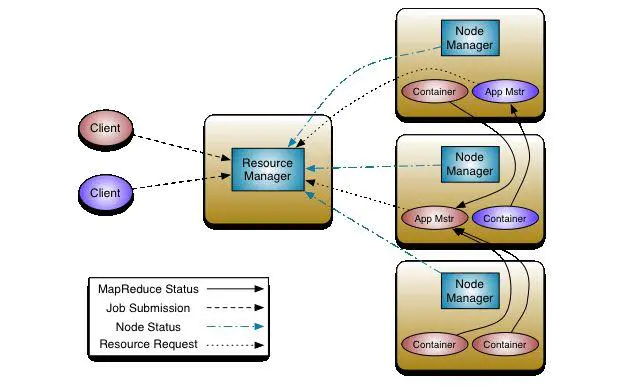
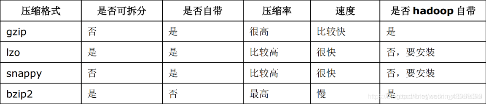
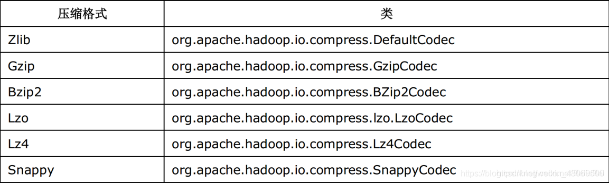
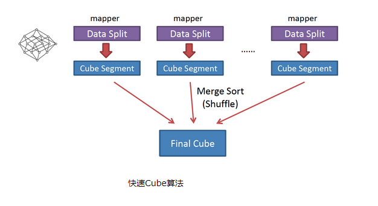

# Spark

## 1.说一说spark 和flink 的区别

https://zhuanlan.zhihu.com/p/68206953

### **抽象**

在 Spark 中，对于批处理，有 RDD 抽象和 DStream 用于流式传输，这是内部 RDD 本身。因此，在 Spark 下面代表的所有数据都使用 RDD 抽象来表示。

在 Flink 中，为批处理数据集提供了数据集抽象，为流应用程序提供了 DataStream。它们听起来与 RDD 和 DStreams 非常相似，但它们不是。

### **实时与近实时**

Apache Flink 提供事件级处理，也称为实时流。它与 Storm 模型非常相似。

Spark 只有不提供事件级粒度的最小批处理（mini-batch）。这种方法被称为近实时。

Spark 流式处理是更快的批处理，Flink 批处理是有限的流处理。

### **灵活的窗口**

由于最小批处理的性质，Spark 现在对窗口的支持非常有限。允许根据处理时间窗口批量处理。

与其他任何系统相比，Flink 提供了非常灵活的窗口系统。 Window 是 Flink 流 API 的主要焦点之一。它允许基于处理时间、数据时间和无记录等的窗口。这种灵活性使 Flink 流 API 与 Spark 相比非常强大。

## 一、Spark中的基本概念

https://www.cnblogs.com/frankdeng/p/9301485.html

（1）Application：表示你的应用程序

（2）Driver：表示main()函数，创建SparkContext。由SparkContext负责与ClusterManager通信，进行资源的申请，任务的分配和监控等。程序执行完毕后关闭SparkContext

（3）Executor：某个Application运行在Worker节点上的一个进程，该进程负责运行某些task，并且负责将数据存在内存或者磁盘上。在Spark on Yarn模式下，其进程名称为 CoarseGrainedExecutor Backend，一个CoarseGrainedExecutor Backend进程有且仅有一个executor对象，它负责将Task包装成taskRunner，并从线程池中抽取出一个空闲线程运行Task，这样，每个CoarseGrainedExecutorBackend能并行运行Task的数据就取决于分配给它的CPU的个数。

（4）Worker：集群中可以运行Application代码的节点。在Standalone模式中指的是通过slave文件配置的worker节点，在Spark on Yarn模式中指的就是NodeManager节点。

（5）Task：在Executor进程中执行任务的工作单元，多个Task组成一个Stage

（6）Job：包含多个Task组成的并行计算，是由Action行为触发的

（7）Stage：每个Job会被拆分很多组Task，作为一个TaskSet，其名称为Stage

（8）DAGScheduler：根据Job构建基于Stage的DAG，并提交Stage给TaskScheduler，其划分Stage的依据是RDD之间的依赖关系

（9）TaskScheduler：将TaskSet提交给Worker（集群）运行，每个Executor运行什么Task就是在此处分配的。


## Spark的运行流程

### 2.1　Spark的基本运行流程

#### 1、说明

> (1)构建Spark Application的运行环境（启动SparkContext），SparkContext向资源管理器（可以是Standalone、Mesos或YARN）注册并申请运行Executor资源；
>
> (2)资源管理器分配Executor资源并启动StandaloneExecutorBackend，Executor运行情况将随着心跳发送到资源管理器上；
>
> (3)SparkContext构建成DAG图，将DAG图分解成Stage，并把Taskset发送给Task Scheduler。Executor向SparkContext申请Task
>
> (4)Task Scheduler将Task发放给Executor运行同时SparkContext将应用程序代码发放给Executor。
>
> (5)Task在Executor上运行，运行完毕释放所有资源。

## **1.11.26 Spark BroadCast join** **广播** **join**

原理：先将小表数据查询出来聚合到 driver 端，再广播到各个 executor 端，使表与表 join 时进行本地 join，避免进行网络传输产生 shuffle。

使用场景：大表 join 小表 只能广播小表

## **1.11.28** **注册** **UDF** **函数**

SparkSession.udf.register 方法进行注册

spark.udf.register("isAdult", isAdult _) //isAdult _ udf方法

## **1.11.13**  分别简述Spark中的缓存机制（cache和persist）与checkpoint机制，并指出两者的区别与联系

都是做 RDD 持久化的

cache:内存，不会截断血缘关系，使用计算过程中的数据缓存。

checkpoint：磁盘，截断血缘关系，在 ck 之前必须没有任何任务提交才会生效，ck 过程会额外提交一次任务。

## **1.11.15** **当** **Spark** **涉及到数据库的操作时，如何减少** **Spark** **运行中的**数据库连接数？

使用 foreachPartition 代替 foreach，在 foreachPartition 内获取数据库的连接。

## 2.Spark Streaming Crash 如何保证Exactly Once Semantics


https://blog.csdn.net/wangpei1949/article/details/89277490

https://developer.aliyun.com/article/60120

一个Spark Streaming流处理程序，从广义上讲，包含三个步骤。

- 接收数据:从Source中接收数据。

- 转换数据:用DStream和RDD算子转换。

- 储存数据:将结果保存至外部系统。

如果流处理程序需要实现Exactly-Once语义，那么每一个步骤都要保证Exactly-Once。

### 接收数据

不同的数据源提供不同的保证。

如HDFS中的数据源，直接支持Exactly-Once语义。如使用基于Kafka Direct API从Kafka获取数据，也能保证Exactly-Once。（Receiver Based  保证不了）

### 转换数据

Spark Streaming 的词汇我都直接用 SS

### SS 自身可以做到at least once语义

SS 是靠CheckPoint 机制 来保证 at least once 语义的。 

1. checkpoint 是非常高效的。没有涉及到实际数据的存储。一般大小只有几十K，因为只存了Kafka的偏移量等信息。
2. checkpoint 采用的是序列化机制，尤其是DStreamGraph的引入，里面包含了可能如ForeachRDD等，而ForeachRDD里面的函数应该也会被序列化。如果采用了CheckPoint机制，而你的程序包做了做了变更，恢复后可能会有一定的问题。

### 储存数据

### 下游业务（Sink）需要做事务或幂等，保证 Exactly Once 语义

这里业务场景被区分为两个：

1. 幂等操作
2. 业务代码需要自身添加事物操作

### 幂等输出

即同样的数据输出多次，结果一样。一般需要借助外部存储中的唯一键实现。具体步骤:

将kafka参数enable.auto.commit设置为false。

幂等写入后手动提交offset。这里用checkpoint，**不需要手动提交**，生产中可用Kafka、Zookeeper、HBase等保存offset。


### 事务输出

事务输出，即数据输出和Kafka Offset提交在同一原子性事务中。具体步骤:

1. 将kafka参数`enable.auto.commit`设置为false。
2. 结果存储与Offset提交在同一事务中原子执行。


## 3.Spark数据倾斜如何处理？

https://tech.meituan.com/2016/05/12/spark-tuning-pro.html 高级篇（数据倾斜优化）

https://tech.meituan.com/2016/04/29/spark-tuning-basic.html  基础篇（spark使用优化）

#### 数据倾斜发生的原理

数据倾斜的原理很简单：在进行shuffle的时候，必须将各个节点上相同的key拉取到某个节点上的一个task来进行处理，比如按照key进行聚合或join等操作。此时如果某个key对应的数据量特别大的话，就会发生数据倾斜。

#### 如何定位导致数据倾斜的代码

数据倾斜只会发生在shuffle过程中。这里给大家罗列一些常用的并且可能会触发shuffle操作的算子：distinct、groupByKey、reduceByKey、aggregateByKey、join、cogroup、repartition等。出现数据倾斜时，可能就是你的代码中使用了这些算子中的某一个所导致的。


### 数据倾斜的解决方案

### 解决方案三：提高shuffle操作的并行度

**方案适用场景：**如果我们必须要对数据倾斜迎难而上，那么建议优先使用这种方案，因为这是处理数据倾斜最简单的一种方案。

**方案实现思路：**在对RDD执行shuffle算子时，给shuffle算子传入一个参数，比如reduceByKey(1000)，该参数就设置了这个shuffle算子执行时shuffle read task的数量。对于Spark SQL中的shuffle类语句，比如group by、join等，需要设置一个参数，即spark.sql.shuffle.partitions，该参数代表了shuffle read task的并行度，该值默认是200，对于很多场景来说都有点过小。

### 解决方案四：两阶段聚合（局部聚合+全局聚合）

**方案适用场景：**对RDD执行reduceByKey等**聚合类shuffle**算子或者在Spark SQL中使用group by语句进行分组聚合时，比较适用这种方案。

**方案实现思路：**这个方案的核心实现思路就是进行两阶段聚合。第一次是局部聚合，先给每个key都打上一个随机数，比如10以内的随机数，此时原先一样的key就变成不一样的了，比如(hello, 1) (hello, 1) (hello, 1) (hello, 1)，就会变成(1_hello, 1) (1_hello, 1) (2_hello, 1) (2_hello, 1)。接着对打上随机数后的数据，执行reduceByKey等聚合操作，进行局部聚合，那么局部聚合结果，就会变成了(1_hello, 2) (2_hello, 2)。然后将各个key的前缀给去掉，就会变成(hello,2)(hello,2)，再次进行全局聚合操作，就可以得到最终结果了，比如(hello, 4)。

### 解决方案五：将reduce join转为map join

**方案适用场景：**在对RDD使用join类操作，或者是在Spark SQL中使用join语句时，而且join操作中的一个RDD或表的数据量比较小（比如几百M或者一两G），比较适用此方案。（一大表一小表情况）

**方案实现思路：**不使用join算子进行连接操作，而使用Broadcast变量与map类算子实现join操作，进而完全规避掉shuffle类的操作，彻底避免数据倾斜的发生和出现。将较小RDD中的数据直接通过collect算子拉取到Driver端的内存中来，然后对其创建一个Broadcast变量；接着对另外一个RDD执行map类算子，在算子函数内，从Broadcast变量中获取较小RDD的全量数据，与当前RDD的每一条数据按照连接key进行比对，如果连接key相同的话，那么就将两个RDD的数据用你需要的方式连接起来。

**方案实现原理：**普通的join是会走shuffle过程的，而一旦shuffle，就相当于会将相同key的数据拉取到一个shuffle read task中再进行join，此时就是reduce join。但是如果一个RDD是比较小的，则可以采用广播小RDD全量数据+map算子来实现与join同样的效果，也就是map join，此时就不会发生shuffle操作，也就不会发生数据倾斜。

**方案优点：**对join操作导致的数据倾斜，效果非常好，因为根本就不会发生shuffle，也就根本不会发生数据倾斜。

**方案缺点：**适用场景较少，因为这个方案**只适用于一个大表和一个小表的情况**。

## **1.13.1** **数据倾斜表现**

1）hadoop 中的数据倾斜表现：

⚫ 有一个多几个 Reduce 卡住，卡在 99.99%，一直不能结束。

⚫ 各种 container 报错 OOM

⚫ 异常的 Reducer 读写的数据量极大，至少远远超过其它正常的 Reducer

⚫ 伴随着数据倾斜，会出现任务被 kill 等各种诡异的表现。

2）hive 中数据倾斜

一般都发生在 Sql 中 group by 和 join on 上，而且和数据逻辑绑定比较深。

3）Spark 中的数据倾斜

Spark 中的数据倾斜，包括 Spark Streaming 和 Spark Sql，表现主要有下面几种：

⚫ Executor lost，OOM，Shuffle 过程出错； 

⚫ Driver OOM； 

⚫ 单个 Executor 执行时间特别久，整体任务卡在某个阶段不能结束； 

⚫ 正常运行的任务突然失败；

## **1.13.2** **数据倾斜产生原因**

我们以 Spark 和 Hive 的使用场景为例。

他们在做数据运算的时候会涉及到，count distinct、group by、join on 等操作，这些都会

触发 Shuffle 动作。一旦触发 Shuffle，所有相同 key 的值就会被拉到一个或几个 Reducer 节

点上，容易发生单点计算问题，导致数据倾斜。

## **1.13.3** **解决数据倾斜思路**

很多数据倾斜的问题，都可以用和平台无关的方式解决，比如更好的**数据预处理**，**异常**

**值的过滤**等。因此，解决数据倾斜的重点在于对数据设计和业务的理解，这两个搞清楚了，

数据倾斜就解决了大部分了。

**1**）业务逻辑

我们从业务逻辑的层面上来优化数据倾斜，比如上面的两个城市做推广活动导致那两个

城市数据量激增的例子，我们可以单独对这两个城市来做 count，单独做时可用两次 MR，

第一次打散计算，第二次再最终聚合计算。完成后和其它城市做整合。

**2**）程序层面

比如说在 Hive 中，经常遇到 count(distinct)操作，这样会导致最终只有一个 Reduce 任

务。

我们可以先 group by，再在外面包一层 count，就可以了。比如计算按用户名去重后的

总用户量：

（1）优化前 只有一个 reduce，先去重再 count 负担比较大：

select name,count(distinct name)from user;

（2）优化后

// 设置该任务的每个 job 的 reducer 个数为 3 个。Hive 默认-1，自动推断。

set mapred.reduce.tasks=3;

// 启动两个 job，一个负责子查询(可以有多个 reduce)，另一个负责 count(1)：

select count(1) from (select name from user group by name) tmp;

**3**）调参方面

Hadoop 和 Spark 都自带了很多的参数和机制来调节数据倾斜，合理利用它们就能解决

大部分问题。

**4**）从业务和数据上解决数据倾斜

很多数据倾斜都是在数据的使用上造成的。我们举几个场景，并分别给出它们的解决方

案。


-  有损的方法：找到异常数据，比如 ip 为 0 的数据，过滤掉

- 无损的方法：对分布不均匀的数据，单独计算

- 先对 key 做一层 hash，先将数据随机打散让它的并行度变大，再汇集

- 数据预处理

### **1.13.4** **定位导致数据倾斜代码**

Spark 数据倾斜只会发生在 shuffle 过程中。

这里给大家罗列一些常用的并且可能会触发 shuffle 操作的算子：distinct、groupByKey、

reduceByKey、aggregateByKey、join、cogroup、repartition 等。

出现数据倾斜时，可能就是你的代码中使用了这些算子中的某一个所导致的。

### **1.13.4.1 某个 task 执行特别慢的情况**

首先要看的，就是数据倾斜发生在第几个 stage 中：

如果是用 yarn-client 模式提交，那么在提交的机器本地是直接可以看到 log，可以在 log

中找到当前运行到了第几个 stage；

如果是用 yarn-cluster 模式提交，则可以通过 Spark Web UI 来查看当前运行到了第几个

stage。

此外，无论是使用 yarn-client 模式还是 yarn-cluster 模式，我们都可以在 Spark Web UI

上深入看一下当前这个 stage 各个 task 分配的数据量，从而进一步确定是不是 task 分配的数

据不均匀导致了数据倾斜。

看 task 运行时间和数据量

task 运行时间

比如下图中，倒数第三列显示了每个 task 的运行时间。明显可以看到，有的 task 运行

特别快，只需要几秒钟就可以运行完；而有的 task 运行特别慢，需要几分钟才能运行完，此

时单从运行时间上看就已经能够确定发生数据倾斜了。

task 数据量

此外，倒数第一列显示了每个 task 处理的数据量，明显可以看到，运行时间特别短的

task 只需要处理几百 KB 的数据即可，而运行时间特别长的 task 需要处理几千 KB 的数据，

处理的数据量差了 10 倍。此时更加能够确定是发生了数据倾斜。

推断倾斜代码


知道数据倾斜发生在哪一个 stage 之后，接着我们就需要根据 stage 划分原理，推算出

来发生倾斜的那个 stage 对应代码中的哪一部分，这部分代码中肯定会有一个 shuffle 类算

子。

精准推算 stage 与代码的对应关系，需要对 Spark 的源码有深入的理解，这里我们可以

介绍一个相对简单实用的推算方法：只要看到 Spark 代码中出现了一个 shuffle 类算子或者

是 Spark SQL 的 SQL 语句中出现了会导致 shuffle 的语句（比如 group by 语句），那么就可

以判定，以那个地方为界限划分出了前后两个 stage。

这里我们就以如下单词计数来举例。

val conf = new SparkConf()

val sc = new SparkContext(conf)

val lines = 

sc.textFile("hdfs://...")

val words = lines.flatMap(_.split(" "))_

_val pairs = words.map((_, 1))

val wordCounts = pairs.reduceByKey(_ + _)wordCounts.collect().foreach(println(_))

在整个代码中只有一个 reduceByKey 是会发生 shuffle 的算子，也就是说这个算子为界

限划分出了前后两个 stage：

stage0，主要是执行从 textFile 到 map 操作，以及 shuffle write 操作（对 pairs RDD 中的

数据进行分区操作，每个 task 处理的数据中，相同的 key 会写入同一个磁盘文件内）。

stage1，主要是执行从 reduceByKey 到 collect 操作，以及 stage1 的各个 task 一开始运

行，就会首先执行 shuffle read 操作（会从 stage0 的各个 task 所在节点拉取属于自己处理的

那些 key，然后对同一个 key 进行全局性的聚合或 join 等操作，在这里就是对 key 的 value

值进行累加）

stage1 在执行完 reduceByKey 算子之后，就计算出了最终的 wordCounts RDD，然后会

执行 collect 算子，将所有数据拉取到 Driver 上，供我们遍历和打印输出。

123456789

通过对单词计数程序的分析，希望能够让大家了解最基本的stage划分的原理，以及stage

划分后 shuffle 操作是如何在两个 stage 的边界处执行的。然后我们就知道如何快速定位出发

生数据倾斜的 stage 对应代码的哪一个部分了。

比如我们在 Spark Web UI 或者本地 log 中发现，stage1 的某几个 task 执行得特别慢，判

定 stage1 出现了数据倾斜，那么就可以回到代码中，定位出 stage1 主要包括了 reduceByKey

这个 shuffle 类算子，此时基本就可以确定是是该算子导致了数据倾斜问题。

此时，如果某个单词出现了 100 万次，其他单词才出现 10 次，那么 stage1 的某个 task

就要处理 100 万数据，整个 stage 的速度就会被这个 task 拖慢。

## 4.Spark transformation和action的区别

https://blog.csdn.net/zhangbaoanhadoop/article/details/82111029

### 区别

1，transformation是得到一个新的RDD，方式很多，比如从数据源生成一个新的RDD，从RDD生成一个新的RDD

2，action是得到一个值，或者一个结果（直接将RDDcache到内存中）

所有的transformation都是采用的懒策略，就是如果只是将transformation提交是不会执行计算的，计算只有在action被提交的时候才被触发。
————————————————

### transformation操作：

  map(func):对调用map的RDD数据集中的每个element都使用func，然后返回一个新的RDD,这个返回的数据集是分布式的数据集

  filter(func): 对调用filter的RDD数据集中的每个元素都使用func，然后返回一个包含使func为true的元素构成的RDD

flatMap(func):和map差不多，但是flatMap生成的是多个结果

mapPartitions(func):和map很像，但是map是每个element，而mapPartitions是每个partition

mapPartitionsWithSplit(func):和mapPartitions很像，但是func作用的是其中一个split上，所以func中应该有index

sample(withReplacement,faction,seed):抽样

union(otherDataset)：返回一个新的dataset，包含源dataset和给定dataset的元素的集合

distinct([numTasks]):返回一个新的dataset，这个dataset含有的是源dataset中的distinct的element

groupByKey(numTasks):返回(K,Seq[V])，也就是hadoop中reduce函数接受的key-valuelist

reduceByKey(func,[numTasks]):就是用一个给定的reducefunc再作用在groupByKey产生的(K,Seq[V]),比如求和，求平均数

sortByKey([ascending],[numTasks]):按照key来进行排序，是升序还是降序，ascending是boolean类型

join(otherDataset,[numTasks]):当有两个KV的dataset(K,V)和(K,W)，返回的是(K,(V,W))的dataset,numTasks为并发的任务数

cogroup(otherDataset,[numTasks]):当有两个KV的dataset(K,V)和(K,W)，返回的是(K,Seq[V],Seq[W])的dataset,numTasks为并发的任务数

cartesian(otherDataset)：笛卡尔积就是m*n，大家懂的

 

### action操作：

reduce(func)：说白了就是聚集，但是传入的函数是两个参数输入返回一个值，这个函数必须是满足交换律和结合律的

collect()：一般在filter或者足够小的结果的时候，再用collect封装返回一个数组

count():返回的是dataset中的element的个数

first():返回的是dataset中的第一个元素

take(n):返回前n个elements，这个士driverprogram返回的

takeSample(withReplacement，num，seed)：抽样返回一个dataset中的num个元素，随机种子seed

saveAsTextFile（path）：把dataset写到一个textfile中，或者hdfs，或者hdfs支持的文件系统中，spark把每条记录都转换为一行记录，然后写到file中

saveAsSequenceFile(path):只能用在key-value对上，然后生成SequenceFile写到本地或者hadoop文件系统

countByKey()：返回的是key对应的个数的一个map，作用于一个RDD

foreach(func):对dataset中的每个元素都使用func


## 5.stage划分的原理


https://www.cnblogs.com/wwcom123/p/10492731.html

https://zhuanlan.zhihu.com/p/67068559

#### 宽窄依赖

RDD之间有一系列的依赖关系，依赖关系又分为窄依赖和宽依赖。

Spark中的Stage其实是一组并行的任务，任务是一个个的Task

Task：Stage 是一个 TaskSet，将 Stage 根据分区数划分成一个个的 Task。

**窄依赖：**

父RDD和子RDDpartition之间的关系是一对一的，或者父RDD一个partition只对应一个子RDD的partition情况下的父RDD和子RDD partition关系是多对一的，**不会有shuffle产生。**父RDD的一个分区去到了子RDD的一个分区

**宽依赖：**

父RDD与子RDD partition之间的关系是一对多，**会有shuffle的产生**。父RDD的一个分区的数据去到了子RDD的不同分区里面。

区分宽窄依赖主要就是看父RDD的一个partition的流向，要是流向一个的话就是窄依赖，流向多个的话就是宽依赖。**相比于宽依赖，窄依赖对优化很有利，主要基于一下两点：**

1.宽依赖往往对应着shuffle操作，需要在运行过程中将同一个父RDD的分区传入到不同的子RDD分区中，中间可能涉及多个节点间的数据传输，而窄依赖的每个父RDD分区只会传入到一个子RDD分区中，通常可以在一个节点内完成转换。

2.当RDD分区丢失时（某个节点故障），spark会对数据进行重算

1).对于窄依赖，由于父RDD的一个分区只对应一个子RDD分区，这样只需要重算和子RDD分区对应的父RDD分区即可，所以这个重算对数据的利用率是100%的。

2).对于宽依赖，重算的父RDD分区对应多个字RDD分区，这样实际上父RDD中只有一部分的数据是被用于恢复这个丢失的子RDD分区的，另一部分对应子RDD的其他未丢失分区，这就造成了多余的计算，宽依赖中子RDD分区通常来自于多个父RDD分区，极端情况下，所有的父RDD分区都要重新计算

#### Stage划分原理

**Job->Stage->Task**
开发完一个应用以后，把这个应用提交到Spark集群，这个应用叫Application。这个应用里面开发了很多代码，这些代码里面凡是遇到一个**action操作**，就会产生一个job任务。

一个Application有一个或多个job任务。job任务被DAGScheduler划分为不同stage去执行，stage是一组Task任务。Task分别计算每个分区partition上的数据，**Task数量=分区partition数量**。

 

**Spark如何划分Stage**：
会从执行action的最后一个RDD开始向前推，首先为最后一个RDD创建一个stage，向前遇到某个RDD是**宽依赖**，再划分一个stage。如下图，从宽依赖处划分为2个stage。


## 6.Spark groupByKey/reduceByKey 比较与性能调优

https://vopaaz.github.io/2020/01/08/Spark-shuffle-optimization/

## 预聚合

`reduceByKey` 实际上会在每个 partition 上对数据进行预聚合（因为 `reduce` 算子可以直接在每个 partition 上根据 key 直接先计算一波），再将结果按照 key shuffle 计算最终结果。见下图：

[](https://awps-assets.meituan.net/mit-x/blog-images-bundle-2016/a6c7d4c4.png)

相反，由于 `groupByKey` 没有任何算子可供预聚合计算，所有数据都会进入 shuffle 中，如下图所示。

[](https://awps-assets.meituan.net/mit-x/blog-images-bundle-2016/5ebe0848.png)

这样就导致了 OOM.

## 7.Spark使用优化

https://zhuanlan.zhihu.com/p/108454557

https://tech.meituan.com/2016/04/29/spark-tuning-basic.html

## 8.Spark 部署模式

https://zhuanlan.zhihu.com/p/99398378

Spark 支持多种分布式部署模式，主要支持三种部署模式，分别是：**Standalone**、**Spark on YARN**和 **Spark on Mesos**模式。

**Standalone**模式为 Spark 自带的一种集群管理模式，即独立模式，自带完整的服务，可单独部署到一个集群中，无需依赖任何其他资源管理系统。它是 Spark 实现的资源调度框架，其主要的节点有 Driver 节点、Master 节点和 Worker 节点。**Standalone**模式也是最简单最容易部署的一种模式。

**Spark on YARN**模式**，**即 Spark 运行在**Hadoop YARN**框架之上的一种模式**。Hadoop YARN**（Yet Another Resource
Negotiator，另一种资源协调者）是一种新的 Hadoop 资源管理器，它是一个通用资源管理系统，可为上层应用提供统一的资源管理和调度。

**Spark on Mesos**模式，即 Spark 运行在**Apache Mesos**框架之上的一种模式。**Apache Mesos**是一个更强大的分布式资源管理框架，负责集群资源的分配，它允许多种不同的框架部署在其上，包括**YARN**。它被称为是分布式系统的内核。

三种架构都采用了**Master**/**Worker**(**Slave**)的架构，Spark 分布式运行架构大致如下：


## **1.12.4 Spark Streaming** **背压机制**

把 spark.streaming.backpressure.enabled 参数设置为 ture,开启背压机制后 Spark Streaming 会

根据延迟动态去 kafka 消费数据,上限由 spark.streaming.kafka.maxRatePerPartition 参数控制，

所以两个参数一般会一起使用

## **1.12.7 Spark Streaming** **默认分区个数**

Spark Streaming 默认分区个数与所对接的 kafka topic 分区个数一致，Spark Streaming 里一般

不会使用 repartition 算子增大分区，因为 repartition 会进行 shuffle 增加耗时

## **1.12.8 SparkStreaming** **有哪几种方式消费** **Kafka** 中的数据，它们之间的区别是什么？

### **一、基于 Receiver 的方式**

这种方式使用 Receiver 来获取数据。Receiver 是使用 Kafka 的高层次 Consumer API

来实现的。receiver 从 Kafka 中获取的数据都是存储在 Spark Executor 的内存中的（如

果突然数据暴增，大量 batch 堆积，很容易出现内存溢出的问题），然后 Spark 

Streaming 启动的 job 会去处理那些数据。

然而，在默认的配置下，这种方式可能会因为底层的失败而丢失数据。如果要启用高

可靠机制，让数据零丢失，就必须启用 Spark Streaming 的预写日志机制（Write Ahead 

Log，WAL）。该机制会同步地将接收到的 Kafka 数据写入分布式文件系统（比如 HDFS）上

的预写日志中。所以，即使底层节点出现了失败，也可以使用预写日志中的数据进行恢

复。

### **二、基于 Direct 的方式**


这种新的不基于 Receiver 的直接方式，是在 Spark 1.3 中引入的，从而能够确保更加

健壮的机制。替代掉使用 Receiver 来接收数据后，这种方式会周期性地查询 Kafka，来获

得每个 topic+partition 的最新的 offset，从而定义每个 batch 的 offset 的范围。当处

理数据的 job 启动时，就会使用 Kafka 的简单 consumer api 来获取 Kafka 指定 offset 范

围的数据。

**优点如下：** 

**简化并行读取：**如果要读取多个 partition，不需要创建多个输入 DStream 然后对它

们进行 union 操作。Spark 会创建跟 Kafka partition 一样多的 RDD partition，并且会并

行从 Kafka 中读取数据。所以在 Kafka partition 和 RDD partition 之间，有一个一对一

的映射关系。

**高性能：**如果要保证零数据丢失，在基于 receiver 的方式中，需要开启 WAL 机制。这

种方式其实效率低下，因为数据实际上被复制了两份，Kafka 自己本身就有高可靠的机

制，会对数据复制一份，而这里又会复制一份到 WAL 中。而基于 direct 的方式，不依赖

Receiver，不需要开启 WAL 机制，只要 Kafka 中作了数据的复制，那么就可以通过 Kafka

的副本进行恢复。

**一次且仅一次的事务机制**。 

### **三、对比：** 

基于 receiver 的方式，是使用 Kafka 的高阶 API 来在 ZooKeeper 中保存消费过的

offset 的。这是消费 Kafka 数据的传统方式。这种方式配合着 WAL 机制可以保证数据零丢

失的高可靠性，但是却无法保证数据被处理一次且仅一次，可能会处理两次。因为 Spark

和 ZooKeeper 之间可能是不同步的。

基于 direct 的方式，使用 kafka 的简单 api，Spark Streaming 自己就负责追踪消费

的 offset，并保存在 checkpoint 中。Spark 自己一定是同步的，因此可以保证数据是消费

一次且仅消费一次。

#### 在实际生产环境中大都用 Direct 方式

## **1.12.9** **简述** **SparkStreaming** **窗口函数的原理（重点）**

窗口函数就是在原来定义的 SparkStreaming 计算批次大小的基础上再次进行封装，

每次计算多个批次的数据，同时还需要传递一个滑动步长的参数，用来设置当次计算任务

完成之后下一次从什么地方开始计算。

# Yarn

## Yarn概念

`Apache Hadoop YARN` 是一种新的 Hadoop 资源管理器，它是一个通用资源管理系统，可为上层应用提供统一的`资源管理和调度`，它的引入为集群在`利用率`、`资源统一管理`和`数据共享`等方面带来了巨大好处。也就是说 YARN 在 Hadoop 集群中充当`资源管理`和`任务调度`的框架



`ResourceManager` 负责集群资源的统一管理和调度；

`NodeManager` 负责单节点资源管理和使用，处理来自 ResourceManager/ApplicationMaster 的命令;

`ApplicationMaster` 负责应用程序的管理;

`Container` 是对任务运行环境的抽象，描述任务运行资源（节点、内存、CPU）, 启动命令以及环境

## Yarn三种调度策略对比

https://www.jianshu.com/p/fbdb1c2ee2ef

Yarn 提供了三种可用资源调度器 (直接从 MRv1 基础上修改而来的)：
`FIFO Scheduler` ，`Capacity Scheduler`，`Fair Scheduler`

**FIFO Scheduler**：从字面不难看出就是先进先出策略，所有的任务都放在`一个队列`中，只有`执行完一个任务后`，`才会进行下一个`。这种调度方式最简单，但**真实场景中并不推荐**，因为会有很多问题，比如如果有大任务独占资源，会导致其他任务一直处于 pending 状态等。

**Capacity Scheduler**：也就是所谓的容量调度，这种方案**更适合`多租户安全地共享大型集群`**，以便在分配的`容量限制下`及`时分配资源`。采用队列的概念，任务提交到队列，`队列`可以设置`资源的占比`，并且支持层级队列、访问控制、用户限制、预定等等配置。不过对于资源占用比需要不断的摸索与权衡

**Fair Scheduler**：就是公平调度器，能够`公平地共享大型集群中的资源`，Fair 调度器会为所有运行的 job 动态的调整系统资源。当只有一个 job 在运行时，该应用程序最多可获取所有资源，再提交其他 job 时，资源将会被重新分配分配给目前的 job，这可以让`大量 job 在合理的时间内完成，减少作业 pending 的情况`。**可见 `Fair Schedule 比较适用于多用户共享的大集群`**

## Yarn延迟调度

https://my.oschina.net/freeshow/blog/4699030

所有的YARN调度器都试图以`本地请求`为重。在一个繁忙的集群上， 如果一个应用请求某个节点，那么极有可能此时有其他容器正在该节点上运行。显而易见的处理是，立刻放宽本地性需求，在同一机架中分配一个容器。然而，通过实践发现，此时如果等待一小段时间(不超过几秒)，能够戏剧性的增加在所请求的节点上分配到一个容器的机会，从而可以提高集群的效率。这个特性称之为`延迟调度 (delay scheduling)` 。**容量调度器和公平调度器都支持延迟调度。**

# Hive

## 一篇文章让你通透Hive优化

https://blog.csdn.net/weixin_43069500/article/details/105915121

# 一、hive 参数优化


## 1、map 数优化

> mapred.min.split.size: 指的是数据的最小分割单元大小；min 的默认值是 1B
> mapred.max.split.size: 指的是数据的最大分割单元大小；max 的默认值是 256MB
> 通过调整 max 可以起到调整 map 数的作用，减小 max 可以增加 map 数，增大 max 可以减少 map 数。
> 需要提醒的是，直接调整 mapred.map.tasks 这个参数是没有效果的。

举例：

  a) 假设 input 目录下有 1 个文件 a，大小为 780M，那么 hadoop 会将该文件 a 分隔成 7 个块（6 个 128M 的块和 1 个 12M 的块），从而产生 7 个 map 书；

  b) 假设 input 目录下有 3 个文件 a,b,c，大小分别为 10M，20M，130M，那么 hadoop 会分隔成 4 个块（10M，20M，128M，2M），从而产生 4 个 map 数；

  `注意`：如果文件大于块大小（128M），那么会拆分，如果小于块大小，则把该文件当成一个块。

  其实这就涉及到小文件的问题：如果一个任务有很多小文件（远远小于块大小 128M），则每个小文件也会当做一个块，用一个 map 任务来完成。

  而一个 map 任务启动和初始化的时间远远大于逻辑处理的时间，就会造成很大的资源浪费。而且，同时可执行的 map 数是受限的。那么，是不是保证每个 map 处理接近 128M 的文件块，就高枕无忧了？答案也是不一定。比如有一个 127M 的文件，正常会用一个 map 去完成，但这个文件只有一个或者两个小字段，却有几千万的记录，如果 map 处理的逻辑比较复杂，用一个 map 任务去做，肯定也比较耗时。

  我们该如何去解决呢？？？

  我们需要采取两种方式来解决：即减少 map 数和增加 map 数。

  1、减少 map 数量

```sql
假设一个SQL任务：
Select count(1) from popt_tbaccountcopy_meswhere pt = '2012-07-04';
该任务的inputdir :  /group/p_sdo_data/p_sdo_data_etl/pt/popt_tbaccountcopy_mes/pt=2012-07-04
共有194个文件，其中很多事远远小于128M的小文件，总大小9G，正常执行会用194个map任务。
Map总共消耗的计算资源：SLOTS_MILLIS_MAPS= 623,020

通过以下方法来在map执行前合并小文件，减少map数：
set mapred.max.split.size=100000000;
set mapred.min.split.size.per.node=100000000;
set mapred.min.split.size.per.rack=100000000;
set hive.input.format=org.apache.hadoop.hive.ql.io.CombineHiveInputFormat;
再执行上面的语句，用了74个map任务，map消耗的计算资源：SLOTS_MILLIS_MAPS= 333,500
对于这个简单SQL任务，执行时间上可能差不多，但节省了一半的计算资源。
大概解释一下，100000000表示100M, 
set hive.input.format=org.apache.hadoop.hive.ql.io.CombineHiveInputFormat;这个参数表示执行前进行小文件合并，
前面三个参数确定合并文件块的大小，大于文件块大小128m的，按照128m来分隔，
小于128m,大于100m的，按照100m来分隔，把那些小于100m的（包括小文件和分隔大文件剩下的），
进行合并,最终生成了74个块。
```

2、增大 map 数量

  如何适当的增加 map 数？
  当 input 的文件都很大，任务逻辑复杂，map 执行非常慢的时候，可以考虑增加 Map 数，来使得每个 map 处理的数据量减少，从而提高任务的执行效率。

```sql
 假设有这样一个任务：
    Select data_desc,
               count(1),
               count(distinct id),
               sum(case when ...),
               sum(case when ...),
               sum(...)
    from a group by data_desc
```

  如果表 a 只有一个文件，大小为 120M，但包含几千万的记录，如果用 1 个 map 去完成这个任务，肯定是比较耗时的，这种情况下，我们要考虑将这一个文件合理的拆分成多个，这样就可以用多个 map 任务去完成。

```sql
set mapred.reduce.tasks=10;
  create table a_1 as 
  select * from a 
  distribute by rand(123);
```

  这样会将 a 表的记录，随机的分散到包含 10 个文件的 a_1 表中，再用 a_1 代替上面 sql 中的 a 表，则会用 10 个 map 任务去完成。每个 map 任务处理大于 12M（几百万记录）的数据，效率肯定会好很多。


## 2、reduce 数优化

  Reduce 的个数对整个作业的运行性能有很大影响。如果 Reduce 设置的过大，那么将会产生很多小文件，对 NameNode 会产生一定的影响，而且整个作业的运行时间未必会减少；如果 Reduce 设置的过小，那么单个 Reduce 处理的数据将会加大，很可能会引起 OOM 异常。

  如果设置了 mapred.reduce.tasks/mapreduce.job.reduces 参数，那么 Hive 会直接使用它的值作为 Reduce 的个数；如果 mapred.reduce.tasks/mapreduce.job.reduces 的值没有设置（也就是 - 1），那么 Hive 会根据输入文件的大小估算出 Reduce 的个数。根据输入文件估算 Reduce 的个数可能未必很准确，因为 Reduce 的输入是 Map 的输出，而 Map 的输出可能会比输入要小，所以最准确的数根据 Map 的输出估算 Reduce 的个数。

自己如何确定 reduce 数：

  reduce 个数的设定极大影响任务执行效率，不指定 reduce 个数的情况下，Hive 会猜测确定一个 reduce 个数，基于以下两个设定：

```sql
hive.exec.reducers.bytes.per.reducer（每个reduce任务处理的数据量，默认为1000^3=1G）

hive.exec.reducers.max（每个任务最大的reduce数，默认为1009）
```

  计算 reducer 数的公式很简单 N=min（参数 2，总输入数据量 / 参数 1）。即，如果 reduce 的输入（map 的输出）总大小不超过 1G，那么只会有一个 reduce 任务。

> 如：select pt,count (1) from popt_tbaccountcopy_mes where pt = ‘2012-07-04’ group by pt;
>   总大小为 9G 多
>   因此这句有 10 个 reduce

1. **调整 reduce 个数方法一**

> （1）每个 Reduce 处理的数据量默认是 256MB
> hive.exec.reducers.bytes.per.reducer=256123456
> （2）每个任务最大的 reduce 数，默认为 1009
> hive.exec.reducers.max=1009

1. **调整 reduce 个数方法二**

> 在 hadoop 的 mapred-default.xml 文件中修改
> 设置每个 job 的 Reduce 个数
> set mapreduce.job.reduces = 15;

1. **reduce 个数并不是越多越好**

   `1）过多的启动和初始化reduce也会消耗时间和资源；`

   `2）另外，有多少个reduce，就会有多少个输出文件，如果生成了很多个小文件，那么如果这些小文件作为下一个任务的输入，则也会出现小文件过多的问题；`

  注意：在设置 reduce 个数的时候也需要考虑这两个原则：使大数据量利用合适的 reduce 数；是单个 reduce 任务处理合适的数据量。


## 3、Fetch 抓取（Hive 可以避免进行 MapReduce）

  Hive 中对某些情况的查询可以不必使用 MapReduce 计算。例如：SELECT * FROM employees; 在这种情况下，Hive 可以简单地读取 employee 对应的存储目录下的文件，然后输出查询结果到控制台。
  在 hive-default.xml.template 文件中 hive.fetch.task.conversion 默认是 more，老版本 hive 默认是 minimal，该属性修改为 more 以后，在全局查找、字段查找、limit 查找等都不走 MapReduce。

`案例实操`：

- **1）把 hive.fetch.task.conversion 设置成 none，然后执行查询语句，都会执行 mapreduce 程序。**

```sql
hive (default)> set hive.fetch.task.conversion=none;

hive (default)> select * from score;

hive (default)> select s_score from score;

hive (default)> select s_score from score limit 3;
```

- **2）把 hive.fetch.task.conversion 设置成 more，然后执行查询语句，如下查询方式都不会执行 mapreduce 程序。**

```sql
hive (default)> set hive.fetch.task.conversion=more;

hive (default)> select * from score;

hive (default)> select s_score from score;

hive (default)> select s_score from score limit 3;
```


## 4 、模式选择


###  1）本地模式

  大多数的 Hadoop job 是需要 Hadoop 提供的完整的可扩展性来处理大数据集的。不过，有时 Hive 的输入数据量是非常小的。在这种情况下，为查询触发执行任务时消耗可能会比实际 job 的执行时间要多的多。对于大多数这种情况，Hive 可以通过本地模式在单台机器上处理所有的任务。对于小数据集，执行时间可以明显被缩短。
  用户可以通过设置 hive.exec.mode.local.auto 的值为 true，来让 Hive 在适当的时候自动启动这个优化。本地模式涉及到三个参数：

| 参数名                                    | 默认值 | 备注                               |
| ----------------------------------------- | ------ | ---------------------------------- |
| hive.exec.mode.local.auto                 | false  | 让 hive 决定是否在本地模式自动运行 |
| hive.exec.mode.local.auto.input.files.max | 4      | 不启动本地模式的 task 最大个数     |
| hive.exec.mode.local.auto.inputbytes.max  | 128M   | 不启动本地模式的最大输入文件大小   |

```sql
set hive.exec.mode.local.auto=true;  //开启本地mr
//设置local mr的最大输入数据量，当输入数据量小于这个值时采用local  mr的方式，默认为134217728，即128M
set hive.exec.mode.local.auto.inputbytes.max=50000000;
//设置local mr的最大输入文件个数，当输入文件个数小于这个值时采用local mr的方式，默认为4
set hive.exec.mode.local.auto.input.files.max=10;
案例实操：
1）开启本地模式，并执行查询语句
hive (default)> set hive.exec.mode.local.auto=true; 
hive (default)> select * from score cluster by s_id;
18 rows selected (1.568 seconds)
2）关闭本地模式，并执行查询语句
hive (default)> set hive.exec.mode.local.auto=false; 
hive (default)> select * from score cluster by s_id;
18 rows selected (11.865 seconds)
```


###  2）并行模式

  Hive 会将一个查询转化成一个或多个阶段。这样的阶段可以是 MapReduce 阶段、抽样阶段、合并阶段、limit 阶段。默认情况下，Hive 一次只会执行一个阶段，由于 job 包含多个阶段，而这些阶段并非完全相互依赖，即：这些阶段可以并行执行，可以缩短整个 job 的执行时间。设置参数，`set hive.exec.parallel=true` 或者通过配置文件来完成。


###  3）严格模式

  Hive 提供一个严格模式，可以防止用户执行那些可能产生意想不到的影响查询，通过设置 `hive.mapred.mode值为strict` 来完成。默认是非严格模式 nonstrict。

  1）对于分区表，除非 where 语句中含有分区字段过滤条件来限制范围，否则不允许执行。换句话说，就是用户不允许扫描所有分区。进行这个限制的原因是，通常分区表都拥有非常大的数据集，而且数据增加迅速。没有进行分区限制的查询可能会消耗令人不可接受的巨大资源来处理这个表。

  2）对于使用了 order by 语句的查询，要求必须使用 limit 语句。因为 order by 为了执行排序过程会将所有的结果数据分发到同一个 Reducer 中进行处理，强制要求用户增加这个 LIMIT 语句可以防止 Reducer 额外执行很长一段时间。

  3）限制笛卡尔积的查询。对关系型数据库非常了解的用户可能期望在执行 JOIN 查询的时候不使用 ON 语句而是使用 where 语句，这样关系数据库的执行优化器就可以高效地将 WHERE 语句转化成那个 ON 语句。不幸的是，Hive 并不会执行这种优化，因此，如果表足够大，那么这个查询就会出现不可控的情况。


## 5、JVM 重用

  JVM 重用是 Hadoop 调优参数的内容，其对 Hive 的性能具有非常大的影响，特别是对于很难避免小文件的场景或 task 特别多的场景，这类场景大多数执行时间都很短。

  JVM 重用可以使得 JVM 实例在同一个 job 中重新使用 N 次。N 的值可以在 Hadoop 的 mapred-site.xml 文件中进行配置。通常在 10-20 之间，具体多少需要根据具体业务场景测试得出。

```xml
<property>
  <name>mapreduce.job.jvm.numtasks</name>
  <value>10</value>
  <description>How many tasks to run per jvm. If set to -1, there is
  no limit. 
  </description>
</property>
```

  我们也可以在 hive 当中通过

```sql
set  mapred.job.reuse.jvm.num.tasks=10;
```

  这个设置来设置我们的 jvm 重用。

`缺点`：

  开启 JVM 重用将一直占用使用到的 task 插槽，直到任务完成后才能释放。如果某个 “不平衡的” job 中有某几个 Reduce task 执行的时间要比其他 Reduce task 消耗的时间多的多的话，那么保留的插槽就会一直空闲着却无法被其他的 job 使用，直到所有的 task 都结束了才会释放。


## 6、推测执行

  在分布式集群环境下，因为程序 Bug（包括 Hadoop 本身的 bug），负载不均衡或者资源分布不均等原因，会造成同一个作业的多个任务之间运行速度不一致，有些任务的运行速度可能明显慢于其他任务（比如一个作业的某个任务进度只有 50%，而其他所有任务已经运行完毕），则这些任务会拖慢作业的整体执行进度。为了避免这种情况发生，Hadoop 采用了推测执行（Speculative Execution）机制，它根据一定的法则推测出 “拖后腿” 的任务，并为这样的任务启动一个备份任务，让该任务与原始任务同时处理同一份数据，并最终选用最先成功运行完成任务的计算结果作为最终结果。
hadoop 的推测执行功能由 mapred-site.xml 文件中的 2 个参数决定：

```xml
<property>
	<name> mapred.map.tasks.speculative.execution </name>
	<value>true</value>
</property>

<property>
	<name> mapred.reduce.tasks.speculative.execution</name>
	<value>true</value>
</property>
```

hive 本身也有控制推测执行的参数，可以在 hive-site.xml 文件中配置：

```xml
<property>
	<name>hive.mapred.reduce.tasks.speculative.execution </name>
	<value>true</value>
</property>
```

hive 中推测执行参数默认值如下：

```shell
hive (default)> set mapred.map.tasks.speculative.execution;

mapred.map.tasks.speculative.execution=true

hive (default)> set mapred.reduce.tasks.speculative.execution;

mapred.reduce.tasks.speculative.execution=true

hive (default)> set hive.mapred.reduce.tasks.speculative.execution;

hive.mapred.reduce.tasks.speculative.execution=true
```

  关于调优这些推测执行变量，还很难给一个具体的建议。如果用户对于运行时的偏差非常敏感的话，那么可以将这些功能关闭掉。如果用户因为输入数据量很大而需要执行长时间的 map task 或者 reduce task 的话，那么启动推测执行造成的浪费是非常巨大大。


## 7、并行执行

  Hive 会将一个查询转化成一个或者多个阶段。例如：MapReduce 阶段、抽样阶段、合并阶段、limit 阶段。或者 Hive 执行过程中可能需要的其他阶段。默认情况下，Hive 一次只会执行一个阶段。不过，某个特定的 job 可能包含众多的阶段，而这些阶段可能并非完全互相依赖的，也就是说有些阶段是可以并行执行的，这样可能使得整个 job 的执行时间缩短。不过，如果有更多的阶段可以并行执行，那么 job 可能就越快完成。

```sql
// 开启任务并行执行
 set hive.exec.parallel=true;
// 同一个sql允许并行任务的最大线程数 
set hive.exec.parallel.thread.number=8;
```


## 8、合并小文件

  小文件的产生有三个地方，map 输入，map 输出，reduce 输出，小文件过多也会影响 hive 的分析效率：

设置 map 输入的小文件合并

```sql
set mapred.max.split.size=256000000;  
//一个节点上split的至少的大小(这个值决定了多个DataNode上的文件是否需要合并)
set mapred.min.split.size.per.node=100000000;
//一个交换机下split的至少的大小(这个值决定了多个交换机上的文件是否需要合并)  
set mapred.min.split.size.per.rack=100000000;
//执行Map前进行小文件合并
set hive.input.format=org.apache.hadoop.hive.ql.io.CombineHiveInputFormat;
```

设置 map 输出和 reduce 输出进行合并的相关参数：

```sql
//设置map端输出进行合并，默认为true
set hive.merge.mapfiles = true
//设置reduce端输出进行合并，默认为false
set hive.merge.mapredfiles = true
//设置合并文件的大小
set hive.merge.size.per.task = 256*1000*1000
//当输出文件的平均大小小于该值时，启动一个独立的MapReduce任务进行文件merge。
set hive.merge.smallfiles.avgsize=16000000
```

## 


# 二、hive 压缩存储优化


## 1、压缩优化


###  1）压缩原因

  hive 最终是转为 MapReduce 程序来执行的，而 MapReduce 的性能瓶颈在于网络 IO 和磁盘 IO，要解决性能瓶颈，最主要的是减少数据量，对数据进行压缩是个好的方式。但是在压缩和解压过程中会增加 CPU 的开销。不过往往性能瓶颈不在于 CPU，所以`针对IO密集型的jobs(非计算密集型)可以使用压缩的方式提高性能`。


###  2）压缩方式

  **各个压缩方式所对应的 Class 类：**



###  3）压缩方式的选择

> 压缩率
> 压缩解压缩速度
> 是否支持 spllit


###  4）压缩的使用

```
Job输出文件按照block以Gzip的方式进行压缩：
set mapreduce.output.fileoutputformat.compress=true // 默认值是 false
set mapreduce.output.fileoutputformat.compress.type=BLOCK // 默认值是 Record
set mapreduce.output.fileoutputformat.compress.codec=org.apache.hadoop.io.compress.GzipCodec 
// 默认值是 org.apache.hadoop.io.compress.DefaultCodec
Map输出结果也以Gzip进行压缩：
set mapred.map.output.compress=true
set mapreduce.map.output.compress.codec=org.apache.hadoop.io.compress.GzipCodec // 默认值是 org.apache.hadoop.io.compress.DefaultCodec 
对Hive输出结果和中间都进行压缩：
set hive.exec.compress.output=true // 默认值是 false，不压缩
set hive.exec.compress.intermediate=true // 默认值是 false，为 true 时 MR 设置的压缩才启用
```


## 2、存储优化

  可以使用列裁剪，分区裁剪，orc，parquet 等这些列式存储格式，因为列式存储的表，每一列的数据在物理上是存储在一起的，Hive 查询时会只遍历需要列数据，大大减少处理的数据量。


###  1）存储格式

1. `TextFile`

>   Hive 数据表的默认格式，存储方式：行存储。
>   可以使用 Gzip 压缩算法，但压缩后的文件不支持 split 在反序列化过程中，必须逐个字符判断是不是分隔符和行结束符，因此反序列化开销会比 SequenceFile 高几十倍。

1. `Sequence Files`

>   Hadoop 中有些原生压缩文件的缺点之一就是不支持分割。支持分割的文件可以并行的有多个 mapper 程序处理大数据文件，大多数文件不支持可分割是因为这些文件只能从头开始读。Sequence File 是可分割的文件格式，支持 Hadoop 的 block 级压缩。 Hadoop API 提供的一种二进制文件，以 key-value 的形式序列化到文件中。存储方式：行存储。 sequencefile 支持三种压缩选择：NONE，RECORD，BLOCK。Record 压缩率低，RECORD 是默认选项，通常 BLOCK 会带来较 RECORD 更好的压缩性能。 优势是文件和 hadoop api 中的 MapFile 是相互兼容的。

1. `RCFile`

>   存储方式：数据按行分块，每块按列存储。结合了行存储和列存储的优点：
>   首先，RCFile 保证同一行的数据位于同一节点，因此元组重构的开销很低 其次，像列存储一样，RCFile 能够利用列维度的数据压缩，并且能跳过不必要的列读取 数据追加：RCFile 不支持任意方式的数据写操作，仅提供一种追加接口，这是因为底层的 HDFS 当前仅仅支持数据追加写文件尾部。 行组大小：行组变大有助于提高数据压缩的效率，但是可能会损害数据的读取性能，因为这样增加了 Lazy 解压性能的消耗。而且行组变大会占用更多的内存，这会影响并发执行的其他 MR 作业。

1. `ORCFile`

>   存储方式：数据按行分块，每块按照列存储。
>   压缩快，快速列存取。效率比 rcfile 高，是 rcfile 的改良版本。

1. `Parquet`

>   Parquet 也是一种行式存储，同时具有很好的压缩性能；同时可以减少大量的表扫描和反序列化的时间。

1. `自定义格式`

>   可以自定义文件格式，用户可通过实现 InputFormat 和 OutputFormat 来自定义输入输出格式。

**结论**：一般选择 ORCFile/parquet + snappy 的方式

```sql
create table tablename (
 xxx,string
 xxx, bigint
)
ROW FORMAT DELTMITED FIELDS TERMINATED BY '\t'
STORED AS orc tblproperties("orc.compress" = "SNAPPY")
```


# 三、hive 表设计优化


## 1、内部表 & 外部表

`区别：`
  (1) 创建表时指定 external 关键字，就是外部表，不指定 external 就是内部表（也称管理表）。

  (2) 内部表删除后把元数据和数据都删除了，外部表删除后只是删除了元数据，不会删除 hdfs 上的数据文件。

  (3) 外部表创建表时通过 location 指定存放表数据的 hdfs 上的路径，而内部表是默认存放在 hive-site.xml 中。


## 2、分区

分区主要用于提高性能

  1. 分区列的值将表划分为 segments (文件夹)

  2. 查询时使用 “分区” 列和常规列类似

  3. 查询时 Hive 自动过滤掉不用于提高性能的分区


###  1）静态分区

```
建表时通过PARTITIONED BY定义分区
CREATE TABLE employee_partitioned(
    name string,
    work_place ARRAY<string>,
    sex_age STRUCT<sex:string,age:int>,
    skills_score MAP<string,int>,
    depart_title MAP<STRING,ARRAY<STRING>> )
PARTITIONED BY (year INT, month INT)
ROW FORMAT DELIMITED
FIELDS TERMINATED BY '|'
COLLECTION ITEMS TERMINATED BY ','
MAP KEYS TERMINATED BY ':';
ALTER TABLE的方式添加静态分区，ADD添加分区， DROP删除分区
ALTER TABLE employee_partitioned ADD 
PARTITION (year=2019,month=3) PARTITION (year=2019,month=4); 
ALTER TABLE employee_partitioned DROP PARTITION (year=2019, month=4);
```


###  2）动态分区

```
使用动态分区需设定属性
set hive.exec.dynamic.partition=true;
set hive.exec.dynamic.partition.mode=nonstrict;
动态分区设置方法
insert into table employee_partitioned partition(year, month)
select name,array('Toronto') as work_place,
named_struct("sex","male","age",30) as sex_age,
map("python",90) as skills_score,
map("r&d", array('developer')) as depart_title,
year(start_date) as year,month(start_date) as month
from employee_hr eh ;
```

  默认情况下，用户必须指定至少一个静态分区列。这是为了避免意外地覆盖分区。
  使用动态分区需禁用此限制，可以将分区模式从默认的严格模式设置为非严格模式


## 3、分桶

  桶是更细粒度的划分， 相同的数据分到一个桶里面，减少数据访问的量，对每一个表或者分区，hive 可以进行进一步的分桶。
  1. 分桶对应于 HDFS 中的文件
  2. 更高的查询处理效率
  3. 使抽样（sampling）更高效
  4. 根据 “桶列” 的哈希函数将数据进行分桶
  5. 分桶只有动态分桶

```sql
SET hive.enforce.bucketing = true;
定义分桶
CLUSTERED BY (employee_id) INTO 2 BUCKETS  //分桶的列employee_id是表中已有的列
```

  1. 分桶数最好是 2 的 n 次方
  2. 必须使用 INSERT 方式加载数据到设置分桶的表，才会生效
  3. 与分区不同，分桶列名出现在列定义中

# 四、SQL 优化


## 1、小表 join 大表

  `新的版本当中已经没有区别了，旧的版本当中需要使用小表。`
  在使用写有 join 操作的查询语句时有一条原则：应该将条目少的表 / 子查询放在 join 操作符的左边。原因是在 Join 操作的 Reduce 阶段，位于 join 操作符左边的表的内容会被加载进内存，将条目少的表放在左边，可以有效减少发生 OOM 错误的几率；再进一步，可以使用 Group 让小的维度表（1000 条以下的记录条数）先进内存。在 map 端完成 reduce。
  多个表关联时，最好分拆成小段，避免大 sql（无法控制中间 Job）。

## 2、大表 join 大表

###  1）空 key 过滤

有时 join 超时是因为某些 key 对应的数据太多，而相同 key 对应的数据都会发送到相同的 reducer 上，从而导致内存不够。此时我们应该仔细分析这些异常的 key，很多情况下，这些 key 对应的数据是异常数据，我们需要在 SQL 语句中进行过滤。例如 key 对应的字段为空。对比如下：

- **不过滤**

```sql
INSERT OVERWRITE TABLE jointable
SELECT a.* FROM nullidtable a JOIN ori b ON a.id = b.id;
结果：
No rows affected (152.135 seconds)
```

- **过滤**

```sql
INSERT OVERWRITE TABLE jointable
SELECT a.* FROM (SELECT * FROM nullidtable WHERE id IS NOT NULL ) a JOIN ori b ON a.id = b.id;
结果：
No rows affected (141.585 seconds)
```

###  2）空 key 转换

  问题：日志中常会出现信息丢失，比如每日约为 20 亿的全网日志，其中的 user_id 为主键，在日志收集过程中会丢失，出现主键为 null 的情况，如果取其中的 user_id 和 bmw_users 关联，就会碰到数据倾斜的问题。原因是 Hive 中，主键为 null 值的项会被当做相同的 Key 而分配进同一个计算 Map。

```
解决方法1：user_id为空的不参与关联，子查询过滤null
SELECT * FROM log a
JOIN bmw_users b ON a.user_id IS NOT NULL AND a.user_id=b.user_id
UNION ALL SELECT * FROM log a WHERE a.user_id IS NULL
解决方法2:函数过滤null
SELECT * FROM log a LEFT OUTER
JOIN bmw_users b ON
CASE WHEN a.user_id IS NULL THEN CONCAT('dp_hive', RAND()) ELSE a.user_id END = b.user_id;
```

  调优结果：原先由于数据倾斜导致运行时长超过 1 小时，解决方法 1 运行每日平均时长 25 分钟，解决方法 2 运行的每日平均时长在 20 分钟左右。优化效果很明显。

  解决方法 2 比解决方法 1 效果更好，不但 IO 少了，而且作业数也少了。解决方法 1 中 log 读取两次，job 数为 2。解决方法 2 中 job 数是 1。这个优化适合无效 id（比如 - 99，‘’，null 等）产生的倾斜问题。把空值的 key 变成一个字符串加上随机数，就能把倾斜的数据分到不同的 Reduce 上，从而解决数据倾斜问题。因为空值不参与关联，即使分到不同的 Reduce 上，也不会影响最终的结果。附上 Hadoop 通用关联的实现方法是：关联通过二次排序实现的，关联的列为 partition key，关联的列和表的 tag 组成排序的 group key，根据 partition key 分配 Reduce。同一 Reduce 内根据 group key 排序。

## 3、mapjoin

  如果不指定 MapJoin 或者不符合 MapJoin 的条件，那么 Hive 解析器会将 Join 操作转换成 Common Join，即：在 Reduce 阶段完成 join。容易发生数据倾斜。可以用 MapJoin 把小表全部加载到内存在 map 端进行 join，避免 reducer 处理。

- **开启 MapJoin 参数设置：**

```sql
（1）设置自动选择Mapjoin

set hive.auto.convert.join = true; 默认为true

（2）大表小表的阈值设置（默认25M以下认为是小表）：

set hive.mapjoin.smalltable.filesize=25123456;
```

## 4、group by

  默认情况下，Map 阶段同一 Key 数据分发给一个 reduce，当一个 key 数据过大时就倾斜了。
  并不是所有的聚合操作都需要在 Reduce 端完成，很多聚合操作都可以先在 Map 端进行部分聚合，最后在 Reduce 端得出最终结果。

- **开启 Map 端聚合参数设置**

```sql
（1）是否在Map端进行聚合，默认为True

   set hive.map.aggr = true;

（2）在Map端进行聚合操作的条目数目

   set hive.groupby.mapaggr.checkinterval = 100000;

（3）有数据倾斜的时候进行负载均衡（默认是false）

   set hive.groupby.skewindata = true;
```

  当选项设定为 true，生成的查询计划会有两个 MapReduce Job。
  第一个 MapReduce Job 中，Map 的输出结果会随机分布到 Reduce 中，每个 Reduce 做部分聚合操作，并输出结果，这样处理的结果是相同的 Group By Key 有可能被分发到不同的 Reduce 中，从而达到负载均衡的目的；
  第二个 MapReduce Job 再根据预处理的数据结果按照 Group By Key 分布到 Reduce 中（这个过程可以保证相同的 Group By Key 被分布到同一个 Reduce 中），最后完成最终的聚合操作。


## 5、笛卡尔积

  尽量避免笛卡尔积，join 的时候不加 on 条件，或者无效的 on 条件，Hive 只能使用 1 个 reducer 来完成笛卡尔积。
  当 Hive 设定为严格模式（hive.mapred.mode=strict）时，不允许在 HQL 语句中出现笛卡尔积， 这实际说明了 Hive 对笛卡尔积支持较弱。因为找不到 Join key，Hive 只能使用 1 个 reducer 来完成笛卡尔积。
  当然也可以使用 limit 的办法来减少某个表参与 join 的数据量，但对于需要笛卡尔积语义的需求来说，经常是一个大表和一个小表的 Join 操作，结果仍然很大（以至于无法用单机处理），这时 MapJoin 才是最好的解决办法。MapJoin，顾名思义，会在 Map 端完成 Join 操作。 这需要将 Join 操作的一个或多个表完全读入内存。
  MapJoin 在子查询中可能出现未知 BUG。在大表和小表做笛卡尔积时，规避笛卡尔积的方法是：给 Join 添加一个 Join key，原理很简单：将小表扩充一列 join key，并将小表的条目复制数倍，join key 各不相同；将大表扩充一列 join key 为随机数。精髓就在于复制几倍，最后就有几个 reduce 来做，而且大表的数据是前面小表扩张 key 值 范围里面随机出来的，所以复制了几倍 n，就相当于这个随机范围就有多大 n，那么相应的， 大表的数据就被随机的分为了 n 份。并且最后处理所用的 reduce 数量也是 n，而且也不会出现数据倾斜。

## 6、count (distinct) 去重统计

  数据量小的时候无所谓，数据量大的情况下，由于 COUNT DISTINCT 操作需要用一个 Reduce Task 来完成，这一个 Reduce 需要处理的数据量太大，容易产生倾斜问题，就会导致整个 Job 很难完成。一般 COUNT DISTINCT 使用先 GROUP BY 再 COUNT 的方式替换。


## 7、行列过滤

1、列处理

  在 SELECT 中，只拿需要的列，如果有，尽量使用分区过滤，少用 SELECT *。
2、行处理

  在分区剪裁中，当使用外关联时，过滤条件最好用在子查询里。

```
（1）先关联两张表，再用 where 条件过滤 （不推荐）
```

select o.id from bigtable b join ori o on o.id = b.id where o.id <= 10;

```
（2）优化后，通过子查询后，再关联表 （推荐）
```

select b.id from bigtable b join (select id from ori where id <= 10 ) o on b.id = o.id;


## 8、排序选择

cluster by：对同一字段分桶并排序，不能和 sort by 连用。

distribute by + sort by：分桶，保证同一字段值只存在一个结果文件当中，结合 sort by 保证 每个 reduceTask 结果有序。

sort by：单机排序，单个 reduce 结果有序。

order by：全局排序，缺陷是只能使用一个 reduce。


## 9、查看 sql 的执行计划（Explain）

1）基本语法

Explain [extended | dependency | authorization] query

2）案例实操

（1）查看下面这条语句的执行计划

```sql
hive (default)> explain select * from emp;
```

（2）查看详细执行计划

```sql
hive (default)> explain extended select * from emp;
```


# 五、数据倾斜

  表现：任务进度长时间维持在 99%（或 100%），查看任务监控页面，发现只有少量（1 个或几个）reduce 子任务未完成。因为其处理的数据量和其他 reduce 差异过大。

  原因：某个 reduce 的数据输入量远远大于其他 reduce 数据的输入量

1)、key 分布不均匀

2)、业务数据本身的特性

3)、建表时考虑不周

4)、某些 SQL 语句本身就有数据倾斜

| 关键词         | 情形                                          | 后果                                           |
| -------------- | --------------------------------------------- | ---------------------------------------------- |
| join           | 其中一个表较小，但是 key 集中                 | 分发到某一个或几个 Reduce 上的数据远高于平均值 |
| join           | 大表与大表，但是分桶的判断字段 0 值或空值过多 | 这些空值都由一个 reduce 处理，非常慢           |
| group by       | group by 维度过小，某值的数量过多             | 处理某值的 reduce 非常耗时                     |
| count distinct | 某特殊值过多                                  | 处理此特殊值 reduce 耗时                       |

```
解决方案：
```

(1) 参数调节

> set hive.map.aggr=true
> set hive.groupby.skewindata=true

(2) 熟悉数据的分布，优化 sql 的逻辑，找出数据倾斜的原因。

# Flink

## 13.Flink相关

https://ververica.cn/developers/flink-training-course-operation/?spm=a2c6h.12873639.0.0.7cb01761RVS7z0


## Flink的容错是怎么做的

**定期checkpoint存储oprator state及keyedstate到stateBackend**


## **Parquet vs ORC**

https://zhuanlan.zhihu.com/p/141908285

- Parquet 是一种支持嵌套结构的列式存储格式
- 非常适用于 OLAP 场景，按列存储和扫描

Parquet 与 ORC 的不同点总结以下：

- 嵌套结构支持：Parquet 能够很完美的支持嵌套式结构，而在这一点上 ORC 支持的并不好，表达起来复杂且性能和空间都损耗较大。
- 更新与 ACID 支持：ORC 格式支持 update 操作与 ACID，而 Parquet 并不支持。
- 压缩与查询性能：在压缩空间与查询性能方面，Parquet 与 ORC 总体上相差不大。可能 ORC 要稍好于 Parquet。
- 查询引擎支持：这方面 Parquet 可能更有优势，支持 Hive、Impala、Presto 等各种查询引擎，而 ORC 与 Hive 接触的比较紧密，而与 Impala 适配的并不好。之前我们说 Impala 不支持 ORC，直到 CDH 6.1.x 版本也就是 Impala3.x 才开始以 experimental feature 支持 ORC 格式。

## flink保证Exactly_Once的原理

同Spark

1.开启checkpoint

2.source支持数据重发

3.sink支持幂等或事务，可以分2次提交，如kafka；或者sink支持幂等，可以覆盖之前写入的数据，如redis

满足以上三点，可以保证Exactly_Once


## **1.16.9 Flink** **中的分布式快照机制是如何实现的？**

Flink 的容错机制的核心部分是制作分布式数据流和操作算子状态的一致性快照。 这些

快照充当一致性 checkpoint，系统可以在发生故障时回滚。 Flink 用于制作这些快照的机制

在“分布式数据流的轻量级异步快照”中进行了描述。 它受到分布式快照的标准 Chandy

Lamport 算法的启发，专门针对 Flink 的执行模型而定制。


barriers 在数据流源处被注入并行数据流中。快照 n 的 barriers 被插入的位置（我们称之

为 Sn）是快照所包含的数据在数据源中最大位置。例如，在 Apache Kafka 中，此位置将是

分区中最后一条记录的偏移量。

将该位置Sn报告给checkpoint协调器（Flink的JobManager）。

然后 barriers 向下游流动。当一个中间操作算子从其所有输入流中收到快照 n 的 barriers 时，

它会为快照 n 发出 barriers 进入其所有输出流中。 一旦 sink 操作算子（流式 DAG 的末端）

从其所有输入流接收到 barriers n，它就向 checkpoint 协调器确认快照 n 完成。在所有 sink 确

认快照后，意味快照着已完成。一旦完成快照 n，job 将永远不再向数据源请求 Sn 之前的记

录，因为此时这些记录（及其后续记录）将已经通过整个数据流拓扑，也即是已经被处理结束

## **1.14.2 Flink** 相比传统的 **Spark Streaming** 区别

这个问题是一个非常宏观的问题，因为两个框架的不同点非常之多。但是在面试时有非

常重要的一点一定要回答出来：

**Flink** **是标准的实时处理引擎，基于事件驱动。而** **SparkStreaming** **是微批（**Micro-Batch**）的模型。**

下面我们就分几个方面介绍两个框架的主要区别：

### 架构模型 

Spark Streaming 在运行时的主要角色包括：Master、Worker、Driver、Executor，

Flink 在运行时主要包含：Jobmanager、Taskmanager 和 Slot。

### 任务调度 

Spark Streaming 连续不断的生成微小的数据批次，构建有向无环图 DAG，Spark Streaming 会依次创建 DStreamGraph、JobGenerator、JobScheduler。

Flink 根据用户提交的代码生成 StreamGraph，经过优化生成 JobGraph，然后提交给 JobManager 进行处理，JobManager 会根据 JobGraph 生成 ExecutionGraph，ExecutionGraph 是 Flink 调度最核心的数据结构，JobManager 根据 ExecutionGraph 对 Job 进行调度。

### 时间机制 

Spark Streaming 支持的时间机制有限，只支持处理时间。 Flink 支持了流处理程序在时间上的三个定义：处理时间、事件时间、注入时间。同时也支持 watermark 机制来处理滞后数据。

### 容错机制

对于 Spark Streaming 任务，我们可以设置 checkpoint，然后假如发生故障并重启，我们可以从上次 checkpoint 之处恢复，但是这个行为只能使得数据不丢失，可能会重复处理，不能做到恰好一次处理语义。Flink 则使用**两阶段提交协议**来解决这个问题。

## **1.15.5 Flink** **是如何保证** **Exactly-once** **语义的？**

Flink 通过实现**两阶段提交**和**状态保存**来实现端到端的一致性语义。

分为以下几个步骤：

开始事务（beginTransaction）创建一个临时文件夹，来写把数据写入到这个文件夹里面

预提交（preCommit）将内存中缓存的数据写入文件并关闭

正式提交（commit）将之前写完的临时文件放入目标目录下。这代表着最终的数据会有

一些延迟

丢弃（abort）丢弃临时文件

若失败发生在预提交成功后，正式提交前。可以根据状态来提交预提交的数据，也可删

除预提交的数据。

## Flink window数据倾斜问题？


## **1.15.10 Flink** **中在使用聚合函数** **GroupBy**、**Distinct**、**KeyBy** **等函**数时出现数据热点该如何解决？

数据倾斜和数据热点是所有大数据框架绕不过去的问题。处理这类问题主要从 3 个方面入手：

在业务上规避这类问题

例如一个假设订单场景，北京和上海两个城市订单量增长几十倍，其余城市的数据量不

变。这时候我们在进行聚合的时候，北京和上海就会出现数据堆积，我们可以单独数据北京

和上海的数据。

Key 的设计上

把热 key 进行拆分，比如上个例子中的北京和上海，可以把北京和上海按照地区进行拆

分聚合。

参数设置

Flink 1.9.0 SQL(Blink Planner) 性能优化中一项重要的改进就是升级了微批模型，即

MiniBatch。原理是缓存一定的数据后再触发处理，以减少对 State 的访问，从而提升吞吐和

减少数据的输出量。

## **1.15.11 Flink** **任务延迟高，想解决这个问题，你会如何入手？**

在 Flink 的后台任务管理中，我们可以看到 Flink 的哪个算子和 task 出现了反压。最主要的手段是资源调优和算子调优。资源调优即是对作业中的 Operator 的并发数（parallelism）、CPU（core）、堆内存（heap_memory）等参数进行调优。作业参数调优包括：并行度的设置，State 的设置，checkpoint 的设置。

## **1.15.12 Flink** **是如何处理反压的？**

Flink 内部是基于 producer-consumer 模型来进行消息传递的，Flink 的反压设计也是基于这个模型。Flink 使用了高效有界的分布式阻塞队列，就像 Java 通用的阻塞队列（BlockingQueue）一样。下游消费者消费变慢，上游就会受到阻塞。

## **1.16.1 Flink Job** **的提交流程**

用户提交的 Flink Job 会被转化成一个 DAG 任务运行，分别是：StreamGraph、JobGraph、ExecutionGraph，Flink 中 JobManager 与 TaskManager，JobManager 与 Client 的交互是基于Akka 工具包的，是通过消息驱动。整个 Flink Job 的提交还包含着 ActorSystem 的创建，JobManager 的启动，TaskManager 的启动和注册。

## 异步对齐？

为了解决barrier未对齐就会阻塞正常导致数据延迟这里Flink引入了异步的snapshot

## 增量的checkpoint？

同时checkpoint是一个全局的状态,当用户存储的状态非常大时这个状态就会非常大,导致checkpoint的创建非常慢,占用资源也非常大,这里Flink提出了增量的checkpoint来解决此问题

## Flink自定义UDF

https://blog.csdn.net/wangpei1949/article/details/103444412Flink Table & SQL 用户自定义函数: UDF、UDAF、UDTF

- UDF: 自定义标量函数(User Defined Scalar Function)。一行输入一行输出。

  UDF需要继承`ScalarFunction`抽象类，主要实现eval方法

- UDAF: 自定义聚合函数。多行输入一行输出。

  # UDAF求Sum

  UDAF，自定义聚合函数，需要继承`AggregateFunction`抽象类，实现一系列方法

  最基本的UDAF至少需要实现如下三个方法:

  createAccumulator: UDAF是聚合操作，需要定义一个存放中间结果的数据结构(即Accumulator)。一般，在这里，初始化时，定义这个Accumulator

  accumulate: 定义如何根据输入更新Accumulator

  getValue: 定义如何返回Accumulator中存储的中间结果作为UDAF的最终结果
  
-  UDTF: 自定义表函数。一行输入多行输出或一列输入多列输出。

  # UDTF一列转多列

  UDTF，自定义表函数，继承`TableFunction`抽象类，主要实现`eval`方法。

# **数仓**

## 数据为什么要分层 ?

清洗数据结构:每一个数据分层都有他的作用域和职责,在使用表的时候能更方便地定义和理解

减少重复开发:规范数据分层,开发一些通用的中间层数据,能够减少极大的重复计算

统一数据口径:通过数据分层,提供统一的数据出口,统一对外输出的数据口径

复杂问题简单化:将一个复杂的任务分解成多个步骤来完成,每一层解决特定的问题


ods
是数仓准备区
为dwd层提供基础原始数据
减少对业务系统的影响
建模方式及原则
数据保留时间根据事先业务需求而定
数据清洗转换,统一数据定义
按主题逻辑划分
源系统以增量方式经过etl到ods
可以分表进行周期存储,存储周期不长


## **数仓分层**

### **3.1 ODS** **层做了哪些事？**

1）保持数据原貌，不做任何修改

2）压缩采用 LZO，压缩比是 100g 数据压缩完 10g 左右。

3）创建分区表

### **3.2 DWD** **层做了哪些事？**

#### **3.2.1** **数据清洗**

（1）空值去除

（2）过滤核心字段无意义的数据，比如订单表中订单 id 为 null，支付表中支付 id 为空

（3）将用户行为宽表和业务表进行数据一致性处理

select case when a is null then b else a end as JZR,

 ...

from A

#### **3.2.2** **清洗的手段**

Sql、mr、rdd、kettle、Python（项目中采用 sql 进行清除）

#### **3.2.3** **清洗掉多少数据算合理**

1 万条数据清洗掉 1 条。

#### **3.2.4** **脱敏**

对手机号、身份证号等敏感数据脱敏

#### **3.2.5** **维度退化**

对业务数据传过来的表进行维度退化和降维。（商品一级二级三级、省市县、年月日）

#### **3.2.6** **压缩** **LZO**

#### **3.2.7** **列式存储** **parquet**

### **3.3 DWS** **层做了哪些事？**

**3.3.1 DWS** **层有** **3-5** **张宽表（处理** **100-200** **个指标** **70%**以上的需求）

具体宽表名称：用户行为宽表，用户购买商品明细行为宽表，商品宽表，购物车宽表，

物流宽表、登录注册、售后等

一般为星型模型

### **3.4 ADS** **层分析过哪些指标**

**3.4.1** **分析过的指标（一分钟至少说出** **30** **个指标）**

日活、月活、周活、留存、留存率、新增（日、周、年）、转化率、流失、回流、七天

内连续 3 天登录（点赞、收藏、评价、购买、加购、下单、活动）、连续 3 周（月）登录、

GMV、复购率、复购率排行、点赞、评论、收藏、领优惠价人数、使用优惠价、沉默、值不

值得买、退款人数、退款率 topn 热门商品


## **数据模型**

雪花模型、星型模型和星座模型

（在维度建模的基础上又分为三种模型：星型模型、雪花模型、星座模型。）

星型模型（一级维度表），雪花（多级维度），星座模型（星型模型+多个事实表）


# Apache Kylin

## [Apache Kylin的实践与优化](https://tech.meituan.com/2020/11/19/apache-kylin-practice-in-meituan.html)

https://tech.meituan.com/2020/11/19/apache-kylin-practice-in-meituan.html  美团

## Kylin题目

https://blog.csdn.net/young_0609/article/details/112367511

### 1.Kylin的优点和缺点？

优点:预计算，界面可视化

缺点：依赖较多，属于重量级方案，运维成本很高

不适合做即席查询

预计算量大，非常消耗资源

 

### 2.Kylin的rowkey如何设计？

Kylin rowkey的编码和压缩选择

维度在rowkey中顺序的调整，

将过滤频率较高的列放置在过滤频率较低的列之前，

将基数高的列放置在基数低的列之前。

在查询中被用作过滤条件的维度有可能放在其他维度的前面。

充分利用过滤条件来缩小在HBase中扫描的范围， 从而提高查询的效率。 

 

### 3.Kylin的cuboid,cube和segment的关系？

Cube是所有cubiod的组合，一个cube包含一个或者多个cuboid

Cuboid 在 Kylin 中特指在某一种维度组合下所计算的数据。

Cube Segment 是指针对源数据中的某一片段，全量构建的cube只存在唯一的segment，该segment没有分割时间的概念，增量构建的cube，不同时间的数据分布在不同的segment中

 

### 4.一张hive宽表有5个维度，kylin构建cube的时候我选了4个维度，我select *的时候会有几个维度字段？

select * from wedw_dw.t_kylin_test_df

所以只能查询出4个字段

 

### 5.其他olap工具有了解过吗？

了解过，kylin，druid（并发高）

 

### 6.kylin你一般怎么调优

Cube调优

l剪枝优化(衍生维度，聚合组，强制维度，层级维度，联合维度)

l并发粒度优化

lRowkeys优化(编码，按维度分片，调整维度顺序)

l降低度量精度

l及时清理无用的segment

 

Rowkey调优

lKylin rowkey的编码和压缩选择

l维度在rowkey中顺序的调整，

l将过滤频率较高的列放置在过滤频率较低的列之前，

l将基数高的列放置在基数低的列之前。

l在查询中被用作过滤条件的维度有可能放在其他维度的前面。

充分利用过滤条件来缩小在HBase中扫描的范围， 从而提高查询的效率。 

 

### 7.kylin的原理和优化？

原理：预计算

优化同上

 

### 8.为什么kylin的维度不建议过多？

Cube 的最大物理维度数量 (不包括衍生维度) 是 63，但是不推荐使用大于 30 个维度的 Cube，会引起维度灾难。

 

### 9.Kylin cube的构建过程是怎么样的？

选择model

选择维度

选择指标

cube设计(包括维度和rowkeys)

构建cube(mr程序，hbase存储元数据信息及计算好的数据信息)

 

### 10.Kylin维度优化有几种类型？

衍生维度

聚合组

强制维度

层级维度

联合维度

 

### 11.Kylin的构建算法

快速构建算法（inmem）

也被称作“逐段”(By Segment) 或“逐块”(By Split) 算法，从1.5.x开始引入该算法，利用Mapper端计算先完成大部分聚合，再将聚合后的结果交给Reducer，从而降低对网络瓶颈的压力。该算法的主要思想是，对Mapper所分配的数据块，将它计算成一个完整的小Cube 段（包含所有Cuboid）；每个Mapper将计算完的Cube段输出给Reducer做合并，生成大Cube，也就是最终结果；如图所示解释了此流程。



与旧算法相比，快速算法主要有两点不同：

Mapper会利用内存做预聚合，算出所有组合；Mapper输出的每个Key都是不同的，这样会减少输出到Hadoop MapReduce的数据量，Combiner也不再需要；

一轮MapReduce便会完成所有层次的计算，减少Hadoop任务的调配。

 

### 12.cube优化？

剪枝优化(衍生维度，聚合组，强制维度，层级维度，联合维度)

并发粒度优化

Rowkeys优化(编码，按维度分片，调整维度顺序)

降低度量精度

及时清理无用的segment


