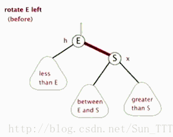

## 树

### 树中使用的术语

- **根（Root）**：树中最顶端的节点，根没有父节点。
- **子节点（Child）**：节点所拥有子树的根节点称为该节点的子节点。
- **父节点（Parent）**：如果节点拥有子节点，则该节点为子节点的父节点。
- **兄弟节点（Sibling）**：与节点拥有相同父节点的节点。
- **子孙节点（Descendant）**：节点向下路径上可达的节点。
- **叶节点（Leaf）**：没有子节点的节点。
- **内节点（Internal Node）**：至少有一个子节点的节点。
- **度（Degree）**：节点拥有子树的数量。
- **边（Edge）**：两个节点中间的链接。
- **路径（Path）**：从节点到子孙节点过程中的边和节点所组成的序列。
- **层级（Level）**：根为 Level 0 层，根的子节点为 Level 1 层，以此类推。
- **高度（Height）/深度（Depth）**：树中层的数量。比如只有 Level 0,Level 1,Level 2 则高度为 3。

| **类别**                                                     | **树名称**                                                   |
| ------------------------------------------------------------ | ------------------------------------------------------------ |
| **[二叉查找树](http://www.cnblogs.com/gaochundong/p/binary_search_tree.html)****[（Binary Search Tree）](http://www.cnblogs.com/gaochundong/p/binary_search_tree.html)** | [二叉查找树](http://www.cnblogs.com/gaochundong/p/binary_search_tree.html)，笛卡尔树，T 树 |
| **[自平衡二叉查找树](http://www.cnblogs.com/gaochundong/p/self_balancing_binary_search_tree.html)****[（Self-balancing Binary Search Tree）](http://www.cnblogs.com/gaochundong/p/self_balancing_binary_search_tree.html)** | AA 树，[AVL 树](http://www.cnblogs.com/gaochundong/p/self_balancing_binary_search_tree.html)， [红黑树（Red-Black Tree）](http://www.cnblogs.com/gaochundong/p/self_balancing_binary_search_tree.html)， 伸展树（Splay Tree） |
| **B 树****（B-Tree）**                                       | [2-3 树](http://www.cnblogs.com/gaochundong/p/balanced_search_tree.html)，[2-3-4 树](http://www.cnblogs.com/gaochundong/p/balanced_search_tree.html)， B 树，B+ 树，B* 树 |
| **字典树****（Trie-Tree）**                                  | 后缀树，基数树，三叉查找树，快速前缀树                       |
| **空间数据分割树****（Spatial Data Partitioning Tree）**     | R 树，R+ 树，R* 树， 线段树，优先 R 树                       |

### 二叉树

**二叉树（Binary Tree）是一种特殊的树类型，其每个节点最多只能有两个子节点。**这两个子节点分别称为当前节点的左孩子（left child）和右孩子（right child）。

**完全二叉树和满二叉树**

完全二叉树（Complete Binary Tree）：深度为 h，有 n 个节点的二叉树，当且仅当其每一个节点都与深度为 h 的满二叉树中，序号为 1 至 n 的节点对应时，称之为完全二叉树。

满二叉树（Full Binary Tree）：一棵深度为 h，且有 2h - 1 个节点称之为满二叉树。

|                | ***\*完全二叉树\**** | **满二叉树**    |
| -------------- | -------------------- | --------------- |
| **总节点数 k** | 2h-1 <= k < 2h - 1   | k = 2h - 1      |
| **树高 h**     | h = log2k + 1        | h = log2(k + 1) |

满二叉树的查找次数为树的深度（二分查找法），所以查询复杂度为O(logn)

### **二叉查找树（Binary Search Tree）**

二叉查找树（BST：Binary Search Tree）是一种特殊的二叉树，它改善了二叉树节点查找的效率。二叉查找树有以下性质：

对于任意一个节点 n，

- 其左子树（left subtree）下的每个后代节点（descendant node）的值都小于节点 n 的值；
- 其右子树（right subtree）下的每个后代节点的值都大于节点 n 的值。

所谓节点 n 的子树，可以将其看作是以节点 n 为根节点的树。子树的所有节点都是节点 n 的后代，而子树的根则是节点 n 本身。

### 平衡树

### 红黑树

 R-B Tree，全称是Red-Black Tree，又称为“红黑树”，它一种特殊的二叉查找树。红黑树的每个节点上都有存储位表示节点的颜色，可以是红(Red)或黑(Black)。

**红黑树的特性**:
**（1）每个节点或者是黑色，或者是红色。**
**（2）根节点是黑色。**
**（3）每个叶子节点（NIL）是黑色。 [注意：这里叶子节点，是指为空(NIL或NULL)的叶子节点！]**
**（4）如果一个节点是红色的，则它的子节点必须是黑色的。****（不能有连续的两个红色节点）**
**（5）从一个节点到该节点的子孙节点的所有路径上包含相同数目的黑节点。**

**注意**：
(01) 特性(3)中的叶子节点，是只为空(NIL或null)的节点。
(02) 特性(5)，确保没有一条路径会比其他路径长出俩倍。因而，红黑树是相对是接近平衡的二叉树。

红黑树示意图如下：

#### 右旋和右旋

##### 左旋动图

##### 右旋动图

#### 红黑树的变换规则

所有**插入的点默认都是红色**，否则全黑色就是普通二叉树了，下一步也就无法按照规律变换以达到自平衡。

1. 变色规则

   当前结点是红色，父结点是红色，且它的叔叔结点也是红色(自红，父红，叔叔红)

   1. 把父结点设为黑色
   2. 把叔叔结点设为黑色
   3. 把祖父结点设为红色
   4. 把指针结点定义到祖父结点设为当前要操作的，分析的点变换的规则（此时可能是要左右旋）

2. 左旋

- 当前结点是右子树，且是红色

- 父结点是红色

- 叔叔结点是黑色（**右红，父红，叔叔黑**）

- 以**父结点**左旋

  3 右旋
  当前节结点是左子树，红色，父结点红色，叔叔黑色。（**左红，父红，叔叔黑**）

- 把父结点变为黑色
- 把祖父变为红色
- 以**祖父为结点**右旋

#### B树

#### B+树

#### 为什么mysql用B+树做索引而不用B-树或红黑树

B-树、B+树、红黑树，都是平衡查找树，那么查询效率上讲，平均都是O(logn)。使用什么哪种数据结构，肯定是出于提高数据库的查询效率的考虑

- 红黑树是对内存操作，B数是对磁盘操作

- B树是多路树，红黑树是二叉树！红黑树一个节点只能存出一个值，B树一个节点可以存储多个值，红黑树的深度会更大,定位时 红黑树的查找次数会大一些。

  在大规模数据存储的时候，红黑树往往出现由于树的深度过大而造成磁盘IO读写过于频繁，进而导致效率低下的情况。为什么会出现这样的情况，我们知道要获取磁盘上数据，必须先通过磁盘移动臂移动到数据所在的柱面，然后找到指定盘面，接着旋转盘面找到数据所在的磁道，最后对数据进行读写。磁盘IO代价主要花费在查找所需的柱面上，树的深度过大会造成磁盘IO频繁读写。根据磁盘查找存取的次数往往由树的高度所决定，所以，只要我们通过某种较好的树结构减少树的结构尽量减少树的高度，B树可以有多个子女，从几十到上千，可以降低树的高度。

- B+树相对B数更适合区间访问

  B-树和B+树最重要的一个区别就是B+树只有叶节点存放数据，其余节点用来索引，而B-树是每个索引节点都会有Data域。
  这就决定了B+树更适合用来存储外部数据，也就是所谓的磁盘数据。B+树所有的Data域在叶子节点，一般来说都会进行一个优化，就是将所有的叶子节点用指针串起来。这样遍历叶子节点就能获得全部数据，这样就能进行区间访问啦。

## MySQL

### 索引相关

#### 1.数据库索引有哪些优缺点？

**B+树索引：** 不再需要进行全表扫描，只需要对树进行搜索即可，所以查找速度快很多

**哈希索引：** 哈希索引能以 O(1) 时间进行查找，无法用于排序与分组，并且只支持精确查找，无法用于部分查找和范围查找。

**全文索引：** MyISAM 存储引擎支持全文索引，MySQL InnoDB从5.6开始已经支持全文索引，用于查找文本中的关键词。全文索引导致磁盘资源的大量占用且必须修改查询语句。

#### 2.为什么不用二叉查找树作为数据库索引？

​    二叉查找树：查找到指定数据，效率其实很高logn。但是数据库索引文件有可能很大，关系型数据存储了上亿条数据，索引文件大则上G，不可能全部放入内存中，而是需要的时候换入内存，方式是磁盘页。一般来说树的  **一个节点就是一个磁盘页**  （可存储16k数据）。如果使用二叉查找树，那么每个节点存储一个元素，查找到指定元素，需要进行大量的磁盘IO，效率很低。
​    B树：通过单一节点包含多个data，大大降低了树的高度，大大减少了磁盘IO次数。

#### 3.为什么数据库索引不用红黑树而用B+树？

​    红黑树当插入删除元素的时候会进行频繁的变色与旋转，来保证红黑树的性质，浪费时间。但是当数据量较小，数据完全可以放入内存中，不需要进行磁盘IO时，红黑树时间复杂度比B+树低。

#### 4.MySQL索引为什么用B+树？

​    B+树索引并不能直接找到具体的行，只是找到被查找行所在的页，然后DB通过把整页读入内存，再在内存中查找。B+树的高度一般为2-4层，所以查找记录时最多只需要2-4次IO，相对二叉平衡树已经大大降低了。范围查找时，能通过叶子节点的指针获取数据。例如查找大于等于3的数据，当在叶子节点中查到3时，通过3的尾指针便能获取所有数据，而不需要再像二叉树一样再获取到3的父节点。

#### 5.B+树较B树的优势

- 单一节点存储的元素更多，使得查询的IO次数更少，所以也就使得它更适合做为数据库MySQL的底层数据结构了。
- 所有的查询都要查找到叶子节点，查询性能是稳定的，而B树，每个节点都可以查找到数据，所以不稳定。
- 所有的叶子节点形成了一个有序链表，更加便于查找。

### 最左匹配

**对于联合索引来说，要遵守最左前缀法则**

https://blog.csdn.net/qq_39390545/article/details/108540362

在***创建联合索引***的时候一定要注意索引字段顺序，常用的查询字段放在最前面。

对于index:(col1, col2, col3)

1.按照文档, 更准确的说法应该是最左前缀原则, 即如果你创建一个联合索引, 那 这个索引的任何前缀都会用于查询, (col1, col2, col3)这个联合索引的所有前缀 就是(col1), (col1, col2), (col1, col2, col3), 包含这些列的查询都会启用索 引查询.  

引擎自动优化： (col2, col1)查询会用到索引

 2.其他所有不在最左前缀里的列都不会启用索引, 即使包含了联合索引里的部分列 也不行. 即上述中的(col2), (col3), (col2, col3) 都不会启用索引去查询.
 **注意, (col1, col3)会启用(col1)的索引查询**

> 如果abc_index:(a,b，c)
>
> mysql会一直向右匹配直到遇到范围查询(>、<、between、like)就停止匹配（包括`like '陈%'`这种）。在a、b走完索引后，c已经是无序了，所以c就没法走索引，优化器会认为还不如全表扫描c字段来的快。所以只使用了(a,b)两个索引，影响了执行效率。
>
> select * from LOL where a = 2 and b > 1000  and c='JJJ疾风剑豪'
>
> 不会用索引
>
> `修改索引顺序为 abc_index:(a,c,b)`，就可以使三个索引字段都用到索引

### MySQL三大日志：binlog、redo log和undo log

https://blog.csdn.net/b644ROfP20z37485O35M/article/details/111658912

##### **binlog**（所有引擎都有，Server层面的）

binlog用于记录数据库执行的写入性操作(不包括查询)信息，以二进制的形式保存在磁盘中。binlog是mysql的逻辑日志，并且由Server层进行记录，使用任何存储引擎的mysql数据库都会记录binlog日志。

- 逻辑日志：可以简单理解为记录的就是sql语句。
- 物理日志：因为mysql数据最终是保存在数据页中的，物理日志记录的就是数据页变更。

binlog是通过追加的方式进行写入的，可以通过max_binlog_size参数设置每个binlog文件的大小，当文件大小达到给定值之后，会生成新的文件来保存日志。

##### **binlog刷盘时机**

对于InnoDB存储引擎而言，只有在事务提交时才会记录biglog，此时记录还在内存中，那么biglog是什么时候刷到磁盘中的呢？mysql通过sync_binlog参数控制biglog的刷盘时机，取值范围是0-N：

- 0：不去强制要求，由系统自行判断何时写入磁盘；
- 1：每次commit的时候都要将binlog写入磁盘；
- N：每N个事务，才会将binlog写入磁盘。

从上面可以看出，sync_binlog最安全的是设置是1，这也是MySQL 5.7.7之后版本的默认值。但是设置一个大一些的值可以提升数据库性能，因此实际情况下也可以将值适当调大，牺牲一定的一致性来获取更好的性能。

##### **redo log**（InnoDB 引擎特有，物理层）

每次事务提交的时候，将该事务涉及修改的数据页全部刷新到磁盘中。但是这么做会有严重的性能问题，主要体现在两个方面：

- 因为Innodb是以页为单位进行磁盘交互的，而一个事务很可能只修改一个数据页里面的几个字节，这个时候将完整的数据页刷到磁盘的话，太浪费资源了！
- 一个事务可能涉及修改多个数据页，并且这些数据页在物理上并不连续，使用随机IO写入性能太差！

redo log，具体来说就是只记录事务对数据页做了哪些修改

先写redo log再进行数据操作！！！

mysql支持三种将redo log buffer写入redo log file的时机，可以通过innodb_flush_log_at_trx_commit参数配置，各参数值含义如下：

##### **redo log与binlog区别**

##### **undo log**（逻辑层）

- 用于事务的回滚

原子性底层就是通过undo log实现的。undo log主要记录了数据的逻辑变化，比如一条INSERT语句，对应一条DELETE的undo log，对于每个UPDATE语句，对应一条相反的UPDATE的undo log，这样在发生错误时，就能回滚到事务之前的数据状态

##### undo log 是否是redo log的逆过程？

否，undo log是逻辑日志，对事务回滚时，只是将数据库逻辑地恢复到原来的样子，而redo log是物理日志，记录的是数据页的物理变化，显然undo log不是redo log的逆过程。

##### MySQL是如何实现可重复读的?

https://juejin.cn/post/6844904180440629262

MVCC （多版本并发控制）

InnoDB 里面每个事务都有一个唯一的事务 ID，叫作 transaction id。它在事务开始的时候向 InnoDB 的事务系统申请的，是按**申请顺序严格递增**的。

每条记录在更新的时候都会同时记录一条 undo log，这条 log 就会记录上当前事务的 transaction id，记为 row trx_id。记录上的最新值，通过回滚操作，都可以得到前一个状态的值。

在可重复读隔离级别下，一个事务在启动时，InnoDB 会为事务构造一个数组，用来保存这个事务启动瞬间，当前正在”活跃“的所有事务ID。”活跃“指的是，启动了但还没提交。

数组里面事务 ID 为最小值记为低水位，当前系统里面已经创建过的事务 ID 的最大值加 1 记为高水位。

这个视图数组和高水位，就组成了当前事务的一致性视图（read-view）。

这个视图数组把所有的 row trx_id 分成了几种不同的情况。

查询一条数据时，事务会拿到这个ReadView，去到undo log中进行判断。若查询到某一条数据：

- 先去查看undo log中的最新数据行，如果数据行的版本号小于ReadView记录的事务id最小值，就说明这条数据对当前数据库是可见的，可以直接作为结果集返回
- 若数据行版本号大于ReadView记录最大值，说明这条数据是由一个新的事务修改的，对当前事务不可见，那么就顺着版本链继续往下寻找第一条满足条件的
- 若数据行版本号在ReadView最小值和最大值之间，那么就需要进行遍历了整个ReadView了，如果数据行版本号等于ReadView的某个值，说说明该行数据仍然处于活跃状态，那么对当前事务不可见
##### 读已提交和可重复读的实现
ReadView就是这样来判断数据可见性的。

那又是如何实现读已提交和可重复读呢？其实很简单，就是生成ReadView的时机不同。

对读已提交来说，事务中的每次读操作都会生成一个新的ReadView，也就是说，如果这期间某个事务提交了，那么它就会从ReadView中移除。这样确保事务每次读操作都能读到相对比较新的数据

而对可重复读来说，事务只有在第一次进行读操作时才会生成一个ReadView，后续的读操作都会重复使用这个ReadView。也就是说，如果在此期间有其他事务提交了，那么对于可重复读来说也是不可见的，因为对它来说，事务活跃状态在第一次进行读操作时就已经确定下来，后面不会修改了。

##### 当前读

更新数据的时候，只能使用当前读，如果当前记录的行锁被其他事务占用，就需要进入锁等待。InnoDB在更新时运用一条规则：**更新数据都是先读后写的，而这个读，只能读当前的值，称为“当前读“ （current read）**

UPDATE t SET k=k+1 WHERE id=1;  原子性，会在当前事务对记录加行锁，直到事务结束，才会释放这个锁。

## 排序算法

## 动态规划

#### 问题描述

- 动态规划问题的一般形式就是求最值

  动态规划其实是运筹学的一种最优化方法，只不过在计算机问题上应用比较多，比如说让你求**最长**递增子序列呀，**最小**编辑距离呀等等。

- 存在「重叠子问题」

  动态规划的穷举有点特别，因为这类问题**存在「重叠子问题」**，如果暴力穷举的话效率会极其低下，所以需要「备忘录」或者「DP table」来优化穷举过程，避免不必要的计算

#### 动态规划三要素

- 重叠子问题
- 最优子结构
- 状态转移方程
