# [美团外卖实时数仓建设实践](https://tech.meituan.com/2021/08/26/data-warehouse-in-meituan-waimai.html)

实时数仓以端到端低延迟、SQL标准化、快速响应变化、数据统一为目标。美团外卖数据智能组总结的最佳实践是：一个通用的实时生产平台跟一个通用交互式实时分析引擎相互配合，同时满足实时和准实时业务场景。两者合理分工，互相补充，形成易开发、易维护且效率高的流水线，兼顾开发效率与生产成本，以较好的投入产出比满足业务的多样性需求。

## 01 实时场景

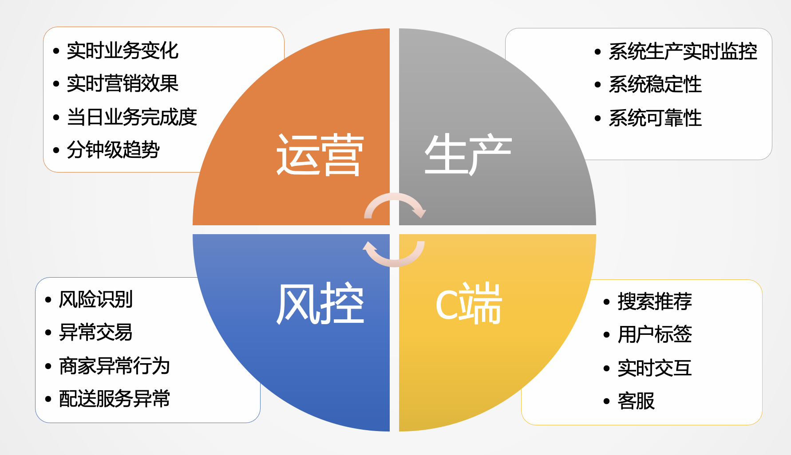

实时数据在美团外卖的场景是非常多的，主要有以下几个方面：

- **运营层面**：比如实时业务变化，实时营销效果，当日营业情况以及当日分时业务趋势分析等。
- **生产层面**：比如实时系统是否可靠，系统是否稳定，实时监控系统的健康状况等。
- **C端用户**：比如搜索推荐排序，需要实时行为、特点等特征变量的生产，给用户推荐更加合理的内容。
- **风控侧**：实时风险识别、反欺诈、异常交易等，都是大量应用实时数据的场景。

## 02 实时技术及架构

### 1. 实时计算技术选型

目前，市面上已经开源的实时技术还是很多的，比较通用的有[Storm](https://tech.meituan.com/2016/10/21/test-of-storms-reliability.html)、Spark Streaming以及[Flink](https://tech.meituan.com/2018/10/18/meishi-data-flink.html)，技术同学在做选型时要根据公司的具体业务来进行部署。

美团外卖依托于美团整体的基础数据体系建设，从技术成熟度来讲，公司前几年主要用的是Storm。当时的Storm，在性能稳定性、可靠性以及扩展性上也是无可替代的。但随着Flink越来越成熟，从技术性能上以及框架设计优势上已经超越了Storm，从趋势来讲就像Spark替代MR一样，Storm也会慢慢被Flink替代。当然，从Storm迁移到Flink会有一个过程，我们目前有一些老的任务仍然运行在Storm上，也在不断推进任务迁移。

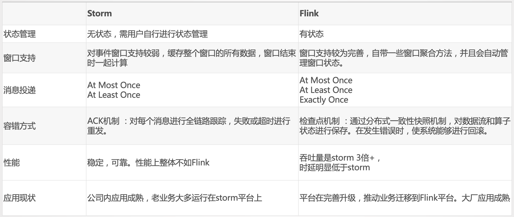

具体[Storm和Flink的对比](https://tech.meituan.com/2017/11/17/flink-benchmark.html)可以参考上图表格。

### 2. 实时架构

**① Lambda架构**

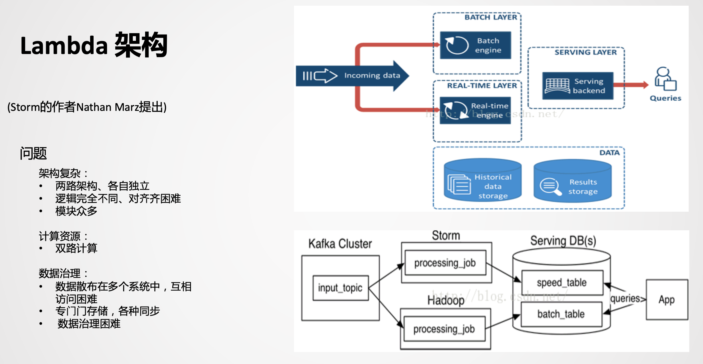

Lambda是比较经典的一款架构，以前实时的场景不是很多，以离线为主，当附加了实时场景后，由于离线和实时的时效性不同，导致技术生态是不一样的。而Lambda架构相当于附加了一条实时生产链路，在应用层面进行一个整合，双路生产，各自独立。在业务应用中，顺理成章成为了一种被采用的方式。

双路生产会存在一些问题，比如加工逻辑Double，开发运维也会Double，资源同样会变成两个资源链路。因为存在以上问题，所以又演进了一个Kappa架构。

**② Kappa架构**

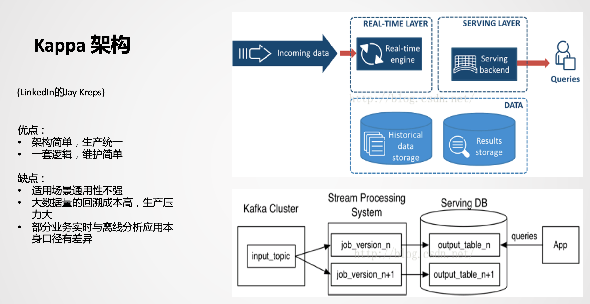

Kappa从架构设计来讲，比较简单，生产统一，一套逻辑同时生产离线和实时。但是在实际应用场景有比较大的局限性，在业内直接用Kappa架构生产落地的案例不多见，且场景比较单一。这些问题在美团外卖这边同样会遇到，我们也会有自己的一些思考，将会在后面的章节进行阐述。

## 03 业务痛点

首先，在外卖业务上，我们遇到了一些问题和挑战。在业务早期，为了满足业务需要，一般是Case By Case地先把需求完成。业务对于实时性要求是比较高的，从时效性的维度来说，没有进行中间层沉淀的机会。在这种场景下，一般是拿到业务逻辑直接嵌入，这是能想到的简单有效的方法，在业务发展初期这种开发模式也比较常见。

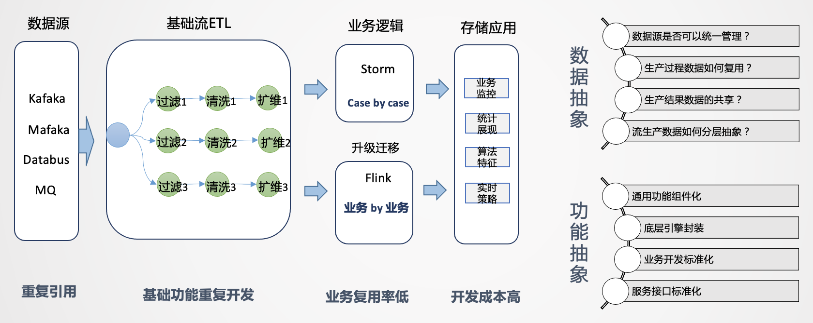

如上图所示，拿到数据源后，我们会经过数据清洗、扩维，通过Storm或Flink进行业务逻辑处理，最后直接进行业务输出。把这个环节拆开来看，数据源端会重复引用相同的数据源，后面进行清洗、过滤、扩维等操作，都要重复做一遍。唯一不同的是业务的代码逻辑是不一样的，如果业务较少，这种模式还可以接受，但当后续业务量上去后，会出现谁开发谁运维的情况，维护工作量会越来越大，作业无法形成统一管理。而且所有人都在申请资源，导致资源成本急速膨胀，资源不能集约有效利用，因此要思考如何从整体来进行实时数据的建设。

## 04 数据特点与应用场景

那么如何来构建实时数仓呢？首先要进行拆解，有哪些数据，有哪些场景，这些场景有哪些共同特点，对于外卖场景来说一共有两大类，日志类和业务类。

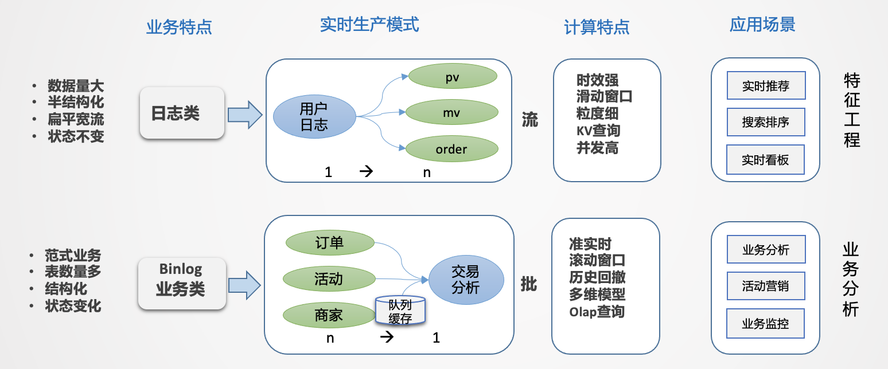

- **日志类**：数据量特别大，半结构化，嵌套比较深。日志类的数据有个很大的特点，日志流一旦形成是不会变的，通过埋点的方式收集平台所有的日志，统一进行采集分发，就像一颗树，树根非常大，推到前端应用的时候，相当于从树根到树枝分叉的过程（从1到n的分解过程）。如果所有的业务都从根上找数据，看起来路径最短，但包袱太重，数据检索效率低。日志类数据一般用于生产监控和用户行为分析，时效性要求比较高，时间窗口一般是5min或10min，或截止到当前的一个状态，主要的应用是实时大屏和实时特征，例如用户每一次点击行为都能够立刻感知到等需求。
- **业务类**：主要是业务交易数据，业务系统一般是自成体系的，以Binlog日志的形式往下分发，业务系统都是事务型的，主要采用范式建模方式。特点是结构化，主体非常清晰，但数据表较多，需要多表关联才能表达完整业务，因此是一个n到1的集成加工过程。

而业务类实时处理，主要面临的以下几个难点：

- **业务的多状态性**：业务过程从开始到结束是不断变化的，比如从下单->支付->配送，业务库是在原始基础上进行变更的，Binlog会产生很多变化的日志。而业务分析更加关注最终状态，由此产生数据回撤计算的问题，例如10点下单，13点取消，但希望在10点减掉取消单。
- **业务集成**：业务分析数据一般无法通过单一主体表达，往往是很多表进行关联，才能得到想要的信息，在实时流中进行数据的合流对齐，往往需要较大的缓存处理且复杂。
- **分析是批量的，处理过程是流式的**：对单一数据，无法形成分析，因此分析对象一定是批量的，而数据加工是逐条的。

日志类和业务类的场景一般是同时存在的，交织在一起，无论是Lambda架构还是Kappa架构，单一的应用都会有一些问题。因此针对场景来选择架构与实践才更有意义。

## 05 实时数仓架构设计

### 1. 实时架构：流批结合的探索

基于以上问题，我们有自己的思考。通过流批结合的方式来应对不同的业务场景。

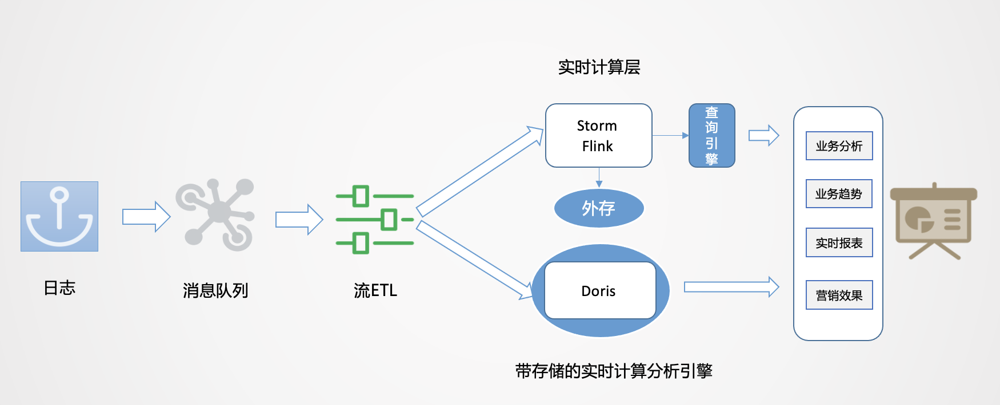

如上图所示，数据从日志统一采集到消息队列，再到数据流的ETL过程，作为基础数据流的建设是统一的。之后对于日志类实时特征，实时大屏类应用走实时流计算。对于Binlog类业务分析走实时OLAP批处理。

流式处理分析业务的痛点是什么？对于范式业务，Storm和Flink都需要很大的外存，来实现数据流之间的业务对齐，需要大量的计算资源。且由于外存的限制，必须进行窗口的限定策略，最终可能放弃一些数据。计算之后，一般是存到Redis里做查询支撑，且KV存储在应对分析类查询场景中也有较多局限。

实时OLAP怎么实现？有没有一种自带存储的实时计算引擎，当实时数据来了之后，可以灵活的在一定范围内自由计算，并且有一定的数据承载能力，同时支持分析查询响应呢？随着技术的发展，目前MPP引擎发展非常迅速，性能也在飞快提升，所以在这种场景下就有了一种新的可能。这里我们使用的是Doris引擎。

这种想法在业内也已经有实践，且成为一个重要探索方向。阿里基于ADB的实时OLAP方案等。

### 2. 实时数仓架构设计

从整个实时数仓架构来看，首先考虑的是如何管理所有的实时数据，资源如何有效整合，数据如何进行建设。

从方法论来讲，实时和离线是非常相似的。离线数仓早期的时候也是Case By Case，当数据规模涨到一定量的时候才会考虑如何治理。分层是一种非常有效的数据治理方式，所以在实时数仓如何进行管理的问题上，首先考虑的也是分层的处理逻辑，具体内容如下：

- **数据源**：在数据源的层面，离线和实时在数据源是一致的，主要分为日志类和业务类，日志类又包括用户日志、DB日志以及服务器日志等。
- **实时明细层**：在明细层，为了解决重复建设的问题，要进行统一构建，利用离线数仓的模式，建设统一的基础明细数据层，按照主题进行管理，明细层的目的是给下游提供直接可用的数据，因此要对基础层进行统一的加工，比如清洗、过滤、扩维等。
- **汇总层**：汇总层通过Flink或Storm的简洁算子直接可以算出结果，并且形成汇总指标池，所有的指标都统一在汇总层加工，所有人按照统一的规范管理建设，形成可复用的汇总结果。

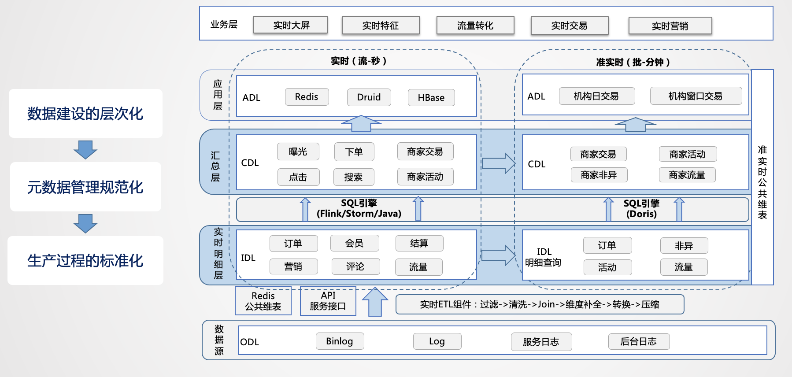

总结起来，从整个实时数仓的建设角度来讲，首先数据建设的层次化要先建出来，先搭框架，然后定规范，每一层加工到什么程度，每一层用什么样的方式，当规范定义出来后，便于在生产上进行标准化的加工。由于要保证时效性，设计的时候，层次不能太多，对于实时性要求比较高的场景，基本可以走上图左侧的数据流，对于批量处理的需求，可以从实时明细层导入到实时OLAP引擎里，基于OLAP引擎自身的计算和查询能力进行快速的回撤计算，如上图右侧的数据流。

## 06 实时平台化建设

架构确定之后，我们后面考虑的是如何进行平台化的建设，实时平台化建设是完全附加于实时数仓管理之上进行的。

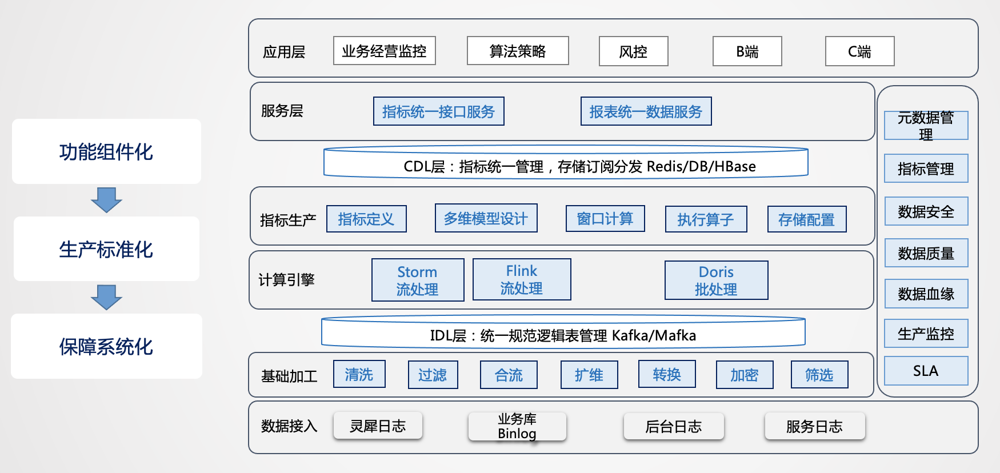

首先进行功能的抽象，把功能抽象成组件，这样就可以达到标准化的生产，系统化的保障就可以更深入的建设，对于基础加工层的清洗、过滤、合流、扩维、转换、加密、筛选等功能都可以抽象出来，基础层通过这种组件化的方式构建直接可用的数据结果流。这会产生一个问题，用户的需求多样，为了满足了这个用户，如何兼容其他的用户，因此可能会出现冗余加工的情况。从存储的维度来讲，实时数据不存历史，不会消耗过多的存储，这种冗余是可以接受的，通过冗余的方式可以提高生产效率，是一种**以空间换时间**思想的应用。

通过基础层的加工，数据全部沉淀到IDL层，同时写到OLAP引擎的基础层，再往上是实时汇总层计算，基于Storm、Flink或Doris，生产多维度的汇总指标，形成统一的汇总层，进行统一的存储分发。

当这些功能都有了以后，元数据管理，指标管理，数据安全性、SLA、数据质量等系统能力也会逐渐构建起来。

### 1. 实时基础层功能

实时基础层的建设要解决一些问题。首先是一条流重复读的问题，一条Binlog打过来，是以DB包的形式存在的，用户可能只用其中一张表，如果大家都要用，可能存在所有人都要接这个流的问题。解决方案是可以按照不同的业务解构出来，还原到基础数据流层，根据业务的需要做成范式结构，按照数仓的建模方式进行集成化的主题建设。

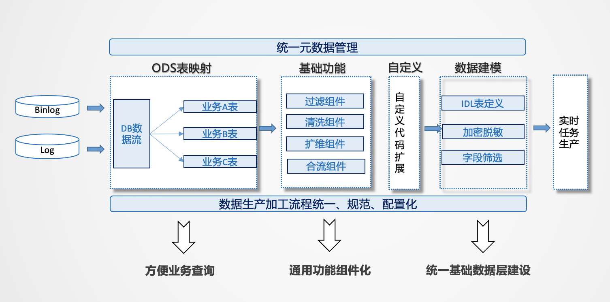

其次要进行组件的封装，比如基础层的清洗、过滤、扩维等功能，通过一个很简单的表达入口，让用户将逻辑写出来。数据转换环节是比较灵活的，比如从一个值转换成另外一个值，对于这种自定义逻辑表达，我们也开放了自定义组件，可以通过Java或Python开发自定义脚本，进行数据加工。

### 2. 实时特征生产功能

特征生产可以通过SQL语法进行逻辑表达，底层进行逻辑的适配，透传到计算引擎，屏蔽用户对计算引擎的依赖。就像对于离线场景，目前大公司很少通过代码的方式开发，除非一些特别的Case，所以基本上可以通过SQL化的方式表达。

在功能层面，把指标管理的思想融合进去，原子指标、派生指标，标准计算口径，维度选择，窗口设置等操作都可以通过配置化的方式，这样可以统一解析生产逻辑，进行统一封装。

还有一个问题，同一个源，写了很多SQL，每一次提交都会起一个数据流，比较浪费资源，我们的解决方案是，通过同一条流实现动态指标的生产，在不停服务的情况下可以动态添加指标。

所以在实时平台建设过程中，更多考虑的是如何更有效的利用资源，在哪些环节更能节约化的使用资源，这是在工程方面更多考虑的事情。

### 3. SLA建设

SLA主要解决两个问题，一个是端到端的SLA，一个是作业生产效率的SLA，我们采用埋点+上报的方式，由于实时流比较大，埋点要尽量简单，不能埋太多的东西，能表达业务即可，每个作业的输出统一上报到SLA监控平台，通过统一接口的形式，在每一个作业点上报所需要的信息，最后能够统计到端到端的SLA。

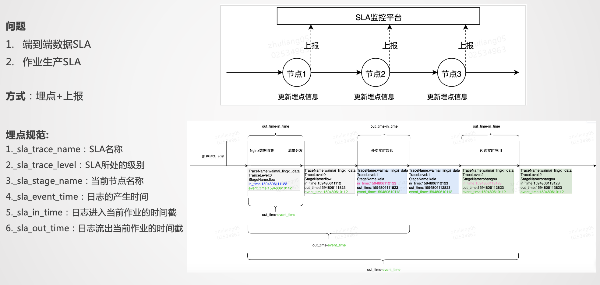

在实时生产中，由于链路非常长，无法控制所有链路，但是可以控制自己作业的效率，所以作业SLA也是必不可少的。

### 4. 实时OLAP方案

**问题**

- **Binlog业务还原复杂**：业务变化很多，需要某个时间点的变化，因此需要进行排序，并且数据要存起来，这对于内存和CPU的资源消耗都是非常大的。
- **Binlog业务关联复杂**：流式计算里，流和流之间的关联，对于业务逻辑的表达是非常困难的。

**解决方案**

通过带计算能力的OLAP引擎来解决，不需要把一个流进行逻辑化映射，只需要解决数据实时稳定的入库问题。

我们这边采用的是Doris作为高性能的OLAP引擎，由于业务数据产生的结果和结果之间还需要进行衍生计算，Doris可以利用Unique模型或聚合模型快速还原业务，还原业务的同时还可以进行汇总层的聚合，也是为了复用而设计。应用层可以是物理的，也可以是逻辑化视图。

这种模式重在解决业务回撤计算，比如业务状态改变，需要在历史的某个点将值变更，这种场景用流计算的成本非常大，OLAP模式可以很好的解决这个问题。

## 07 实时应用案例

最后通过一个案例说明，比如商家要根据用户历史下单数给用户优惠，商家需要看到历史下了多少单，历史T+1的数据要有，今天实时的数据也要有，这种场景是典型的Lambda架构。我们可以在Doris里设计一个分区表，一个是历史分区，一个是今日分区，历史分区可以通过离线的方式生产，今日指标可以通过实时的方式计算，写到今日分区里，查询的时候进行一个简单的汇总。

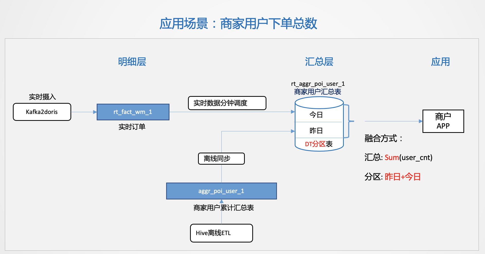

这种场景看起来比较简单，难点在于商家的量上来之后，很多简单的问题都会变得复杂。后续，我们也会通过更多的业务输入，沉淀出更多的业务场景，抽象出来形成统一的生产方案和功能，以最小化的实时计算资源支撑多样化的业务需求，这也是未来我们需要达到的目的。

# [美团基于 Flink 的实时数仓建设实践](https://tech.meituan.com/2018/10/18/meishi-data-flink.html)

## 引言

近些年，企业对数据服务实时化服务的需求日益增多。本文整理了常见实时数据组件的性能特点和适用场景，介绍了美团如何通过 Flink 引擎构建实时数据仓库，从而提供高效、稳健的实时数据服务。此前我们美团技术博客发布过一篇文章《[流计算框架 Flink 与 Storm 的性能对比](https://tech.meituan.com/Flink_Benchmark.html)》，对 Flink 和 Storm 俩个引擎的计算性能进行了比较。本文主要阐述使用 Flink 在实际数据生产上的经验。

## 实时平台初期架构

在实时数据系统建设初期，由于对实时数据的需求较少，形成不了完整的数据体系。我们采用的是“一路到底”的开发模式：通过在实时计算平台上部署 Storm 作业处理实时数据队列来提取数据指标，直接推送到实时应用服务中。

图1 初期实时数据架构

但是，随着产品和业务人员对实时数据需求的不断增多，新的挑战也随之发生。

1. 数据指标越来越多，“烟囱式”的开发导致代码耦合问题严重。
2. 需求越来越多，有的需要明细数据，有的需要 OLAP 分析。单一的开发模式难以应付多种需求。
3. 缺少完善的监控系统，无法在对业务产生影响之前发现并修复问题。

## 实时数据仓库的构建

为解决以上问题，我们根据生产离线数据的经验，选择使用分层设计方案来建设实时数据仓库，其分层架构如下图所示：

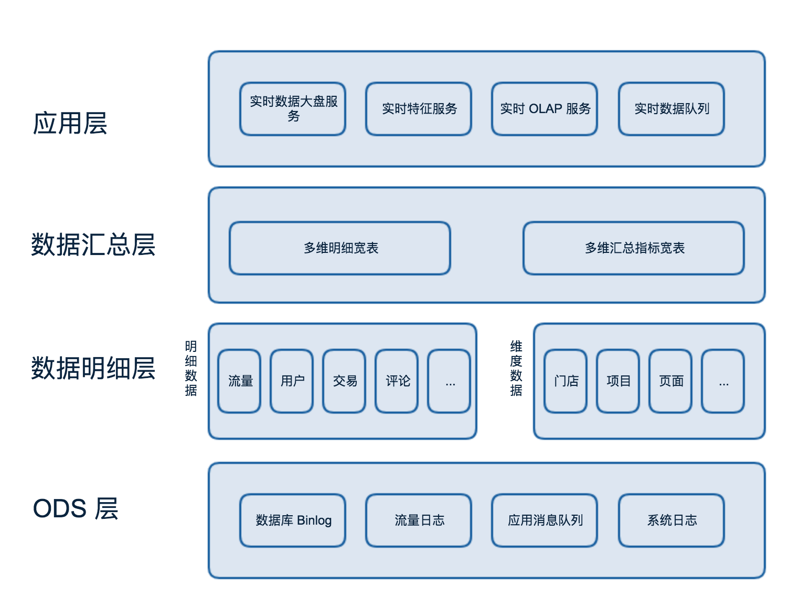

图2 实时数仓数据分层架构

**该方案由以下四层构成：**

1. ODS 层：Binlog 和流量日志以及各业务实时队列。
2. 数据明细层：业务领域整合提取事实数据，离线全量和实时变化数据构建实时维度数据。
3. 数据汇总层：使用宽表模型对明细数据补充维度数据，对共性指标进行汇总。
4. App 层：为了具体需求而构建的应用层，通过 RPC 框架对外提供服务。

通过多层设计我们可以将处理数据的流程沉淀在各层完成。比如在数据明细层统一完成数据的过滤、清洗、规范、脱敏流程；在数据汇总层加工共性的多维指标汇总数据。提高了代码的复用率和整体生产效率。同时各层级处理的任务类型相似，可以采用统一的技术方案优化性能，使数仓技术架构更简洁。

### 技术选型

#### 1.存储引擎的调研

实时数仓在设计中不同于离线数仓在各层级使用同种储存方案，比如都存储在 Hive 、DB 中的策略。首先对中间过程的表，采用将结构化的数据通过消息队列存储和高速 KV 存储混合的方案。实时计算引擎可以通过监听消息消费消息队列内的数据，进行实时计算。而在高速 KV 存储上的数据则可以用于快速关联计算，比如维度数据。 其次在应用层上，针对数据使用特点配置存储方案直接写入。避免了离线数仓应用层同步数据流程带来的处理延迟。 为了解决不同类型的实时数据需求，合理的设计各层级存储方案，我们调研了美团内部使用比较广泛的几种存储方案。

存储方案列表如下：

| 方案          | 优势                                                         | 劣势                                                         |
| :------------ | :----------------------------------------------------------- | :----------------------------------------------------------- |
| MySQL         | 1. 具有完备的事务功能，可以对数据进行更新。2. 支持 SQL，开发成本低。 | 1. 横向扩展成本大，存储容易成为瓶颈； 2. 实时数据的更新和查询频率都很高，线上单个实时应用请求就有 1000+ QPS；使用 MySQL 成本太高。 |
| Elasticsearch | 1. 吞吐量大，单个机器可以支持 2500+ QPS，并且集群可以快速横向扩展。2. Term 查询时响应速度很快，单个机器在 2000+ QPS时，查询延迟在 20 ms以内。 | 1. 没有原生的 SQL 支持，查询 DSL 有一定的学习门槛；2. 进行聚合运算时性能下降明显。 |
| Druid         | 1. 支持超大数据量，通过 Kafka 获取实时数据时，单个作业可支持 6W+ QPS；2. 可以在数据导入时通过预计算对数据进行汇总，减少的数据存储。提高了实际处理数据的效率；3. 有很多开源 OLAP 分析框架。实现如 Superset。 | 1. 预聚合导致无法支持明细的查询；2. 无法支持 Join 操作；3. Append-only 不支持数据的修改。只能以 Segment 为单位进行替换。 |
| Cellar        | 1. 支持超大数据量，采用内存加分布式存储的架构，存储性价比很高；2. 吞吐性能好，经测试处理 3W+ QPS 读写请求时，平均延迟在 1ms左右；通过异步读写线上最高支持 10W+ QPS。 | 1. 接口仅支持 KV，Map，List 以及原子加减等；2. 单个 Key 值不得超过 1KB ，而 Value 的值超过 100KB 时则性能下降明显。 |

根据不同业务场景，实时数仓各个模型层次使用的存储方案大致如下：

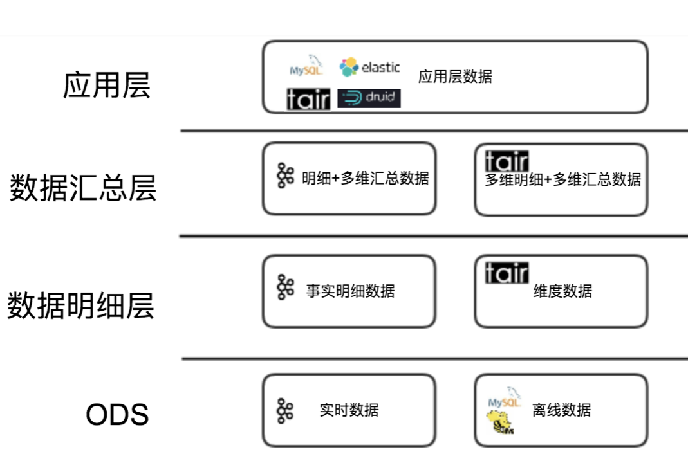

图3 实时数仓存储分层架构

1. **数据明细层** 对于维度数据部分场景下关联的频率可达 10w+ TPS，我们选择 Cellar（美团内部存储系统） 作为存储，封装维度服务为实时数仓提供维度数据。
2. **数据汇总层** 对于通用的汇总指标，需要进行历史数据关联的数据，采用和维度数据一样的方案通过 Cellar 作为存储，用服务的方式进行关联操作。
3. **数据应用层** 应用层设计相对复杂，再对比了几种不同存储方案后。我们制定了以数据读写频率 1000 QPS 为分界的判断依据。对于读写平均频率高于 1000 QPS 但查询不太复杂的实时应用，比如商户实时的经营数据。采用 Cellar 为存储，提供实时数据服务。对于一些查询复杂的和需要明细列表的应用，使用 Elasticsearch 作为存储则更为合适。而一些查询频率低，比如一些内部运营的数据。 Druid 通过实时处理消息构建索引，并通过预聚合可以快速的提供实时数据 OLAP 分析功能。对于一些历史版本的数据产品进行实时化改造时，也可以使用 MySQL 存储便于产品迭代。

#### 2.计算引擎的调研

在实时平台建设初期我们使用 Storm 引擎来进行实时数据处理。Storm 引擎虽然在灵活性和性能上都表现不错。但是由于 API 过于底层，在数据开发过程中需要对一些常用的数据操作进行功能实现。比如表关联、聚合等，产生了很多额外的开发工作，不仅引入了很多外部依赖比如缓存，而且实际使用时性能也不是很理想。同时 Storm 内的数据对象 Tuple 支持的功能也很简单，通常需要将其转换为 Java 对象来处理。对于这种基于代码定义的数据模型，通常我们只能通过文档来进行维护。不仅需要额外的维护工作，同时在增改字段时也很麻烦。综合来看使用 Storm 引擎构建实时数仓难度较大。我们需要一个新的实时处理方案，要能够实现：

1. 提供高级 API，支持常见的数据操作比如关联聚合，最好是能支持 SQL。
2. 具有状态管理和自动支持久化方案，减少对存储的依赖。
3. 便于接入元数据服务，避免通过代码管理数据结构。
4. 处理性能至少要和 Storm 一致。

我们对主要的实时计算引擎进行了技术调研。总结了各类引擎特性如下表所示：

**实时计算方案列表如下：**

| 项目引擎 | Storm                                       | Flink                                                        | spark-treaming                                               |
| :------- | :------------------------------------------ | :----------------------------------------------------------- | :----------------------------------------------------------- |
| API      | 灵活的底层 API 和具有事务保证的 Trident API | 流 API 和更加适合数据开发的 Table API 和 Flink SQL 支持      | 流 API 和 Structured-Streaming API 同时也可以使用更适合数据开发的 Spark SQL |
| 容错机制 | ACK 机制                                    | State 分布式快照保存点                                       | RDD 保存点                                                   |
| 状态管理 | Trident State状态管理                       | Key State 和 Operator State两种 State 可以使用，支持多种持久化方案 | 有 UpdateStateByKey 等 API 进行带状态的变更，支持多种持久化方案 |
| 处理模式 | 单条流式处理                                | 单条流式处理                                                 | Mic batch处理                                                |
| 延迟     | 毫秒级                                      | 毫秒级                                                       | 秒级                                                         |
| 语义保障 | At Least Once，Exactly Once                 | Exactly Once，At Least Once                                  | At Least Once                                                |

从调研结果来看，Flink 和 Spark Streaming 的 API 、容错机制与状态持久化机制都可以解决一部分我们目前使用 Storm 中遇到的问题。但 Flink 在数据延迟上和 Storm 更接近，对现有应用影响最小。而且在公司内部的测试中 Flink 的吞吐性能对比 Storm 有十倍左右提升。综合考量我们选定 Flink 引擎作为实时数仓的开发引擎。

更加引起我们注意的是，Flink 的 Table 抽象和 SQL 支持。虽然使用 Strom 引擎也可以处理结构化数据。但毕竟依旧是基于消息的处理 API ，在代码层层面上不能完全享受操作结构化数据的便利。而 Flink 不仅支持了大量常用的 SQL 语句，基本覆盖了我们的开发场景。而且 Flink 的 Table 可以通过 TableSchema 进行管理，支持丰富的数据类型和数据结构以及数据源。可以很容易的和现有的元数据管理系统或配置管理系统结合。通过下图我们可以清晰的看出 Storm 和 Flink 在开发统过程中的区别。

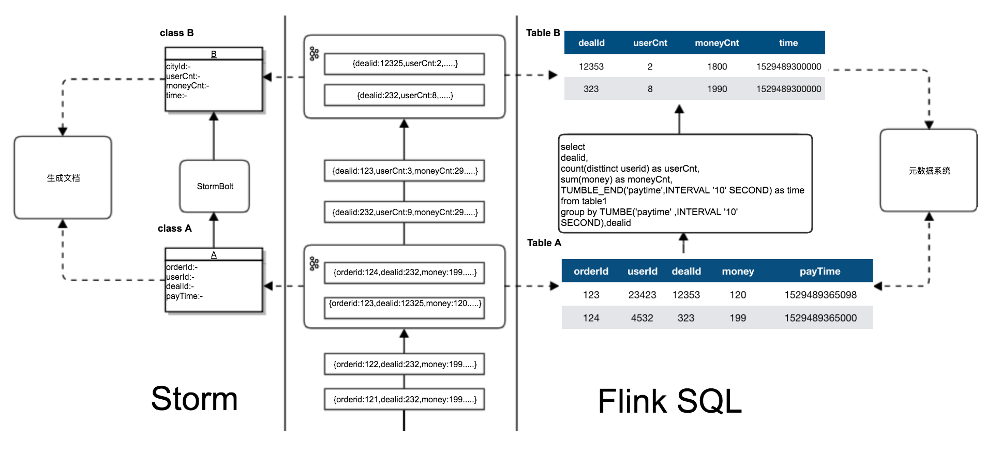

图4 Flink - Storm 对比图

在使用 Storm 开发时处理逻辑与实现需要固化在 Bolt 的代码。Flink 则可以通过 SQL 进行开发，代码可读性更高，逻辑的实现由开源框架来保证可靠高效，对特定场景的优化只要修改 Flink SQL 优化器功能实现即可，而不影响逻辑代码。使我们可以把更多的精力放到到数据开发中，而不是逻辑的实现。当需要离线数据和实时数据口径统一的场景时，我们只需对离线口径的 SQL 脚本稍加改造即可，极大地提高了开发效率。同时对比图中 Flink 和 Storm 使用的数据模型，Storm 需要通过一个 Java 的 Class 去定义数据结构，Flink Table 则可以通过元数据来定义。可以很好的和数据开发中的元数据，数据治理等系统结合，提高开发效率。

### Flink使用心得

在利用 Flink-Table 构建实时数据仓库过程中。我们针对一些构建数据仓库的常用操作，比如数据指标的维度扩充，数据按主题关联，以及数据的聚合运算通过 Flink 来实现总结了一些使用心得。

#### 1. 维度扩充

数据指标的维度扩充，我们采用的是通过维度服务获取维度信息。虽然基于 Cellar 的维度服务通常的响应延迟可以在 1ms 以下。但是为了进一步优化 Flink 的吞吐，我们对维度数据的关联全部采用了异步接口访问的方式，避免了使用 RPC 调用影响数据吞吐。 对于一些数据量很大的流，比如流量日志数据量在 10W 条/秒这个量级。在关联 UDF 的时候内置了缓存机制，可以根据命中率和时间对缓存进行淘汰，配合用关联的 Key 值进行分区，显著减少了对外部服务的请求次数，有效的减少了处理延迟和对外部系统的压力。

#### 2. 数据关联

数据主题合并，本质上就是多个数据源的关联，简单的来说就是 Join 操作。Flink 的 Table 是建立在无限流这个概念上的。在进行 Join 操作时并不能像离线数据一样对两个完整的表进行关联。采用的是在窗口时间内对数据进行关联的方案，相当于从两个数据流中各自截取一段时间的数据进行 Join 操作。有点类似于离线数据通过限制分区来进行关联。同时需要注意 Flink 关联表时必须有至少一个“等于”关联条件，因为等号两边的值会用来分组。

由于 Flink 会缓存窗口内的全部数据来进行关联，缓存的数据量和关联的窗口大小成正比。因此 Flink 的关联查询，更适合处理一些可以通过业务规则限制关联数据时间范围的场景。比如关联下单用户购买之前 30 分钟内的浏览日志。过大的窗口不仅会消耗更多的内存，同时会产生更大的 Checkpoint ，导致吞吐下降或 Checkpoint 超时。在实际生产中可以使用 RocksDB 和启用增量保存点模式，减少 Checkpoint 过程对吞吐产生影响。对于一些需要关联窗口期很长的场景，比如关联的数据可能是几天以前的数据。对于这些历史数据，我们可以将其理解为是一种已经固定不变的”维度”。可以将需要被关联的历史数据采用和维度数据一致的处理方法：”缓存 + 离线”数据方式存储，用接口的方式进行关联。另外需要注意 Flink 对多表关联是直接顺序链接的，因此需要注意先进行结果集小的关联。

#### 3. 聚合运算

使用聚合运算时，Flink 对常见的聚合运算如求和、极值、均值等都有支持。美中不足的是对于 Distinct 的支持，Flink-1.6 之前的采用的方案是通过先对去重字段进行分组再聚合实现。对于需要对多个字段去重聚合的场景，只能分别计算再进行关联处理效率很低。为此我们开发了自定义的 UDAF，实现了 MapView 精确去重、BloomFilter 非精确去重、 HyperLogLog 超低内存去重方案应对各种实时去重场景。但是在使用自定义的 UDAF 时，需要注意 RocksDBStateBackend 模式对于较大的 Key 进行更新操作时序列化和反序列化耗时很多。可以考虑使用 FsStateBackend 模式替代。另外要注意的一点 Flink 框架在计算比如 Rank 这样的分析函数时，需要缓存每个分组窗口下的全部数据才能进行排序，会消耗大量内存。建议在这种场景下优先转换为 TopN 的逻辑，看是否可以解决需求。

下图展示一个完整的使用 Flink 引擎生产一张实时数据表的过程：

图5 实时计算流程图

### 实时数仓成果

通过使用实时数仓代替原有流程，我们将数据生产中的各个流程抽象到实时数仓的各层当中。实现了全部实时数据应用的数据源统一，保证了应用数据指标、维度的口径的一致。在几次数据口径发生修改的场景中，我们通过对仓库明细和汇总进行改造，在完全不用修改应用代码的情况下就完成全部应用的口径切换。在开发过程中通过严格的把控数据分层、主题域划分、内容组织标准规范和命名规则。使数据开发的链路更为清晰，减少了代码的耦合。再配合上使用 Flink SQL 进行开发，代码加简洁。单个作业的代码量从平均 300+ 行的 JAVA 代码 ，缩减到几十行的 SQL 脚本。项目的开发时长也大幅减短，一人日开发多个实时数据指标情况也不少见。

除此以外我们通过针对数仓各层级工作内容的不同特点，可以进行针对性的性能优化和参数配置。比如 ODS 层主要进行数据的解析、过滤等操作，不需要 RPC 调用和聚合运算。 我们针对数据解析过程进行优化，减少不必要的 JSON 字段解析，并使用更高效的 JSON 包。在资源分配上，单个 CPU 只配置 1GB 的内存即可满需求。而汇总层主要则主要进行聚合与关联运算，可以通过优化聚合算法、内外存共同运算来提高性能、减少成本。资源配置上也会分配更多的内存，避免内存溢出。通过这些优化手段，虽然相比原有流程实时数仓的生产链路更长，但数据延迟并没有明显增加。同时实时数据应用所使用的计算资源也有明显减少。

## 展望

我们的目标是将实时仓库建设成可以和离线仓库数据准确性，一致性媲美的数据系统。为商家，业务人员以及美团用户提供及时可靠的数据服务。同时作为到餐实时数据的统一出口，为集团其他业务部门助力。未来我们将更加关注在数据可靠性和实时数据指标管理。建立完善的数据监控，数据血缘检测，交叉检查机制。及时对异常数据或数据延迟进行监控和预警。同时优化开发流程，降低开发实时数据学习成本。让更多有实时数据需求的人，可以自己动手解决问题。