# 服务治理到底治理的是啥

https://mp.weixin.qq.com/s/HjgGWCLbHG-ZyY4JFVyLsA  服务治理到底治理的是啥？？

凌晨四点被公司的监控告警叫醒了，告警的原因是生产环境跑批任务发生故障。即刻起床处理故障，但还是花了不少时间才解决。

这次故障是一次数据校验的跑批任务，校验前面跑批任务的数据是否正确。幸运的是，之前的核心任务已经完成，并没有影响到生产上的交易系统工作。

为什么我这里提到了交易工作呢？因为交易系统是整个系统业务流量的入口，如果交易系统发生故障，那会给公司带来直接的收入损失。

今天我们聊的话题是服务治理，服务治理最终达到的结果就是系统 **「7 \* 24」** 小时不间断服务。

## 1 监控告警

公司的这次生产告警很准确，找到系统的直接维护人，并且通知到是哪个跑批任务出了故障。这次告警是通过监控跑批任务中间件的任务执行结果来触发的。

一般情况下，告警有哪些类型呢？我们看下图：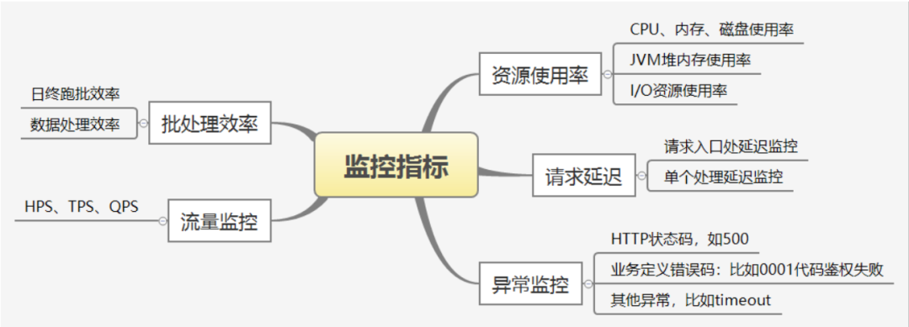

### 1.1 批处理效率

> ❝
>
> 多数情况下批处理任务是不阻碍业务入口的，所以不需要监控。
>
> ❞

在阻碍业务入口的情况下，批处理任务必须要监控。我举两个业务场景：

- 域名系统要通过dns信息和数据库记录来找出脏数据进行交易补偿，这期间客户查询域名信息可能是脏数据
- 银行日终跑批期间是不允许实时交易的，这个**「7 \* 24」**小时不间断服务相违背

这些场景下批处理效率是非常重要的一个监控指标，必须配置超时阈值并进行监控。

### 1.2 流量监控

常用的限流的指标如下图: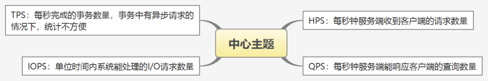流量监控我们需要注意几点：

- 不同的系统，使用的监控指标是不同的，比如`redis`，可以用`QPS`指标，对于交易系统，可以用`TPS`
- 通过测试和业务量的预估来配置合适的监控阈值
- 监控阈值需要考虑突发情况，比如秒杀、抢券等场景

### 1.3 异常监控

异常监控对于系统来说非常重要。在生产环境中很难保证程序不发生异常，配置合理的异常报警对快速定位和解决问题至关重要。比如开篇提到的跑批告警，告警信息中带着异常，让我很快就定位到了问题。

异常监控需要注意下面几个方面：

- 客户端`read timeout`,这时要尽快从服务端找出原因
- 对客户端收到响应的时间设置一个阈值，比如`1`秒，超出后触发告警
- 对业务异常一定要监控，比如失败响应码

### 1.4 资源使用率

生产环境配置系统资源时，一般要对系统资源的使用率有一个预测。比如`redis`在当前的内存增长速率下，多久会耗尽内存，数据库在当前的增长速率下多久会用光磁盘。

系统资源需要设置一个阈值，比如`70%`，超过这个限制就要触发告警。因为资源使用快要饱和时，处理效率也会严重下降。

配置资源使用率的阈值时，一定要考虑突增流量和突发业务的情况，提前预留额外的资源来应对。

对核心服务要做好限流措施，防止突增流量把系统压垮。

### 1.5 请求延迟

请求延迟并不是一个很容易统计的指标，下图是一个电商购物系统：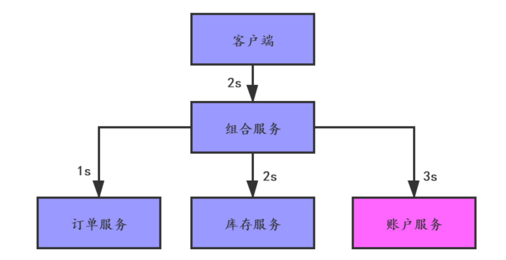这个图中，我们假设组合服务会并发地调用下面的订单、库存和账户服务。客户端发出请求后，组合服务处理请求需要花费`2`秒的处理时间，账户服务需要花费`3`秒的处理时间，那客户端配置的`read timeout`最小是`5`秒。

监控系统需要设置一个阈值来监控，比如`1`秒内如果有`100`个请求延迟都大于了`5`秒就触发报警，让系统维护人员去查找问题。

> ❝
>
> 客户端设置的`read timeout`不能太大，如果因为服务端故障导致延迟，要保证`fail-fast`，防止因为资源不能释放造成系统性能大服务降低。
>
> ❞

### 1.6 监控注意事项

监控是为了能让系统维护人员快速发现生产问题并定位到原因，不过监控系统也有几个指标需要考虑：

- 根据监控目标来指定监控指标采样频率，频率太高会增加监控成本。
- 监控覆盖率，最好能够覆盖到所有核心的系统指标。
- 监控有效性，监控指标不是越多越好，太多会给分辨报警有效性带来额外工作量，也会让开发人员习以为常。
- 告警时效，对于跑批任务这种非实时交易类系统，可以不用实时告警，记录事件后定一个时间，比如早晨8点触发告警，责任人到公司后处理。
- 为避免长尾效应，最好不要使用平均值。如下图：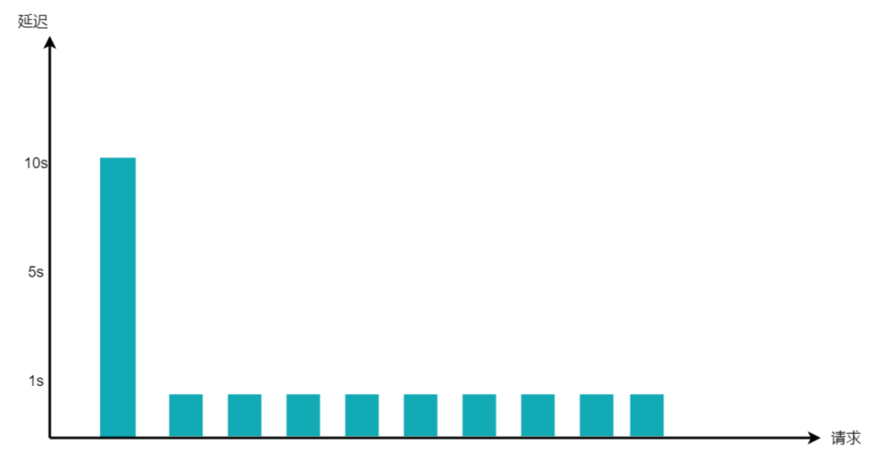10个请求，有9个延迟都是1秒，但有1个延迟是10秒，所以平均值参考意义并不大。

> ❝
>
> 可以采用按照区间分组的方式，比如延迟1秒以内的请求数量，1-2秒的请求数量，2-3秒的请求数量分组进行统计，按照指数级增长的方式来配置监控阈值。
>
> ❞

## 2 故障管理

### 2.1 常见故障原因

故障发生的原因五花八门，但常见的无非下面几种：

- 发布升级带来的故障
- 硬件资源故障
- 系统过载
- 恶意攻击
- 基础服务故障

### 2.2 应对策略

应对故障，我们分两步走：

- 立即解决故障，比如因为数据问题引起的故障，修改问题数据即可。
- 找出故障原因，可以通过查找日志或者调用链追踪系统来定位问题并解决

### 2.2.1 软件升级故障

升级带来的故障，有的是上线后能很快暴露的。有的是上线很长时间才会暴露，比如有的业务代码可能之前一直执行不到。

对于第一种情况，可以采用灰度发布的方式进行验证解决。

对于第二种情况，完全避免是很难的，我们只能最大限度的提高测试用例覆盖率。

### 2.2.2 硬件资源故障

这类故障主要分为两类：

- 硬件资源超载，比如内存不够
- 硬件资源老化

对于第一种故障一般用监控告警的方式来通知责任人处理，处理的方式主要是增加资源，找出消耗资源严重的程序进行优化。

对于第二种故障需要运维人员对硬件资源进行记录和监控，对于老化的资源及时进行更换。

### 2.3 系统过载

系统过载可能是遇到秒杀之类的突增流量，也可能是随着业务发展慢慢地超过系统承受能力，可以使用增加资源或者限流的方式来应对。

### 2.4 恶意攻击

恶意攻击的类型非常多，比如DDOS攻击、恶意软件、浏览器攻击等。

针对恶意攻击，防止手段也很多，比如对请求报文进行加密、引入专业的网络安全防火墙、定期安全扫描、核心服务部署在非默认端口等。

### 2.5 基础软件故障

如下图所示，除了业务服务外每个组件都是基础软件，都需要考虑高可用。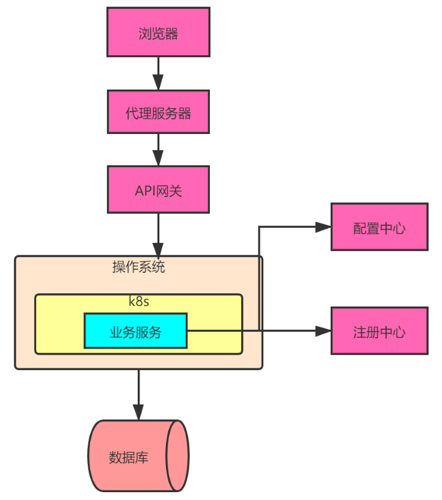

## 3 发布管理

发布通常指软硬件的升级，包括业务系统版本升级、基础软件升级、硬件环境升级等。作为程序员，本文讲的升级是针对业务系统的升级。

### 3.1 发布流程

一般情况下，业务系统升级流程如下：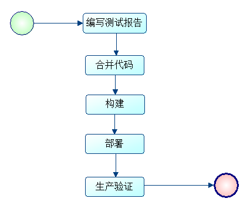发布到生产环境，验证没有问题表示发布成功。

### 3.2 发布质量

在升级软件的时候，发布质量非常重要，为保证发布质量需要注意下面这些问题。

#### 3.2.1 CheckList

为了保证发布质量，发布前维护一份`CheckList`，并且开发团队对所有的问题进行确认。等这份清单都确认完成后进行构建发布。下面是一些比较典型的问题：

- 上线sql是否正确
- 生产配置文件配置项是否完备
- 外部依赖的服务是否已经发布并验证完成
- 新机器路由权限是否已经开通
- 多个服务的发布顺序是否已经明确
- 如果上线后发生故障怎么应对

#### 3.2.2 灰度发布

灰度发布是指在黑与白之间，能够平滑过渡的一种发布方式。如下图：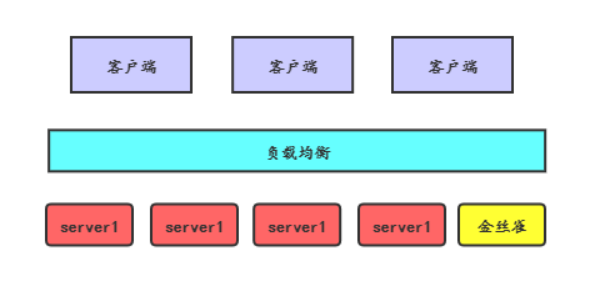升级时采用金丝雀部署的方式，先把其中一个`server`作为金丝雀进行发布升级，这个`server`在生产环境运行后没有问题，再升级其他的`server`。有问题则进行回滚。

#### 3.2.2 蓝绿部署

蓝绿部署的方式如下图：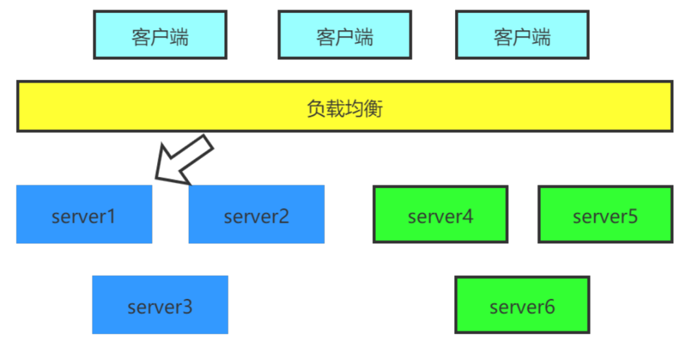升级之前客户端的请求发送到绿色服务上，升级发布之后，通过负载均衡把请求转到蓝色系统，绿色系统暂时不下线，如果生产测试没有问题，则下线绿色系统，否则切回绿色系统。

> ❝
>
> 蓝绿部署跟金丝雀部署的区别是，金丝雀部署不用增加新的机器，而蓝绿部署相当于是增加了一套新机器，需要额外的资源成本。
>
> ❞

#### 3.2.4 ab测试

`ab`测试是指在生产环境发布多个版本，主要目的是测试不同版本的不同效果。比如页面样式不一样，操作流程不一样，这样可以让用户选择一个最喜欢的版本作为最终版本。如下图：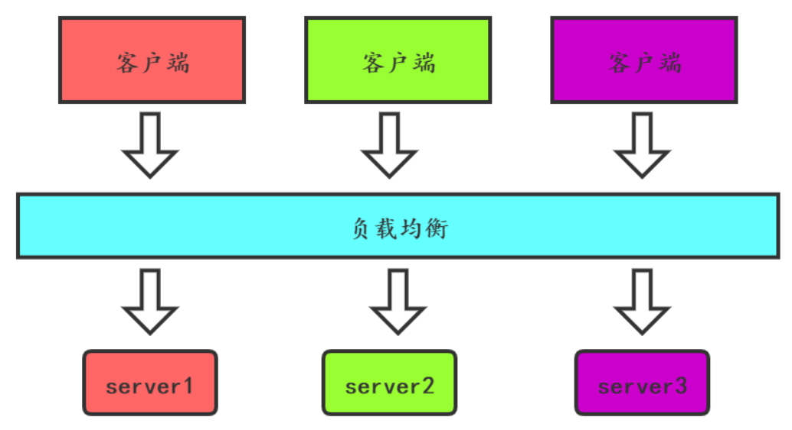三个颜色的服务部署了，客户端的请求分部发送到跟自己颜色一样的服务上。

> ❝
>
> ab测试的版本都是已经是验证没有问题的，这点不同于灰度发布。
>
> ❞

#### 3.2.4 配置变更

好多时候我们把配置写在代码里，比如`yaml`文件。这样我们修改配置后就需要重新发布新版本。如果配置修改频繁，可以考虑下面两种方法：

- 引入配置中心
- 使用外部系统保存配置

## 4 容量管理

在2.3节中讲到系统过载导致的系统故障。容量管理是保证系统上线后稳定运行的一个重要环节，主要是保证系统流量不超过系统能承受的阈值，防止系统奔溃。一般情况下，系统容量超载的原因如下：

- 业务持续增加给系统带来的流量不断增加
- 系统资源收缩，比如一台机器上新部署了一个应用，占用了一些资源
- 系统处理请求变慢，比如因为数据量变大，数据库响应变慢，导致单个请求处理时间变长，资源不能释放
- 重试导致的请求增加
- 突增流量，比如微博系统遇到明星离婚案之类的新闻。

### 4.1 重试

对于一些失败的请求进行重试，能够很好地增加系统的用户体验。重试一般分为两类，一类是对连接超时的请求，一类是对响应超时的请求。

对于连接超时的请求，可能是网络瞬时故障造成的，这种情况下重试并不会对服务端造成压力，因为失败的请求压根就没有到达服务端。

但是对于响应超时的请求，如果进行重试，可能会给服务端带来额外的压力。如下图：

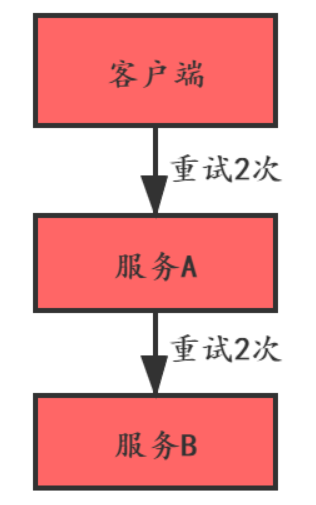

正常情况下，客户端先调用服务`A`，服务`A`再调用服务`B`，服务`B`只被调用了一次。

如果服务`B`响应慢导致超时，客户端配置了失败重试`2`次，服务`A`也配置了失败重试`2`次，在服务`B`最终不能响应的情况下，服务`B`最终被调了`9`次。

在大型分布式系统中，如果调用链很长，每个服务都配置了重试，那重试会给调用链下游服务造成巨大的压力甚至让系统奔溃。可见重试不是越多越好，合理的设置重试对系统有保护作用。

对于重试，有如下`3`个建议：

- 非核心业务不重试，如果重试，必须限定次数
- 重试时间间隔要指数增加
- 根据返回失败的状态进行重试，比如服务端定义一个拒绝码，客户端就不重试了

### 4.2 突增流量（限流、熔断）

对于突增流量，是很难提前规划到的。

遇到突增的流量时，我们可以先考虑增加资源。以`K8S`为例，如果原来有`2`个`pod`，使用`deploy`编排扩容到`4`个`pod`。命令如下：

```
kubectl scale deployment springboot-deployment --replicas=4
```

如果资源已经用完了，那就得考虑限流了。

#### 推荐几个限流框架：

- google guava
- netflix/concurrency-limits
- sentinel
- [Redis和Lua脚本](https://www.jianshu.com/p/864ddda9288f)可实现限流

#### 限流算法：

##### 漏桶

访问量从漏斗的大口进入,从漏斗的小口进入系统.这样不管是多大的访问量进入漏斗,最后进入系统的访问量都是固定的.漏斗的好处就是,大批量访问进入时,漏斗有容量,不超过容量(容量的设计=固定处理的访问量*可接受等待时长)的数据都可以排队等待处理,超过的才会丢弃.

这种方案由于`出口速率是固定的`,那么当就无法应对短时间的突发流量.

实现方式可以使用队列,队列设置容量,访问可以大批量塞入队列,满队列后丢弃后续访问量.队列的出口以固定速率拿去访问量处理.

> 出口速率是固定的,限制的是常量流出速率

##### 令牌桶

令牌桶算法会按照一定的速率生成令牌放入令牌桶,访问要进入系统时,需要从令牌桶获取令牌,有令牌的可以进入,没有的被抛弃

> 入口速率是固定的,限制的是平均流入速率

##### 漏桶、令牌桶区别

令牌桶算法算是漏斗算法的改进版,为了`处理短时间的突发流量`而做了优化

##### 计数器

计数器限流方式比较粗暴,一次访问设置一次计数,在系统内设置每秒的访问量,超过访问量的访问直接丢弃,实现访问限流.这种算法的弊端就是,在开始的时间,访问量被使用完后,1S内会有长时间的真空期是处于接口不可用的状态的.

实现方式和拓展方式很多.比如可以使用redis进行1S的100次访问计数,来一个流量100-1当数量到达0时,拒绝后续的访问.也可以不拒绝而是将请求放入缓存队列,根据实际业务情况选择不同的实现方式.

##### 滑动窗口

[滑动窗口](https://so.csdn.net/so/search?q=滑动窗口&spm=1001.2101.3001.7020)算法弥补了计数器算法的不足。滑动窗口算法把间隔时间划分成更小的粒度，当更小粒度的时间间隔过去后，把过去的间隔请求数减掉，再补充一个空的时间间隔。

### 4.3 容量规划

系统建设初期做好容量规划是非常重要的。

可以根据业务量来估算系统的`QPS`，基于`QPS`进行压力测试。针对压力测试的结果估算的容量，并不一定能应对生产环境的真实场景和突发情况，可以根据预估容量给出预留资源，比如`2`倍容量。

### 4.4 服务降级

服务降级对于服务端来说，可以有三种方式：

- 服务端容量超载后，直接拒绝新的请求
- 非核心服务暂停，预留资源给核心服务用
- 客户端可以根据服务端拒绝的请求比例来进行降级处理，比如观察`1`分钟，如果服务端对`1000`个请求，拒绝了`100`个，客户端可以作为参考，以后每分钟超过`90`个，就直接拒绝。

## 总结

微服务化的架构给系统带来了很多好处，但同时也带来了一些技术上的挑战。这些挑战包括服务注册与发现、负载均衡、监控管理、发布升级、访问控制等。而服务治理就是对这些问题进行管理和预防，保证系统持续平稳地运行。

本文所讲的服务治理方案，也算是传统意义上的方案，有时会有一些代码的侵入，而框架的选择也会对编程语言有限制。

在云原生时代，`Service Mesh`的出现又把服务治理的话题带入一个新的阶段。

http://mp.weixin.qq.com/s?__biz=MzA5ODM5MDU3MA==&mid=2650875861&idx=1&sn=0a0db3a29e2d5c80d591870c5e16365f&chksm=8b67c090bc10498655cc5643adbbe20904e0b4f346f5fc8b26b0fb66b57d8340de14bdeafda7&scene=21#wechat_redirect)

# 服务治理开源组件

https://mp.weixin.qq.com/s/yfZuC2yosRqxmHL1WeBofQ  不会服务治理，还怎么搞微服务？

## 1 服务注册发现

服务治理的第一个事儿，其实就是服务注册和发现

> Nacos 、Eureka、Zookeeper、Consul 实现服务注册和发现

## 2 负载均衡

一个服务可以发现另外一个服务实例的多台机器，到底应该调用哪一台呢？

这个时候就得用负载均衡算法了，用算法找到一台机器，然后就可以针对那台机器发起一次 RPC 调用。

> 这个负载均衡的活儿，就是 Dubbo、SpringCloud的Ribbon 给我们干的

## 3 限流熔断降级

分两块来说，因为限流是用来防止系统被压垮的，熔断是用来防止系统被拖垮的。

#### 限流

假设你的系统正常最多只能抗每秒 1000 个请求，结果此时来了每秒 2000 个请求，会如何？

当然会压垮你的系统了，所以此时我们就必须做一个限流，如果每秒超过了 1000 个请求，后续的请求全部都直接返回禁止访问。

#### 熔断

熔断的意思是说，如果你调用一个系统，结果那个系统挂了，然后你每次调用他都是失败失败失败，而且每次失败还得阻塞一会儿那不就把你自己给拖垮了吗？

所以这个时候就必须上熔断，如果一旦发现要是在一段时间内频繁调用别人失败，此时就触发熔断，熔断之后，就每次请求过来直接报错返回。

>SpringCloud Hystrix熔断器，zuul微服务网关做限流、降级，SpringCloud Alibaba 里的 Sentinel 限流熔断降级

## 4 配置中心

服务治理的下一个活儿是配置中心，就是说，平时咱们系统的配置是不是都是放在 src/main/rsource 目录下的各种 properties 和 xml 文件。

但是如果你要是系统部署上线了，你要修改配置，就只能修改代码里的配置，然后重新打包部署上线，这太麻烦了，对不对。

所以如果引入一个配置中心，系统的一些核心配置直接从配置中心里动态加载，然后如果要修改配置直接在配置中心里修改。

接着线上系统直接就感知到最新配置运用就可以了，那就不用每次修改配置都打包重新部署了

> 这个配置中心的活儿是SpringCloud Alibaba的 Nacos 、apollo 配置中心、美团Lion给我们干的。

## 5 监控、分布式链路追踪

服务监控，这个监控包括了很多内容，比如说对线上系统部署的各个服务器的 CPU、内存、磁盘、网络、IO 进行监控，以及对线上系统的 JVM GC 进行监控，包括对线上系统的各个接口的 QPS 和延迟进行监控。同时还可以对线上微服务系统的各个服务之间进行调用的调用链路进行监控。

> Skywalking 通常可以追踪我们的微服务调用链路，Prometheus 可以对我们的线上系统的服务器、JVM 以及接口各个层次进行监控。

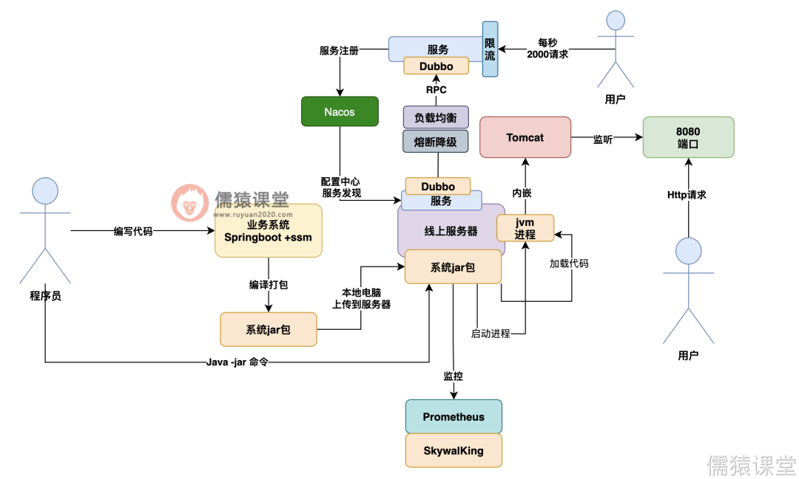

# 下一代微服务，到底什么是Service Mesh（服务网格）

## 那么，到底什么是Service Mesh？

一言以蔽之：Service Mesh是微服务时代的TCP协议。有了这样一个感性的初步认知，我们再来看到底什么是Service Mesh。

提到Service Mesh，就不得不提微服务。根据维基百科的定义：微服务(Microservices)是一种软件架构风格，它是以专注于单一责任与功能的小型功能区块(Small Building Blocks)为基础，利用模块化的方式组合出复杂的大型应用程序，各功能区块使用与语言无关（Language-Independent /Language agnostic）的API集相互通信。

目前业界跟微服务相关的开发平台和框架更是不胜枚举：Spring Cloud、Service Fabric、Linkerd、Envoy、Istio等等这些纷繁的产品和Sevice Mesh有什么样的关联？哪些属于Service Mesh的范畴？

为了理清这些繁复的产品和概念，我们先来了解下微服务和Service Mesh技术的历史发展脉络。

了解清楚了技术的主要脉络，就能清晰的知道上述的各个平台、框架属于技术脉络中的哪个结点，其间的关系也就一目了然。

Phil Calçado的文章<Pattern: Service Mesh>，详细的介绍了从开发者视角来看，服务开发模式和Service Mesh技术的演化过程，个人认为是非常经典的学习Service Mesh的资料。

这里借用文章的脉络，结合自己的理解并予以简化，试图说清楚ServiceMesh的概念和这项技术诞生的历史必然性。

### 时代0：开发人员想象中，不同服务间的通信

抽象表示如下：

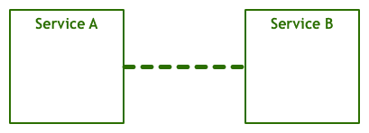

### 时代1：原始通信时代

然而现实远比想象的复杂，在实际情况中，通信需要底层能够传输字节码和电子信号的物理层来完成，在TCP协议出现之前，服务需要自己处理网络通信所面临的丢包、乱序、重试等一系列流控问题，因此服务实现中，除了业务逻辑外，还夹杂着对网络传输问题的处理逻辑。

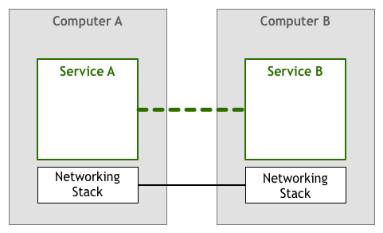

### 时代2：TCP时代

为了避免每个服务都需要自己实现一套相似的网络传输处理逻辑，TCP协议出现了，它解决了网络传输中通用的流量控制问题，将技术栈下移，从服务的实现中抽离出来，成为操作系统网络层的一部分。

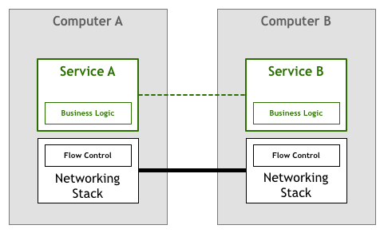

### 时代3：第一代微服务

在TCP出现之后，机器之间的网络通信不再是一个难题，以GFS/BigTable/MapReduce为代表的分布式系统得以蓬勃发展。

这时，分布式系统特有的通信语义又出现了，如熔断策略、负载均衡、服务发现、认证和授权、quota限制、trace和监控等等，于是服务根据业务需求来实现一部分所需的通信语义。

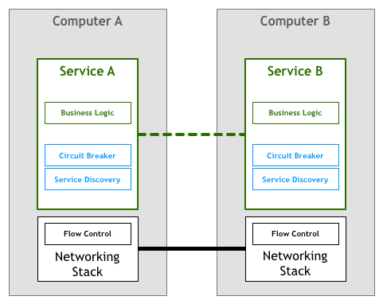

### 时代4：第二代微服务

为了避免每个服务都需要自己实现一套分布式系统通信的语义功能，随着技术的发展，一些面向微服务架构的开发框架出现了，如Twitter的Finagle、Facebook的Proxygen以及Spring Cloud等等。

这些框架实现了分布式系统通信需要的各种通用语义功能：如负载均衡和服务发现等，因此一定程度上屏蔽了这些通信细节，使得开发人员使用较少的框架代码就能开发出健壮的分布式系统。

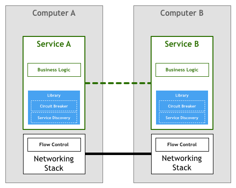

### 时代5：第一代Service Mesh

第二代微服务模式看似完美，但开发人员很快又发现，它也存在一些本质问题：

- 其一，虽然框架本身屏蔽了分布式系统通信的一些通用功能实现细节，但开发者却要花更多精力去掌握和管理复杂的框架本身，在实际应用中，去追踪和解决框架出现的问题也绝非易事；
- 其二，开发框架通常只支持一种或几种特定的语言，回过头来看文章最开始对微服务的定义，一个重要的特性就是语言无关，但那些没有框架支持的语言编写的服务，很难融入面向微服务的架构体系，想因地制宜的用多种语言实现架构体系中的不同模块也很难做到；
- 其三，框架以lib库的形式和服务联编，复杂项目依赖时的库版本兼容问题非常棘手，同时，框架库的升级也无法对服务透明，服务会因为和业务无关的lib库升级而被迫升级。

因此以Linkerd，Envoy，Ngixmesh为代表的代理模式（边车模式）应运而生，这就是第一代Service Mesh，它将分布式服务的通信抽象为单独一层，在这一层中实现负载均衡、服务发现、认证授权、监控追踪、流量控制等分布式系统所需要的功能，作为一个和服务对等的代理服务，和服务部署在一起，接管服务的流量，通过代理之间的通信间接完成服务之间的通信请求，这样上边所说的三个问题也迎刃而解。

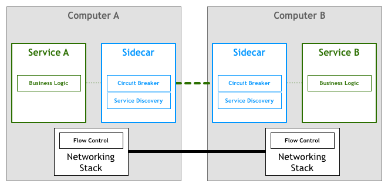

如果我们从一个全局视角来看，很容易就会得到如下部署图：

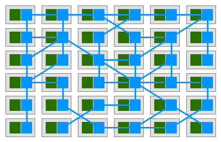

如果我们暂时略去服务，只看Service Mesh的单机组件组成的网络：

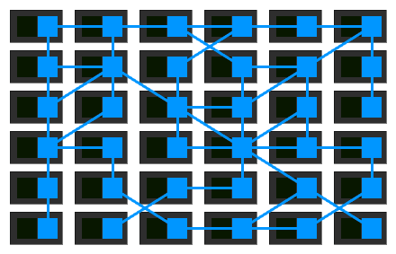

相信现在，大家已经理解何所谓Service Mesh，也就是服务网格了。它看起来确实就像是一个由若干服务代理所组成的错综复杂的网格。

### 时代6：第二代Service Mesh

第一代Service Mesh由一系列独立运行的单机代理服务构成，为了提供统一的上层运维入口，演化出了集中式的控制面板，所有的单机代理组件通过和控制面板交互进行网络拓扑策略的更新和单机数据的汇报。这就是以Istio为代表的第二代Service Mesh。

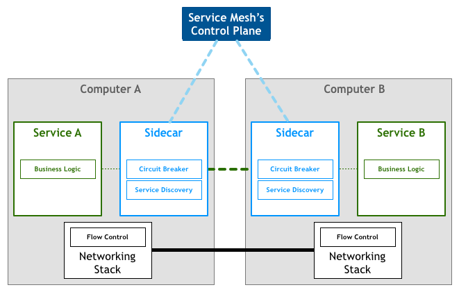

只看单机代理组件(数据面板)和控制面板的Service Mesh全局部署视图如下：

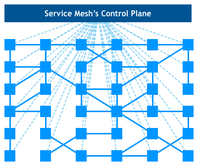

至此，见证了6个时代的变迁，大家一定清楚了Service Mesh技术到底是什么，以及是如何一步步演化到今天这样一个形态。

现在，我们再回过头来看Buoyant的CEO William Morgan，也就是Service Mesh这个词的发明人，对Service Mesh的定义：

服务网格是一个基础设施层，用于处理服务间通信。云原生应用有着复杂的服务拓扑，服务网格保证请求在这些拓扑中可靠地穿梭。

在实际应用当中，服务网格通常是由一系列轻量级的网络代理组成的，它们与应用程序部署在一起，但对应用程序透明。这个定义中，有四个关键词：

- 基础设施层+请求在这些拓扑中可靠穿梭：这两个词加起来描述了Service Mesh的定位和功能，是不是似曾相识？没错，你一定想到了TCP；
- 网络代理：这描述了Service Mesh的实现形态；
- 对应用透明：这描述了Service Mesh的关键特点，正是由于这个特点，Service Mesh能够解决以Spring Cloud为代表的第二代微服务框架所面临的三个本质问题。

## Service Mesh具有如下优点

- 屏蔽分布式系统通信的复杂性（负载均衡、服务发现、认证授权、监控追踪、流量控制等等），服务只用关注业务逻辑；
- 真正的语言无关，服务可以用任何语言编写，只需和Service Mesh通信即可；
- 对应用透明，Service Mesh组件可以单独升级。

## Service Mesh目前也面临一些挑战

- Service Mesh组件以代理模式计算并转发请求，一定程度上会降低通信系统性能，并增加系统资源开销；
- Service Mesh组件接管了网络流量，因此服务的整体稳定性依赖于Service Mesh，同时额外引入的大量Service Mesh服务实例的运维和管理也是一个挑战；

历史总是惊人的相似。为了解决端到端的字节码通信问题，TCP协议诞生，让多机通信变得简单可靠；微服务时代，Service Mesh应运而生，屏蔽了分布式系统的诸多复杂性，让开发者可以回归业务，聚焦真正的价值。

# Service Mesh 框架

https://mp.weixin.qq.com/s/jOVVJOcC67wyB32nvdZXmg

https://blog.csdn.net/qq_39578545/article/details/117668043

https://zhuanlan.zhihu.com/p/397945267

### Istio

Istio是⼀个Service Mesh形态的⽤于服务治理的开放平台。（治理的是服务间的访问）

连接：Istio 通过集中配置的流量规则控制服务间的流量和调⽤，实现负载均衡、熔断、故障注⼊、重试、重定向等服务治理功能。

保护：Istio 提供透明的认证机制、通道加密、服务访问授权等安全能⼒，可增强服务访问的安全性。

控制：Istio 通过可动态插拔、可扩展的策略实现访问控制、速率限制、配额管理、服务计费等能⼒。

观测：动态获取服务运⾏数据和输出，提供强⼤的调⽤链、监控和调⽤⽇志收集输出的能⼒。配合可视化⼯具，可⽅便运维⼈员了解服务的运⾏状况，发现并解决问题。

Service Mesh 是一个专门处理服务通讯的基础设施层。它的职责是在由云原生应用组成服务的复杂拓扑结构下进行可靠的请求传送。

在实践中，它是一组和应用服务部署在一起的轻量级的网络代理，并且对应用服务透明。

主要有控制面和数据面组成，数据面截获不同服务之间的调用并对其进行“处理”；控制面协调代理的行为，并为运维人员提供 API，用来操控和测量整个网络。

#### istio架构和主要功能

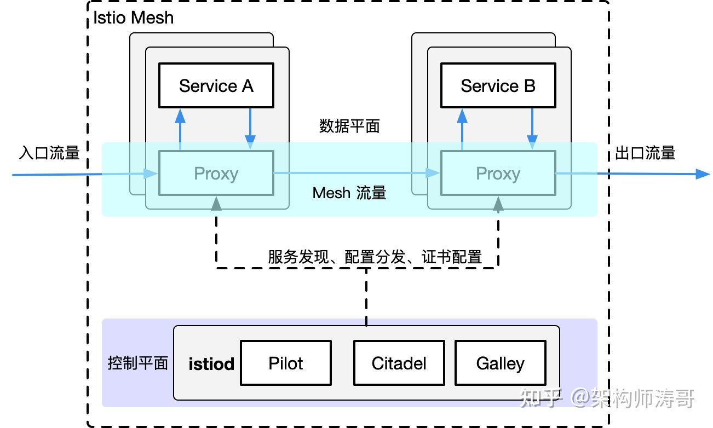