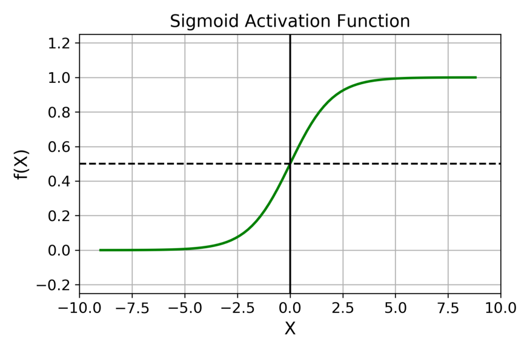
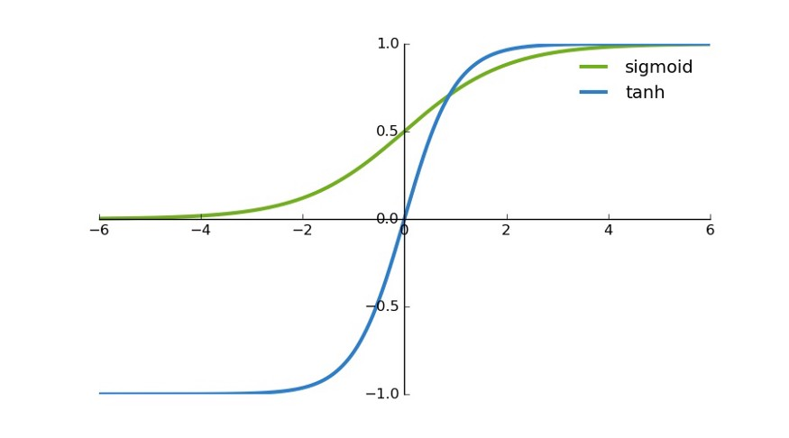
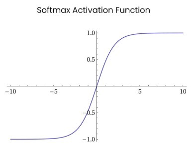
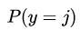
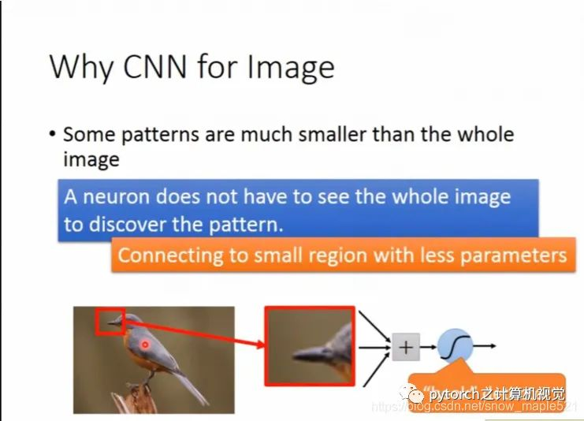
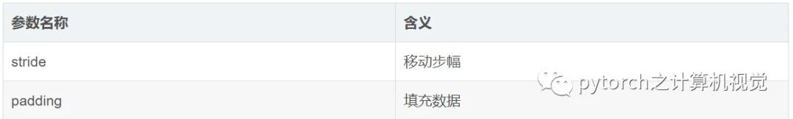

# 概念

## 常用激活函数

https://mp.weixin.qq.com/s/irha7DB2l0GfdAJdsPXlMA

https://zhuanlan.zhihu.com/p/32610035

激活函数的发展经历了Sigmoid -> Tanh -> ReLU -> Leaky ReLU -> Maxout这样的过程，还有一个特殊的激活函数Softmax，因为它只会被用在网络中的最后一层，用来进行最后的分类和归一化

Sigmoid

**存在问题：**

- *Sigmoid函数饱和使梯度消失*。当神经元的激活在接近0或1处时会饱和，在这些区域梯度几乎为0，这就会导致梯度消失，几乎就有没有信号通过神经传回上一层。
- *Sigmoid函数的输出不是零中心的*。因为如果输入神经元的数据总是正数，那么关于![[公式]](https://www.zhihu.com/equation?tex=w)的梯度在反向传播的过程中，将会要么全部是正数，要么全部是负数，这将会导致梯度下降权重更新时出现z字型的下降。

tanh

交易所产品研发部，用户账户、资产、fanyong、交易、订单------合约1k亿美金，100亿，20-30 Java boot Do

**存在问题：**

Tanh解决了Sigmoid的输出是不是零中心的问题，但仍然存在饱和问题。

relu

leak relu

**Maxout**

Softmax


## 准确率、精确率、召回率、F1值、ROC/AUC概念

https://blog.csdn.net/u013063099/article/details/80964865

二、准确率、精确率（精准率）、召回率、F1值

1.准确率（Accuracy）。顾名思义，就是所有的预测正确（正类负类）的占总的比重。

2.精确率（Precision），查准率。即正确预测为正的占全部预测为正的比例。个人理解：真正正确的占所有预测为正的比例。

3.召回率（Recall），查全率。即正确预测为正的占全部实际为正的比例。个人理解：真正正确的占所有实际为正的比例。

4.F1值（H-mean值）。F1值为算数平均数除以几何平均数，且越大越好，将Precision和Recall的上述公式带入会发现，当F1值小时，True Positive相对增加，而false相对减少，即Precision和Recall都相对增加，即F1对Precision和Recall都进行了加权。

# Bert

https://zhuanlan.zhihu.com/p/151412524

## **问题1：bert的具体网络结构，以及训练过程，bert为什么火，它在什么的基础上改进了些什么？**

bert是用了transformer的encoder侧的网络，作为一个文本编码器，使用大规模数据进行预训练，预训练使用两个loss，一个是mask LM，遮蔽掉源端的一些字（可能会被问到mask的具体做法，15%概率mask词，这其中80%用[mask]替换，10%随机替换一个其他字，10%不替换，至于为什么这么做，那就得问问BERT的作者了\{捂脸}），然后根据上下文去预测这些字，一个是next sentence，判断两个句子是否在文章中互为上下句，然后使用了大规模的语料去预训练。在它之前是GPT，GPT是一个单向语言模型的预训练过程（**它和gpt的区别就是bert为啥叫双向 bi-directional**），更适用于文本生成，通过前文去预测当前的字。下图为transformer的结构，bert的网络结构则用了左边的encoder。


## **问题6 如何优化BERT性能**

1 压缩层数，然后蒸馏，直接复用12层bert的前4层或者前6层，效果能和12层基本持平，如果不蒸馏会差一些。

2 双塔模型（短文本匹配任务），将bert作为一个encoder，输入query编码成向量，输入title编码成向量，最后加一个DNN网络计算打分即可。离线缓存编码后的向量，在线计算只需要计算DNN网络。

3 int8预估，在保证模型精度的前提下，将Float32的模型转换成Int8的模型。

4 提前结束，大致思想是简单的case前面几层就可以输出分类结果，比较难区分的case走完12层，但这个在batch里面计算应该怎么优化还没看明白，有的提前结束有的最后结束，如果在一个batch里面的话就不太好弄。感兴趣的可以看看⬇️。

[https://arxiv.org/pdf/2006.04152.pdfarxiv.org](https://link.zhihu.com/?target=https%3A//arxiv.org/pdf/2006.04152.pdf)

5 ALBERT 做了一些改进优化，主要是不同层之间共享参数，以及用矩阵分解降低embedding的参数，可以看看⬇️。

[如何看待瘦身成功版BERT——ALBERT？www.zhihu.com](https://www.zhihu.com/question/347898375/answer/863537122)


## **问题7 self-attention相比lstm优点是什么？**

bert通过使用self-attention + position embedding对序列进行编码，lstm的计算过程是从左到右从上到下（如果是多层lstm的话），后一个时间节点的emb需要等前面的算完，而bert这种方式相当于并行计算，虽然模型复杂了很多，速度其实差不多。


# 常用损失函数

  https://mp.weixin.qq.com/s/qaJQUUZemzZU3U-XeK_LwQ  深度学习常用损失函数的基本形式、原理及特点

https://mp.weixin.qq.com/s/OrbwxiO2gB7lnglj9bvtkg  十九种损失函数，你能认识几个？

机器学习中的监督学习本质上是给定一系列训练样本 ，尝试学习 的映射关系，使得给定一个 ，即便这个 不在训练样本中，也能够得到尽量接近真实 的输出 。而损失函数（Loss Function）则是这个过程中关键的一个组成部分，用来衡量模型的输出 与真实的 之间的差距，给模型的优化指明方向。

本文将介绍机器学习、深度学习中分类与回归常用的几种损失函数，包括:

- 均方差损失 `Mean Squared Loss`
- 平均绝对误差损失 `Mean Absolute Error Loss`
- Huber 损失 `HuberLoss`
- 分位数损失 `Quantile Loss`
- 交叉熵损失函数 `Cross Entropy Loss`
- Hinge 损失 `Hinge Loss`

主要介绍各种损失函数的基本形式、原理、特点等方面。

目录

1. 前言
2. 均方差损失 Mean Squared Error Loss
3. 平均绝对误差损失 Mean Absolute Error Loss
4. Huber Loss
5. 分位数损失 Quantile Loss
6. 交叉熵损失 Cross Entropy Loss
7. 合页损失 Hinge Loss
8. 总结


写在前面


在正文开始之前，先说下关于 Loss Function、Cost Function 和 Objective Function 的区别和联系。在机器学习的语境下这三个术语经常被交叉使用。

- **损失函数** Loss Function 通常是**针对单个训练样本而言**，给定一个模型输出 和一个真实 ，损失函数输出一个实值损失 
- **代价函数** Cost Function 通常是**针对整个训练集**（或者在使用 mini-batch gradient descent 时一个 mini-batch）的总损失 
- **目标函数** Objective Function 是一个更通用的术语，表示任意希望被优化的函数，用于机器学习领域和非机器学习领域（比如运筹优化）

一句话总结三者的关系就是：`A loss function is a part of a cost function which is a type of an objective function.`

由于损失函数和代价函数只是在针对样本集上有区别，因此在本文中统一使用了损失函数这个术语，但下文的相关公式实际上采用的是代价函数 Cost Function 的形式，请读者自行留意。


## 均方差损失 MSE

### **基本形式与原理**

均方差 Mean Squared Error (MSE) 损失是机器学习、深度学习回归任务中最常用的一种损失函数，也称为 L2 Loss。其基本形式如下


从直觉上理解均方差损失，这个损失函数的最小值为 0（当预测等于真实值时），最大值为无穷大。下图是对于真实值 ，不同的预测值 的均方差损失的变化图。横轴是不同的预测值，纵轴是均方差损失，可以看到随着预测与真实值绝对误差 的增加，均方差损失呈二次方地增加。


### 背后的假设


可以看到这个实际上就是均方差损失的形式。也就是说**在模型输出与真实值的误差服从高斯分布的假设下，最小化均方差损失函数与极大似然估计本质上是一致的**，因此在这个假设能被满足的场景中（比如回归），均方差损失是一个很好的损失函数选择；当这个假设没能被满足的场景中（比如分类），均方差损失不是一个好的选择。


## 平方绝对误差损失 MAE


### 基本形式与原理

平均绝对误差 Mean Absolute Error (MAE) 是另一类常用的损失函数，也称为` L1 Loss`。其基本形式如下


同样的我们可以对这个损失函数进行可视化如下图，MAE 损失的最小值为 0（当预测等于真实值时），最大值为无穷大。可以看到随着预测与真实值绝对误差 的增加，MAE 损失呈线性增长


### 背后的假设


## MAE 与 MSE 区别

MAE 和 MSE 作为损失函数的主要区别是：MSE 损失相比 MAE 通常可以更快地收敛，但 MAE 损失对于 outlier 更加健壮，即更加不易受到 outlier 影响。

**MSE 通常比 MAE 可以更快地收敛**。当使用梯度下降算法时，MSE 损失的梯度为 ，而 MAE 损失的梯度为 ，即 MSE 的梯度的 scale 会随误差大小变化，而 MAE 的梯度的 scale 则一直保持为 1，即便在绝对误差 很小的时候 MAE 的梯度 scale 也同样为 1，这实际上是非常不利于模型的训练的。当然你可以通过在训练过程中动态调整学习率缓解这个问题，但是总的来说，损失函数梯度之间的差异导致了 MSE 在大部分时候比 MAE 收敛地更快。这个也是 MSE 更为流行的原因。

**MAE 对于 outlier 更加 robust**。我们可以从两个角度来理解这一点：

- 第一个角度是直观地理解，下图是 MAE 和 MSE 损失画到同一张图里面，由于MAE 损失与绝对误差之间是线性关系，MSE 损失与误差是平方关系，当误差非常大的时候，MSE 损失会远远大于 MAE 损失。因此当数据中出现一个误差非常大的 outlier 时，MSE 会产生一个非常大的损失，对模型的训练会产生较大的影响。


- 第二个角度是从两个损失函数的假设出发，MSE 假设了误差服从高斯分布，MAE 假设了误差服从拉普拉斯分布。拉普拉斯分布本身对于 outlier 更加 robust。参考下图（来源：Machine Learning: A Probabilistic Perspective 2.4.3 The Laplace distribution Figure 2.8），当右图右侧出现了 outliers 时，拉普拉斯分布相比高斯分布受到的影响要小很多。因此以拉普拉斯分布为假设的 MAE 对 outlier 比高斯分布为假设的 MSE 更加 robust。


## Huber Loss

> 将 MSE 与 MAE 结合起来

上文我们分别介绍了 MSE 和 MAE 损失以及各自的优缺点，MSE 损失收敛快但容易受 outlier 影响，MAE 对 outlier 更加健壮但是收敛慢，Huber Loss 则是一种将 MSE 与 MAE 结合起来，取两者优点的损失函数，也被称作 Smooth Mean Absolute Error Loss 。其原理很简单，就是在误差接近 0 时使用 MSE，误差较大时使用 MAE，公式为


下图是  时的 Huber Loss，可以看到在 的区间内实际上就是 MSE 损失，在 和 区间内为 MAE损失。


### Huber Loss 的特点

Huber Loss 结合了 MSE 和 MAE 损失，在误差接近 0 时使用 MSE，使损失函数可导并且梯度更加稳定；在误差较大时使用 MAE 可以降低 outlier 的影响，使训练对 outlier 更加健壮。缺点是需要额外地设置一个 超参数。


## 分位数损失

分位数回归 Quantile Regression 是一类在实际应用中非常有用的回归算法，通常的回归算法是拟合目标值的期望或者中位数，而分位数回归可以通过给定不同的分位点，拟合目标值的不同分位数。例如我们可以分别拟合出多个分位点，得到一个置信区间，如下图所示（图片来自笔者的一个分位数回归代码 demo Quantile Regression Demo）


分位数回归是通过使用分位数损失 Quantile Loss 来实现这一点的，分位数损失形式如下，式中的 r 分位数系数。


我们如何理解这个损失函数呢？这个损失函数是一个分段的函数 ，将 （高估） 和 （低估） 两种情况分开来，并分别给予不同的系数。当 时，低估的损失要比高估的损失更大，反过来当 时，低估的损失要比高估的损失更大，反过来当 时，高估的损失比低估的损失大；分位数损失实现了**分别用不同的系数控制高估和低估的损失，进而实现分位数回归**。特别地，当 时，分位数损失退化为 MAE 损失，从这里可以看出 MAE 损失实际上是分位数损失的一个特例 — 中位数回归（这也可以解释为什么 MAE 损失对 outlier 更鲁棒：MSE 回归期望值，MAE 回归中位数，通常 outlier 对中位数的影响比对期望值的影响小）。


下图是取不同的分位点 0.2、0.5、0.6 得到的三个不同的分位损失函数的可视化，可以看到 0.2 和 0.6 在高估和低估两种情况下损失是不同的，而 0.5 实际上就是 MAE。


## 交叉熵损失

上文介绍的几种损失函数都是适用于回归问题损失函数，对于`分类问题`，最常用的损失函数是交叉熵损失函数 Cross Entropy Loss。

### 二分类


下图是对二分类的交叉熵损失函数的可视化，蓝线是目标值为 0 时输出不同输出的损失，黄线是目标值为 1 时的损失。可以看到约接近目标值损失越小，随着误差变差，损失呈指数增长。


### 多分类

在多分类的任务中，交叉熵损失函数的推导思路和二分类是一样的，变化的地方是真实值 现在是一个 One-hot 向量，同时模型输出的压缩由原来的 Sigmoid 函数换成 Softmax 函数。Softmax 函数将每个维度的输出范围都限定在(0,1)  之间，同时所有维度的输出和为 1，用于表示一个概率分布。


### Cross Entropy is good. But WHY？分类中为什么不用均方差损失？

分类中为什么不用均方差损失？上文在介绍均方差损失的时候讲到实际上均方差损失假设了`误差服从高斯分布`，在分类任务下这个假设没办法被满足，因此效果会很差。为什么是交叉熵损失呢？有两个角度可以解释这个事情，一个角度从最大似然的角度，也就是我们上面的推导；另一个角度是可以用信息论来解释交叉熵损失：

**通过最小化交叉熵的角度推导出来的结果和使用最大 化似然得到的结果是一致的**。


## 合页损失


合页损失 Hinge Loss 是另外一种二分类损失函数，适用于 maximum-margin 的分类，支持向量机 Support Vector Machine (SVM) 模型的损失函数本质上就是 Hinge Loss + L2 正则化。合页损失的公式如下


下图是 为正类， 即 时，不同输出的合页损失示意图


可以看到当 为正类时，模型输出负值会有较大的惩罚，当模型输出为正值且在 区间时还会有一个较小的惩罚。即合页损失不仅惩罚预测错的，并且对于预测对了但是置信度不高的也会给一个惩罚，只有置信度高的才会有零损失。使用合页损失直觉上理解是要**找到一个决策边界，使得所有数据点被这个边界正确地、高置信地被分类**。


## 总结


本文针对机器学习中最常用的几种损失函数进行相关介绍，首先是适用于`回归`的均方差损失 `Mean Squared Loss`、`平均绝对误差损失` Mean Absolute Error Loss，两者的区别以及两者相结合得到的 `Huber Loss`，接着是应用于分位数回归的分位数损失 Quantile Loss，表明了平均绝对误差损失实际上是分位数损失的一种特例，在`分类场景`下，本文讨论了最常用的`交叉熵损失函数` Cross Entropy Loss，包括二分类和多分类下的形式，并从信息论的角度解释了交叉熵损失函数，最后简单介绍了应用于 SVM 中的 Hinge 损失 Hinge Loss。本文相关的可视化代码在 这里。

受限于时间，本文还有其他许多损失函数没有提及，比如应用于 Adaboost 模型中的指数损失 Exponential Loss，0-1 损失函数等。另外通常在损失函数中还会有正则项（L1/L2 正则），这些正则项作为损失函数的一部分，通过约束参数的绝对值大小以及增加参数稀疏性来降低模型的复杂度，防止模型过拟合，这部分内容在本文中也没有详细展开。读者有兴趣可以查阅相关的资料进一步了解。

# 十种激活函数

> 激活函数是神经网络模型重要的组成部分，本文作者Sukanya Bag从激活函数的数学原理出发，详解了十种激活函数的优缺点。


激活函数（Activation Function）是一种添加到人工神经网络中的函数，旨在帮助网络学习数据中的复杂模式。类似于人类大脑中基于神经元的模型，激活函数最终决定了要发射给下一个神经元的内容。


在人工神经网络中，一个节点的激活函数定义了该节点在给定的输入或输入集合下的输出。标准的计算机芯片电路可以看作是根据输入得到开（1）或关（0）输出的数字电路激活函数。因此，激活函数是确定神经网络输出的数学方程式，本文概述了深度学习中常见的十种激活函数及其优缺点。


首先我们来了解一下人工神经元的工作原理，大致如下：


上述过程的数学可视化过程如下图所示：


## **1. Sigmoid 激活函数**





Sigmoid 函数的图像看起来像一个 S 形曲线。


函数表达式如下：


### 在什么情况下适合使用 Sigmoid 激活函数呢？


- Sigmoid 函数的输出范围是 0 到 1。由于输出值限定在 0 到 1，因此它对每个神经元的输出进行了归一化；
- 用于将预测概率作为输出的模型。由于概率的取值范围是 0 到 1，因此 Sigmoid 函数非常合适；
- 梯度平滑，避免「跳跃」的输出值；
- 函数是可微的。这意味着可以找到任意两个点的 sigmoid 曲线的斜率；
- 明确的预测，即非常接近 1 或 0。


### Sigmoid 激活函数有哪些缺点？


- 倾向于梯度消失；
- 函数输出不是以 0 为中心的，这会降低权重更新的效率；
- Sigmoid 函数执行指数运算，计算机运行得较慢。


## **2. Tanh / 双曲正切激活函数**


tanh 激活函数的图像也是 S 形，表达式如下：


tanh 是一个双曲正切函数。tanh 函数和 sigmoid 函数的曲线相对相似。但是它比 sigmoid 函数更有一些优势。





- 首先，当输入较大或较小时，输出几乎是平滑的并且梯度较小，这不利于权重更新。二者的区别在于输出间隔，tanh 的输出间隔为 1，并且整个函数以 0 为中心，比 sigmoid 函数更好；
- 在 tanh 图中，负输入将被强映射为负，而零输入被映射为接近零。


> 注意：在一般的二元分类问题中，tanh 函数用于隐藏层，而 sigmoid 函数用于输出层，但这并不是固定的，需要根据特定问题进行调整。


## **3. ReLU 激活函数**


ReLU 激活函数图像如上图所示，函数表达式如下：


ReLU 函数是深度学习中较为流行的一种激活函数

### 相比于 sigmoid 函数和 tanh 函数，它具有如下优点：


- 当输入为正时，不存在梯度饱和问题。
- 计算速度快得多。ReLU 函数中只存在线性关系，因此它的计算速度比 sigmoid 和 tanh 更快。


### 当然，它也有缺点：


1. Dead ReLU 问题。当输入为负时，ReLU 完全失效，在正向传播过程中，这不是问题。有些区域很敏感，有些则不敏感。但是在反向传播过程中，如果输入负数，则梯度将完全为零，sigmoid 函数和 tanh 函数也具有相同的问题；
2. 我们发现 ReLU 函数的输出为 0 或正数，这意味着 ReLU 函数不是以 0 为中心的函数。


## **4. Leaky ReLU**


它是一种专门设计用于解决 Dead ReLU 问题的激活函数：


*ReLU vs Leaky ReLU*


为什么 Leaky ReLU 比 ReLU 更好？


1. Leaky ReLU 通过把 x 的非常小的线性分量给予负输入（0.01x）来调整负值的零梯度（zero gradients）问题；
2. leak 有助于扩大 ReLU 函数的范围，通常 a 的值为 0.01 左右；
3. Leaky ReLU 的函数范围是（负无穷到正无穷）。


**注意：**从理论上讲，Leaky ReLU 具有 ReLU 的所有优点，而且 Dead ReLU 不会有任何问题，但在实际操作中，尚未完全证明 Leaky ReLU 总是比 ReLU 更好。


## **5. ELU** 


*ELU vs Leaky ReLU vs ReLU*


ELU 的提出也解决了 ReLU 的问题。与 ReLU 相比，ELU 有负值，这会使激活的平均值接近零。均值激活接近于零可以使学习更快，因为它们使梯度更接近自然梯度。


### 显然，ELU 具有 ReLU 的所有优点，并且：


- 没有 Dead ReLU 问题，输出的平均值接近 0，以 0 为中心；
- ELU 通过减少偏置偏移的影响，使正常梯度更接近于单位自然梯度，从而使均值向零加速学习；
- ELU 在较小的输入下会饱和至负值，从而减少前向传播的变异和信息。


一个小问题是它的计算强度更高。与 Leaky ReLU 类似，尽管理论上比 ReLU 要好，但目前在实践中没有充分的证据表明 ELU 总是比 ReLU 好。


## **6. PReLU（Parametric ReLU）**


****


### PReLU 也是 ReLU 的改进版本：


看一下 PReLU 的公式：参数α通常为 0 到 1 之间的数字，并且通常相对较小。


- 如果 a_i= 0，则 f 变为 ReLU
- 如果 a_i> 0，则 f 变为 leaky ReLU
- 如果 a_i 是可学习的参数，则 f 变为 PReLU


### PReLU 的优点如下：


1. 在负值域，PReLU 的斜率较小，这也可以避免 Dead ReLU 问题。
2. 与 ELU 相比，PReLU 在负值域是线性运算。尽管斜率很小，但不会趋于 0。


## **7. Softmax**





Softmax 是用于多类分类问题的激活函数，在多类分类问题中，超过两个类标签则需要类成员关系。对于长度为 K 的任意实向量，Softmax 可以将其压缩为长度为 K，值在（0，1）范围内，并且向量中元素的总和为 1 的实向量。


Softmax 与正常的 max 函数不同：max 函数仅输出最大值，但 Softmax 确保较小的值具有较小的概率，并且不会直接丢弃。我们可以认为它是 argmax 函数的概率版本或「soft」版本。


Softmax 函数的分母结合了原始输出值的所有因子，这意味着 Softmax 函数获得的各种概率彼此相关。


### Softmax 激活函数的主要缺点是：


1. 在零点不可微；
2. 负输入的梯度为零，这意味着对于该区域的激活，权重不会在反向传播期间更新，因此会产生永不激活的死亡神经元。


## **8. Swish** 


函数表达式：y = x * sigmoid (x)


Swish 的设计受到了 LSTM 和高速网络中 gating 的 sigmoid 函数使用的启发。我们使用相同的 gating 值来简化 gating 机制，这称为 self-gating。


self-gating 的优点在于它只需要简单的标量输入，而普通的 gating 则需要多个标量输入。这使得诸如 Swish 之类的 self-gated 激活函数能够轻松替换以单个标量为输入的激活函数（例如 ReLU），而无需更改隐藏容量或参数数量。


### Swish 激活函数的主要优点如下：


- 「无界性」有助于防止慢速训练期间，梯度逐渐接近 0 并导致饱和；（同时，有界性也是有优势的，因为有界激活函数可以具有很强的正则化，并且较大的负输入问题也能解决）；
- 导数恒 > 0；
- 平滑度在优化和泛化中起了重要作用。


## **9. Maxout**


在 Maxout 层，激活函数是输入的最大值，因此只有 2 个 maxout 节点的多层感知机就可以拟合任意的凸函数。


单个 Maxout 节点可以解释为对一个实值函数进行分段线性近似 (PWL) ，其中函数图上任意两点之间的线段位于图（凸函数）的上方。


Maxout 也可以对 d 维向量（V）实现：


假设两个凸函数 h_1(x) 和 h_2(x)，由两个 Maxout 节点近似化，函数 g(x) 是连续的 PWL 函数。


因此，由两个 Maxout 节点组成的 Maxout 层可以很好地近似任何连续函数。


## 10. Softplus


Softplus 函数：f（x）= ln（1 + exp x）


Softplus 的导数为


f ′(x)=exp(x) / ( 1+exp⁡ x )


= 1/ (1 +exp(−x ))


，也称为 logistic / sigmoid 函数。


Softplus 函数类似于 ReLU 函数，但是相对较平滑，像 ReLU 一样是单侧抑制。它的接受范围很广：(0, + inf)。

# 线性回归

https://mp.weixin.qq.com/s/hvWsNimTDcKo2h9Idjm-Nw 一文学会，线性回归超全总结，原来这么简单！

## 线性回归

给定由d个属性描述的数据样本x = (x1;x2;...;xd），其中xi是x在第i个属性上的取值，线性模型试图学得一个通过属性的线性组合来进行预测的函数，即f(x) = w1x1+w2x2+...+wnxn,一般用向量形式会写成 f(x) = w*x+b，其中样本固定，而w作为参数也是一个n维的向量，当w和b确定后，线性模型也就得以确定。


而我们要做的线性回归，就是在面对预测值连续，且拥有多个属性一定数据样本的情况下，学出参数向量w和b，从而确定出一个函数来，这个函数就是我们通常所说的模型，他在预测这种情况下的未来值时，同样具有较高的准确率。

## 回归分析的分析流程


> 回归分析实质上就是研究一个或多个自变量X对一个因变量Y（定量数据)的影响关系情况。

##  一元线性回归&多元线性回归

当自变量为1个时，是一元线性回归，又称作简单线性回归；自变量为2个及以上时，称为多元线性回归。在SPSSAU里均是使用【通用方法】里的【线性回归】实现分析的。

 


SPSSAU-线性回归


## 步骤

 

### **01** **数据类型**

 

线性回归要求因变量Y（被解释变量）一定是`定量`数据。如果因变量Y为`定类`数据，可以用【进阶方法】中的【logit回归】。


 

### **02** **变量筛选**

 

对于引入模型的自变量，通常没有个数要求。但从经验上看，不要一次性放入太多自变量。如果同时自变量太多，容易引起共线性问题。建议根据专业知识进行选择，同时样本量不能过少，通常要满足样本个数是自变量的20倍以上。

 

如果自变量为定类数据，需要对变量进行哑变量处理，可以在SPSSAU的【数据处理】→【生成变量】进行设置。具体设置步骤查看SPSSAU有关哑变量的文章：[什么是虚拟变量？](http://mp.weixin.qq.com/s?__biz=MzI5OTYxNTU5Ng==&mid=2247483778&idx=2&sn=a5640574c3da9a02157a7f4a7cebeda2&chksm=ec929581dbe51c97b90d57b1e155cdd1a9fbb79c4ea73dd8d5b96ed5c2e6d0d98a9b3f364087&scene=21#wechat_redirect)[怎么设置才正确？](http://mp.weixin.qq.com/s?__biz=MzI5OTYxNTU5Ng==&mid=2247483778&idx=2&sn=a5640574c3da9a02157a7f4a7cebeda2&chksm=ec929581dbe51c97b90d57b1e155cdd1a9fbb79c4ea73dd8d5b96ed5c2e6d0d98a9b3f364087&scene=21#wechat_redirect)


控制变量，可以是定量数据，也可以是定类数据。一般来说更多是定类数据，如：性别，年龄，工作年限等人口统计学变量。通常情况下，不需要处理，可以直接和自变量一起放入X分析框分析即可。

 

### **03** **正态性检验**

 

①理论上，回归分析的因变量要求需服从正态分布，SPSSAU提供多种检验正态性的方法。

 


②如果出现数据不正态，可以进行对数处理。若数据为问卷数据，建议可跳过正态性检验这一步。原因在于问卷数据属于等级数据，很难保证正态性，且数据本身变化幅度就不大，即使对数处理效果也不明显。


 

### **04** **散点图和相关分析**

 

一般来说，回归分析之前需要做相关分析，原因在于相关分析可以先了解是否有关系，回归分析是研究有没有影响关系，有相关关系但并不一定有回归影响关系。当然回归分析之前也可以使用散点图查看数据关系。


 

### **05** **SPSSAU操作**

 

**案例：****在线英语学习购买因素研究**

 

①操作步骤

 

将性别、年龄、月收入水平、产品、促销、渠道、价格、个性化服务、隐私保护共九个变量作为自变量，将购买意愿作为因变量进行线性回归分析。


勾选“保存残差和预测值”。

 


 

②指标说明


- **非标准化系数（B）**：非标准化回归系数。回归模型方程中使用的是非标准化系数。
- **标准化系数（Beta）**：标准化回归系数。一般可用于比较自变量对Y的影响程度。Beta值越大说明该变量对Y的影响越大
- **t值**：t检验的过程值，回归分析中涉及两种检验（t检验和F检验），t检验分别检验每一个X对Y的影响关系，通过t检验说明这个X对Y有显著的影响关系。F检验用于检验模型整体的影响关系，通过F检验，则说明模型中至少有一个X对Y有显著的影响关系。此处的t值，为t检验的过程值，用于计算P值。一般无需关注。
- **p值**：t检验所得p值。P值小于0.05即说明，其所对应的X对因变量存在显著性影响关系。
- **VIF值**：共线性指标。大于5说明存在共线性问题。
- **R²**：决定系数，模型拟合指标。反应Y的波动有多少比例能被X的波动描述。
- **调整R²**：调整后的决定系数，也是模型拟合指标。当x个数较多是调整R²比R²更为准确。
- **F检验**：通过F检验，说明模型中至少有一个X对Y有显著的影响关系。分析时主要关注后面的P值即可。
- **D-W值**：D-W检验值，Durbin-Watson检验，是自相关性的一项检验方法。如果D-W值在2附近（1.7~2.3之间），则说明没有自相关性，模型构建良好。

 

③结果分析

分析时可按照“分析建议”给出的步骤进行。

 


SPSSAU分析建议


 SPSSAU智能分析

 

- 模型公式显示在智能分析中，可直接使用。

 

### **06** **模型后检验**


 

到这里很多人认为已经分析完了，可以得出结果，实际上还远远没结束。


回归模型有很多限制条件，上述步骤里我们只是构建了模型，至于模型质量如何，模型是否满足线性回归的前提条件，都需要在这一步进行确认。

 

通常需要对线性回归模型检验以下几个方面：

 


 

### **多重共线性**

 

在进行线性回归分析时，容易出现**自变量之间彼此相关**的现象，我们称这种现象为多重共线性。

 

当出现严重共线性问题时，会导致分析结果不稳定，甚至出现回归系数的符号与实际情况完全相反的情况，因而需要及时进行处理。

 

①诊断指标

检验多重共线性，可查看分析结果中的VIF值。

 


VIF>5说明存在共线性问题，VIF>10说明存在严重的多重共线性问题，模型构建较差，需要进行处理。

 

②处理方法


 

 

（1）增加分析的样本量，是解释共线性问题的一种办法，但在实际操作中较难实现。

（2）对自变量进行相关分析，找出相关系数高的变量，手工移出后再做线性回归分析。

（3）采用逐步回归法，让系统自动筛选出最优分析项，剔除引起多重共线性的变量。

（4）如果不想涉及核心自变量，不希望剔除，可使用岭回归分析。

 

### **残差独立性（自相关）**

 

残差独立性是线性回归方程的基本前提之一。如果回归方程存在自相关，说明可能存在与因变量相关的因素没有引入回归方程，整体模型构建较差。


①诊断指标

D-W值用于判断自相关性，判断标准是2附近即可(1.8~2.2之间)，如果达标说明没有自相关性，即样本之间并没有干扰关系。

 


 

②处理方法

问卷数据基本不会出现自相关问题，如有自相关问题时建议查看因变量Y的数据。

 

### **残差正态性**

 

①诊断指标

残差正态性也是线性回归方程的基本前提之一。在分析时可保存残差项，然后使用“正态图”直观检测残差正态性情况。 

 


 


- regressionXXXX_residual代表残差值
- regressionXXXX_prediction 代表预测值


 


残差正态图


②处理方法

如果残差直观上满足正态性，说明模型构建较好，反之说明模型构建较差。如果残差正态性非常糟糕，建议重新构建模型，比如对Y取对数后再次构建模型等。


### **残差方差齐性（异方差）**

 

①检验方法

方差齐性可以通过散点图来考察，在分析时可保存残差项，以模型自变量X或因变量Y为横坐标，残差值为纵坐标，作散点图。


 

如果随着预测值的增加，残差值保持相同的离散程度，则说明方差齐。

如果残差值随着预测值的增加而变宽或变窄，则说明有异方差问题。

 

②处理方法

处理异方差问题有三种办法，分别是数据处理、稳健标准误回归、FGLS回归（可行广义最小二乘法回归）。

 

问卷研究里很少出现异方差问题，如果遇到异方差问题建议查看帮助手册。


### **异常值**

 

除此之外，如果回归分析出现各类异常，可能存在异常值应该回归模型。在散点图里可观察到是否有异常值存在。

 

以上就是线性回归分析的分析流程梳理，但在实际研究过程中，理论与实际操作会有较大“距离”，具体还需要结合实际研究考察。

# 逻辑回归

Logistic回归则与线性回归在一开始的应用出发点就有所不同，虽然二者看似都是回归，但一个用于回归，一个用于分类。我们可以将Logistic回归看作是加了sigmoid函数的线性回归，他的形状很像S形，所以才会以Sigmoid命名。


Sigmoid函数在之后的深度学习中也会被频繁用到，因为他的作用将数值结果转化为了0到1之间的概率，接着我们依据这个概率进行预测，比如概率大于0.5，则这封邮件就是垃圾邮件，或者肿瘤是否是恶性等等。

# GBDT

https://mp.weixin.qq.com/s/dAqqE7l0_1hnGaXyBfYtXw  GBDT是如何成为推荐系统顶级工具人的？

## Saying

> 1. 集成学习的ensemble注意一定要读作昂三姆包而不是印三姆包，一天一个算法工程师装x小技巧
> 2. 区别bagging和boosting的准则是，先训练的模型对于后训练的模型是否有影响
> 3. GBDT中，B（boosting）组成头部，这是该方法的核心，G（Gradient）组成躯干，决定大方向上的选型，DT（Decision Tree）组成腿部，想换就可以换掉
> 4.  Facebook把GBDT用在推荐里的重点是为了自动地找出特征的归类方式，并没有说明树模型在推荐中优于LR，但是说明树模型是顶级工具人

这是 ***从零单排推荐系统*** 系列的第14讲，这一讲和下一讲我们合起来把树模型在推荐中的使用讲清楚。在推荐领域里，树模型属于是来得快，去得也快。Facebook最开始发表Practical Lessons from Predicting Clicks on Ads at Facebook[1]的时候，大家都觉得很新奇很有意思，但是这个时间点DNN已经开始攻城略地了。到了embedding+DNN称霸的现在，还没有什么特别好的方案能把树模型和DNN结合在一起。时至今日，GBDT还可以作为一个很好的分桶工具，而它的升级版XGBoost和LightGBM则是以另一个形式活在推荐系统中。

如果是一个没有背景知识的同学，面对GBDT这四个字母可能有点懵，我们首先来拆解一下这四个字母都代表什么：

## DT：Decision Tree

就是决策树，具体来说，Facebook的论文里面使用CART作为决策树。决策树的内容比较基础这里就不赘述了。但是它完成了两件事：（1）非线性的分类

（2）分桶。分桶的这个性质非常重要，属于是无心插柳式的点了。

## B：Boosting

Boosting和树模型总是一起出现的，本质原因是树模型往往比较弱，而当我们不满足一个模型的能力，想要用多个模型来融合达到最佳结果，这种方法就是集成学习，即ensemble learning。

### ensemble learning又可以分为两种：bagging和boosting

如下图所示：


黄色的圆表示数据点，蓝色立方体是模型，而问号则是目标。问号的深浅表示这步需要拟合的难度。

- bagging：使用多个模型来共同完成目标。目标不会拆解，在训练时，每一个模型的任务都是拟合目标，在部署时，可以简单把决策加起来或者投票。数据上，有时候为了让模型的侧重点不同，每个模型用的特征或数据不一样。前面讲过的MoE可以算是bagging，而random forest就算是典型的bagging了。
- boosting：使用多个模型来拟合目标，目标是循序渐进的，即后面的模型学习前面模型没学到的部分。数据上可以做区分。这一族的算法比较著名的是AdaBoost，还有这一讲要讲的Gradient Boosting Machine（GBM）。


一共有T 个模型，模型用 f(t)来表示。从部署上来看，boosting和bagging没有区别，都是一堆弱分类器决策加起来形成更强的结果。但是**对于boosting，\**前面出错的样本在后面会增大权重，即\**前后是互相影响的**，而bagging的各个模型几乎是独立的。

## GB：Gradient Boosting （Machine）

对于Gradient Boosting来说，每一步中，都新训练一个模型，**而这个模型学习的是之前所有结果综合后，仍然距离目标的误差**：


其中之前模型的结果合起来就是 ，所以其实等价于让 学习 和 之间相差的部分，也可称之为残差。公式最后的 表示正则部分。

简单起见（也符合这部分技术发展的历史）我们用MSE loss来代入 ，那么忽略掉正则项之后，loss就变成了 ，前面括号里的计算结果就是残差了，可见这个loss实际上就是希望 。另一方面，如果对 求导，则有：


所以这么看下来就要求 ，我们似乎可以得到结论：**后面加的每一个函数，就是拟合在前一步的时候的负梯度。** 但是要注意的是，上面的推导其实是省略了正则项的，如果加上正则项，希望的 的结果一定会变，不会再次严格等于负梯度。

那为什么后续的方法还是按照负梯度来呢？

> **GBM中Gradient的含义**
> 这个问题在知乎上也有一些争论：gbdt的残差为什么用负梯度代替？(https://www.zhihu.com/question/63560633)
> 有一部分人认为负梯度是下降方向，所以一定是对的，另一部分人认为和泰勒展开有关系
> 其实《Gradient boosting machines, a tutorial》[2]这篇文章就明确说了：In practice, given some specific loss function and/or a custom base-learner , the solution to the parameter estimates can be difficult to obtain. To deal with this, it was proposed to choose a new function to be the most parallel to the negative gradient along the observed data.
> 所以说白了就一句话，**也没想那么多，就是负梯度简单好用，而且也不差**。

其实在XGBoost[3]这篇文章其实还给出了一个理由：每次计算新的结果的时候，上一步的结果和梯度是可以提前算好的，那岂不是不用白不用？

## GBDT：组装积木

所以知道了DT，B，GB分别是什么之后，GBDT就好理解了：就是在GBM中吧模型换成决策树就好了。

但是这一讲得重点是我们要理解，为什么Facebook使用了GBDT？

要理解这一点，我们要从特征的处理来讲起。在一个推荐模型中，特征最方便的用法是给一个ID，或者用One-hot来表示，这样可以很容易和前面讲的逻辑回归（LR）结合使用。但是对于连续值特征（比如这个用户已经累计登陆了多少天），值是不可以穷举的，要把它们加入到模型中去，比较常见的做法是分桶（bucketize）。例如对与用户累计登录的天数，划分0-1天是一档，1-7是一档，7-30，30-180，180-365，365+各有一档。这样这个特征就一定可以表示为这六者之一。但是问题是这个桶的边如何才能切的很好呢？可能有同学说，我可以做个统计，选择最有信息量的切法。但是这个分布其实是动态变化的，又保证能够跟得上呢？

不只是连续特征有问题，离散的特征也有问题。比如item ID，可能有很多商品长得都没啥差距，仅仅是代理商换了一下，ID就不一样。这些ID可能出现的次数还很稀疏，如果给这些ID都分配空间也是比较占空间且低效的，我可不可以做一些压缩，一堆弟弟ID就放到一个ID的桶里面好了呢？

理解了上面的两个问题，就可以理解GBDT用在这里的动机：对于item ID这个特征，就单独对它用决策树训练一下点击率，在决策树分裂的过程中自动地就会决定一些ID是不是在同一个叶子节点中，做到某个深度之后就停止，然后这个叶子节点的序号就成为新的ID。也就是说，**在这里使用GBDT，其实只是当做一个更高级一点的分桶的工具**。

补充一下原论文的图来举一个例子：


item ID现在有5个，第一棵树用来转换这个特征，在做决策的过程中，3号落入第一个叶子节点，1，2落入第二个叶子节点，4，5在第三个里面。那么输入3之后，压缩后的item ID现在是1了，同理，1，2现在都是2，4，5变为3.

接下来每一棵树处理一种特征，以此类推，刚好就有了boosting的过程。在这个算法中，分为两个步骤，训练好的GBDT仅仅用来转换特征。转换完成的特征仍然使用LR来进行分类，GBDT只是一个变换/压缩特征的工具人罢了。文章中也给出了比较，直接使用GBDT来分类效果并不会更好。

其实我们也不用在GBDT上面扣得太细，归纳一下就是**GBDT是学过的决策树的升级版本，而更进一步的版本是XGBoost和LightGBM，如果我们在哪个环节需要一个树模型，直接调用它们就好了**。

# Word2Vec

https://mp.weixin.qq.com/s/hoQXBo2r4WGgxIGtODZkFw

## 1、背景介绍

word2vec 是Google 2013年提出的用于计算词向量的工具，在论文Efficient Estimation of Word Representations in Vector Space中，作者提出了Word2vec计算工具，并通过对比NNLM、RNNLM语言模型验证了word2vec的有效性。

word2vec工具中包含两种模型：CBOW和skip-gram。论文中介绍的比较简单，如下图所示，CBOW是通过上下文的词预测中心词，Skip-gram则是通过输入词预测上下文的词。


## 2、CBOW 和 Skip-gram

原论文对这两种模型的介绍比较粗略，在论文《word2vec Parameter Learning Explained》中进行了详细的解释和说明，接下来我们详细看下CBOW和Skip-gram。

### a）CBOW 上下文词预测中心词

>  **连续词包(袋)（Continuous Bag of Words）**它预测相邻词的中心词

**One-word context**

首先看一下只有一个上下文词的情况

其中单词的总个数为，隐藏层的神经元个数为，输入层到隐藏层的权重矩阵为，隐藏层到输出层的权重矩阵为。


**multi-word context**

当有多个上下文单词时对应的图为：


其中 表示上下文单词的个数， 表示上下文单词， 表示单词的输入向量（注意和输入层区别）。


### b）Skip-gram 中心词预测上下文词

> 给定中心词，预测上下文词。

Skip-gram


**注意⚠️**

- **经验上一般选择使用skip-gram模型，因为效果较好**
- **在Word2vec模型中，如果选择使用CBOW时，最终产出的word embedding为 单词的输出向量（W‘n*v）表示，如果选择使用skip-gram时，最终产出的word embedding为单词的输入向量（Wn*v）表示，因为更倾向于选择靠近中心词一端的权重矩阵。**

## 3、hierarchical softmax 和negative sampling

因为基于word2vec框架进行模型训练要求语料库非常大，这样才能保证结果的准确性，但随着预料库的增大，随之而来的就是计算的耗时和资源的消耗。那么有没有优化的余地呢？比如可以牺牲一定的准确性来加快训练速度，答案就是 hierarchical softmax 和 negative sampling。

在论文《Distributed Representations of Words and Phrases and their Compositionality》中介绍了训练word2vec的两个技（同样在论文《word2vec Parameter Learning Explained》中进行了详细的解释和说明），下面来具体看一下。

### a）霍夫曼树和霍夫曼编码

在了解层次softmax（hierarchical softmax）之前，先来理解一下什么是霍夫曼树和霍夫曼编码。

霍夫曼树本质上是一棵最优二叉树，是指对于一组带有确定权值的叶子节点所构造的具有带权路径长度最短的二叉树。

那么针对一组权重值，如何构造一棵霍夫曼树呢？根据**权值大的结点尽量靠近根**这一原则，给出了一个带有一般规律的算法，称为**霍夫曼算法**，其描述如下：

- 1、根据给定个权值构成棵二叉树的集合;其中,每棵二叉树只有一个带权值的根结点,其左、右子树均为空
- 2、在中选取两棵根结点权值最小的二叉树作为左、右子树来构造一棵新的二叉树,且置新的二叉树根结点权值为其左右子树根结点的权值之和
- 3、在中删除这两棵树,同时将生成新的二叉树加入到中
- 4、重复2、3，直到中只剩下一棵二叉树加入到中

例如一组数据其对应的权重为：[9,11,13,8,4,5]，其生成的霍夫曼树为（图来源于百度经验）：

霍夫曼树构建示例

**注意⚠️：**

- **在构造哈夫曼树时，叶子节点无左右之分，只需约定好一个规则，从头到尾遵守这个规则执行即可。习惯上左节点比右节点小。**

那什么又是霍夫曼编码呢？霍夫曼编码是一种基于霍夫曼树的编码方式，是可变长编码的一种。

对于构造好的霍夫曼树进行0/1编码，左子树为0，右子树为1，则针对上图构造好的霍夫曼树，其各个叶子节点的霍夫曼编码分别为：

- 9 -> 00
- 11 -> 01
- 13 -> 10
- 8 -> 110
- 4 -> 1110
- 5 -> 1111

**注意⚠️：**

- **同样针对霍夫曼树的编码也没有明确规定说左子树为1或者左子树为0**
- **在word2vec中，针对霍夫曼树的构建和编码和上边说的相反，即约定左子树编码为1，右子树编码为0（论文中说的是-1，含义一致），同时约定左子树的权重不小于右子树的权重**

### b）hierarchical softmax

hierarchical softmax

上图为一棵霍夫曼编码树，其中白色结点表示词库中的所有单词，黑色结点表示内部的隐藏结点，单词 对应的路径编码如图中黑色线连接所示，其路径长度为4，表示的是针对单词，其所在路径上的第个结点。

基于霍夫曼树进行优化的word2vec，移除了从隐藏层到输出层的权重矩阵（即输出向量），使用的是霍夫曼树中的隐藏结点编码代替（如上图中的黑色结点），那么输出结点是输入单词的概率可以表示为：


> 使用标准的softmax计算相当耗时，于是CBOW的输出层采用的正是上文提到过的分层Softmax。

### c）negative sampling

除了hierarchical softmax，另外一种优化方法是Noise Contrasive Estimation（NCE），在论文《**Noise-contrastive estimation of unnormalized statistical models, with applications to natural image statistics**》中有详细的解释和说明，但因为NCE的逻辑有些复杂，所以这里使用的是简化版的，称之为：**Negative Sampling**。

因为每次计算全量的负样本计算量比较大，因此进行了负采样，

**注意⚠️：**

- **基于层次softmax或者negative sampling优化的cbow或者skip-gram模型，输出的词向量应该是输入层到隐藏层之间的词向量（之所以说应该，是因为论文中没有进行特意说明，也没有在公开的资料中看到，可能是我看的不够认真）**
- **猜想：能否根据最短路径节点的平均向量来表示叶子结点，即词向量？**
- **以上两个问题有读者明白了可以在评论区进行留言，感谢！**

## 4、Gensim中Word2vec的使用

关于gensim的文档可以参考：https://radimrehurek.com/gensim/auto_examples/index.html#documentation

使用之前需要先引入对应的模型类

```
from gensim.models.word2vec import Word2Vec
```

创建一个模型

```
model = Word2Vec(sentences=topics_list, iter=5, size=128, window=5, min_count=0, workers=10, sg=1, hs=1, negative=1, seed=128, compute_loss=True)
```

其对应的模型参数有很多，主要的有：

- sentences：训练模型的语料，是一个可迭代的序列
- corpus_file：表示从文件中加载数据，和sentences互斥
- size：word的维度，默认为100，通常取64、128、256等
- window：滑动窗口的大小，默认值为5
- min_count：word次数小于该值被忽略掉，默认值为5
- seed：用于随机数发生器
- workers：使用多少线程进行模型训练，默认为3
- min_alpha=0.0001
- sg：1 表示 Skip-gram 0 表示 CBOW，默认为0
- hs：1 表示 hierarchical softmax 0 且 negative 参数不为0 的话 negative sampling 会被启用，默认为0
- negative：0 表示不采用，1 表示采用，建议值在 5-20 表示噪音词的个数，默认为5

**更多参数可以参考模型中的注释**

保存模型

```
model.save(model_path)
```

加载模型

```
model = Word2Vec.load(model_path)
```

输出loss值

```
model.get_latest_training_loss()
```

计算相似度

```
model.wv.similarity(word1, word2)
```


# Fasttext

https://mp.weixin.qq.com/s/ySL4xdv2mqBJC38y_8VeXw fastText原理及实践

https://mp.weixin.qq.com/s/PNWBR_HVee6u7EZYtwYIZQ  基于fastText的意图识别框架

https://mp.weixin.qq.com/s/PFe1sVJu_MRhmBnUQFD_3A  FastText词嵌入的可视化指南

## **1** **Softmax回归**

 

Softmax回归（Softmax Regression）又被称作多项逻辑回归（multinomial logistic regression），它是逻辑回归在处理多类别任务上的推广。逻辑回归是softmax回归在K=2时的特例。

## **2** **分层Softmax**

 你可能也发现了，标准的Softmax回归中，要计算y=j时的Softmax概率：，我们需要对所有的K个概率做归一化，这在|y|很大时非常耗时。于是，分层Softmax诞生了，它的基本思想是使用树的层级结构替代扁平化的标准Softmax，使得在计算时，只需计算一条路径上的所有节点的概率值，无需在意其它的节点。

下图是一个分层Softmax示例：


通过分层的Softmax，计算复杂度一下从|K|降低到log|K|。


## **3** **n-gram特征**

 

在文本特征提取中，常常能看到n-gram的身影。它是一种基于语言模型的算法，基本思想是将文本内容按照字节顺序进行大小为N的滑动窗口操作，最终形成长度为N的字节片段序列。看下面的例子：

**我来到达观数据参观**


**相应的bigram特征为：**我来 来到 到达 达观 观数 数据 据参 参观

**相应的trigram特征为：**我来到 来到达 到达观 达观数 观数据 数据参 据参观

 

**注意一点：**n-gram中的gram根据粒度不同，有不同的含义。它可以是字粒度，也可以是词粒度的。上面所举的例子属于`字粒度`的n-gram，`词粒度`的n-gram看下面例子：

 

**我 来到 达观数据 参观**


**相应的bigram特征为：**我/来到 来到/达观数据 达观数据/参观

**相应的trigram特征为：**我/来到/达观数据 来到/达观数据/参观 

n-gram产生的特征只是作为文本特征的候选集，你后面可能会采用信息熵、卡方统计、IDF等文本特征选择方式筛选出比较重要特征。


## Word2vec

你可能要问，这篇文章不是介绍fastText的么，怎么开始介绍起了word2vec？

**最主要的原因是word2vec的CBOW模型架构和fastText模型非常相似。**于是，你看到facebook开源的fastText工具不仅实现了fastText文本分类工具，还实现了快速词向量训练工具。word2vec主要有两种模型：skip-gram 模型和CBOW模型，这里只介绍CBOW模型，有关skip-gram模型的内容请参考达观另一篇技术文章：

[漫谈Word2vec之skip-gram模型](https://mp.weixin.qq.com/s?__biz=MzA5NzY0MDg1NA==&mid=2706953858&idx=1&sn=cb83cb61330cdb77275e846bec6e7433&scene=21#wechat_redirect)


### Word2vec局限性 ****

#### Out of Vocabulary(OOV)单词

在Word2Vec中，需要为每个单词创建嵌入。因此，它不能处理任何在训练中没有遇到过的单词。例如，单词“tensor”和“flow”出现在Word2Vec的词汇表中。但是如果你试图嵌入复合单词“tensorflow”，你将会得到一个词汇表错误。

#### **形态学**

对于词根相同的单词，如“eat”和“eaten”，Word2Vec没有任何的参数共享。每个单词都是根据上下文来学习的。因此，可以利用单词的内部结构来提高这个过程的效率

> 为了解决上述挑战，Bojanowski等提出了一种新的嵌入方法FastText。他们的关键见解是利用单词的内部结构来改进从skip-gram法获得的向量表示。

## fastText分类

终于到我们的fastText出场了。这里有一点需要特别注意，一般情况下，使用fastText进行文本分类的同时也会产生词的embedding，即embedding是fastText分类的产物。除非你决定使用预训练的embedding来训练fastText分类模型，这另当别论。

### **1** **字符级别的n-gram**

word2vec把语料库中的每个单词当成原子的，它会为每个单词生成一个向量。这忽略了单词内部的形态特征，比如：“apple” 和“apples”，“达观数据”和“达观”，这两个例子中，两个单词都有较多公共字符，即它们的内部形态类似，但是在传统的word2vec中，这种单词内部形态信息因为它们被转换成不同的id丢失了。

> 解决word2vec `OOV问题`-OOV问题是[NLP]中常见的一个问题，其全称是`Out-Of-Vocabulary`

**为了克服这个问题，fastText使用了字符级别的n-grams来表示一个单词。**对于单词“apple”，假设n的取值为3，则它的trigram有:

**“<ap”,  “app”,  “ppl”,  “ple”, “le>”**

其中，<表示前缀，>表示后缀。于是，我们可以用这些trigram来表示“apple”这个单词，进一步，我们可以用这5个trigram的向量叠加来表示“apple”的词向量。

**这带来两点好处：**

1. 对于低频词生成的词向量效果会更好。因为它们的n-gram可以和其它词共享。

2. 对于训练词库之外的单词，仍然可以构建它们的词向量。我们可以叠加它们的字符级n-gram向量。

### **2** **模型架构**


之前提到过，fastText模型架构和word2vec的CBOW模型架构非常相似。下面是fastText模型架构图：


**注意：**此架构图没有展示词向量的训练过程。可以看到，和CBOW一样，fastText模型也只有三层：输入层、隐含层、输出层（Hierarchical Softmax），输入都是多个经向量表示的单词，输出都是一个特定的target，隐含层都是对多个词向量的叠加平均。

**不同的是，**CBOW的输入是目标单词的上下文，fastText的输入是多个单词及其n-gram特征，这些特征用来表示单个文档；CBOW的输入单词被onehot编码过，fastText的输入特征是被embedding过；CBOW的输出是目标词汇，fastText的输出是文档对应的类标。

**值得注意的是，fastText在输入时，将单词的字符级别的n-gram向量作为额外的特征；在输出时，fastText采用了分层Softmax，大大降低了模型训练时间。**这两个知识点在前文中已经讲过，这里不再赘述。

fastText相关公式的推导和CBOW非常类似，这里也不展开了。

### **3** **核心思想**

现在抛开那些不是很讨人喜欢的公式推导，来想一想fastText文本分类的核心思想是什么？

仔细观察模型的后半部分，即从隐含层输出到输出层输出，会发现它就是一个softmax线性多类别分类器，分类器的输入是一个用来表征当前文档的向量；模型的前半部分，即从输入层输入到隐含层输出部分，主要在做一件事情：生成用来表征文档的向量。那么它是如何做的呢？叠加构成这篇文档的所有词及n-gram的词向量，然后取平均。叠加词向量背后的思想就是传统的词袋法，即将文档看成一个由词构成的集合。

**于是fastText的核心思想就是：将整篇文档的词及n-gram向量叠加平均得到文档向量，然后使用文档向量做softmax多分类。**这中间涉及到两个技巧：字符级n-gram特征的引入以及分层Softmax分类。

**4** **关于分类效果**

还有个问题，就是为何fastText的分类效果常常不输于传统的非线性分类器？

**假设我们有两段文本：**

我 来到 达观数据

俺 去了 达而观信息科技

这两段文本意思几乎一模一样，如果要分类，肯定要分到同一个类中去。但在传统的分类器中，用来表征这两段文本的向量可能差距非常大。传统的文本分类中，你需要计算出每个词的权重，比如tfidf值， “我”和“俺” 算出的tfidf值相差可能会比较大，其它词类似，于是，VSM（向量空间模型）中用来表征这两段文本的文本向量差别可能比较大。

 

**但是fastText就不一样了，它是用单词的embedding叠加获得的文档向量，词向量的重要特点就是向量的距离可以用来衡量单词间的语义相似程度**，于是，在fastText模型中，这两段文本的向量应该是非常相似的，于是，它们很大概率会被分到同一个类中。

使用词embedding而非词本身作为特征，这是fastText效果好的一个原因；另一个原因就是字符级n-gram特征的引入对分类效果会有一些提升 。

 

## 手写一个fastText

keras是一个抽象层次很高的神经网络API，由python编写，底层可以基于Tensorflow、Theano或者CNTK。它的优点在于：用户友好、模块性好、易扩展等。所以下面我会用keras简单搭一个fastText的demo版，生产可用的fastText请移步https://github.com/facebookresearch/fastText。

如果你弄懂了上面所讲的它的原理，下面的demo对你来讲应该是非常明了的。

为了简化我们的任务：

1. 训练词向量时，我们使用正常的word2vec方法，而真实的fastText还附加了字符级别的n-gram作为特征输入；

2. 我们的输出层使用简单的softmax分类，而真实的fastText使用的是Hierarchical Softmax。

首先定义几个常量：

VOCAB_SIZE = 2000

EMBEDDING_DIM =100

MAX_WORDS = 500

CLASS_NUM = 5

VOCAB_SIZE表示词汇表大小，这里简单设置为2000；

EMBEDDING_DIM表示经过embedding层输出，每个词被分布式表示的向量的维度，这里设置为100。比如对于“达观”这个词，会被一个长度为100的类似于[ 0.97860014, 5.93589592, 0.22342691, -3.83102846, -0.23053935, …]的实值向量来表示；

MAX_WORDS表示一篇文档最多使用的词个数，因为文档可能长短不一（即词数不同），为了能feed到一个固定维度的神经网络，我们需要设置一个最大词数，对于词数少于这个阈值的文档，我们需要用“未知词”去填充。比如可以设置词汇表中索引为0的词为“未知词”，用0去填充少于阈值的部分；

CLASS_NUM表示类别数，多分类问题，这里简单设置为5。

模型搭建遵循以下步骤：

1. 添加输入层（embedding层）。Embedding层的输入是一批文档，每个文档由一个词汇索引序列构成。例如：[10, 30, 80, 1000] 可能表示“我 昨天 来到 达观数据”这个短文本，其中“我”、“昨天”、“来到”、“达观数据”在词汇表中的索引分别是10、30、80、1000；Embedding层将每个单词映射成EMBEDDING_DIM维的向量。于是：input_shape=(BATCH_SIZE, MAX_WORDS), output_shape=(BATCH_SIZE,MAX_WORDS, EMBEDDING_DIM)；

2. 添加隐含层（投影层）。投影层对一个文档中所有单词的向量进行叠加平均。keras提供的GlobalAveragePooling1D类可以帮我们实现这个功能。这层的input_shape是Embedding层的output_shape，这层的output_shape=( BATCH_SIZE, EMBEDDING_DIM)；

3. 添加输出层（softmax层）。真实的fastText这层是Hierarchical Softmax，因为keras原生并没有支持Hierarchical Softmax，所以这里用Softmax代替。这层指定了CLASS_NUM，对于一篇文档，输出层会产生CLASS_NUM个概率值，分别表示此文档属于当前类的可能性。这层的output_shape=(BATCH_SIZE, CLASS_NUM)

4. 指定损失函数、优化器类型、评价指标，编译模型。损失函数我们设置为categorical_crossentropy，它就是我们上面所说的softmax回归的损失函数；优化器我们设置为SGD，表示随机梯度下降优化器；评价指标选择accuracy，表示精度。

用训练数据feed模型时，你需要：

1. 将文档分好词，构建词汇表。词汇表中每个词用一个整数（索引）来代替，并预留“未知词”索引，假设为0；

2. 对类标进行onehot化。假设我们文本数据总共有3个类别，对应的类标分别是1、2、3，那么这三个类标对应的onehot向量分别是[1, 0,
   0]、[0, 1, 0]、[0, 0, 1]；

3. 对一批文本，将每个文本转化为词索引序列，每个类标转化为onehot向量。就像之前的例子，“我 昨天 来到 达观数据”可能被转化为[10, 30,
   80, 1000]；它属于类别1，它的类标就是[1, 0, 0]。由于我们设置了MAX_WORDS=500，这个短文本向量后面就需要补496个0，即[10, 30, 80, 1000, 0, 0, 0, …, 0]。因此，batch_xs的 维度为( BATCH_SIZE,MAX_WORDS)，batch_ys的维度为（BATCH_SIZE, CLASS_NUM）。

下面是构建模型的代码，数据处理、feed数据到模型的代码比较繁琐，这里不展示。


 


## fastText原理及实践

### fastText在达观数据的应用

fastText作为诞生不久的词向量训练、文本分类工具，在达观得到了比较深入的应用。主要被用在以下两个系统：

### **1. 同近义词挖掘。**

Facebook开源的fastText工具也实现了词向量的训练，达观基于各种垂直领域的语料，使用其挖掘出一批同近义词；

### **2. 文本分类系统。**

在类标数、数据量都比较大时，达观会选择fastText 来做文本分类，以实现快速训练预测、节省内存的目的。


# 神经网络之 CNN 与 RNN 再梳理

https://mp.weixin.qq.com/s/NOE0AtO1UYe2QwfmMbBHhA

## 1、CNN介绍

CNN是一种利用卷积计算的神经网络。它可以通过卷积计算将原像素很大的图片保留主要特征变成很小的像素图片。本文以李宏毅老师ppt内容展开具体介绍。

### 1.1 Why CNN for Image


#### **①为什么引入CNN ？**

图片示意：给定一个图片放入全连接神经网络，第一个hidden layer识别这张图片有没有绿色出现？有没有黄色出现？有没有斜的条纹？第二个hidden layer结合第一个hidden layer的输出实现更复杂的功能，例如：如图如果看到直线+横线就是框框一部分，如果看到棕色+条纹就是木纹，如果看到斜条纹+绿色就是灰色类条纹一部分。再根据第二个hidden layer输出结果，如果某个神经元看到蜂巢就会activate，某个神经元如果看到人就会activate。

但是我们如果一般地用fully network（全连接）神经网络处理的话，我们会需要很多的参数，例如如果input的vector是个30000维，第一个hidden layer假设是1000个神经元，那么第一个hidden layer就会30000*1000个，数据量非常大，导致计算效率和准确率效果低，而引入CNN，主要就是解决我们这些问题，简化我们神经网络架构。因为 某些weight我们是用不到的，CNN会使用过滤手段（filter）将一些不需要的参数过滤掉，保留一些重要的参数做图像处理。

#### **②为什么使用比较少的参数就足够进行图像处理 ？**

三个特性:

1. 大部分的patterns要比整张图片小，一个神经元不需要去观察整个图片，只需要观察图片的一小部分就能找到一个想要的pattern，例如：给定一张图片，第一个hidden layer的某个神经元找图像中的鸟的嘴，另一个神经元找鸟的爪子。如下图只需要看红色框不需要观察整张图就可以找到鸟嘴。



1. 不同位置的鸟嘴只需要训练一个识别鸟嘴的参数就Ok了，不需要分别训练。
2. 我们可以采用子样品来使图片变小，子样不会改变目标图像。

### 1.2 CNN架构图


1.1节的前两个property需要卷积计算，后一个池化层处理，具体下节介绍。

### 1.3 卷积层

#### 1.3.1 重要参数



#### 1.3.2 卷积计算

矩阵卷积计算如下：


计算如下：图像传入的是553的像素值，经过padding=1的填充构成773的像素值，卷积核是333的大小，2个卷积核，步数stride=2。注意这里的卷积核深度要核传入过来的像素值深度相同，当每次扫描到的蓝色位置数对应卷积核红色位置数位置相乘后相加得到绿色位置的数据。

像素数变化为：(n+2p-f)\s = (5+2-3)\2 + 1= 3得到332的数据，经过卷积输出的像素深度等于上一层输入的卷积核数目。将得的结果作为池化层的输入值。

卷积核大小选取往往是奇数。深度要和它的上一层输出像素值深度相同，如动图卷积核的选取是3*3*3，而输出像素值深度=本次卷积的卷积核数。这点不要混淆。

#### 1.3.3 卷积层与全连接层的关系

其实卷积就是将全连接层的一些weight拿掉，卷积层计算输出的结果，其实就是全连接层的hidden layer输出的结果。如下图所示：


卷积没有考虑输入的全部特征，只和filter中经过的特征有关，如下：6*6的图像展开成36pixel，然后下一层只和输入层的9个pixel有关，没有连接全部，这样就会使用很少的参数，具体图解如下：


由上图也可发现，计算结果3和-1不像全连接网络那样全部都需要不同的weight，而这个3和-1的部分计算的weight相同，这就是所谓的参数共享（权值共享）

### 1.4 池化层

根据前一个卷积计算后的矩阵，再进行池化处理（将一个框框内的四个值合并一个值，可取最大值或者平均值），如下图：


经过一次卷积一次池化，将原来6x6的image转化成2x2的image

### 1.5 应用

主要使用pytorch框架来介绍卷积神经网络。

源代码：

```
torch.nn.Conv2d(
in_channels: int, #输入图像的通道数
out_channels: int, #卷积产生的输出通道数
kernel_size: Union[T, Tuple[T, T]], #卷积核大小
stride: Union[T, Tuple[T, T]] = 1, #卷积的步数 默认：1
padding: Union[T, Tuple[T, T]] = 0, #0填充添加到输入的两边 默认：0
dilation: Union[T, Tuple[T, T]] = 1, #核元素之间的间距 默认：1
groups: int = 1, #从输入通道到输出通道的阻塞链接数，默认：1
#groups:控制输入和输出之间的连接，输入和输出通道数必须被组整除，
#当groups=1：所有输入移交给所有输出
#当groups=2：相当于两个卷积层，一个看到一半的输入通道并产生一半的输出通道，将两个合并
#当groups=in_channels：每个通道都有自己的一组过滤器，其大小为out_channel/in_channel
bias: bool = True, #将可学习的偏差添加到输出中 默认：true
padding_mode: str = 'zeros')
#注：kenerl_size,stride,padding,dilation参数类型可以是int，可以是tuple,当是tuple时，第一个int是高度维度，第二个是宽度维度。当是单个int时，高度宽度值相同

# 方形核和等步幅
m = nn.Conv2d(16, 33, 3, stride=2)
# 非方形核和不等步幅和填充
m = nn.Conv2d(16, 33, (3, 5), stride=(2, 1), padding=(4, 2))
# 非方形核和不等步幅和填充和扩展
m = nn.Conv2d(16, 33, (3, 5), stride=(2, 1), padding=(4, 2), dilation=(3, 1))
input = torch.randn(20, 16, 50, 100)
output = m(input)
```

**应用：此处采用的是VGG16，顺便介绍以下pytorch的torchsummary库，可以把网络模型打印出来，例如：**

```
import torchvision.models as models
import torch.nn as nn
import torch
from torchsummary import summary

device = torch.device('cuda' if torch.cuda.is_available() else 'cpu')

model = models.vgg16(pretrained=True).to(device)
print(model)
```

输出：

```
VGG(
  (features): Sequential(
    (0): Conv2d(3, 64, kernel_size=(3, 3), stride=(1, 1), padding=(1, 1))
    (1): ReLU(inplace)
    (2): Conv2d(64, 64, kernel_size=(3, 3), stride=(1, 1), padding=(1, 1))
    (3): ReLU(inplace)
    (4): MaxPool2d(kernel_size=2, stride=2, padding=0, dilation=1, ceil_mode=False)
    (5): Conv2d(64, 128, kernel_size=(3, 3), stride=(1, 1), padding=(1, 1))
    (6): ReLU(inplace)
    (7): Conv2d(128, 128, kernel_size=(3, 3), stride=(1, 1), padding=(1, 1))
    (8): ReLU(inplace)
    (9): MaxPool2d(kernel_size=2, stride=2, padding=0, dilation=1, ceil_mode=False)
    (10): Conv2d(128, 256, kernel_size=(3, 3), stride=(1, 1), padding=(1, 1))
    (11): ReLU(inplace)
    (12): Conv2d(256, 256, kernel_size=(3, 3), stride=(1, 1), padding=(1, 1))
    (13): ReLU(inplace)
    (14): Conv2d(256, 256, kernel_size=(3, 3), stride=(1, 1), padding=(1, 1))
    (15): ReLU(inplace)
    (16): MaxPool2d(kernel_size=2, stride=2, padding=0, dilation=1, ceil_mode=False)
    (17): Conv2d(256, 512, kernel_size=(3, 3), stride=(1, 1), padding=(1, 1))
    (18): ReLU(inplace)
    (19): Conv2d(512, 512, kernel_size=(3, 3), stride=(1, 1), padding=(1, 1))
    (20): ReLU(inplace)
    (21): Conv2d(512, 512, kernel_size=(3, 3), stride=(1, 1), padding=(1, 1))
    (22): ReLU(inplace)
    (23): MaxPool2d(kernel_size=2, stride=2, padding=0, dilation=1, ceil_mode=False)
    (24): Conv2d(512, 512, kernel_size=(3, 3), stride=(1, 1), padding=(1, 1))
    (25): ReLU(inplace)
    (26): Conv2d(512, 512, kernel_size=(3, 3), stride=(1, 1), padding=(1, 1))
    (27): ReLU(inplace)
    (28): Conv2d(512, 512, kernel_size=(3, 3), stride=(1, 1), padding=(1, 1))
    (29): ReLU(inplace)
    (30): MaxPool2d(kernel_size=2, stride=2, padding=0, dilation=1, ceil_mode=False)
  )
  (classifier): Sequential(
    (0): Linear(in_features=25088, out_features=4096, bias=True)
    (1): ReLU(inplace)
    (2): Dropout(p=0.5)
    (3): Linear(in_features=4096, out_features=4096, bias=True)
    (4): ReLU(inplace)
    (5): Dropout(p=0.5)
    (6): Linear(in_features=4096, out_features=1000, bias=True)
  )
)
model.classifier = nn.Sequential(
    *list(model.classifier.children())[:-1])    # remove last fc layer
print(model)
summary(model,(3,224,224))
```

输出：

```
----------------------------------------------------------------
        Layer (type)               Output Shape         Param #
================================================================
            Conv2d-1         [-1, 64, 224, 224]           1,792
              ReLU-2         [-1, 64, 224, 224]               0
            Conv2d-3         [-1, 64, 224, 224]          36,928
              ReLU-4         [-1, 64, 224, 224]               0
         MaxPool2d-5         [-1, 64, 112, 112]               0
            Conv2d-6        [-1, 128, 112, 112]          73,856
              ReLU-7        [-1, 128, 112, 112]               0
            Conv2d-8        [-1, 128, 112, 112]         147,584
              ReLU-9        [-1, 128, 112, 112]               0
        MaxPool2d-10          [-1, 128, 56, 56]               0
           Conv2d-11          [-1, 256, 56, 56]         295,168
             ReLU-12          [-1, 256, 56, 56]               0
           Conv2d-13          [-1, 256, 56, 56]         590,080
             ReLU-14          [-1, 256, 56, 56]               0
           Conv2d-15          [-1, 256, 56, 56]         590,080
             ReLU-16          [-1, 256, 56, 56]               0
        MaxPool2d-17          [-1, 256, 28, 28]               0
           Conv2d-18          [-1, 512, 28, 28]       1,180,160
             ReLU-19          [-1, 512, 28, 28]               0
           Conv2d-20          [-1, 512, 28, 28]       2,359,808
             ReLU-21          [-1, 512, 28, 28]               0
           Conv2d-22          [-1, 512, 28, 28]       2,359,808
             ReLU-23          [-1, 512, 28, 28]               0
        MaxPool2d-24          [-1, 512, 14, 14]               0
           Conv2d-25          [-1, 512, 14, 14]       2,359,808
             ReLU-26          [-1, 512, 14, 14]               0
           Conv2d-27          [-1, 512, 14, 14]       2,359,808
             ReLU-28          [-1, 512, 14, 14]               0
           Conv2d-29          [-1, 512, 14, 14]       2,359,808
             ReLU-30          [-1, 512, 14, 14]               0
        MaxPool2d-31            [-1, 512, 7, 7]               0
           Linear-32                 [-1, 4096]     102,764,544
             ReLU-33                 [-1, 4096]               0
          Dropout-34                 [-1, 4096]               0
           Linear-35                 [-1, 4096]      16,781,312
             ReLU-36                 [-1, 4096]               0
          Dropout-37                 [-1, 4096]               0
================================================================
Total params: 134,260,544
Trainable params: 134,260,544
Non-trainable params: 0
----------------------------------------------------------------
Input size (MB): 0.57
Forward/backward pass size (MB): 218.58
Params size (MB): 512.16
Estimated Total Size (MB): 731.32
----------------------------------------------------------------
```

## 2、RNN介绍

### 2.1 引言

每个订票系统都会有一个空位填充（slot filling）,有些slot是Destination，有些slot是time of arrival，系统要知道哪些词属于哪个slot；例如：

```
I would like to arrive Taipei on November 2nd;
这里的Taipei就是Destination，November 2nd就是time of arrival;
```

采用普通的神经网络，将Taipei这个词丢入到网络中，当然在丢入之前要将其转化成向量表示，如何表示成向量？方法很多此处采用：1-of-N Encoding,表示方式如下：


其他词向量方式如下：


但是，如果有如下情况，系统就会出错。


**问：** 怎么办？使有时输入Taipei时，输出dest概率高，有时输入Taipei时输出出发地概率高？

**答：** 此时就要使我们的网络有“记忆”，能记住前面输入的数据。例如：Taipei是目的地时看到了arrive，Taipei是出发地时看到了leave。

> 那么这种有记忆的网络就叫做：Recurrent Neural Network(RNN)

### 2.2 RNN简介

RNN的隐藏层的输出会存储在内存中，当下次输入数据时会使用到内存中存储的上次的输出。图解如下：


图中，同样的weight用同样的颜色表示。当然hidden layer可以有很多层；以上介绍的RNN是最简单的，接下来介绍加强版的LSTM；

### 2.3 RNN之LSTM

现在常用的内存（memory）是Long short-term内存。

当外部信息需要输入到memory时需要一个“闸门”——input gate，而input gate什么时候打开和关闭是被神经网络学到的，同理output gate也是神经网络学习的，forget gate也是如此。

所以LSTM有四个input，1个output。简图如下：


公式如下:


### 2.4 LSTM例子


图中x2 = 1将x1送入memory中，如果x2=-1就清空memory的数值，如果x3=1，就将memory中的数据输出。如上图，第一列，x2=0不送入memory，第二列x2=1，将此刻x1=3送入memory中（注意memory中的数据是x1的累加，例如第四列，x2=1,此时有x1=4，memory中=3，所以一起就是7）第五列发现x3=1,可以输出，所以输出memory中的值7.

结合LSTM简图如下：


假设进来的是第一列：x1=3,x2=1,x3=0步骤：g—Tanh: x1w1+x2w2+x3w3 = 3f—sigmod: x1w1+x2w2+x3w3=90 sigmod后=1算好f和g后传入input gate=3*1=3，forget gate = 1，代表不需要清0，x3=0,代表output gate锁上，输出的还是0。

### 2.5 LSTM实战

pytorch中封装好了LSTM网络，直接采用nn.lstm即可使用，例如

```
class QstEncoder(nn.Module):

    def __init__(self, qst_vocab_size, word_embed_size, embed_size, num_layers, hidden_size):

        super(QstEncoder, self).__init__()
        self.word2vec = nn.Embedding(qst_vocab_size, word_embed_size)
        self.tanh = nn.Tanh()
        self.lstm = nn.LSTM(word_embed_size, hidden_size, num_layers)
        self.fc = nn.Linear(2*num_layers*hidden_size, embed_size)     # 2 for hidden and cell states
    def forward(self, question):

        qst_vec = self.word2vec(question)                             # [batch_size, max_qst_length=30, word_embed_size=300]
        qst_vec = self.tanh(qst_vec)
        qst_vec = qst_vec.transpose(0, 1)                             # [max_qst_length=30, batch_size, word_embed_size=300]
        _, (hidden, cell) = self.lstm(qst_vec)                        # [num_layers=2, batch_size, hidden_size=512]
        qst_feature = torch.cat((hidden, cell), 2)                    # [num_layers=2, batch_size, 2*hidden_size=1024]
        qst_feature = qst_feature.transpose(0, 1)                     # [batch_size, num_layers=2, 2*hidden_size=1024]
        qst_feature = qst_feature.reshape(qst_feature.size()[0], -1)  # [batch_size, 2*num_layers*hidden_size=2048]
        qst_feature = self.tanh(qst_feature)
        qst_feature = self.fc(qst_feature)                            # [batch_size, embed_size]

        return qst_feature
```

## 3、CNN与RNN的区别

CNN与RNN区别链接如下，引用了这个博客作者总结，（https://blog.csdn.net/lff1208/article/details/77717149）具体如下。

### DNN形成

为了克服梯度消失，ReLU、maxout等传输函数代替了sigmoid，形成了如今DNN的基本形式。结构跟多层感知机一样，如下图所示：


我们看到全连接DNN的结构里下层神经元和所有上层神经元都能够形成连接，从而导致参数数量膨胀。假设输入的是一幅像素为1K*1K的图像，隐含层有1M个节点，光这一层就有10^12个权重需要训练，这不仅容易过拟合，而且极容易陷入局部最优。

### CNN形成

由于图像中存在固有的局部模式（如人脸中的眼睛、鼻子、嘴巴等），所以将图像处理和神将网络结合引出卷积神经网络CNN。CNN是通过卷积核将上下层进行链接，同一个卷积核在所有图像中是共享的，图像通过卷积操作后仍然保留原先的位置关系。


通过一个例子简单说明卷积神经网络的结构。假设我们需要识别一幅彩色图像，这幅图像具有四个通道ARGB（透明度和红绿蓝，对应了四幅相同大小的图像），假设卷积核大小为100*100，共使用100个卷积核w1到w100(从直觉来看，每个卷积核应该学习到不同的结构特征)。

用w1在ARGB图像上进行卷积操作，可以得到隐含层的第一幅图像；这幅隐含层图像左上角第一个像素是四幅输入图像左上角100*/100区域内像素的加权求和，以此类推。

同理，算上其他卷积核，隐含层对应100幅“图像”。每幅图像对是对原始图像中不同特征的响应。按照这样的结构继续传递下去。CNN中还有max-pooling等操作进一步提高鲁棒性。


注意到最后一层实际上是一个全连接层，在这个例子里，我们注意到输入层到隐藏层的参数瞬间降低到了100*100*100=10^6个！这使得我们能够用已有的训练数据得到良好的模型。题主所说的适用于图像识别，正是由于CNN模型限制参数了个数并挖掘了局部结构的这个特点。顺着同样的思路，利用语音语谱结构中的局部信息，CNN照样能应用在语音识别中。

### RNN形成

DNN无法对时间序列上的变化进行建模。然而，样本出现的时间顺序对于自然语言处理、语音识别、手写体识别等应用非常重要。为了适应这种需求，就出现了大家所说的另一种神经网络结构——循环神经网络RNN。

在普通的全连接网络或CNN中，每层神经元的信号只能向上一层传播，样本的处理在各个时刻独立，因此又被成为前向神经网络(Feed-forward Neural Networks)。而在RNN中，神经元的输出可以在下一个时间段直接作用到自身，即第i层神经元在m时刻的输入，除了(i-1)层神经元在该时刻的输出外，还包括其自身在(m-1)时刻的输出！表示成图就是这样的：


为方便分析，按照时间段展开如下图所示：


（t+1）时刻网络的最终结果O（t+1）是该时刻输入和所有历史共同作用的结果！这就达到了对时间序列建模的目的。RNN可以看成一个在时间上传递的神经网络，它的深度是时间的长度!正如我们上面所说，“梯度消失”现象又要出现了，只不过这次发生在时间轴上。

所以RNN存在无法解决长时依赖的问题。为解决上述问题，提出了LSTM（长短时记忆单元），通过cell门开关实现时间上的记忆功能，并防止梯度消失，LSTM单元结构如下图所示：


除了DNN、CNN、RNN、ResNet（深度残差）、LSTM之外，还有很多其他结构的神经网络。如因为在序列信号分析中，如果我能预知未来，对识别一定也是有所帮助的。因此就有了双向RNN、双向LSTM，同时利用历史和未来的信息。

事实上，不论是哪种网络，他们在实际应用中常常都混合着使用，比如CNN和RNN在上层输出之前往往会接上全连接层，很难说某个网络到底属于哪个类别。不难想象随着深度学习热度的延续，更灵活的组合方式、更多的网络结构将被发展出来。

## 简单总结如下


# LSTM&BiLSTM

## 一、介绍

### 1.1 文章组织

本文简要介绍了BiLSTM的基本原理，并以句子级情感分类任务为例介绍为什么需要使用LSTM或BiLSTM进行建模。

### 1.2 情感分类任务

自然语言处理中情感分类任务是对给定文本进行情感倾向分类的任务，粗略来看可以认为其是分类任务中的一类。对于情感分类任务，目前通常的做法是先对词或者短语进行表示，再通过某种组合方式把句子中词的表示组合成句子的表示。最后，利用句子的表示对句子进行情感分类。


举一个对句子进行褒贬二分类的例子。

> 句子：我爱赛尔
>
> 情感标签：褒义

### 1.3 什么是LSTM和BiLSTM？

LSTM的全称是Long Short-Term Memory，它是RNN（Recurrent Neural Network）的一种。LSTM由于其设计的特点，非常适合用于对`时序数据`的建模，如文本数据。BiLSTM是Bi-directional Long Short-Term Memory的缩写，是由前向LSTM与后向LSTM组合而成。两者在自然语言处理任务中都常被用来建模上下文信息。

### 1.4 为什么使用LSTM与BiLSTM？

将词的表示组合成句子的表示，可以采用相加的方法，即将所有词的表示进行加和，或者取平均等方法，但是这些方法没有考虑到词语在句子中前后顺序。如句子“我不觉得他好”。“不”字是对后面“好”的否定，即该句子的情感极性是贬义。使用LSTM模型可以更好的捕捉到较长距离的依赖关系。因为LSTM通过训练过程可以学到记忆哪些信息和遗忘哪些信息。


但是利用LSTM对句子进行建模还存在一个问题：无法编码从后到前的信息。在更细粒度的分类时，如对于强程度的褒义、弱程度的褒义、中性、弱程度的贬义、强程度的贬义的五分类任务需要注意情感词、程度词、否定词之间的交互。举一个例子，“这个餐厅脏得不行，没有隔壁好”，这里的“不行”是对“脏”的程度的一种修饰，通过BiLSTM可以更好的捕捉双向的语义依赖。

## 二、BiLSTM原理简介

### 2.1 LSTM介绍

#### 2.1.1 总体框架

LSTM模型是由时刻的输入词，细胞状态 ，临时细胞状态，隐层状态，遗忘门，记忆门，输出门组成。LSTM的计算过程可以概括为，通过对细胞状态中信息遗忘和记忆新的信息使得对后续时刻计算有用的信息得以传递，而无用的信息被丢弃，并在每个时间步都会输出隐层状态，其中遗忘，记忆与输出由通过上个时刻的隐层状态和当前输入计算出来的遗忘门，记忆门，输出门来控制。


总体框架如图1所示。


图1. LSTM总体框架

#### 2.1.2 详细介绍计算过程

计算遗忘门，选择要遗忘的信息。

> 输入：前一时刻的隐层状态，当前时刻的输入词 
>
> 输出：遗忘门的值


图2. 计算遗忘门


计算记忆门，选择要记忆的信息。

> 输入：前一时刻的隐层状态，当前时刻的输入词 
>
> 输出：记忆门的值，临时细胞状态


图3. 计算记忆门和临时细胞状态


计算当前时刻细胞状态

> 输入：记忆门的值，遗忘门的值，临时细胞状态，上一刻细胞状态
>
> 输出：当前时刻细胞状态


图4. 计算当前时刻细胞状态


计算输出门和当前时刻隐层状态

> 输入：前一时刻的隐层状态，当前时刻的输入词 ，当前时刻细胞状态
>
> 输出：输出门的值，隐层状态


图5. 计算输出门和当前时刻隐层状态


最终，我们可以得到与句子长度相同的隐层状态序列{, , ..., }。

### 2.2 BiLSTM介绍

前向的LSTM与后向的LSTM结合成BiLSTM。比如，我们对“我爱中国”这句话进行编码，模型如图6所示。


图6. 双向LSTM编码句子


前向的依次输入“我”，“爱”，“中国”得到三个向量{, , }。后向的依次输入“中国”，“爱”，“我”得到三个向量{, , }。最后将前向和后向的隐向量进行拼接得到{[, ], [, ], [, ]}，即{, , }。


对于情感分类任务来说，我们采用的句子的表示往往是[, ]。因为其包含了前向与后向的所有信息，如图7所示。


图7. 拼接向量用于情感分类


## 三、BiLSTM代码实现样例

### 3.1 模型搭建

使用PyTorch搭建BiLSTM样例代码。代码地址为https://github.com/albertwy/BiLSTM/。

## 四、总结

本文中，我们结合情感分类任务介绍了LSTM以及BiLSTM的基本原理，并给出一个BiLSTM样例代码。除了情感分类任务，LSTM与BiLSTM在自然语言处理领域的其它任务上也得到了广泛应用，如机器翻译任务中使用其进行源语言的编码和目标语言的解码，机器阅读理解任务中使用其对文章和问题的编码等。

# BiLSTM-CRF

https://mp.weixin.qq.com/s/aq5Yfa9FV1OEizD-pNqHWg  最通俗易懂的BiLSTM-CRF模型中的CRF层讲解

# Attention

https://mp.weixin.qq.com/s/mjvdC35YW00gKtV0mIaJfw 一文读懂Attention机制

## Attention 的本质是什么

Attention机制源自于人类视觉注意力机制：将有限的注意力集中在重点信息上，「从关注全部到关注重点」，从而节省资源，快速获得最有效的信息。对于Attention而言，就是一种权重参数的分配机制，目标是协助模型捕捉重要信息，“带权求和”就可以高度概括，在不同的 context 下，focusing 不同的信息。在很多的应用场景，attention肩负起了部分 feature-selection,featue-representation 的责任。

## Attention 的优点

attention 机制具有如下优点：

- 一步到位的全局联系捕捉，且关注了元素的局部联系；attention 函数在计算 attention value 时，是进行序列的每一个元素和其它元素的对比，在这个过程中每一个元素间的距离都是一；而在时间序列 RNNs 中，元素的值是通过一步步递推得到的长期依赖关系获取的，而越长的序列捕捉长期依赖关系的能力就会越弱。
- 并行计算减少模型训练时间；Attention 机制每一步的计算都不依赖于上一步的计算结果，因此可以并行处理。
- 模型复杂度小，参数少

但 attention 机制的缺点也比较明显，因为是对序列的所有元素并行处理的，所以无法考虑输入序列的元素顺序。


## 总结


简而言之，Attention 机制就是对输入的每个元素考虑不同的权重参数，从而更加关注与输入的元素相似的部分，而抑制其它无用的信息。其最大的优势就是能一步到位的考虑全局联系和局部联系，且能并行化计算，这在大数据的环境下尤为重要。同时，我们需要注意的是 Attention 机制作为一种思想，并不是只能依附在 Encoder-Decoder 框架下的，而是可以根据实际情况和多种模型进行结合。

# 一文看懂推荐系统的原理


## 一、推荐系统介绍

一句话介绍推荐系统的作用：**高效地达成用户与意向对象的匹配。**

### 1.1 推荐系统的应用

推荐系统是建立在海量数据挖掘基础上，高效地为用户提供个性化的决策支持和信息服务，以提高**用户体验及商业效益**。常见的推荐应用场景如：

- 资讯类：今日头条、腾讯公众号等新闻、广告、文章等内容推荐；
- 电商类：淘宝、京东、拼多多、亚马逊等商品推荐；
- 娱乐类：抖音、快手、爱奇艺等视频推荐；
- 生活服务类：美团、大众点评、携程等吃喝玩乐推荐；
- 社交类：微信、陌陌等好友推荐；

### 1.2 推荐系统的目标

构建推荐系统前，首先要根据业务目标确定推荐系统的优化目标，对于不同的应用场景，推荐系统（模型学习）关注的是不同的业务指标，比如：

- 对于电商推荐，不仅要预测用户的点击率（CTR），更重要的是预测用户的转化率（CVR）；
- 对于内容推荐，业务关心的除了CTR，还有阅读/观看时长、点赞、转发、评论等指标；

由于不同的业务指标可能存在一些联系，技术实现上，大多数时候都会设计一个多目标优化的框架（如：CTR和CVR模型进行Cotrain），共同进行模型的训练与预测，各个任务之间能够更好地共享信息。

## 二、推荐系统的技术架构

### 2.1 推荐系统的层次组成

推荐系统基于海量的物品数据的挖掘，**通常**由 召回层→排序层（粗排、精排、重排）组成，不同的层次的组成，其实也就是**信息筛选的漏斗**，这也是工程上效率的需要，把意向对象的数量从粗犷到精细化的筛选过程（这过程就像是找工作的时候，HR根据简历985/211粗筛出一部分，再做技能匹配及面试精准筛选，最终敲定合适的人选）：

#### 召回层

从物品库中根据多个维度筛选出潜在物品候选集（多路召回），并将候选集传递给排序环节。在召回供给池中，整个召回环节的输出量往往以万为单位。召回层主要作用是在海量的候选做粗筛，由于召回位置靠前且输入空间较大，所以时延要求较高，偏好简单方法，简单快速地确定候选集。常用方法有：召回策略（如推荐热门文章、命中某类标签的文章等等）、双塔模型（学习用户及物品的embedding，内积表示预测意向概率）、FM及CF等模型做召回、知识图谱（知识图谱表示学习，知识推理用户对物品的兴趣程度）、用户（多兴趣）行为序列预测做召回等等。

#### 粗排层

利用规则或者简单模型对召回的物品进行排序，并根据配额进行截断，截取出 Top N 条数据输出给精排层，配额一般分业务场景，整个粗排环节的输出量往往以千为单位。

#### 精排层

利用大量特征的复杂模型，对物品进行更精准的排序，然后输出给重排层，整个精排环节的输出量往往以百为单位。粗排、精排的环节是推荐系统最关键，也是最具有技术含量的部分，使用的方法有深度学习推荐模型（Deep& Cross、NFM等）、强化学习等等。

#### 重排层

主要以产品策略为导向进行重排（及融合），常见策略如去除已曝光、去重、打散、多样性、新鲜度、效益优先等策略，并根据点击回退在列表中插入新的信息来提升体验，最后生成用户可见的推荐列表，整个融合和重排环节的输出量往往以几十为单位。

### 2.2 冷启动方法

对于完整的推荐系统结构，还需要考虑一个问题是：对于新的用户、新的物品如何有效推荐的问题，也就是**“冷启动”**的问题，因为没有太多数据和特征来学习召回及排序模型，所以往往要用一些冷启动方法替代来达到目的（这个目的不只是提高点击等消费指标，更深层的可能会极大的带动业务增长）。

冷启动一般分为三类，用户冷启动、物品冷启动还有系统冷启动，常用的冷启动方法如：

- 提供热门及多样性内容推荐。即使用统计的方法将最热门的物品进行推荐，越热门且品类丰富的内容被点击的可能性越大；
- 利用新用户基本信息关联到相关内容（利用领域、职位、工作年龄、性别和所在地等信息给用户推荐感兴趣或者相关的内容，如年龄-关联电影表、收入-关联商品类型表，性别-文章关联表等等）；
- 利用新物品的内容关联到相似物品，并对应相关用户。

## 三、推荐系统的相关技术

纵观推荐技术的发展史，简单来说就是特征工程自动化的过程，从人工设计特征+LR，到模型实现自动特征交互：如基于LR的自动特征交互组合的因式分解机FM及FFM 以及 GBDT树特征+LR ，到自动提取高层次特征的深度学习模型（DNN）。

推荐系统整体技术栈可以分为**传统机器学习推荐及深度学习推荐**，而不同的推荐层偏好不同（复杂度、精确度）的模型或策略（图来源：王喆老师的专栏）：


### 3.1 传统机器学习推荐模型

传统机器学习推荐可以简单划分为协同过滤算法及基于逻辑回归的序列算法：

#### 3.1.1 协同过滤的相关算法

协同过滤算法可以简单划分为基于用户/物品的方法：

- 基于用户的协同过滤算法（UserCF）

通过分析用户喜欢的物品，我们发现如果两个用户（用户A 和用户 B）喜欢过的物品差不多，则这两个用户相似。此时，我们可以将用户 A 喜欢过但是用户 B 没有看过的物品推荐给用户 B。基于用户的协同过滤算法（UserCF）的具体实现思路如下：

（1）计算用户之间的相似度；（2）根据用户的相似度，找到这个集合中用户未见过但是喜欢的物品（即目标用户兴趣相似的用户有过的行为）进行推荐。


- 基于物品的协同过滤算法（ItemCF）

通过分析用户喜欢的物品，我们发现如果两个物品被一拨人喜欢，则这两个物品相似。此时，我们就会将用户喜欢相似物品中某个大概率物品推荐给这群用户。基于物品的协同过滤算法的具体实现思路如下：

（1）计算物品之间的相似度；（2）就可以推荐给目标用户没有评价过的相似物品。

- 矩阵分解法

对于协同过滤算法，它本质上是一个矩阵填充问题，可以直接通过相似度计算（如基于用户的相似、基于物品的相似等）去解决。但有一问题是现实中的共现矩阵中有绝大部分的评分是空白的，由于数据稀疏，因此在计算相似度的时候效果就会大打折扣。这里我们可以借助矩阵分解方法，找到用户和物品的表征向量（K个维度，超参数），通过对用户向量和物品向量的内积则是用户对物品的偏好度（预测评分）。

由于矩阵分解引入了隐因子的概念，模型解释性很弱。另外的，它只简单利用了用户对物品的打分（特征维度单一），很难融入更多的特征（比如用户信息及其他行为的特征，商品属性的特征等等）。而这些缺陷，下文介绍的逻辑回归的相关算法可以很好地弥补。

#### 3.1.2 逻辑回归的相关算法

逻辑回归（LR）由于其简单高效、易于解释，是工业应用最为广泛的模型之一，比如用于金融风控领域的评分卡、互联网的推荐系统。它是一种广义线性的分类模型且其模型结构可以视为**单层的神经网络**，由一层输入层、一层仅带有一个sigmoid激活函数的神经元的输出层组成，而无隐藏层。

LR模型计算可以简化成两步，**“通过模型权重[w]对输入特征[x]线性求和 ，然后sigmoid激活输出概率”**。其中，sigmoid函数是一个s形的曲线，它的输出值在[0, 1]之间，在远离0的地方函数的值会很快接近0或1。

由于LR是线性模型，特征表达（特征交互）能力是不足的，为提高模型的能力，常用的有特征工程的方法或者基于模型的方法。

##### 基于特征工程的优化

通过人工结合业务设计特征、特征衍生工具（如FeatureTools）暴力生成特征 以及 特征离散化编码等特征工程的方法，为LR引入非线性的表达。具体可以参见[【逻辑回归优化】](http://mp.weixin.qq.com/s?__biz=MzI4MDE1NjExMQ==&mid=2247486347&idx=1&sn=e8951e7299f267a5cd1eeb944d19de02&scene=21#wechat_redirect)

##### 基于模型的优化

另外还可以基于模型的方法提升特征交互的能力。如POLY2、引入隐向量的因子分解机(FM）可以看做是LR的基础上，对所有特征进行了两两交叉，生成非线性的特征组合。

但FM等方法只能够做二阶的特征交叉，更高阶的，可以利用GBDT自动进行筛选特征并生成特征组合，也就是提取GBDT子树的特征划分及组合路径作为新的特征，再把该特征向量当作LR模型输入，也就是经典的GBDT +LR方法。(需要注意的，GBDT子树深度太深的化，特征组合层次比较高，极大提高LR模型拟合能力的同时，也容易引入一些噪声，导致模型过拟合)

### 3.2 深度学习推荐模型


深度学习能够全自动从原有数据中提取到高层次的特征，深度学习推荐模型的进化趋势简单来说是 Wide（广）及  Deep（深）。Wide部分善于处理大量稀疏的特征，便于让模型直接“记住”大量原始的特征信息，Deep部分的主要作用有更深层的拟合能力，发现更高层次特征隐含的本质规律。

#### 3.2.1 深度矩阵分解（双塔结构）

深度矩阵分解模型（Deep Matrix Factorization Model，DMF）是以传统的矩阵分解（MF）模型为基础，再与 MLP 网络组合而成的一种模型，其中 MF 主要负责线性部分，MLP 主要负责非线性部分，它主要以学习用户和物品的高阶表征向量为目标。

DMF 模型的框架图如下所示：该模型的输入层为交互矩阵 Y，其行、列分别对应为对用户和对物品的打分，并采用 multi-hot 形式分别表征用户和物品。我们将用户表征 Yi* 和物品表征 Y*j 分别送入 MLP 双塔结构，生成用户隐向量表征 Pi 和物品隐向量表征 qj。最后对二者使用余弦点积匹配分数。

#### 3.2.2 Wide&Deep

与其说广深（Wide&Deep）模型是一种模型，倒不如说是一套通用的范式框架。Wide&Deep 模型由 LR+MLP 两部分并联组成，综合了传统机器学习和深度学习的长处。

- Wide 部分根据历史行为数据推荐与用户已有行为直接相关的物品；
- Deep 部分负责捕捉新的特征组合，从而提高推荐的多样性。

#### 3.2.3 深度因子分解机（DeepFM）模型

深度因子分解机（Deep Factorization Machine，DeepFM）模型是从广深（Wide&Deep）框架中演化出来的一种模型。它使用 FM 模型替换掉了 LR 部分，从而形成了 FM&Deep 结构。

#### 3.2.4 Deep&Cross

深度和交叉网络（Deep & Cross Network，DCN）模型是从广深（Wide&Deep）框架中演化出来的一个模型。DCN 模型将 Wide 部分替换为由特殊网络结构实现的特征交叉网络，它的框架如下图所示：左侧的交叉层除了接收前一层的输出外，还会同步接收原始输入层的特征，从而实现特征信息的高阶交叉。

#### 3.2.5 注意力因子分解机（AFM）

注意力因子分解机（Attentional Factorization Machine，AFM）模型也是Wide&Deep 框架中的一种，它通过添加 Attention 网络，自动学习不同特征之间交互的重要性。

#### 3.2.6 神经因子分解机（NFM）

神经因子分解机（Neural Factorization Machine）模型也是 Wide&Deep 框架中的一种。NFM 模型把 Wide 部分放到一边不做变化，Deep 部分在 FM 的基础上结合了 MLP 部分。其中，FM 部分能够提取二阶线性特征，MLP 部分能够提取高阶非线性特征，从而使模型具备捕捉高阶非线性特征的能力。

NFM 模型框架的 Deep 部分如下图所示，NFM 模型是在 Embedding 层后将 FM 的输出进行 Bi-Interaction Pooling 操作（将表征向量的两两元素相乘后，再将所有组合的结果进行求和），然后在后面接上 MLP。

> *参考文献：*
>
> *https://zhuanlan.zhihu.com/p/100019681* 
>
> *https://zhuanlan.zhihu.com/p/63186101* 
>
> *https://zhuanlan.zhihu.com/p/61154299*


# Faiss

https://mp.weixin.qq.com/s/nh5JuTWiytqh4Eo8r5F3xg

https://blog.csdn.net/weixin_40375871/article/details/119119975

最近在使用ColBERT双塔结构进行文本召回，其中必然要涉及到向量相似度查询，如果只用brute-force方法的复杂度实在太高，无法接受。所以必须在**Faiss**上建立索引。因此，今天来学习一下Faiss的原理和实际应用。

在这个万物皆可embedding的时代，图像、文本、商品皆被表示为50-1000维的向量。在双塔结构中，我们把物品的embedding离线存好；当query来的时候，就要在一个巨大的商品池中去召回top k个商品(k 为千级)。这个过程必须很快的完成，来达到较大的QPS(query per second). 那么，怎么去快速召回相似向量呢？


双塔结构

Faiss是Facebook AI团队开源的针对聚类和相似性搜索库，为稠密向量提供高效相似度搜索和聚类，支持十亿级别向量的搜索，是目前最为成熟的近似近邻搜索库。

它包含多种搜索任意大小向量集（向量集大小由RAM内存决定）的算法，以及用于算法评估和参数调整的支持代码。Faiss用C++编写，并提供与Numpy完美衔接的Python接口。除此以外，对一些核心算法提供了GPU实现。

## 1. Faiss简介

如果用暴力搜索的方法，能够得到完全正确的“标准答案”，但是其时间复杂度为O(mn)，这根本无法接受。如果牺牲一些精度的话，比如允许与参考结果有一点点偏差，那么相似性搜索能快几个数量级。加快搜索速度还涉及到数据集的预处理，我们通常把这个预处理操作称作**「索引」**。我们主要关注三个评价指标：

- **「速度」**。找到与查询最相似的k个向量要耗时多久？期望比暴力算法耗时更少，不然索引的意义何在？
- **「内存消耗」**。该方法需要消耗多少 RAM？Faiss 支持只在 RAM 上搜索，而磁盘数据库就会慢几个数量级。
- **「精确度」**。返回的结果列表与暴力搜索结果匹配程度如何？可以用Recall @ 10 来评估。

通常我们都会在内存资源的限制下在速度和精准度之间权衡。Faiss中提供了若干种方法实现数据压缩，包括PCA、Product-Quantization等向量压缩的方法 (当然还有其它的一些优化手段，但是PCA和PQ是最为核心的)，来存储十亿级别的数据。

## 2. Faiss原理

首先来介绍一下Faiss使用时候的数据流：


在使用Faiss的时候首先需要基于原始的向量build一个索引文件，然后再对索引文件进行一个查询操作。在第一次build索引文件的时候，需要经过Train和Add两个过程；后续如果有新的向量需要被添加到索引文件，只需要一个Add操作从而实现增量build索引，但是如果增量的量级与原始索引差不多的话，整个向量空间就可能发生了一些变化，这个时候就需要重新build整个索引文件，也就是再用全部的向量来走一遍Train和Add，至于具体是怎么Train和Add的，就关系到Faiss的核心原理了。

Faiss的核心原理其实就两个部分：

1. **Product Quantizer, 简称PQ.**
2. **Inverted File System, 简称IVF.**


#### 2.1 Product Quantizer

矢量量化方法，即vector quantization，其具体定义为: 将向量空间的点用一个有限子集来进行编码的过程。常见的聚类算法，都是一种矢量量化方法。而在ANN(Approximate Nearest Neighbor,近似最近邻) 搜索问题中，向量量化方法又以乘积量化(PQ, Product Quantization)最为典型。

##### 2.1.1 Pretrain

PQ有一个Pre-train的过程，一般分为两步操作，第一步**「Cluster」**，第二步**「Assign」**，这两步合起来就是对应到前文提到Faiss数据流的**「Train」**阶段，可以以一个128维的向量库为例：


PQ乘积量化的核心思想还是聚类，K-Means就是PQ乘积量化子空间数目为1的特例。

在做PQ之前，首先需要指定一个参数M，这个M就是指定向量要被切分成多少段，在上图中M=4，所以向量库的每一个向量就被切分成了4段，然后把所有向量的第一段取出来做Clustering得到256个簇心（256是一个作者拍的经验值）；再把所有向量的第二段取出来做Clustering得到256个簇心，直至对所有向量的第N段做完Clustering，从而最终得到了256*M个簇心。

做完Cluster，就开始对所有向量做Assign操作。这里的Assign就是把原来的N维的向量映射到M个数字，以N=128，M=4为例，首先把向量切成四段，然后对于每一段向量，都可以找到对应的最近的簇心 ID，4段向量就对应了4个簇心 ID，一个128维的向量就变成了一个由4个ID组成的向量，这样就可以完成了Assign操作的过程 -- 现在，128维向量变成了4维，每个位置都只能取0~127，这就完成了向量的压缩。

##### 2.1.2 查询

完成了PQ的Pre-train，就可以看看如何基于PQ做向量检索了。查询过程如下图所示：


同样是以N=128，M=4为例，对于每一个查询向量，以相同的方法把128维分成4段32维向量，**「然后计算每一段向量与之前预训练好的簇心的距离」**，得到一个4*256的表。然后就可以开始计算查询向量与库里面的向量的距离。

此时，库的向量已经被量化成M个簇心 ID，而查询向量的M段子向量与各自的256个簇心距离已经预计算好了，所以在计算两个向量的时候只用查M次表，比如的库里的某个向量被量化成了[124, 56, 132, 222], 那么首先查表得到查询向量第一段子向量与其ID为124的簇心的距离，然后再查表得到查询向量第二段子向量与其ID为56的簇心的距离......最后就可以得到四个距离d1、d2、d3、d4，查询向量跟库里向量的距离d = d1+d2+d3+d4。

所以在提出的例子里面，使用PQ只用4×256次128/4维向量距离计算加上4xN次查表，而最原始的暴力计算则有N次128维向量距离计算，很显然随着向量个数N的增加，后者相较于前者会越来越耗时。

#### 2.2 Inverted File System

PQ优化了向量距离计算的过程，但是假如库里面的向量特别多，依然逃不了一个遍历整个库的过程，效率依旧还是不够高，所以这时就有了Faiss用到的另外一个关键技术——Inverted File System。

倒排乘积量化(IVFPQ)是乘积量化(PQ)的更进一步加速版。其加速的本质就是在前面强调的是加速原理：brute-force搜索的方式是在**「全空间」**进行搜索，为了加快查找的速度，几乎所有的ANN方法都是通过**「对全空间分割(聚类)」**，将其分割成很多小的子空间，在搜索的时候，通过某种方式，快速锁定在某一（几）子空间，然后在该（几个）子空间里做遍历。

在上一小节可以看出，PQ乘积量化计算距离的时候，距离虽然已经预先算好了，但是对于每个样本到查询样本的距离，还是得老老实实挨个去求和相加计算距离。

但是，实际上我们感兴趣的是那些跟查询样本相近的样本(下面称之为“感兴趣区域”)，也就是说老老实实挨个相加其实做了很多的无用功，如果能够通过某种手段快速**「将全局遍历锁定为感兴趣区域」**，则可以舍去不必要的全局计算以及排序。

倒排PQ乘积量化的”倒排“，正是这样一种思想的体现，在具体实施手段上，采用的是通过聚类的方式实现感兴趣区域的快速定位，在倒排PQ乘积量化中，聚类可以说应用得淋漓尽致。


要想减少需要计算的目标向量的个数，做法就是直接对库里所有向量做KMeans Clustering，假设簇心个数为1024。那么每来一个query向量，首先计算其与1024个粗聚类簇心的距离，然后选择距离最近的top N个簇，只计算查询向量与这几个簇底下的向量的距离，计算距离的方法就是前面说的PQ。

Faiss具体实现有一个小细节，就是在计算查询向量和一个簇底下的向量的距离的时候，所有向量都会被转化成与簇心的残差，这应该就是类似于归一化的操作，使得后面用PQ计算距离更准确一点。使用了IVF过后，需要计算距离的向量个数就少了几个数量级，最终向量检索就变成一个很快的操作。

## 3. Faiss应用

#### 3.1 IndexFlatL2

这种索引的方式是用暴力的(brute-force)精确搜索计算L2距离。

```
import faiss                   # make faiss available
index = faiss.IndexFlatL2(d)   # build the index, d = 128, 为dimension
index.add(xb)                  # add vectors to the index, xb 为 (100000,128)大小的numpy
print(index.ntotal)            # 索引中向量的数量, 输出100000

k = 4                          # we want to see 4 nearest neighbors
D, I = index.search(xq, k)     # xq为query embedding, 大小为(10000,128)
## D为查询得到的物品embedding与query embedding的距离,大小(10000,4)
## I为和query embedding最接近的k个物品id，大小(10000,4)
print(I[:5])                   # neighbors of the 5 first queries
```

输出：

```
100000
[[ 381  207  210  477]
 [ 526  911  142   72]
 [ 838  527 1290  425]
 [ 196  184  164  359]
 [ 526  377  120  425]]
```

IndexFlatL2的结果精确，可以用来作为其他索引测试中准确性程度的参考。当数据集比较大的时候，暴力搜索的时间复杂度很高，因此我们一般会使用其他方式的索引。

#### 3.2 IndexIVFFlat

为了加快搜索的速度，我们可以将数据集分割为几部分，将其定义为Voronoi Cells，每个数据向量只能落在一个cell中。查询时只需要查询query向量落在cell中的数据了，降低了距离计算次数。这就是上文说的倒排索引方法。

IndexIVFFlat需要一个训练的阶段，其与另外一个索引quantizer有关，通过quantizer来判断属于哪个cell。IndexIVFFlat在搜索的时候，引入了nlist(cell的数量)与nprob(执行搜索的cell数)参数。增大nprobe可以得到与brute-force更为接近的结果，nprobe就是速度与精度的调节器。

```
import faiss                   # make faiss available
nlist = 100
k = 4

quantizer = faiss.IndexFlatL2(d)  # d = 128, dimension
index = faiss.IndexIVFFlat(quantizer, d, nlist, faiss.METRIC_L2)

index.train(xb) ## xb: (100000,128)
index.add(xb)                
index.nprobe = 10              # 默认 nprobe 是1 ,可以设置的大一些试试
D, I = index.search(xq, k)
print(I[-5:])                  # 最后五次查询的结果
```

#### 3.3 IndexIVFPQ

IndexFlatL2 和 IndexIVFFlat都要存储所有的向量数据。对于超大规模数据集来说，可能会不大现实。因此IndexIVFPQ索引可以用来压缩向量，具体的压缩算法就是PQ。

```
import faiss

nlist = 100
m = 8 ##每个向量分8段
k = 4 ##求4-近邻
quantizer = faiss.IndexFlatL2(d)    # 内部的索引方式依然不变
index = faiss.IndexIVFPQ(quantizer, d, nlist, m, 8) # 每个向量都被编码为8个字节大小
index.train(xb)
index.add(xb)
index.nprobe = 10                
D, I = index.search(xq, k)          # 检索
print(I[-5:])
```


#### 3.4 faiss中由多种类型的索引


## 4.Faiss 进阶

### 1）index_factory简化索引构建

index_factory提供了更简化的方式建立声明索引类型，在给定字符串的情况下建立不同的索引，参数：1.前处理部分；2.倒排表（聚类）；3.细化后处理部分

```
index = faiss.index_factory(d, “IVF100,PQ8”)
index = faiss.index_factory(d, “IVF4096, Flat”)
index = index_factory(d, "PCA80,Flat") # 原始向量128维，用PCA降为80维，然后应用精确搜索
index = index_factory(d, “OPQ16_64,IMI2x8,PQ8+16”) #原始向量128维，用OPQ降为64维，分为16类，用2*8bit的倒排多索引，用PQ编码为8byte保存，检索时使用16byte。
```

### 2）PCA降维-PCAMatrix

```
coarse_quantizer = faiss.IndexFlatL2(256)
sub_index = faiss.IndexIVFPQ (coarse_quantizer, 1024, ncoarse, 16, 8)
pca_matrix = faiss.PCAMatrix (2048, 256, 0, True)
index = faiss.IndexPreTransform (pca_matrix, sub_index)
index.train(xb)
index.add(xb)
```

为了使得在整个降维的过程中信息丢失最少，需要对待转换向量进行分析计算得到相应的转换矩阵（p*q）。也就是说这个降维中乘以的转换矩阵是与待转换向量息息相关的。假设期望使用PCA预处理来减少Index中的存储空间，那在整个处理流程中，除了输入搜索图库外，必须多输入一个转换矩阵，但是这个转换矩阵是与向量库息息相关的，是可以由向量库数据计算出来的。

### 3）IndexRefineFlat-对搜索结果进行精准重排序

由于使用IndexPQ类的索引会对结果精度造成影响，faiss提供了重排序的方法

```
q = faiss. IndexPQ (d, M, nbits_per_index)
rq = faiss.IndexRefineFlat (q)
rq.train (xt)
rq.add (xb)
rq.k_factor = 4
D, I = rq.search (xq, 10)
```


从IndexPQ的最近4*10个邻域中，计算真实距离，返回最好的10个结果

### 4）Faiss使用gpu加速

如果本身硬件有gpu的话，可以调用gpu进行加速，量越大加速越明显

```
res = faiss.StandardGpuResources()
cpu_index = faiss.IndexFlatL2(d)
gpu_index_flat = faiss.index_cpu_to_gpu(res, 0, cpu_index)拷贝至gpu中
#gpu_index = faiss.index_cpu_to_all_gpus(cpu_index)
gpu_index_flat.add(xb)        
D, I = gpu_index_flat.search(xq, k)
```

### 5）Faiss索引保存至磁盘

如果使用一个服务器在调用faiss进行计算，那在处理多种向量库数据时会造成硬件（缓存）的压力，对于不常用或者随着时间慢慢消逝的索引，可以直接将其保存在硬盘中。

```
index = faiss.IndexFlatL2(d)
faiss.write_index(index, tmpdir + "trained.index")
index = faiss.read_index(tmpdir + "trained.index")
```


# 向量引擎对比

https://zhuanlan.zhihu.com/p/364923722

人工智能算法可以对物理世界的人/物/场景所产生各种非结构化数据（如语音、图片、视频，语言文字、行为等）进行抽象，变成多维的向量。

这些向量如同数学空间中的坐标，标识着各个实体和实体关系。我们一般将非结构化数据变成向量的过程称为 Embedding，而非结构化检索则是对这些生成的向量进行检索，从而找到相应实体的过程。


非结构化检索本质是向量检索技术，其主要的应用领域如人脸识别、推荐系统、图片搜索、视频指纹、语音处理、自然语言处理、文件搜索等。

随着 AI 技术的广泛应用，以及数据规模的不断增长，**向量检索也逐渐成了 AI 技术链路中不可或缺的一环**，更是对传统搜索技术的补充，并且具备多模态搜索的能力。

向量检索的应用场景远不止上面提到的这些类型。

如下图所示，它几乎覆盖了大部分的可以应用AI的业务场景。


------


## **1 facebook - Faiss**

**Faiss 主要特性：**

- 支持相似度检索和聚类；
- 支持多种索引方式；
- 支持CPU和GPU计算；
- 支持Python和C++调用；


**Faiss 使用场景：**

最常见的人脸比对，指纹比对，基因比对等。

## **2 国产 - Milvus**

Milvus 是一款开源的特征向量相似度搜索引擎Milvus 使用方便、实用可靠、易于扩展、稳定高效和搜索迅速。

Milvus能够很好地应对海量向量数据，它集成了目前在向量相似性计算领域比较知名的几个开源库（Faiss， SPTAG等），通过对数据和硬件算力的合理调度，以获得最优的搜索性能。


Milvus 提供完整的向量数据更新，索引与查询框架。Milvus 利用 GPU（Nvidia）进行索引加速与查询加速，能大幅提高单机性能。除了提供针对向量的近实时搜索能力外，Milvus 可以对标量数据进行过滤。


随着数据和查询规模的增加，Milvus 还提供了集群分片的解决方案，支持读写分离、水平扩展、动态扩容等功能，实现了对于超大数据规模的支持。


目前，Milvus 是一个单节点主从式架构（Client-server model）的服务器，最高可以支持 TB 级特征数据的存储和搜索服务。对于有更大数据规模或者高并发需求的用户，可以使用目前尚在实验阶段的集群分片中间件 Mishards 进行部署。


### Milvus索引类型

- IVF：集成 Faiss IVF、Milvus 团队自研 IVF
- Graph：Milvus 团队实现的 NSG 索引、集成 Faiss hnsw
- Tree & Graph：集成微软 SPTAG
- IVF & Graph：Milvus 团队实现


### 可支撑的应用场景

https://milvus.io/cn/docs/v2.0.x/text_search_engine.md

### **2.1 图像视频检索**

深度学习模型最开始就是用来对图像、视频等进行处理，通过训练可以精准的提取图片、视频中的特征从而对图片、视频进行分类，打标签，以图搜图，以图搜视频等等。Milvus凭借其出色的性能和数据管理能力，可以支持各种深度学习模型，实现对海量图片和视频的高性能分析检索能力。

- 图片搜索
- 图片去重
- 视频去重
- 以商品搜商品

构建一个图片相似度检索系统。该系统可以检测图案，并返回与你上传的图片相似的其他图片。为了搭建这样一个图片相似度检索系统，请先下载包含 20 个类别、17125 张图片的 PASCAL VOC 图片数据集。然后使用 YOLOv3 进行目标检测、使用 ResNet-50 进行图像特征提取。 所有图片通过上述两个机器学习（ML）模型被转换为 256 维的向量。将图片向量存储在 Milvus 中，Milvus 自动为每个向量生成唯一的 ID。 然后使用 MySQL 用于存储 向量 ID 及数据集图片间的映射关系。新上传到图片搜索系统中的图片将被转换为新的向量，Milvus 将比较新向量与之前存储在 Milvus 中的所有向量数据的相似度，并返回最相似向量的 ID。随后，你可以在 MySQL 中查询 ID 所对应的图像。


### **2.2 智能问答机器人**


传统的问答机器人大都是基于规则的知识图谱方式实现，这种方式需要对大量的语料进行分类整理。而基于深度学习模型的实现方式可以彻底摆脱对语料的预处理，只需提供问题和答案的对应关系，通过自然语言处理的语义分析模型对问题库提取语义特征向量存入Milvus中，然后对提问的问题也进行语义特征向量提取，通过对向量特征的匹配就可以实现自动回复，轻松实现智能客服等应用。

- 语义提取
- 个性化推荐
- 语料分析和推荐

搭建一个 QA 系统，用于检索向量数据库中存储的大量问答是否与用户问题相关联。 要构建这样的聊天机器人，请提前准备好自己的问题和相应的答案数据集。 将问题和答案存储在关系数据库 MySQL 中。 然后使用用于自然语言处理 (NLP) 的机器学习 (ML) 模型 BERT 将问题转换为向量。 使用 Milvus 存储这些问题向量并构建索引。当用户输入一个新问题时，BERT 模型会将其转换为一个新向量，然后 Milvus 会搜索与这个新向量最相似的问题向量。 最终 QA 系统返回最相似问题的相应答案。


### **2.3 赋能传统向量计算**

在传统的数据处理领域也存在大量向量计算的场景，使用传统的计算方式需要消耗大量的算力而Milvus凭借先进的算法可以在同等算力资源下将向量数据处理能力提高至少两个数量级。

- 分子结构相似性分析
- 分子药理分析
- 药物分子虚拟筛选

### **2.4 音频数据处理**

利用深度学习模型对音频数据进行分析和处理能够大大提高语音识别的准确率，而其核心也是对相关音频切片进行向量化处理并且通过向量距离的计算来判断其表达的含义，因此，Milvus在语音、音乐等音频数据处理领域的也有丰富的应用。

- 个性化音乐推荐
- 音乐去重
- 声纹验证
- 语音识别
- 智能语音小助手
- 智能翻译机器人

### 2.5推荐系统

电影推荐系统，可以根据用户的兴趣来推荐电影。要构建这样的推荐系统，首先下载一个与电影相关的数据集。本教程使用 MovieLens 1M。或者你也可以准备自己的数据集，里面应包括用户对电影的评分，用户的特征统计和电影的描述。使用 PaddlePaddle 组合用户 ID 和特征，并将它们转换为 256 维向量。 以类似的方式将电影 ID 和特征转换为向量。 将电影向量存储在 Milvus 中，并使用用户向量进行相似度搜索。 如果用户向量与电影向量相似，Milvus 将返回电影向量及其 ID 作为推荐结果。 然后使用存储在 Redis 或 MySQL 中的电影向量 ID 查询电影信息。


### 2.6 文本搜索引擎

使用 BERT 将文本转换为固定长度的向量。Milvus 作为向量数据库，用于存储和向量相似性搜索。使用 MySQL 存储 Milvus 向量 ID 与文本数据间的映射关系。


## 3.**58同城向量检索平台架构实践**


为了满足业务上对向量检索的需求，降低学习成本，提高开发效率，我们开发并上线了向量检索平台。我们支持了Faiss算法库，实现了几种常用索引的全量索引构建、实时增量索引、实时在线检索，旨在帮助用户更快更好的使用海量高维向量相似性检索功能。


## 4...省略，更多参考

https://zhuanlan.zhihu.com/p/364923722

## 5 **京东 - vearch**

https://github.com/vearch/vearch


## ** 技术选型**

在技术选型阶段，我们调研了业界已经比较成熟的工具，如facebook的faiss、微软的SPTAG，以及国内发起的开源项目Vearch，Milvus。


具体对比见表1,2。Vearch和Milvus属于同类型产品，对比faiss和SPTAG的优势在于，后两者为开发库，不能开箱即用，在生产环境中使用涉及更多的开发、维护成本。Milvus和Vearch是两款基于现有的开发库，开箱即用的应用，在实现基本的相似计算功能的基础上，围绕服务整体易用性、部署、稳定性等方面做了更多工作。


另外，Milvus对比Vearch，在社区活跃度、支持度上具有更明显的优势。基于以上的调研，综合考虑各方面的成本，我们选择Milvus作为底层引擎。


# 机器学习平台建设

https://mp.weixin.qq.com/s/HEg_6Gly2WMrcPD5Ao2n6g  机器学习平台建设指南

https://mp.weixin.qq.com/s/X47wvxzrrAgzkC_E086qYg  对话明略科技：一个设计完善的机器学习平台是什么样子？

### **00. 平台的业务** 

从平台这个概念本身来说，它提供的是支撑作用，通过整合、管理不同的基础设施、技术框架，一些通用的流程规范来形成一个通用的、易用的GUI来给用户使用。通用性是它的考量之一、也是所有平台的愿景之一：希望平台能适用于各个不同的业务线来产生价值。所以从业务上来说，作为一个平台本身是不会、也不应该有太多specific的业务功能的。当然这只是理想情况，有时候为了平台使用方的需求，也不得不加上一些业务领域特定的功能或者补丁来适应业务方，特别是平台建设初期，在没有太多业务的使用的时候。整体来看，平台自身的业务可谓是非常简单，可以用一张图来表示：


上面这个分支是标准的机器学习流程的抽象。从数据准备，数据处理，模型训练，再到模型上线实现价值完成整个流程。

下面这个分支，也是机器学习和数据科学领域中不可或缺的，主要指的是类似于Jupyter Notebook这类，提供高度灵活性和可视化的数据探索服务，用户可以在里面进行数据探索、尝试一些实验来验证想法。当然当平台拥有了SDK/CLI之后，也可以在里面无缝集成上面这条线里面的功能，将灵活性与功能性融合在一起。

------

### 01. 基础设施

上面提到平台本身是整合了不同的基础设施、技术框架和流程规范。在正式开始之前，有必要介绍下本文后续所使用的的基础设施和框架。

在容器化、云化的潮流中，Kubernetes基本上是必选的基础设施，它提供灵活易用的基础设施和应用管理能力，同时扩展性非常好。它可以用于

1. 部署平台本身
2. 调度一些批处理任务(这里主要指离线任务，如数据处理、模型训练。适用的技术为：Spark on kubernetes/Kubernetes Job)，
3. 部署常驻服务(一般指的是RESTful/gRPC等为基础的服务，如启动的Notebook、模型发布后的模型推理服务。适用的技术为Kubernetes Deployment/Kubernetes Statefulset/Service等)。

机器学习的主要场景下，数据量都是非常大的，所以Hadoop这一套也是必不可少的，其中包含基础的Hadoop(HDFS/HIVE/HBase/Yarn)以及上层计算框架Spark等。大数据技术体系主要用于数据存储和分布式数据处理、训练的业务。

最后就是一些机器学习框架，Spark系的(Spark MLlib/Angel)，Python系的(Tensorflow/Pytorch)。主要用途就是模型训练和模型发布(Serving)的业务。

------

### 02. 原始数据

原始数据，也叫做数据源，也就是机器学习的燃料。平台本身并不关心原始数据是如何被收集的，只关心数据存储的方式和位置。存储的方式决定了平台是否能支持此种数据的操作。存储的位置决定了平台是否有权限、有能力去读取到此数据。按主流的情况来看，原始数据的存储一般支持四类形式：

1. **传统的数据库，例如RDS/NoSQL。**这类数据源见得比较少，因为一般在大数据场景下，通用的解决方案是将此类数据源通过一些工具导入到大数据体系中(如Sqoop)。对于此类数据源的支持也是很简单的，使用通用的Driver 或者 Connector即可。
2. **以HDFS为媒介的通用大数据存储。**此类数据源使用较为广泛，最常见的是HDFS文件(parquet/csv/txt)和基于HDFS的HIVE数据源。另外，由于是大数据场景下的经典数据源，所以上层的框架支持较为完善。
3. **NFS。**NFS由于其快速的读写能力，以及悠久的历史。很多企业内部都有此基础设施，因而已有的数据也极有可能存储在上面。
4. **OSS(对象存储)。**最过于流行的要属S3了。对象存储是作为数据湖的经典方案，使用简单，存储理论上无限，和HDFS一样具备数据高可用，不允许按片段更改数据，只能修改整个对象是其缺点。

值得注意的是，NFS和OSS一般用于存储非结构化数据，例如图片和视屏。或者用于持久化输出目的，如容器存储，业务日志存储。而HDFS和数据库里面存放的都是结构化、半结构化的数据，一般都是已经经过ETL处理过的数据。存储的数据不一样决定了后续的处理流程的区别：

1. NFS/OSS系数据源，基本上都是通过TensorFlow/Pytorch来处理，数据一般通过Mount或者API来操作使用。当然也有特例，如果是使用云服务，例如AWS的大数据体系的话，绝大多数场景下，是使用S3来代替HDFS使用的，这也得益于AWS本身对于S3的专属EMRFS的定制化。当然Spark本身等大数据处理框架也是支持此类云存储的。
2. HDFS系和传统数据库系数据源，这个大数据框架、Python系框架都是可以的。

平台一般会内嵌对以上数据源的支持能力。对于不支持的其他存储，比如本地文件，一般的解决方案是数据迁移到支持的环境。

------

### 03. 数据导入

这应该是整个平台里较为简单的功能，有点类似于元数据管理的功能，不过功能要更简单。要做的是在平台创建一个对应的数据Mapping。为保证数据源的可访问，以及用户的操作感知。平台要做的事情可以分为三步：

1. 访问对应的数据源，以测试数据是否存在、是否有权限访问。
2. 拉取小部分数据作为采样存放在平台中(如MySQL)，以便于快速展示，同时这也是数据本身的直观展现(Sample)。对于图片、视频类的，只需要存储元信息(如资源的url、大小、名称)，展示的时候通过Nginx之类的代理访问展示即可。
3. 如果是有Schema的数据源，例如Hive表，数据源的Schema也需要获取到。为后续数据处理作为输入信息。

技术上来说，平台中会存在与各种存储设施交互的代码，大量的外部依赖。此时，外部依赖可能会影响到平台本身的性能和可用性，比如Hive的不可用、访问缓慢等，这个是需要注意的。

业务上来说，更多考量的是提高系统的易用性，举个例子，创建Hive表数据源，是不是可以支持自动识别分区，选择分区又或者是动态分区(支持变量)等。

------

### 04. 数据处理

这里的数据处理是一个大的概念，从我的认知上来看。大体可以分成两个部分， 数据标注以及特征处理。

#### **数据标注**

数据标注针对是的监督学习任务，目前机器学习的应用场景大多都是应用监督学习任务习得的。巧妇难为无米之炊，没有足够的标注数据，算法的发挥也不会好到哪儿去。对于标注这块。业务功能上来说，基本上可以当成是另一套系统了，我们可以把它叫做标注平台。但从逻辑关系上来说，标注数据是为了机器学习服务的。本质上也是对数据的处理，所以划到机器学习平台里面也没有什么问题。

标注平台对应了之前提到平台的另一功能：提供通用的流程规范。这里，流程指的是整个标注流程，规范指的是标注数据存储的规范，比如在图像领域，目前没有通用而且规范的存储格式，比较需要平台来提供一种通用的存储格式。

数据标注有两种，一种是人工标注; 另一种是使用已训练好的机器学习模型来标注，然后再辅以人工确定和修订。无论是使用哪种方式，最后都需要人工介入。因为数据标注的正确性是非常重要的，大家应该都听过一句话：数据和特征决定了机器学习的上限，而模型和算法只是逼近这个上限而已。如果给你的数据都是有问题的，那模型如何能学习到正确的能力呢。

在标注平台中，往往都是人工+模型混合使用的，整体流程如下：


1. 在最开始可能没有模型来辅助进行标注(这里的预标注)，这个时候就需要人为手工介入，以此来训练出一个模型
2. 当我们根据标注出的数据(训练数据集)训练出不错的模型之后，就可以使用此模型来对新输入的数据做一个预标注的工作，然后再辅以人工确认和修订
3. 如此反复迭代，随着输入数据的增多，当我们训练出的模型准确率达到一个很高的水准之后，需要人工操作的数据就会越来越少。以此减少人工成本费

标注平台中需要考量的问题有几点：

1. 一般来说，需要标注的数据量都是非常巨大的。不存在说两三个人随便标几下就完事。所以更为通用的做法是做一个众包平台，外包给其他公司或者自由职业者(标注员)来做。参考AWS的Amazon Mechanical Turk。这就涉及到了权限控制、角色控制。
2. 标注数据的准确性问题。不能避免有些标注员划水摸鱼，随意标注。此时是需要己方人员去做一个审计工作的，这里就是一个工作流，和上图所示差不多。是一个相对来说较为规范的流程，可以随着业务来增加额外的流程。
3. 标注工具的开发。如果有合适开源工具，可以集成开源工具，如VGG-VIA/Vatic， poplar。开源工具一般不会满足所有的需求，在开源上做二次开发往往成本更高。这里更倾向于自己开发，这样更能满足需要，自定义程度高，灵活性强
4. 标注数据的存储。最好是一个相对通用的格式，以便于往各种其他格式做一个转换。在使用时做一个数据格式转换。这里更偏好Json格式类似的存储，可读性和代码可操作性都非常高

技术上的考量，这里并不是太多。唯一需要注意的可能是数据的处理，如图片、视频标注，资源的拆剪、缩放，各种标注数据的保存，坐标计算等。相对而言，后端主要是工作流处理，前端的各种标注工具是技术核心点。

#### **特征处理**

在正式开始模型构建与训练之前，对数据做特征处理基本上是必不可少的环节。特征处理的输入是之前创建的数据集、或者是标注完成后产生的数据集。它的输出是经过一系列数据操作后、可以直接输入到模型中的数据，这里称它为训练数据。

这里又可以分为两类，一类是不需要太多操作的特征处理，常见于非结构化数据，如图片、视屏。另一类是针对结构化/半结构化数据的特征处理流程，这类数据往往不是拿来即可用的，需要一定的特征处理。

首先来看第一类，第一类的典型应用场景就是CNN图像领域。对于输入的图片，一般不需要太多的操作。此类数据源往往也是存储在NFS/OSS上的。对于此类数据的处理，一般也不会使用到大数据框架，一般都是自己手撸Python(C++)来处理；或者是放在模型训练一起处理，不单独拎开。Spark2.3开始是支持图片格式的，不过目前没有看到太多的使用案例。整体流程如下：


本质上是一个批处理过程，Kubernetes的Job天然适用于此类问题。当然其他调度框架来做这个任务调度也是可以的。

然后是第二类，这种基本上就是传统的特征工程了，以Hive/HDFS输入为经典例子。由于对数据的操作是非常多样的，所以一般倾向于构建一个数据处理的流水线，也就是Pipeline：


把对数据的操作拆分成一个一个的操作运算(也就是一个Pipeline Node节点)，可以把它叫做算子,然后利用Pipeline把操作进行自由组合，从而达到对数据进行各种变换处理的过程。使用过Sklearn pipeline或者Spark MLlib pipeline的小伙伴应该对此并不陌生，事实上，这就是基于此的可视化建模。使得用户可以在界面上进行拖拉拽，选择和输入一些参数来完成对于数据的操作，提供更灵活的功能。

那么这条Pipeline里面都有哪些操作呢，整个算子大致可以分为这几类别：


技术上，使用Spark MLlib是个不错的选择，可以适应不同数据量的规模。且天然支持这种Pipeline的形式，只需要对此做一定的封装。同时，考虑到业务功能，还需要手动定制、修改一些算子；对于扩展这点，它的支持也是非常不错的，自定义算子、算法都比较简单。当然也可以基于其他框架(如Azkaban)或者自己造轮子。需要注意的是，在大数据场景下，Spark MLlib里面部分自带的算子会有性能问题(有些直接OOM)，需要分析源码定位然后修复。包括我们自己实现的算子，也都要考量大数据场景下这个问题，这对于测试而言是个Case。

整个Pipeline的核心是构造一个DAG，解析后，提交给对应的框架来做处理。抛开技术来说，功能上来说，易用性和快速反馈是Pipeline需要注意的。比如：

1. 所有的算子都应该能自动获取到可用的输入、对应类型，自动生成输出
2. 支持参数校验，Pipeline完整性校验
3. 支持调试/快速模式，利用部分Sample data快速验证效果，相当于一个试验功能
4. 日志查看，每个算子状态查看，以及操作完成后的Sample data查看
5. 支持一些变量、SQL书写，以扩展更灵活的功能，比如参数动态化
6. 支持定时调度，任务状态邮件、短袖及时告警、同步等

------

### 05. 模型训练

到了模型训练这块。从功能上来看需要的不是很多，更多是体验上的设计。比如参数在界面上的展示和使用，日志、训练出的Metrics的可视化、交互方式，模型的一些可视化等。核心功能包含这几块儿：

#### 1.预置算法/模型

这里考量的点是：

1. 支持界面手动调参
2. 训练中日志、Metrics的可视化。支持同时使用不同的参数多次训练，直观对比结果方便调参
3. 需要支持常用的框架，如Spark MLlib/Tensorflow/Pytorch，或者一些特定的框架(业务方需要的)

预置算法/模型很简单，在不同的框架上封装一层并且暴露对应的参数给到用户即可。有些算法可能框架不支持，这种根据情况决定如何解决(自己实现或者其他解决方案)。有一点就是，框架不宜太多，否则在后续模型发布的Serving上，也需要多套解决方案。对于训练本身来说，分为两种：单体/单机训练和分布式训练，分布式训练是训练这块的大头(也是技术难点所在)。

对于单体/单机训练的解决方案，和上诉特征处理中的解决方案一致。优先使用Kubernetes的Job，或者使用Spark，控制下Executor即可。

对于分布式训练，目前接触到的，基本上都是数据并行：


以Spark为基础的基本都使用的是PS模式。PS模式一般使用的都是异步更新参数，每个Worker只需要和PS通信，所以容错管理上会更加简单。AllReduce模式则是同步的参数模式，而且每个Worker都需要上下游通信，相对而言，容错处理会更苛刻一些。

Spark系的分布式训练，经典的算法可以由Spark MLlib提供。但是其对于DNN的支持并不好，而且Spark的训练是一个同步的过程，如果数据倾斜的话，整个训练的速度取决于最慢的RDD。如果要在Spark上跑深度学习的模型，一般会选用其他框架或者基于Spark的框架，如腾讯的Angel、 Intel的BigDL。两者的思想都是一致的，同属于PS模式下的分布式训练，整个流程可以概括为这几步：

1. 利用Spark来作为任务调度、资源分配、数据读取和容错处理的容器
2. 从PS拉取参数，然后将数据和参数通过JNI喂到底层的框架代码中去(如Pytorch C++ Frontend)完成训练，返回梯度
3. 使用优化算法和梯度，更新参数，再将新的参数更新到PS。如此反复

借用一张Angel的图：


顺着这个思路，可以以Spark为基础，兼容任何深度学习框架。只要底层框架：

1. 支持模型/代码序列化，以支持分发模型到所有Worker中进行本地训练
2. 通过JNI能调用模型提供的接口，如Forward/Backward

这要比自己造轮子更加便利和友好，毕竟Spark已经是一个成熟的分布式计算框架了。

如果使用的是Python系的深度学习框架有两点需要注意：

1. 如何读取分布式存储上的数据以支持数据并行。也就是Spark里面Partition的概念。当然最简单的方法，就是将数据拆分成块，不同的节点读取不同的数据来训练。
2. 另外一点在于容错性，基于Spark的分布式训练的优势就在于数据的分配、容错处理。现在就得自己去保障这两点了。

训练部署上面。Spark系的，使用Spark支持的即可(Yarn/Kubernetes/Standalone)。Python系的更倾向于云原生、或者基于Kubernetes的解决方案(自定义Operator是个比较好的选择)，这里有个为云原生和容器化而生的框架：Polyaxon，值得一试。

#### 2. 自定义算法

关于自定义算法，个人更倾向于将这个功能放在Notebook中而不是界面化的操作上，因为这个功能的自由度很高，允许用户自己写代码。平台其实只需要提供：

1. 数据读取能力，这里包括源数据、平台内生成的数据

2. - NFS/OSS使用Mount形式或者API提供(如Databricks 的DBFS)
   - HDFS系列的API提供支持(如提供pyspark)

3. 调度能力，能根据需求调度起任务。

以上两者功能，都或多或少依赖于SDK/API/CLI。可以参考大厂的实现Amazon SageMaker、Databricks Notebooks。

另外一点是GPU的支持，这点，如果是选择Kubernetes作为基础设施，是有基本的功能支持的，利用Extended Resource(ER)配合 Device plugin体系：


对于Hadoop体系的话，3.1.X之后也是支持的。

这两者对于GPU的支持都非常有限，都是处于一个能用，但是不好用的状态。使用的时候，淌坑可能在所难免。

#### 3. AutoML

关于AutoML这块。目前还没有太多的接触。从我看来，做个简单的随机搜索还是问题不大的，集成算法来自动调参、自动构建模型也是不难的。就跟上诉集成算法进来是一样的。唯一考量的是，集成那些算法进来以及计算资源的考量，尤其是深度学习大行其道的今天，类似于随机搜索这样耗费的资源是巨大的。如何设计这个功能，以及具体实现还是需要非常专业的领域知识。

总的来说，模型训练这块。是一个很偏技术的功能。完成一个Demo的端到端，实现基本的功能很简单。但是要做到好用、稳定性这两点就并不那么容易。尤其是分布式机器学习这一块儿，还是需要不断淌坑的。

------

### 06. 模型发布

终于来到最后一步，是整个平台产生价值的最后一环。模型发布，通常包含两种发布：

1. 发布成API(RESTful/gRPC)，以供业务侧实时调用。这类服务通常对于性能要求苛刻
2. 发布成批处理形式，用于批处理数据，上述标注平台中的预标注属于此类任务

对于批处理形式的发布，较为简单。一般框架本身都支持模型的序列化和加载做预测：

1. Spark系的就依旧走原始路线，提交Spark Job，做批处理预测
2. TensorFlow类似的，配合不同的镜像环境，Mount模型，读取数据，配合Kubernetes Job的方式来启动批处理达到一个统一的处理流程

对于实时推理服务，于平台而言，能使用通用的框架/技术来做那当然是极好的。然鹅，现实很残酷。通用的解决方案，要么性能不够(如MLeap)，要么支持的算子/操作/输入有限(如ONNX。想要在真正的业务场景下发挥价值都是需要淌坑的。用的更多的，往往都是性能领域强悍的C/C++/RUST来实现，比如自研、或者框架本身自带的(如TensorFlow的Serving)，会更能满足性能需求。平台选用的框架最好是不要太多，这样做Serving会比较麻烦，不同的框架都要去找解决方案实现一遍。

虽然做不到通用的模型Serving方案，但是通用的模型发布、提供服务的平台却是可以做到的。这是这部分的重点，即如何设计一个通用的推理平台。一个推理平台需要考量的点如下所示：

1. 支持各种框架，多语言、多环境
2. 模型版本管理
3. API安全性
4. 可用性、可扩展性，服务状态监控、动态扩容
5. 监控、告警，日志可视化
6. 灰度上线/AB Testing

把Serving看做是普通的Web服务。对于上诉的点，Kubernetes体系是绝佳的选择：

1. 镜像，配合NFS的模型，启动时Mount再复制到容器内部。可以支持多语言、多环境
2. 版本管理，每个版本在NFS上创建新的版本目录，比如0.0.1，放入对应的模型和启动脚本配合一个Service。这样就允许不同版本的Service同时在线，或者部分在线
3. API安全性，与Kubernetes本身无关。简单的做法是为每个API生成对应的调用Token来做鉴权，或者使用API网关来做
4. 可用性、可扩展性。利用Kubernetes原生的Liveness/Readness probe，可以检测单个Pod中服务的状态。使用Kubernetes的HPA、或者自己实现监控再配合Autoscale可以满足需求，而且这些都可以成为一些配置暴露给用户
5. 监控、告警。可以Prometheus+Grafana+Alertmanager三件套，或者配合企业内部的运维体系
6. 交给Istio即可。灰度发布肯定妥妥的，利用一些Cookie/Header来做分流到不同版本的服务也可以做到部分AB Testing的事情

由于Serving服务与服务之间是没有关系的，是一个无状态的单体服务。对于单体服务的各种处理就会比较简单。比如不使用Kubernetes，使用AWS云的EC2来部署，配合Auto Scaling、CloudWatch等也是非常简单的。

------

### 07. Addons

除开上诉的核心功能。一般来说，机器学习平台还有一些扩展。最经典的当属CLI和SDK了。

CLI就不用多说了，主要提供快捷入口。可以参考AWS的CLI。需要包含的点主要是：

1. 提供基本的操作功能，满足用户的使用
2. 以及导入导出功能。方便用户共享配置、快速创建和使用平台的功能
3. 支持多环境、认证
4. 完善的操作使用文档、帮助命令、模板文件等

对于SDK这块，需要和平台本身的功能做深度集成；同时，还需要一定的灵活性。比如上诉的自定义算法，用户可以在Notebook里面读取平台生成的数据集，写完代码后，还得支持提交分布式训练。既要集成平台功能，又得支持一定程度的自定义，如何设计会是一个难点。

------

### 08. 探索实验(Notebook)

Notebook本身功能并不复杂。实质上就是对Jupyter Notebook/JupyterLab等的包装。通常的做法是使用Kubernetes的Service，启动一个Notebook。以下几点是需要考量的：

1. 存储要能持久化，需要引入类似于NFS这样的持久目录以供用户使用
2. 内置Demo，如读取平台数据、访问资源、提交任务
3. 预置不同的镜像，支持不同的框架，以及CPU/GPU诉求用于启动不同的Notebook
4. 安全问题，一个是Notebook本身的安全。另一个是容器本身的安全
5. 有可用的安全源，以供用户安装和下载一些包和数据
6. 能够访问到基础设施里面的数据，Mount/API
7. 最好能有Checkpoint机制，不用的时候回收资源。需要的时候再启动，但环境不变

大致的解决思路如下：

1. 持久化需要Mount存储。Storage class可以帮助

2. Notebook自身的安全，可以在里面增加Handler或者外面配置一层Proxy来鉴权。容器的安全大概有这几点需要考量(要做到更严格还有很多可以深挖)：

3. - 限制容器内部用户的权限
   - 开启SELinux
   - Docker的—cap-add/—cap-drop

4. heckpoint机制的实现，数据已经持久化在外部存储了。只需要Save新的镜像，作为下次启动的镜像即可，可使用Daemonset+Docker in dokcer的形式做一个微服务来提交镜像。

------

### 09. 平台的基石

这一节主要讨论的是做平台一定绕不开的问题。首先逃脱不了的是多租户问题：

1. 可能要和已有的系统进行集成。而不是新开发
2. 租户间权限、数据隔离
3. 租户资源配额、任务优先级划分

技术上来说，系统自身的租户功能难度不高。主要是数据、资源隔离这块。要看对应的基础设施：

1. Hadoop可以使用Keberos
2. Kubernetes可以使用Namespace

再配合不同的调度队列。即可完成需求。

另外一点是偏技术层面的调度功能。这可以算是整个平台运行的基础，无论是数据处理还是模型训练、模型部署都依赖于此， 调度系统分为两块：

1. 调度本身，即如何调度不同的任务到不同的基础设施上
2. 状态管理，有些任务可能存在依赖关系，会触发不同的Action。这也是一个状态机的问题

状态管理这块，业务场景不复杂的情况下自己实现即可。一般平台上也没有太复杂的依赖关系，经典的模型训练也不过单向链路而已。如果过于复杂，可以考虑其他开源任务编排工具：


调度本身是一个任务队列+任务调度组合而成。队列用啥都可以，数据库也可以。只要能保证多个Consumer的数据一致性即可。任务调度，如果不考虑用户的感受，可以直接丢给对应的基础设施，如Yarn/Kubernetes都可以。由这些基础设施来负责调度和管理，这样最简单。

如果想做的尽善尽美，那还是需要维护一个资源池。同步基础设施的使用情况，然后根据剩余资源和任务优先级来做调度。

状态更新方面。对于Yarn体系，只能通过API去轮询状态、获取日志。

对于Kubernetes体系，推荐一个Informer机制，通过List&Watch机制可以方便、快速获取整个集群的情况：


关于如何提交任务到基础设施：

1. Spark/Yarn - 直接API、包装下命令行者Livy都可
2. Kubernetes - SDK

------

### 10. 最终Boss

做平台，最怕的是什么？当然不是某某技术太过于复杂，攻克不下。而是没有用户使用平台，或者不能通过平台产生真实业务价值，这才是最重要的。有某一业务场景在平台实现端到端产生价值，才能证明这个平台的价值，才能吸引其他用户来使用。

对于用户来说，一般都已经有自己成熟的技术线。想要他们往平台上迁移，实属不易，除非已有系统满足不了他们的需求、或者已有系统不好用。毕竟，自己用的好好的系统，迁移是需要耗时耗力的，用别人的东西也没有自己做来的灵活；学习一个新的系统使用也是如此，有可能一开始用着并不习惯。此外，新的系统，没有人期望第一个来当小白鼠的。有这么多缺点，当然平台本身也有其优点。比如将基础设施这块甩给了第三方，不用去关注底层的东西，只要关注自己的业务了。

事实上的流程往往都是，随着平台MVP的发布。部分用户开始上来试用，然后提各种想法和需求；紧接着，会逐渐迁移部分功能上来试用，比如搞些数据上来跑跑Demo，看看训练的情况等。同时，在这个阶段，就会需要各种适配用户原始的系统了，比如原始数据导入与现有系统不兼容，需要格式的转换；再比如只想用平台的部分功能，想集成到自己现有的系统中等。最后才是，真正的在平台上使用。想要用户能端到端的使用平台，来完成他们的业务需求，还是需要漫长的过程的。

相对而言，至上而下的推动往往更为有效。总有一批人要先来体验、先来淌坑，给出建议和反馈。这样这个平台才会越来越好，朝好的地方发展。而不是一开始上来就堆功能，什么炫酷搞什么、大而全。但是在用户使用上，易用性和稳定性并不好，或者是并不能解决用户的需求和难点。那这种平台是活不下去的。


# 22道机器学习常见面试题目

## **1、无监督和有监督算法的区别？**

有监督学习：对具有概念标记（分类）的训练样本进行学习，以尽可能对训练样本集外的数据进行标记（分类）预测。这里，所有的标记（分类）是已知的。因此，训练样本的岐义性低。

无监督学习：对没有概念标记（分类）的训练样本进行学习，以发现训练样本集中的结构性知识。这里，所有的标记（分类）是未知的。因此，训练样本的岐义性高。聚类就是典型的无监督学习。

## **2、SVM 的推导，特性？多分类怎么处理？**

SVM是最大间隔分类器，几何间隔和样本的误分次数之间存在关系，


，其中


从线性可分情况下，原问题，特征转换后的dual问题，引入kernel(线性kernel，多项式，高斯)，最后是soft margin。

线性：简单，速度快，但是需要线性可分。

多项式：比线性核拟合程度更强，知道具体的维度，但是高次容易出现数值不稳定，参数选择比较多。

高斯：拟合能力最强，但是要注意过拟合问题。不过只有一个参数需要调整。

多分类问题，一般将二分类推广到多分类的方式有三种，一对一，一对多，多对多。

一对一：将N个类别两两配对，产生N(N-1)/2个二分类任务，测试阶段新样本同时交给所有的分类器，最终结果通过投票产生。

一对多：每一次将一个例作为正例，其他的作为反例，训练N个分类器，测试时如果只有一个分类器预测为正类，则对应类别为最终结果，如果有多个，则一般选择置信度最大的。从分类器角度一对一更多，但是每一次都只用了2个类别，因此当类别数很多的时候一对一开销通常更小(只要训练复杂度高于O(N)即可得到此结果)。

多对多：若干各类作为正类，若干个类作为反类。注意正反类必须特殊的设计。

## **3、LR 的推导，特性？**

LR的优点在于实现简单，并且计算量非常小，速度很快，存储资源低，缺点就是因为模型简单，对于复杂的情况下会出现欠拟合，并且只能处理2分类问题(可以通过一般的二元转换为多元或者用softmax回归)。

## **4、决策树的特性？**

决策树基于树结构进行决策，与人类在面临问题的时候处理机制十分类似。其特点在于需要选择一个属性进行分支，在分支的过程中选择信息增益最大的属性，定义如下　


在划分中我们希望决策树的分支节点所包含的样本属于同一类别，即节点的纯度越来越高。决策树计算量简单，可解释性强，比较适合处理有缺失属性值的样本，能够处理不相关的特征，但是容易过拟合，需要使用剪枝或者随机森林。信息增益是熵减去条件熵，代表信息不确定性较少的程度，信息增益越大，说明不确定性降低的越大，因此说明该特征对分类来说很重要。由于信息增益准则会对数目较多的属性有所偏好，因此一般用信息增益率(c4.5)


其中分母可以看作为属性自身的熵。取值可能性越多，属性的熵越大。

Cart决策树使用基尼指数来选择划分属性，直观的来说，Gini(D)反映了从数据集D中随机抽取两个样本，其类别标记不一致的概率，因此基尼指数越小数据集D的纯度越高，一般为了防止过拟合要进行剪枝，有预剪枝和后剪枝，一般用cross validation集进行剪枝。

连续值和缺失值的处理，对于连续属性a，将a在D上出现的不同的取值进行排序，基于划分点t将D分为两个子集。一般对每一个连续的两个取值的中点作为划分点，然后根据信息增益选择最大的。与离散属性不同，若当前节点划分属性为连续属性，该属性还可以作为其后代的划分属性。

## **5、SVM、LR、决策树的对比？**

SVM既可以用于分类问题，也可以用于回归问题，并且可以通过核函数快速的计算，LR实现简单，训练速度非常快，但是模型较为简单，决策树容易过拟合，需要进行剪枝等。从优化函数上看，soft margin的SVM用的是hinge loss，而带L2正则化的LR对应的是cross entropy loss，另外adaboost对应的是exponential loss。所以LR对远点敏感，但是SVM对outlier不太敏感，因为只关心support vector，SVM可以将特征映射到无穷维空间，但是LR不可以，一般小数据中SVM比LR更优一点，但是LR可以预测概率，而SVM不可以，SVM依赖于数据测度，需要先做归一化，LR一般不需要，对于大量的数据LR使用更加广泛，LR向多分类的扩展更加直接，对于类别不平衡SVM一般用权重解决，即目标函数中对正负样本代价函数不同，LR可以用一般的方法，也可以直接对最后结果调整(通过阈值)，一般小数据下样本维度比较高的时候SVM效果要更优一些。

## **6、GBDT 和随机森林的区别？**

随机森林采用的是bagging的思想，bagging又称为bootstrap aggreagation，通过在训练样本集中进行有放回的采样得到多个采样集，基于每个采样集训练出一个基学习器，再将基学习器结合。随机森林在对决策树进行bagging的基础上，在决策树的训练过程中引入了随机属性选择。传统决策树在选择划分属性的时候是在当前节点属性集合中选择最优属性，而随机森林则是对结点先随机选择包含k个属性的子集，再选择最有属性，k作为一个参数控制了随机性的引入程度。

另外，GBDT训练是基于Boosting思想，每一迭代中根据错误更新样本权重，因此是串行生成的序列化方法，而随机森林是bagging的思想，因此是并行化方法。

## **7、如何判断函数凸或非凸？什么是凸优化

**

首先定义凸集，如果x，y属于某个集合C，并且所有的


也属于c，那么c为一个凸集，进一步，如果一个函数其定义域是凸集，并且


则该函数为凸函数。上述条件还能推出更一般的结果，


如果函数有二阶导数，那么如果函数二阶导数为正，或者对于多元函数，Hessian矩阵半正定则为凸函数。

(也可能引到SVM，或者凸函数局部最优也是全局最优的证明，或者上述公式期望情况下的Jessen不等式)

## **8、如何解决类别不平衡问题？

**

有些情况下训练集中的样本分布很不平衡，例如在肿瘤检测等问题中，正样本的个数往往非常的少。从线性分类器的角度，在用


对新样本进行分类的时候，事实上在用预测出的y值和一个y值进行比较，例如常常在y>0.5的时候判为正例，否则判为反例。几率


反映了正例可能性和反例可能性的比值，阈值0.5恰好表明分类器认为正反的可能性相同。在样本不均衡的情况下，应该是分类器的预测几率高于观测几率就判断为正例，因此应该是


时预测为正例，这种策略称为rebalancing。但是训练集并不一定是真实样本总体的无偏采样，通常有三种做法，一种是对训练集的负样本进行欠采样，第二种是对正例进行升采样，第三种是直接基于原始训练集进行学习，在预测的时候再改变阈值，称为阈值移动。注意过采样一般通过对训练集的正例进行插值产生额外的正例，而欠采样将反例划分为不同的集合供不同的学习器使用。

## **9、解释对偶的概念。**

一个优化问题可以从两个角度进行考察，一个是primal 问题，一个是dual 问题，就是对偶问题，一般情况下对偶问题给出主问题最优值的下界，在强对偶性成立的情况下由对偶问题可以得到主问题的最优下界，对偶问题是凸优化问题，可以进行较好的求解，SVM中就是将primal问题转换为dual问题进行求解，从而进一步引入核函数的思想。

## **10、如何进行特征选择？**

特征选择是一个重要的数据预处理过程，主要有两个原因，首先在现实任务中我们会遇到维数灾难的问题(样本密度非常稀疏)，若能从中选择一部分特征，那么这个问题能大大缓解，另外就是去除不相关特征会降低学习任务的难度，增加模型的泛化能力。冗余特征指该特征包含的信息可以从其他特征中推演出来，但是这并不代表该冗余特征一定没有作用，例如在欠拟合的情况下也可以用过加入冗余特征，增加简单模型的复杂度。

在理论上如果没有任何领域知识作为先验假设那么只能遍历所有可能的子集。但是这显然是不可能的，因为需要遍历的数量是组合爆炸的。一般我们分为子集搜索和子集评价两个过程，子集搜索一般采用贪心算法，每一轮从候选特征中添加或者删除，分别成为前向和后先搜索。或者两者结合的双向搜索。子集评价一般采用信息增益，对于连续数据往往排序之后选择中点作为分割点。

常见的特征选择方式有过滤式，包裹式和嵌入式，filter，wrapper和embedding。Filter类型先对数据集进行特征选择，再训练学习器。Wrapper直接把最终学习器的性能作为特征子集的评价准则，一般通过不断候选子集，然后利用cross-validation过程更新候选特征，通常计算量比较大。嵌入式特征选择将特征选择过程和训练过程融为了一体，在训练过程中自动进行了特征选择，例如L1正则化更易于获得稀疏解，而L2正则化更不容易过拟合。L1正则化可以通过PGD，近端梯度下降进行求解。

## **11、为什么会产生过拟合，有哪些方法可以预防或克服过拟合？**

一般在机器学习中，将学习器在训练集上的误差称为训练误差或者经验误差，在新样本上的误差称为泛化误差。显然我们希望得到泛化误差小的学习器，但是我们事先并不知道新样本，因此实际上往往努力使经验误差最小化。然而，当学习器将训练样本学的太好的时候，往往可能把训练样本自身的特点当做了潜在样本具有的一般性质。这样就会导致泛化性能下降，称之为过拟合，相反，欠拟合一般指对训练样本的一般性质尚未学习好，在训练集上仍然有较大的误差。

欠拟合：一般来说欠拟合更容易解决一些，例如增加模型的复杂度，增加决策树中的分支，增加神经网络中的训练次数等等。

过拟合：一般认为过拟合是无法彻底避免的，因为机器学习面临的问题一般是np-hard，但是一个有效的解一定要在多项式内可以工作，所以会牺牲一些泛化能力。过拟合的解决方案一般有增加样本数量，对样本进行降维，降低模型复杂度，利用先验知识(L1，L2正则化)，利用cross-validation，early stopping等等。

## **12、什么是偏差与方差？**

泛化误差可以分解成偏差的平方加上方差加上噪声。偏差度量了学习算法的期望预测和真实结果的偏离程度，刻画了学习算法本身的拟合能力，方差度量了同样大小的训练集的变动所导致的学习性能的变化，刻画了数据扰动所造成的影响，噪声表达了当前任务上任何学习算法所能达到的期望泛化误差下界，刻画了问题本身的难度。偏差和方差一般称为bias和variance，一般训练程度越强，偏差越小，方差越大，泛化误差一般在中间有一个最小值，如果偏差较大，方差较小，此时一般称为欠拟合，而偏差较小，方差较大称为过拟合。

偏差：


方差：


## **13、神经网络的原理，如何进行训练？**

神经网络自发展以来已经是一个非常庞大的学科，一般而言认为神经网络是由单个的神经元和不同神经元之间的连接构成，不够的结构构成不同的神经网络。最常见的神经网络一般称为多层前馈神经网络，除了输入和输出层，中间隐藏层的个数被称为神经网络的层数。BP算法是训练神经网络中最著名的算法，其本质是梯度下降和链式法则。

## **14、介绍卷积神经网络，和 DBN 有什么区别？**

卷积神经网络的特点是卷积核，CNN中使用了权共享，通过不断的上采用和卷积得到不同的特征表示，采样层又称为pooling层，基于局部相关性原理进行亚采样，在减少数据量的同时保持有用的信息。DBN是深度信念网络，每一层是一个RBM，整个网络可以视为RBM堆叠得到，通常使用无监督逐层训练，从第一层开始，每一层利用上一层的输入进行训练，等各层训练结束之后再利用BP算法对整个网络进行训练。

## **15、采用 EM 算法求解的模型有哪些，为什么不用牛顿法或梯度下降法？**

用EM算法求解的模型一般有GMM或者协同过滤，k-means其实也属于EM。EM算法一定会收敛，但是可能收敛到局部最优。由于求和的项数将随着隐变量的数目指数上升，会给梯度计算带来麻烦。

## **16、用 EM 算法推导解释 Kmeans。**

k-means算法是高斯混合聚类在混合成分方差相等，且每个样本仅指派一个混合成分时候的特例。注意k-means在运行之前需要进行归一化处理，不然可能会因为样本在某些维度上过大导致距离计算失效。k-means中每个样本所属的类就可以看成是一个隐变量，在E步中，我们固定每个类的中心，通过对每一个样本选择最近的类优化目标函数，在M步，重新更新每个类的中心点，该步骤可以通过对目标函数求导实现，最终可得新的类中心就是类中样本的均值。

## **17、用过哪些聚类算法，解释密度聚类算法。**

k-means算法，聚类性能的度量一般分为两类，一类是聚类结果与某个参考模型比较(外部指标)，另外是直接考察聚类结果(内部指标)。后者通常有DB指数和DI，DB指数是对每个类，找出类内平均距离/类间中心距离最大的类，然后计算上述值，并对所有的类求和，越小越好。类似k-means的算法仅在类中数据构成簇的情况下表现较好，密度聚类算法从样本密度的角度考察样本之间的可连接性，并基于可连接样本不断扩展聚类蔟得到最终结果。DBSCAN(density-based spatial clustering of applications with noise)是一种著名的密度聚类算法，基于一组邻域参数


进行刻画，包括邻域，核心对象(邻域内至少包含


个对象)，密度直达(j由i密度直达，表示j在i的邻域内，且i是一个核心对象)，密度可达(j由i密度可达，存在样本序列使得每一对都密度直达)，密度相连(xi，xj存在k，i，j均有k可达)，先找出样本中所有的核心对象，然后以任一核心对象作为出发点，找出由其密度可达的样本生成聚类蔟，直到所有核心对象被访问过为止。

## **18、聚类算法中的距离度量有哪些？**

聚类算法中的距离度量一般用闽科夫斯基距离，在p取不同的值下对应不同的距离，例如p=1的时候对应曼哈顿距离，p=2的情况下对应欧式距离，p=inf的情况下变为切比雪夫距离，还有jaccard距离，幂距离(闽科夫斯基的更一般形式)，余弦相似度，加权的距离，马氏距离(类似加权)作为距离度量需要满足非负性，同一性，对称性和直递性，闽科夫斯基在p>=1的时候满足读来那个性质，对于一些离散属性例如{飞机，火车，轮船}则不能直接在属性值上计算距离，这些称为无序属性，可以用VDM(Value Diffrence Metrix)，属性u上两个离散值a，b之间的VDM距离定义为


其中


表示在第i个簇中属性u上a的样本数，样本空间中不同属性的重要性不同的时候可以采用加权距离，一般如果认为所有属性重要性相同则要对特征进行归一化。一般来说距离需要的是相似性度量，距离越大，相似度越小，用于相似性度量的距离未必一定要满足距离度量的所有性质，例如直递性。比如人马和人，人马和马的距离较近，然后人和马的距离可能就很远。

## **19、解释贝叶斯公式和朴素贝叶斯分类。**

贝叶斯公式：


最小化分类错误的贝叶斯最优分类器等价于最大化后验概率。

基于贝叶斯公式来估计后验概率的主要困难在于，条件概率


是所有属性上的联合概率，难以从有限的训练样本直接估计得到。朴素贝叶斯分类器采用了属性条件独立性假设，对于已知的类别，假设所有属性相互独立。这样，朴素贝叶斯分类则定义为


如果有足够多的独立同分布样本，那么


可以根据每个类中的样本数量直接估计出来。在离散情况下先验概率可以利用样本数量估计或者离散情况下根据假设的概率密度函数进行最大似然估计。朴素贝叶斯可以用于同时包含连续变量和离散变量的情况。如果直接基于出现的次数进行估计，会出现一项为0而乘积为0的情况，所以一般会用一些平滑的方法，例如拉普拉斯修正，

　　　　　　　　　


这样既可以保证概率的归一化，同时还能避免上述出现的现象。

## **20、解释L1和L2正则化的作用。**

L1正则化是在代价函数后面加上


，L2正则化是在代价函数后面增加了


，两者都起到一定的过拟合作用，两者都对应一定的先验知识，L1对应拉普拉斯分布，L2对应高斯分布，L1偏向于参数稀疏性，L2偏向于参数分布较为稠。

## **21、TF-IDF是什么？**

TF指Term frequecy，代表词频，IDF代表inverse document frequency，叫做逆文档频率，这个算法可以用来提取文档的关键词，首先一般认为在文章中出现次数较多的词是关键词，词频就代表了这一项，然而有些词是停用词，例如的，是，有这种大量出现的词，首先需要进行过滤，比如过滤之后再统计词频出现了中国，蜜蜂，养殖且三个词的词频几乎一致，但是中国这个词出现在其他文章的概率比其他两个词要高不少，因此我们应该认为后两个词更能表现文章的主题，IDF就代表了这样的信息，计算该值需要一个语料库，如果一个词在语料库中出现的概率越小，那么该词的IDF应该越大，一般来说TF计算公式为(某个词在文章中出现次数/文章的总词数)，这样消除长文章中词出现次数多的影响，IDF计算公式为log(语料库文章总数/(包含该词的文章数)+1)。将两者乘乘起来就得到了词的TF-IDF。传统的TF-IDF对词出现的位置没有进行考虑，可以针对不同位置赋予不同的权重进行修正，注意这些修正之所以是有效的，正是因为人观测过了大量的信息，因此建议了一个先验估计，人将这个先验估计融合到了算法里面，所以使算法更加的有效。

## **22、文本中的余弦距离是什么，有哪些作用？**

余弦距离是两个向量的距离的一种度量方式，其值在-1~1之间，如果为1表示两个向量同相，0表示两个向量正交，-1表示两个向量反向。使用TF-IDF和余弦距离可以寻找内容相似的文章，例如首先用TF-IDF找出两篇文章的关键词，然后每个文章分别取出k个关键词(10-20个)，统计这些关键词的词频，生成两篇文章的词频向量，然后用余弦距离计算其相似度。

原文链接：

https://www.cnblogs.com/hanxiaosheng/p/9934237.html