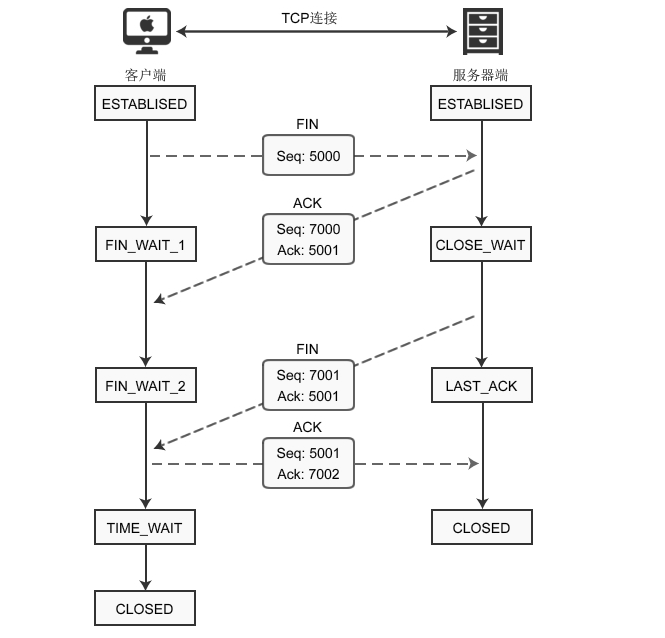
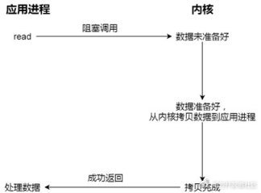

## TCP

https://blog.csdn.net/weixin_45393094/article/details/104965561

### TCP数据报结构

①序号：Seq（Sequence Number）序号占32位，用来标识从计算机A发送到计算机B的数据包的序号，计算机发送数据时对此进行标记。
②确认号：Ack（Acknowledge Number）确认号占32位，客户端和服务器端都可以发送，Ack = Seq + 1。
③标志位：每个标志位占用1Bit，共有6个，分别为 URG、ACK、PSH、RST、SYN、FIN，具体含义如下：

> URG：紧急指针（urgent pointer）有效。
> ACK：确认序号有效。
> PSH：接收方应该尽快将这个报文交给应用层。
> RST：重置连接。
> SYN：建立一个新连接。
> FIN：断开一个连接。

### TCP的三次握手和四次挥手

#### TCP三次握手

①首先 Client 端发送连接请求报文

②Server 段接受连接后回复 ACK 报文，并为这次连接分配资源。

③Client 端接收到 ACK 报文后也向 Server 段发生 ACK 报文，并分配资源，这样 TCP 连接就建立了。

#### TCP的四次挥手

第一次挥手：Clien发送一个FIN，用来关闭Client到Server的数据传送，Client进入FIN_WAIT_1状态。

第二次挥手：Server收到FIN后，发送一个ACK给Client,Server进入CLOSE_WAIT状态。

第三次挥手： Server发送一个FIN，用来关闭Server到Client的数据传送，Server进入LAST_ACK状态。

第四次挥手：Client收到FIN后，Client进入TIME_WAIT状态，发送ACK给Server，Server进入CLOSED状态，完成四次握手。

#### 为什么连接的时候是三次握手，关闭的时候却是四次握手？

①因为当Server端收到Client端的SYN连接请求报文后，可以直接发送SYN+ACK报文。其中ACK报文是用来应答的，SYN报文是用来同步的。
②但是关闭连接时，当Server端收到FIN报文时，很可能并不会立即关闭SOCKET，所以只能先回复一个ACK报文，告诉Client端，“你发的FIN报文我收到了”。
③只有等到我Server端所有的报文都发送完了，我才能发送FIN报文，因此不能一起发送。故需要四步握手。

### TCP的沾包与半包

#### 拆包：

1. 要发送的数据大于TCP发送缓冲区剩余空间大小，将会发生拆包。
2. 待发送数据大于MSS（最大报文长度），TCP在传输前将进行拆包。

#### 粘包：

1. 要发送的数据小于TCP发送缓冲区的大小，TCP将多次写入缓冲区的数据一次发送出去，将会发生粘包。
2. 接收数据端的应用层没有及时读取接收缓冲区中的数据，将发生粘包。

应用层的解决：

1. 传输字符串类数据，可使用特殊字符作为分隔符。字节数组也可以使用特定的字节码来作为分隔符。如：`\0`
2. 使用固定字节长度作为传输协议
3. 添加数据头，通过数据头部来解析数据包长度

其中第一种和第二种方法都比较简单，也有一定的局限性，不推荐采用

### 一台服务器能支持多少连接，为什么

https://zhuanlan.zhihu.com/p/290651392

- **TCP连接的客户端机：**每一个ip可建立的TCP连接理论受限于ip_local_port_range参数，也受限于65535。但可以通过配置多ip的方式来加大自己的建立连接的能力。
- **TCP连接的服务器机：**每一个监听的端口虽然理论值很大，但这个数字没有实际意义。最大并发数取决你的内存大小，每一条静止状态的TCP连接大约需要吃3.3K的内存。**假设你只保持连接不发送数据，那么你服务器可以建立的连接最大数量 = 你的内存/3.3K。** 假如是4GB的内存，那么大约可接受的TCP连接数量是100万左右。

### socket编程相关的一些api和用法

### 建立和处理连接的是同一个socket吗，socket中两个队列分别是啥

是，https://www.jianshu.com/p/65ee5d12b6f2

- TCP三次握手建立连接的过程中，内核通常会为每一个LISTEN状态的Socket维护两个队列：
  - SYN队列（半连接队列）：这些连接已经接到客户端SYN；
  - ACCEPT队列（全连接队列）：这些连接已经接到客户端的ACK，完成了三次握手，等待被accept系统调用取走。

## Reactor和Proactor

https://zhuanlan.zhihu.com/p/372277468

### Reactor和Proactor区别

- Reactor 非阻塞同步网络模式**，感知的是就绪可读写事件**
- Proactor 异步网络模式**， 感知的是已完成的读写事件**

无论是 Reactor，还是 Proactor，都是一种基于「事件分发」的网络编程模式，区别在于 **Reactor 模式是基于「待完成」的 I/O 事件，而 Proactor 模式则是基于「已完成」的 I/O 事件**。

### **阻塞 I/O**-BIO

当用户程序执行 read，线程会被阻塞，一直等到内核数据准备好，并把数据从内核缓冲区拷贝到应用程序的缓冲区中，当拷贝过程完成，read 才会返回.**`阻塞等待`的是「内核数据准备好」和「数据从内核态拷贝到用户态」这两个过程**

### **非阻塞 I/O**- NIO

非阻塞的 read 请求在数据未准备好的情况下立即返回，可以继续往下执行，此时应用程序不断轮询内核，直到数据准备好，内核将数据拷贝到应用程序缓冲区，read 调用才可以获取到结果。**这里最后一次 read 调用，获取数据的过程，是一个同步的过程，是需要等待的过程。这里的`同步`指的是`内核态的数据拷贝到用户程序的缓存区这个过程。**

无论 read 和 send 是阻塞 I/O，还是非阻塞 I/O 都是同步调用。因为在 read 调用时，内核将数据从内核空间拷贝到用户空间的过程都是需要等待的，也就是说这个过程是同步的，如果内核实现的拷贝效率不高，read 调用就会在这个同步过程中等待比较长的时间

### **异步 I/O** 

是「内核数据准备好」和「数据从内核态拷贝到用户态」这**两个过程都不用等待**。

发起 aio_read（异步 I/O） 之后，就立即返回，内核自动将数据从内核空间拷贝到用户空间，这个拷贝过程同样是异步的，内核自动完成的，和前面的同步操作不一样，**应用程序并不需要主动发起拷贝动作**

### 常见的 Reactor 实现方案有三种

#### 1、单 Reactor 单进程 / 线程

不用考虑进程间通信以及数据同步的问题，因此实现起来比较简单，这种方案的缺陷在于无法充分利用多核 CPU，而且处理业务逻辑的时间不能太长，否则会延迟响应，所以不适用于计算机密集型的场景，适用于业务处理快速的场景，比如 Redis 采用的是单 Reactor 单进程的方案（+多路复用）。

##### Redis Reactor多路复用

#### 2、单 Reactor 多线程

通过多线程的方式解决了方案一的缺陷，但它离高并发还差一点距离，差在只有一个 Reactor 对象来承担所有事件的监听和响应，而且只在主线程中运行，在面对瞬间高并发的场景时，容易成为性能的瓶颈的地方。

#### 3、多 Reactor 多进程 / 线程

通过多个 Reactor 来解决了方案二的缺陷，主 Reactor 只负责监听事件，响应事件的工作交给了从 Reactor，Netty 和 Memcache 都采用了「多 Reactor 多线程」的方案，Nginx 则采用了类似于 「多 Reactor 多进程」的方案。

## select、poll、epoll对比

https://www.cnblogs.com/aspirant/p/9166944.html

select，poll，epoll都是IO多路复用的机制。I/O多路复用就通过一种机制，可以监视多个描述符，一旦某个描述符就绪（一般是读就绪或者写就绪），能够通知程序进行相应的读写操作。**但select，poll，epoll本质上都是同步I/O，因为他们都需要在读写事件就绪后自己负责进行读写，也就是说这个读写过程是阻塞的**，而异步I/O则无需自己负责进行读写，异步I/O的实现会负责把数据从内核拷贝到用户空间。 

### **epoll的优点：**

1、没有最大并发连接的限制，能打开的FD的上限远大于1024（1G的内存上能监听约10万个端口）；
2、效率提升，不是轮询的方式，不会随着FD数目的增加效率下降。只有活跃可用的FD才会调用callback函数；即Epoll最大的优点就在于它只管你“活跃”的连接，而跟连接总数无关，因此在实际的网络环境中，Epoll的效率就会远远高于select和poll。

3、 内存拷贝，利用mmap()文件映射内存加速与内核空间的消息传递；即epoll使用mmap减少复制开销。

### **select、poll、epoll 区别总结：**

#### 1、支持一个进程所能打开的最大连接数

##### select

单个进程所能打开的最大连接数有FD_SETSIZE宏定义，其大小是32个整数的大小（在32位的机器上，大小就是1024，同理64位机器上FD_SETSIZE为 2048），当然我们可以对进行修改，然后重新编译内核，但是性能可能会受到影响，这需要进一步的测试。

##### poll

poll本质上和select没有区别，但是它没有最大连接数的限制，原因是它是基于链表来存储的

##### epoll

虽然连接数有上限，但是很大，1G内存的机器上可以打开10万左右的连接，2G内存的机器可以打开20万左右的连接

#### 2、FD剧增后带来的IO效率问题

**select**

因为每次调用时都会对连接进行线性遍历，所以随着FD的增加会造成遍历速度慢的“线性下降性能问题”。

**poll**

同上

**epoll**

因为epoll内核中实现是根据每个fd上的callback函数来实现的，只有活跃的socket才会主动调用callback，所以在活跃socket较少的情况下，使用epoll没有前面两者的线性下降的性能问题，但是所有socket都很活跃的情况下，可能会有性能问题。

#### 3、 消息传递方式

select

内核需要将消息传递到用户空间，都需要内核拷贝动作

poll

同上

epoll

epoll通过内核和用户空间共享一块内存来实现的。

#### **总结：**

**综上，在选择select，poll，epoll时要根据具体的使用场合以及这三种方式的自身特点。**

**1、表面上看epoll的性能最好，但是在连接数少并且连接都十分活跃的情况下，select和poll的性能可能比epoll好，毕竟epoll的通知机制需要很多函数回调。**

**2、select低效是因为每次它都需要轮询。但低效也是相对的，视情况而定，也可通过良好的设计改善** 

###    6.什么是内存泄露和内存溢出？各自会引发什么问题？

**内存溢出 out of memory**，是指程序在申请内存时，没有足够的内存空间供其使用，出现out of memory，那就是内存溢出。

**内存泄露 memory leak**，是指程序在申请内存后，无法释放已申请的内存空间，一次内存泄露危害可以忽略，但内存泄露堆积后果很严重，无论多少内存,迟早会被占光。

## netty

### 项目中有使用过netty吗

Netty封装了JDK的NIO，让你用得更方便，不用再写一大堆复杂的代码了。

用官方正式的话来说就是：Netty是一个异步事件驱动的网络应用框架，用于快速开发可维护的高性能服务端和客户端。

#### 使用Netty而不使用JDK原生NIO的原因

- 使用JDK原生NIO需要了解太多概念，编程复杂，一不小心就Bug横飞。
- Netty底层IO模型随意切换，而这一切只需要做微小的改动，改改参数，Netty可以直接从NIO模型变身为IO模型。
- Netty自带的拆包/粘包、异常检测等机制让你从NIO的繁重细节中脱离出来，只需要关心业务逻辑即可。
- Netty解决了JDK很多包括空轮询在内的Bug。
- Netty底层对线程、Selector做了很多细小的优化，精心设计的`Reactor线程模型`可以做到非常高效的并发处理。
- 自带各种协议栈，让你处理任何一种通用协议都几乎不用亲自动手。
- Netty社区活跃，遇到问题随时邮件列表或者Issue。
- Netty已经历各大RPC框架、消息中间件、分布式通信中间件线上的广泛验证，健壮性无比强大。

#### Netty对Reactor对实现

- boss NioEventLoopGroup 负责接收新连接的线程，主要负责创建新连接。
- worker NioEventLoopGroup 负责读取数据的线程，主要用于读取数据及业务逻辑处理。

12. Linux的共享内存如何实现。

    https://blog.csdn.net/Al_xin/article/details/38602093

13. 共享内存实现的具体步骤

11. tcp各个参数怎么设置